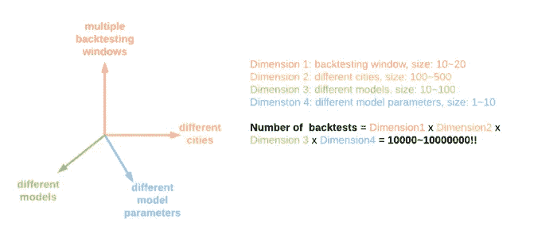
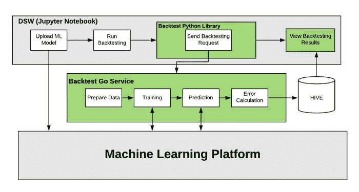
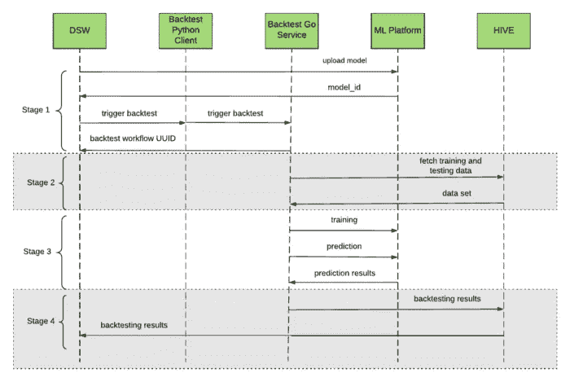

# 回溯测试机器学习以优步的方式建模

> 原文：<https://pub.towardsai.net/backtesting-machine-learning-models-the-uber-way-a391ec45bab4?source=collection_archive---------0----------------------->

## 该架构用于定期回测优步的数百个预测模型。

图片来源:优步

> 我最近创办了一份专注于人工智能的教育时事通讯，已经有超过 125，000 名订户。《序列》是一份无废话(意思是没有炒作，没有新闻等)的 ML 导向时事通讯，需要 5 分钟阅读。目标是让你与机器学习项目、研究论文和概念保持同步。请通过订阅以下内容来尝试一下:

 [## 序列

### 与机器学习、人工智能和数据发展保持同步的最佳资源…

thesequence.substack.com](https://thesequence.substack.com/) 

回溯测试是机器学习模型生命周期中非常重要的一个方面。任何运行多种预测模型的组织都需要一种机制来定期评估其有效性并从错误中恢复。回测的相关性与给定环境中使用的机器学习模型的数量成指数关系。尽管回测很重要，但与机器学习生命周期的其他方面(如模型训练或部署)相比，回测仍然相对被忽视。最近，优步推出了一项完全从头开始构建的新服务，用于大规模回测机器学习模型。

优步运营着世界上最大的机器学习基础设施之一。在其多个物业中，优步运行着数以千计的预测模型，涵盖不同领域，如乘车规划或预算管理。确保这些预测模型的准确性绝非易事。模型的数量和计算的规模使得优步的环境对于大多数回溯测试框架来说相对不切实际。甚至优步自己也建立了以前的回测框架，如 [Omphalos](https://eng.uber.com/omphalos/) 已被证明对某些特定用例有效，但无法随优步的运营而扩展。

我们在谈论什么样的规模？具体来说，优步需要对其不同的预测模型进行大约 1000 万次回溯测试。除了规模之外，优步的运营在回溯测试方面有着不同的特殊性，这最终导致了对构建客户回溯测试服务的支持。

# 理解优步方式的回溯测试

并非所有的回溯测试都是平等的。不同的组织依赖不同的向量来回溯测试模型，这些模型反映了他们业务的领域特定的性质。在优步的案例中，运输巨头需要考虑城市数量或测试窗口等因素，以便有效地回测模型。适用于一个城市的模式不一定适用于另一个城市。类似地，一些模型需要实时回测，而另一些模型可以承受更大的窗口。综合考虑所有因素，优步确定了四个相关的关键向量，以便对预测模型进行回测。

*回溯测试窗口的数量*

*城市数量*

*模型参数数量*

*预测模型数量*

图片来源:优步

这四个向量的组合导致了大多数主流回溯测试服务无法管理的规模。

有效回测的关键要素之一是确定如何分割测试数据。与[交叉验证](https://en.wikipedia.org/wiki/Cross-validation_(statistics))等技术不同，回溯测试利用时间序列数据和非随机分割。这也意味着任何回溯测试策略都需要清楚地理解如何以适应模型性能的方式分割测试数据。在优步的例子中，这也需要在数千种模型中进行。为了应对这一挑战，优步选择利用两种主要的回溯测试数据分割机制，即扩展窗口回溯测试和滑动窗口回溯测试。每个窗口被分成用于训练模型的训练数据和用于计算训练模型的错误率的测试数据。

图片来源:优步

回溯测试策略的最后一个组成部分是精确测量模型的准确性。最常见的指标之一是平均绝对百分比误差(MAPE)，其数学模型如下:

在进行模型回溯测试时，MAPE 越低，预测模型的表现就越好。通常，数据科学家依靠 MAPE 指标来比较同一模型使用的错误率计算方法的结果，以确保它们表达了预测中的实际错误。

将这三个要素放在一起:回溯测试向量、回溯测试窗口和误差度量，优步着手建立一个新的回溯测试服务，它可以简化整个组织的预测操作。

# 优步的回溯测试服务

多年来，优步建立了不同的专有技术，有助于简化机器学习模型的生命周期管理。新的回溯测试服务能够通过利用诸如[数据科学工作台](https://eng.uber.com/dsw/)、优步的交互式数据分析和机器学习工具箱[和优步的机器学习平台](https://eng.uber.com/scaling-michelangelo/)等技术来利用复杂的基础设施。

从架构的角度来看，新的回溯测试服务由一个 Python 库和一个用 Go 编写的服务组成。Python 库的行为类似于 Python 客户端。由于优步大学的许多机器学习模型目前都是用 Python 编写的，因此将这一框架用于回溯测试服务是一个简单的选择，它允许用户无缝地对他们的模型进行测试和迭代。Go 服务被编写为一系列 Cadence 工作流。 [Cadence](https://github.com/uber/cadence) 是一个开源的编排引擎，由优步用 Go 编写，以可伸缩和弹性的方式执行异步长期运行的业务逻辑。在高层次上，通过 Data Science Workbench 上传机器学习模型，并使用 Python 库提交对模型数据的回溯测试请求，Python 库将请求中继到回溯测试 Go 服务。一旦计算出误差测量值，它要么存储在数据存储中，要么立即由数据科学团队投入工作，他们利用这些预测误差来优化训练中的机器学习模型。

图片来源:优步

深入细节，回溯测试工作流由四个阶段组成。在第一阶段，模型或者在数据科学工作台(DSW)中本地编写，或者上传到机器学习平台，该平台返回唯一的模型 ID。DSW 通过我们的 Go 服务触发一个回溯测试，然后返回一个 UUID 给 DSW。在阶段 2 中，Go 服务获取训练和测试数据，将其存储在数据存储中，并返回一个数据集。在阶段 3 中，在 ML 平台上训练回测数据集，并且生成预测结果并将其返回给 Go 服务。在第 4 阶段，回测结果存储在数据存储中，供用户使用 DSW 获取。

图片来源:优步

优步已经开始在多个用例中应用新的回溯测试服务，例如财务预测和预算管理。除了最初的适用性，新的回溯测试服务可以作为许多组织开始大规模应用机器学习模型的参考架构。回溯测试服务的架构中概述的原则可以应用于不同数量的机器学习框架和平台。如果优步决定在不久的将来开放回溯测试服务栈的源代码，这将是一件有趣的事情。