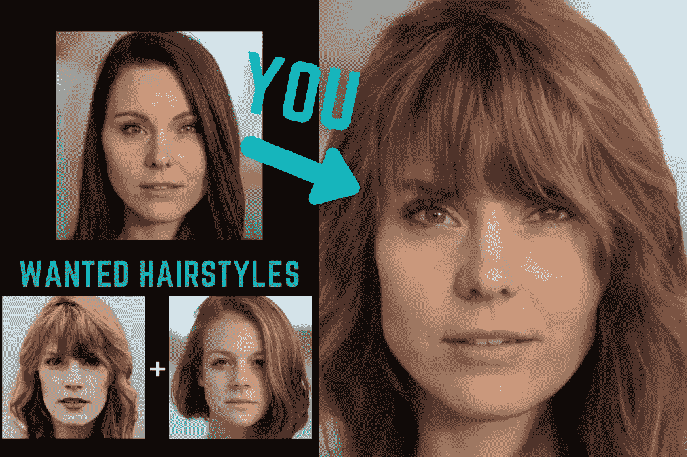
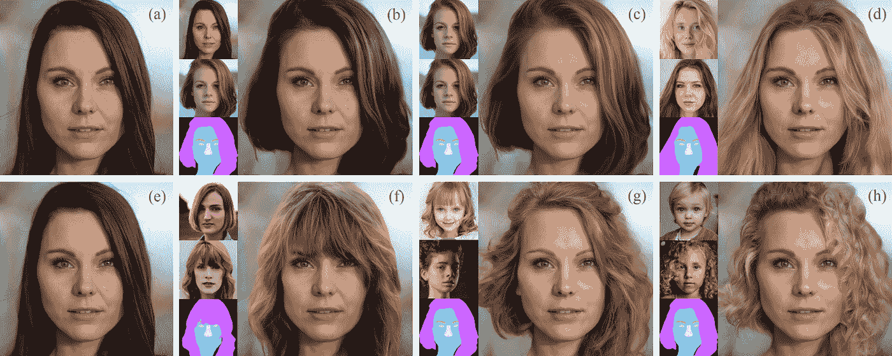
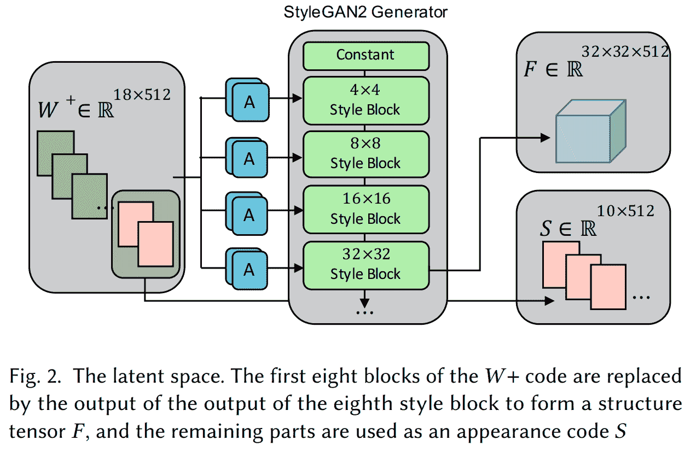
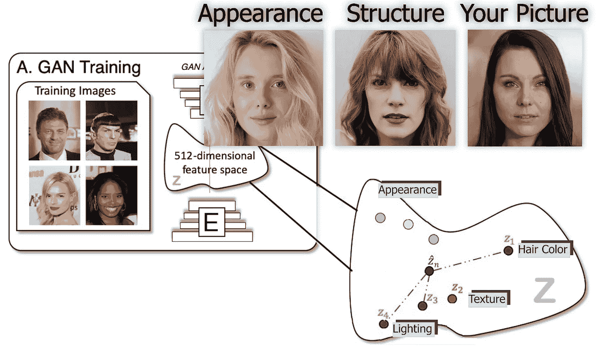
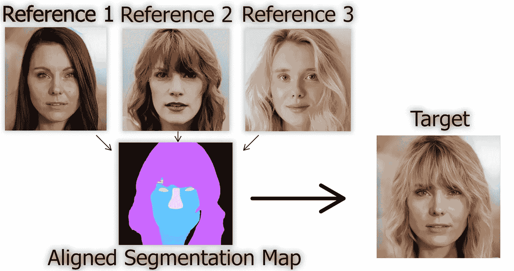
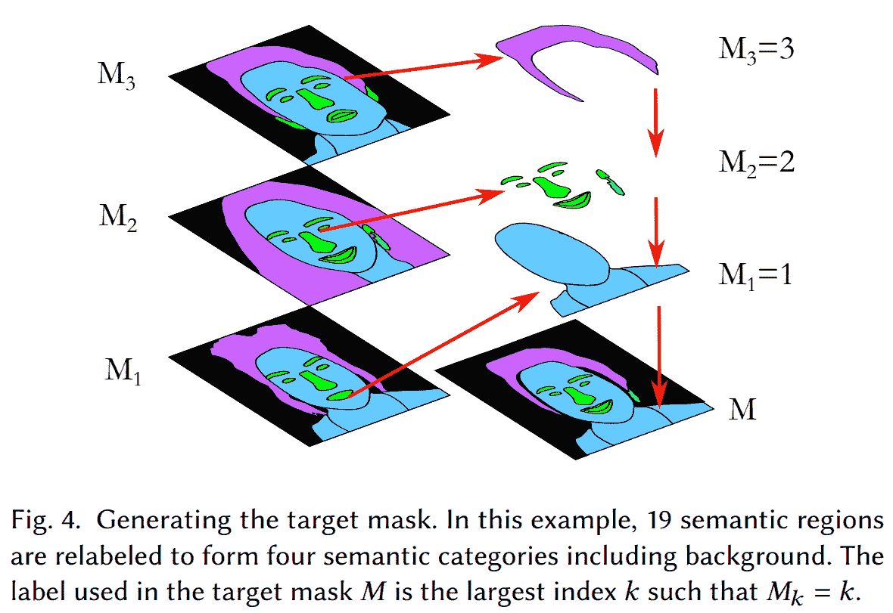
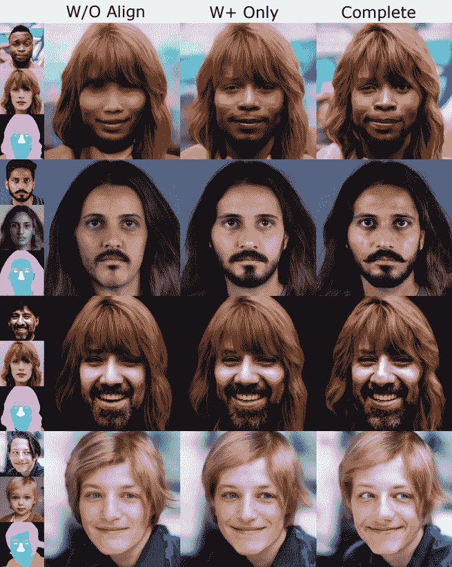
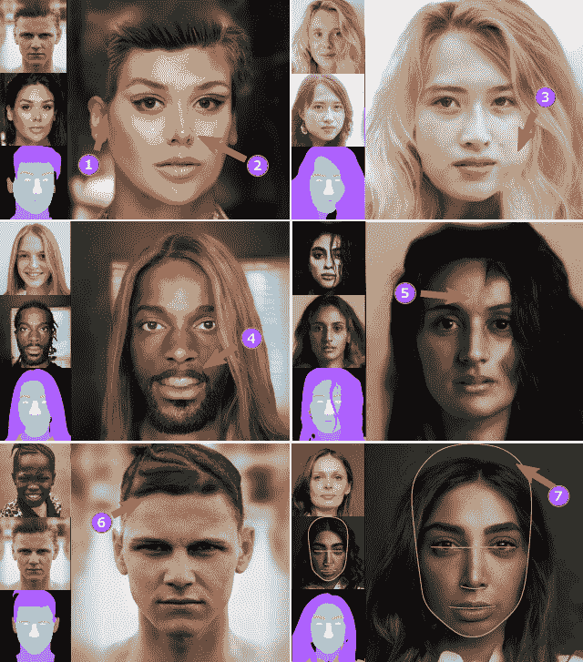

# 理发店:尝试图片中不同的发型和发色

> 原文：<https://pub.towardsai.net/barbershop-try-different-hairstyles-and-hair-colors-from-pictures-gans-e5138a8ee5f4?source=collection_archive---------1----------------------->

## [计算机视觉](https://towardsai.net/p/category/computer-vision)

## 这个人工智能可以在改变之前转移你的头发，看看它会是什么样子。

> *原载于*[*louisbouchard . ai*](https://www.louisbouchard.ai/barbershop/)*，前两天看了我的博客***！**

**

*这篇文章本身并不是关于一项新技术。相反，它是关于 GANs 的一个令人兴奋的新应用。的确，你看到了标题，它不是 clickbait。这个人工智能可以在改变之前转移你的头发，看看它会是什么样子。我们都知道，即使你想改变你的发型，也很难做到。嗯，至少对我自己来说，我已经习惯了多年的同一个发型，每 3 或 4 个月告诉我的理发师“和上次一样”，即使我想改变一下。我只是不能承诺，害怕它会看起来怪异和不寻常。当然，这都是我们的想法，因为我们是唯一关心自己发型的人，但这个工具对我们中的一些人来说可能是一个真正的游戏规则改变者，帮助我们决定是否要做出这样的改变，对自己的发型有很好的见解。尽管如此，在猜测之前你能预见未来的时刻还是很少的。即使它不完全准确，但它仍然非常酷，可以很好地模拟新发型的样子，减轻我们尝试新事物的压力，同时保留令人兴奋的部分。当然，相比更有用的应用，理发是很肤浅的。尽管如此，这是朝着使用人工智能“预见未来”迈出的一步，这非常酷。事实上，这种新技术在某种程度上让我们能够预测未来，即使只是我们发型的未来。但是在深入研究它是如何工作的之前，我很想知道你对此有什么想法。在任何其他领域:你希望看到其他什么应用使用人工智能来“预见未来”？*

**

*理发店的例子。[朱培豪等，(2021)](https://arxiv.org/pdf/2106.01505.pdf)*

*它不仅可以改变你的发型，还可以改变多张图片的颜色。你可以给这个算法赋予三样东西:*

1.  *一张你自己的照片*
2.  *一张你喜欢的发型的照片*
3.  *另一张图片(或同一张)是你想尝试的发色，它真实地融合了你身上的一切。*

**

*结果令人印象深刻。如果你不相信我的判断，根据我的艺术技能水平，我会完全理解，他们还对 396 名参与者进行了用户研究。95%的情况下，他们的解决方案是首选！当然，如果这看起来难以置信，你可以在下面的参考文献中找到更多关于这项研究的细节。*

**

*理发店量化结果。[朱培豪等，(2021)](https://arxiv.org/pdf/2106.01505.pdf)*

*正如你可能怀疑的那样，我们在这里玩人脸，所以它使用了一个非常类似于[的过程，我过去的论文覆盖了](https://www.louisbouchard.ai/toonify/)，将人脸改变成卡通或其他风格，都是使用 GANs。由于极其相似，我将让您观看我的其他视频，在这些视频中，我深入解释了 GANs 的工作原理，我将在这里重点介绍这种方法的新特点以及它为什么如此有效。*

*GAN 架构可以学习将图像的特定特征或风格转置到另一个上。问题是，它们看起来往往不真实，因为光线的差异，遮挡，甚至只是两张照片中头部的位置不同。所有这些小细节使得这个问题非常具有挑战性，导致生成的图像中出现伪像。这里有一个简单的例子可以更好地形象化这个问题，如果你从黑暗的房间里拍摄的照片中取出某人的头发，并试图在白天把它戴在外面的自己身上，即使它在你的头上完美地换位，它看起来仍然会很怪异。通常，这些使用 GANs 的其他技术试图对图片的信息进行编码，并在该编码中明确地识别与头发属性相关联的区域来切换它们。当两张照片在相似的条件下拍摄时，它可以很好地工作，但由于我刚才提到的原因，它在大多数时候看起来不会很真实。然后，他们不得不使用另一个网络来修复合并导致的重新照明、漏洞和其他奇怪的人造物。因此，这里的目标是将特定图片的发型和颜色转置到您自己的图片上，同时更改结果以遵循图片的照明和属性，使其同时令人信服和真实，减少错误的步骤和来源。*

*如果这最后一段不清楚，我强烈建议观看本文末尾的视频，因为有更多的视觉示例来帮助理解。*

**

*StyleGAN2 架构以及它们在哪里获取结构和外观信息。[朱培豪等，(2021)](https://arxiv.org/pdf/2106.01505.pdf)*

*为了实现这一点，朱培豪等人在 GANs 中增加了一个缺失但重要的比对步骤。事实上，它不是简单地对图像进行编码并将其合并，而是按照不同的分段掩码稍微改变编码，以使两幅图像的潜在代码更加相似。正如我提到的，他们都可以编辑头发的结构和风格或外观。*

**

*外观潜在空间。[朱培豪等，(2021)](https://arxiv.org/pdf/2106.01505.pdf)*

*在这里，结构当然是头发的几何形状，告诉我们它是卷曲的，波浪状的，还是直的。如果你看过我的其他视频，你已经知道 GANs 使用卷积对信息进行编码。这意味着它使用内核来缩小每一层的信息，使其越来越小，从而迭代地移除空间细节，同时为最终输出的一般信息赋予越来越多的价值。这种结构信息总是从 GAN 的早期层获得，所以在编码变得太一般和太编码以至于不能表示空间特征之前。*

**

*外观是指深度编码的信息，包括头发的颜色、纹理和光线。你知道信息是从不同的图像中获取的，但现在，他们如何合并这些信息，使其看起来比以前的方法更真实？*

**

*理发店流程。[朱培豪等，(2021)](https://arxiv.org/pdf/2106.01505.pdf)*

*这是使用来自图像的分割图来完成的。更准确地说，基于我们的目标和参考图像的对准版本来生成这个想要的新图像。参考图像是我们自己的图像，目标图像是我们想要应用的发型。这些分割图告诉我们图像包含了什么，在哪里，头发，皮肤，眼睛，鼻子等等。*

**

*分割图。[朱培豪等，(2021)](https://arxiv.org/pdf/2106.01505.pdf)*

*使用来自不同图像的这种信息，他们可以在将图像发送到网络以使用基于改进的 StyleGAN2 的架构进行编码之前，按照目标图像结构对齐头部。我已经讲过很多次了。这种对齐使得编码信息更容易比较和重建。*

*然后，对于外观和照明问题，他们从相同分割区域的目标和参考图像中找到这些外观编码的适当混合比，使其看起来尽可能真实。这是左栏没有对齐而右栏没有对齐方式的结果。*

**

*左无对齐，右无对齐。[朱培豪等，(2021)](https://arxiv.org/pdf/2106.01505.pdf)*

*当然，这个过程有点复杂，所有细节都可以在参考资料中链接的论文中找到。注意，就像大多数 GANs 实现一样，它们的架构需要训练。在这里，他们使用了在 FFHQ 数据集上训练的 StyleGAN2-base 网络。然后，由于他们进行了许多修改，正如我们刚才讨论的那样，他们使用 198 对图像作为发型转移示例，第二次训练了他们修改的 StleGAN2 网络，以优化模型对外观混合比例和结构编码的决策。*

*此外，正如你所料，仍然有一些不完美的地方，比如他们的方法无法对齐分割遮罩或重建人脸。尽管如此，结果还是非常令人印象深刻，他们公开分享局限性也很棒。*

**

*失败的例子。[朱培豪等，(2021)](https://arxiv.org/pdf/2106.01505.pdf)*

*正如他们在论文中所述，他们方法的源代码将在论文最终发表后公开。GitHub 官方回购的链接在下面的参考资料中，希望它能尽快发布。*

*感谢您的阅读！*

# *观看视频*

*来我们的 [**Discord 社区与我们聊天:** **一起学习 AI**](https://discord.gg/learnaitogether)和*分享你的项目、论文、最佳课程、寻找 Kaggle 队友，等等！**

*如果你喜欢我的工作，并想了解人工智能的最新动态，你绝对应该关注我的其他社交媒体账户( [LinkedIn](https://www.linkedin.com/in/whats-ai/) ， [Twitter](https://twitter.com/Whats_AI) )，并订阅我的每周人工智能 [**简讯**](http://eepurl.com/huGLT5) ！*

# *支持我:*

*   *支持我的最好方式是成为这个网站的成员，或者如果你喜欢视频格式，在[**YouTube**](https://www.youtube.com/channel/UCUzGQrN-lyyc0BWTYoJM_Sg)**上订阅我的频道。***
*   ***在经济上支持我在 [**Patreon**](https://www.patreon.com/whatsai) 的工作***
*   ***跟着我到这里***

## ***参考***

*   ***朱佩豪等，(2021)，理发店，***
*   ***项目链接:[https://zpdesu.github.io/Barbershop/](https://zpdesu.github.io/Barbershop/)***
*   ***代号:【https://github.com/ZPdesu/Barbershop ***