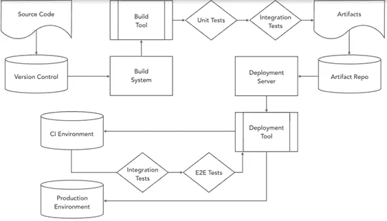

# DevOps 核心和管道建设的基本概念

> 原文：<https://pub.towardsai.net/basic-concepts-of-devops-core-and-pipeline-building-eb3a4645c61b?source=collection_archive---------2----------------------->

## [DevOps](https://towardsai.net/p/category/devops)

## 更好的 SDLC 管理的开发和运营任务

航拍聚焦 [Unsplash](https://unsplash.com?utm_source=medium&utm_medium=referral)

DevOps 是一种应用程序开发实践，它合并了开发任务和运营任务，以实现更好的软件开发生命周期管理，同时还处理应用程序的频繁更新、错误和功能。

DevOps 涉及持续的开发任务，如计划代码、编码、构建代码和测试代码，以及持续的操作任务，如发布代码、部署代码、操作代码和监控代码，随后是两个任务集的持续集成。

**DevOps 核心概念:**

*   连续构建是一个连续的、自动化的构建过程。它运行添加或修改的代码。
*   持续集成是至少单元测试的自动构建和执行，以证明新代码与现有代码的集成，但最好是集成测试(端到端)。这是一种频繁地自动构建和单元测试整个应用程序的实践，理想情况下，在每次源代码签入时，如果必要的话，一天进行几十次。
*   连续交付是将每个变更部署到类似生产的环境中，并在通过构建和单元测试后执行自动化集成和验收测试的额外实践。CD 可能涉及在本地服务器上部署，在 docker 容器或虚拟机集的帮助下创建环境，以执行类似于集成测试的生产环境。测试通常会导致部署类似生产的环境。这使我们能够验证部署过程，并检查和监控环境的功能，就像真实世界一样。
*   连续部署将连续交付的概念扩展到了一个层次，任何修改都要进行完全自动化的测试，然后部署到生产环境中。

**实际建造管道:**

建筑管线流程图

构建管道是工具和操作的顺序组合，执行从源代码到已部署系统的分配任务。用于源代码存储库的常见工具包括 Git、Perforce 或 Subversion。这些工具提供服务来存储和处理所有应用程序使用的配置管理 hapcode、部署脚本和基础设施定义。它的工作是处理代码，保护代码，管理其版本，并处理代码的同时提交。

**构建系统**

接下来是构建系统，它监控存储库，并在请求变更时触发代码构建。Jenkins、Bamboo 和 TeamCity 是流行的构建系统。Circle CI 和 Travis CI 是一些可用的在线服务。您汇编并可以运行 make 的任何构建脚本也可以完成这项工作。但是一些功能，如 webhooks、off 插件和其他有助于优化流程的功能将会在这些代码中丢失。它的工作是构建代码和运行单元测试。当然，还要提供对构建过程的反馈和可见性。

根据您使用的语言，您可能有多种编译和构建编排工具。如果是编译语言，可能需要 c 或 go 编译器。解释语言可能没有编译步骤，直接跳到打包。

您可能有一个构建定义文件，如 make 文件或 docker 文件，或者您可能使用 Maven、Ant 或 Gradle 作为命令行构建编排工具。这允许开发人员在他们的本地机器上进行构建，并尽可能多地将代码保留在源代码控制中，而不是构建控制台配置中。

您可能有一个单元测试工具，它可能是一个独立的工具，但是它是在构建系统内部调用的。单元测试或基本测试旨在验证一段代码是否完成了预期的工作。单元测试不依赖于外部系统。最多，他们嘲笑或剔除代码库之外的任何东西。它们是你判断你的构建是否会像预期的那样工作的第一道防线。

**包装**

下一步是将您构建的东西打包成一个工件。其中一部分通常取决于语言。例如，Java 代码通常被放入 JAR 文件，然后这些文件被组合成 WAR 或 EAR 文件。但是您可能有更高级别的打包结构，比如 RPM 包或 docker 映像。一旦您打包了代码，它就会进入您的工件库。

有些人只是使用存储设备或亚马逊 S3 来存放他们的物品。其他人则使用 Nexus 或 Artifactory 等工具。或者有特定技术的休息，像码头登记或傀儡伪造。在过去，一个建筑工程师认为他们在这里完成了。但事实并非如此。您在某个地方的驱动器上有一些位，而不是向客户提供价值的服务，所以您的工作还没有完成。您需要一个部署工具来启动服务的工作实例。您将使用相同的工具来部署您的测试和生产环境。

您的部署代码就是代码，像任何其他代码一样，您希望在构建和测试周期中发现任何问题，而不是在部署到生产环境时。因此，您在一个测试环境(有时也称为 CI 环境)上运行您的部署工具，以启动并运行您的服务。

接下来，您要执行集成测试，这是为了在真实的环境中测试真实的运行服务，并确保它正常工作。然后你有一个端到端的验收测试阶段。这可能包括手动测试组件。一旦你达到 CD 过程的成熟度，手动测试可以大部分被免除，但是最初几乎总是占主导地位。

然后，您使用通过测试的同一个工件和同一个部署工具将它部署到生产环境中。理想情况下，您也可以使用一些相同的验收测试来测试它。有更多类型的工具可以放在你的管道上，测试覆盖度量工具，linters，安全测试工具，性能测试工具，但是这些都是基本的。打好基础是实现持续集成的关键，如果您想要持续部署。

我希望你喜欢这篇文章。通过我的 [LinkedIn](https://www.linkedin.com/in/data-scientist-95040a1ab/) 和 [twitter](https://twitter.com/amitprius) 联系我。

# 推荐文章

1.[Python 最有用的 15 种 NumPy 方法](/15-most-usable-numpy-methods-with-python-4d20eb93e149?sk=911d2bebf042b148be8f366b907af158)
2。 [NumPy:图像上的线性代数](/numpy-linear-algebra-on-images-ed3180978cdb?source=friends_link&sk=d9afa4a1206971f9b1f64862f6291ac0)3。[Python 中的异常处理概念](/exception-handling-concepts-in-python-4d5116decac3?source=friends_link&sk=a0ed49d9fdeaa67925eac34ecb55ea30)
4。[熊猫:处理分类数据](/pandas-dealing-with-categorical-data-7547305582ff?source=friends_link&sk=11c6809f6623dd4f6dd74d43727297cf)
5。[超参数:机器学习中的 RandomSeachCV 和 GridSearchCV](/hyper-parameters-randomseachcv-and-gridsearchcv-in-machine-learning-b7d091cf56f4?source=friends_link&sk=cab337083fb09601114a6e466ec59689)
6。[用 Python](https://medium.com/towards-artificial-intelligence/fully-explained-linear-regression-with-python-fe2b313f32f3?source=friends_link&sk=53c91a2a51347ec2d93f8222c0e06402)
7 全面讲解了线性回归。[用 Python](https://medium.com/towards-artificial-intelligence/fully-explained-logistic-regression-with-python-f4a16413ddcd?source=friends_link&sk=528181f15a44e48ea38fdd9579241a78)
充分解释了 Logistic 回归 8。[数据分发使用 Numpy 与 Python](/data-distribution-using-numpy-with-python-3b64aae6f9d6?source=friends_link&sk=809e75802cbd25ddceb5f0f6496c9803)
9。 [40 种 Python 中最疯狂可用的方法](https://medium.com/pythoneers/40-most-insanely-usable-methods-in-python-a983c78f5bfd?sk=07df9058ea3e8c2fce4318a73cd8fce9)
10。[Python 中最常用的 20 种熊猫快捷方式](https://medium.com/pythoneers/20-most-usable-pandas-shortcut-methods-in-python-c9bc065ce11e?sk=1faf673d0cdfb46234975cbdeed12beb)