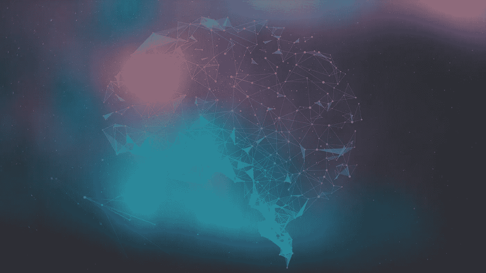
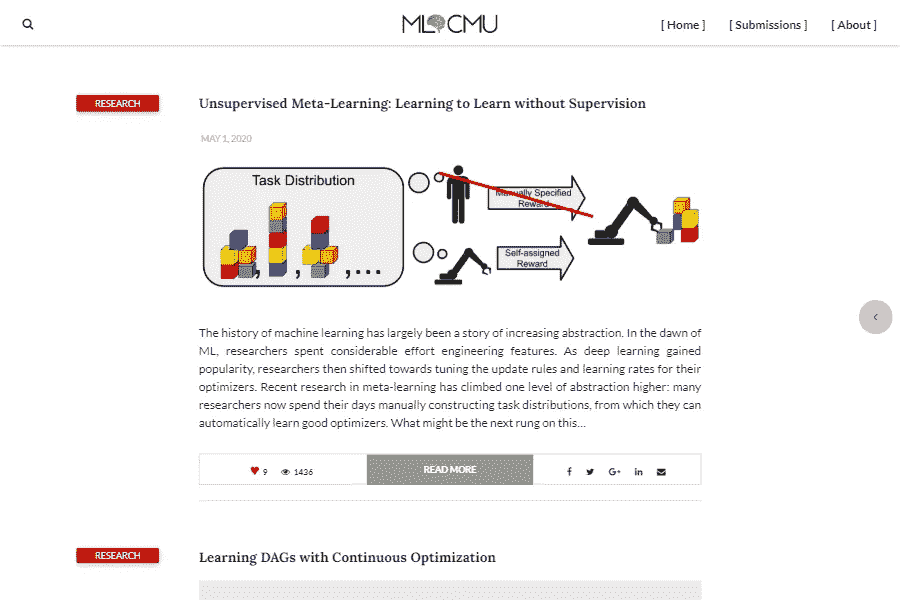
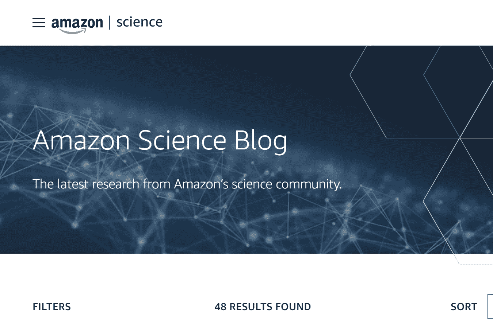
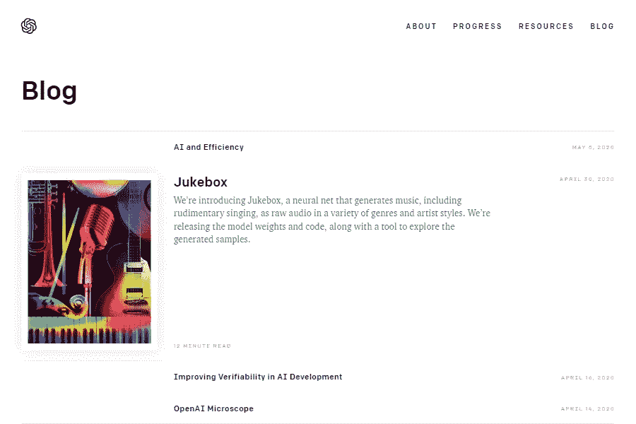
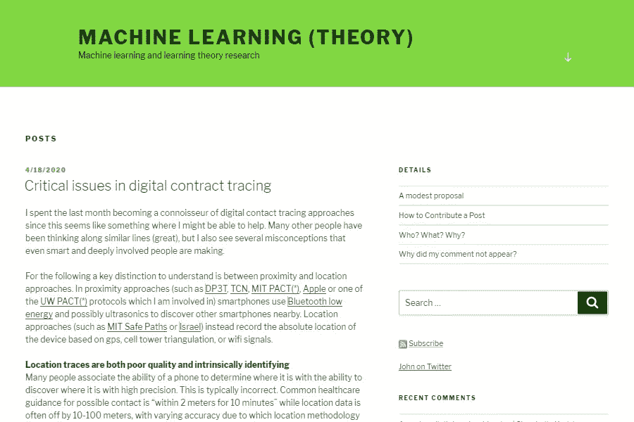
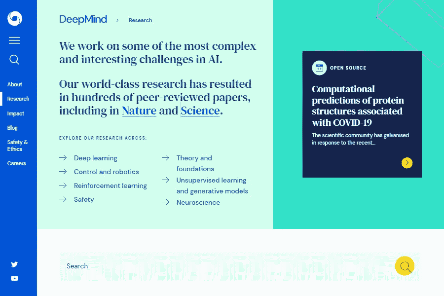
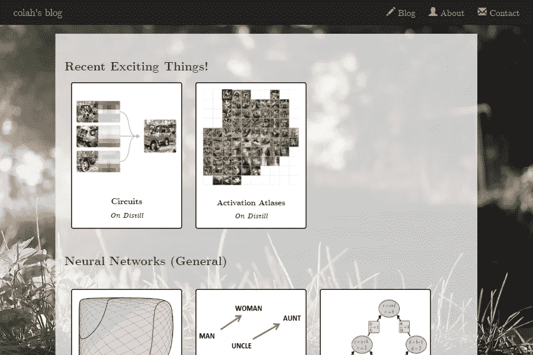
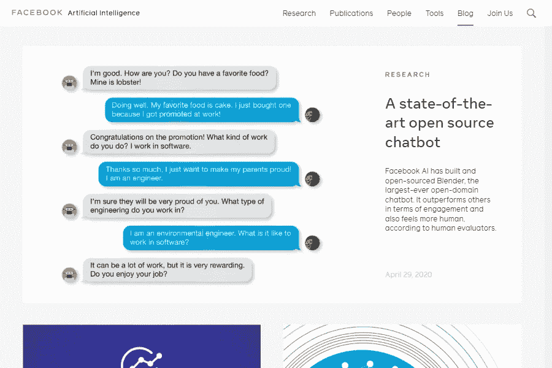
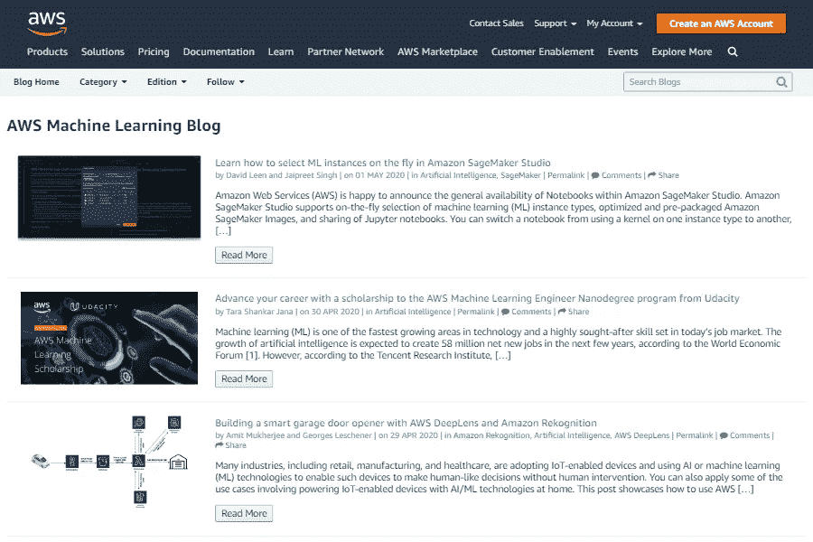

# 2020 年最佳机器学习博客

> 原文：<https://pub.towardsai.net/best-machine-learning-blogs-to-follow-for-reliable-ml-research-towards-ai-6730ea2df3bd?source=collection_archive---------0----------------------->

来源: [Pixabay](https://pixabay.com/photos/neural-networks-brain-5321301/)

## [机器学习](https://towardsai.net/p/category/machine-learning)

## 通过可靠的来源跟上最好和最新的[机器学习](https://mld.ai/mldcmu) (ML)研究博客

从研究人员到学生、行业专家和机器学习(ML)爱好者——跟上最好和最新的机器学习研究是找到可靠的科学工作来源的问题。虽然博客通常以更非正式和对话的方式更新，但我们发现这个列表中的来源是准确、丰富和可靠的机器学习研究来源。适合所有有兴趣了解更多关于 ML 科学领域的人。

> 📚访问[最佳机器学习博客](https://towardsai.net/p/machine-learning/best-machine-learning-blogs-6730ea2df3bd)的更新列表。📚

请注意，下面列出的博客绝不是排名或特定的顺序。它们都是机器学习研究的不可思议的来源。如果你知道机器学习方面任何其他可靠的博客来源，请在评论中告诉我们。

来源: [ML@CMU](https://mktg.best/machine-learning-blog)

## [机器学习博客，ML@CMU，卡耐基梅隆大学](https://mktg.best/machine-learning-blog)

卡耐基梅隆大学的机器学习博客， [**ML@CMU**](https://mktg.best/machine-learning-blog) **，**为研究人员提供了一个可访问的普通受众媒介，用于向专家和普通受众交流研究成果、机器学习领域的观点和各种更新。帖子来自卡内基梅隆大学的学生、博士后和教师。

来源:[亚马逊科学](https://mktg.best/eldwv)

## [亚马逊科学博客](https://mktg.best/eldwv)

[**亚马逊科学**](https://mktg.best/eldwv) 有一个神奇的 [**科学博客**](https://mktg.best/eldwv) 可以让你按研究领域过滤。它的博客涵盖了亚马逊科学社区的工作，其研究领域包括云和系统、计算机视觉、对话式人工智能、NLP、 [**机器学习**](https://mktg.best/eldwv) 、机器人、搜索和信息检索以及安全、隐私和滥用预防[ [13](https://mktg.best/eldwv) ]。

来源:[提取](https://mktg.best/distill)

## [提取](https://mktg.best/distill)

Distill 是机器学习领域的学术期刊。一篇精华文章的显著特点是出色的交流和对人类理解的贡献。 [**提炼**](https://mktg.best/distill) 文章经常使用互动媒体，但并不总是如此。在 Distill 上发表的大多数文章(如果不是全部的话)通常需要 100 多个小时才能发表。

来源:[谷歌 AI](https://mktg.best/google-ai)

## [谷歌人工智能博客](https://mktg.best/google-ai)

谷歌人工智能进行的研究推动了该领域的最新发展。Google AI(或 Google.ai)是谷歌专门致力于人工智能的一个部门。它是由首席执行官桑德尔·皮帅在谷歌 2017 年 I/O 大会上宣布的[3]。Google AI 博客有专门针对 [**机器学习研究**](https://mktg.best/google-ai)[4](https://mktg.best/google-ai)的板块。

来源:[拜尔伯克利](https://mktg.best/bair)

## [BAIR·柏克莱](https://mktg.best/bair)

BAIR 博客为研究人员提供了一个可访问的、面向大众的媒介，以交流研究发现、该领域的观点和各种更新。帖子来自**的学生、博士后和教师，旨在向专家和普通观众[ [5](https://mktg.best/bair-about) ]提供关于研究发现和结果的相关和及时的讨论。**

****

**来源:[打开 AI](https://mktg.best/tyewn)**

## **[开启 AI](https://mktg.best/tyewn)**

**OpenAI 是一个位于加州旧金山的研究实验室。他们的使命是确保人工通用智能造福全人类[ [8](https://mktg.best/te1jy) ]。OpenAI 博客带来了该领域最先进的研究。他们的任务是发现并制定通往安全的人工通用智能(AGI)的道路。**

****

**来源:[机器学习(理论)](https://mktg.best/hunch)**

## **约翰·兰福德的机器学习(理论)**

**机器学习(理论)博客是机器学习研究者[**约翰·兰福德**](https://mktg.best/john-langford)[6](https://mktg.best/hunch-about)将博客应用于机器学习和学习理论学术研究的一项实验。他强调，机器学习领域“正在从一门学术学科转向一种工业工具”。**

****

**来源: [DeepMind](https://mktg.best/deepmind-research)**

## **[DeepMind 博客](https://mktg.best/deepmind-research)**

**DeepMind 致力于人工智能领域一些最复杂、最激动人心的挑战。他们世界级的研究已经产生了数百篇同行评审论文，包括《自然》和《科学》杂志。**

****

**来源:[麻省理工](https://mktg.best/ml-mit)**

## **[麻省理工学院的机器学习](https://mktg.best/ml-mit)**

**麻省理工学院经常在机器学习领域进行最先进的研究。这个[**过滤后的新闻流**](https://mktg.best/ml-mit) 提供了在 [**MIT**](https://mktg.best/mitu) 机器学习领域正在发生的最新新闻和研究。**

****

**来源:Colah 的[博客](https://mktg.best/9byh5)**

## **[Colah 的博客](https://mktg.best/9byh5)**

**克里斯托弗·奥拉赫(Christopher Olah)将自己描述为一名流浪的机器学习研究人员，希望清楚地理解事物，并很好地解释它们。Olah 是开放人工智能的研究员，以前在谷歌人工智能工作。他的博客为机器学习研究人员和爱好者提供了非常完整和令人兴奋的文章——这是免费、开放的机器学习研究的金矿。**

****

**来源:[脸书艾](https://mktg.best/732i6)**

## **[艾的博客](https://mktg.best/732i6)**

**脸书·艾以致力于该领域的最新研究而闻名。他们的研究领域专注于计算机视觉、对话式人工智能、完整性、NLP、排名和推荐、系统研究、机器学习理论、语音和音频，以及人类和机器智能。脸书人工智能博客包含了优秀的内容，从博客文章到研究出版物。**

****

**来源: [AWS 机器学习](https://mktg.best/z405-)**

## **[亚马逊 AWS 机器学习博客](https://mktg.best/z405-)**

**[**亚马逊网络服务**](https://mktg.best/wzlw0) 是全球使用最多的云服务之一。他们提供可靠、可扩展和可访问的云计算服务。他们的研究团队在 [**AWS 博客**](https://mktg.best/z405-)[11](https://mktg.best/z405-)上发布关于机器学习最新研究和 ML 应用的博文。**

> **如果你碰巧知道任何其他可靠的机器学习博客，请在评论中让我知道。感谢您的阅读！**

**由[向艾](https://towardsai.net/)发布**

****免责声明:**本文表达的观点仅代表作者个人观点，不代表卡内基梅隆大学或其他(直接或间接)与作者相关的公司的观点。这些文章并不打算成为最终产品，而是当前思想的反映，同时也是讨论和改进的催化剂。**

**你可以在 [Medium](https://medium.com/@robiriondo) 、 [Instagram](https://www.instagram.com/robiriondo/) 、 [Twitter](https://twitter.com/robiriondo?lang=en) 、[脸书](https://www.facebook.com/robiriondo/)、 [LinkedIn](https://www.linkedin.com/in/robiriondo) 上找到我，或者通过我的 [SEO 公司](https://www.daibuilds.com/seo-services/)。**

**通过[向 AI](https://towardsai.net/) 发布**

## **参考**

**[1]机器学习博客，ML@CMU 关于页面| ML @ CMU |[https://blog.ml.cmu.edu/about/](https://mktg.best/mlcmu-about)**

**[2]发表在蒸馏研究杂志|蒸馏|[https://distill.pub/journal](https://mktg.best/distill-about)**

**[3]谷歌人工智能|维基百科|[https://en.wikipedia.com/wiki/google-ai](https://mktg.best/wiki-google-ai)**

**[4]谷歌人工智能博客，机器学习|谷歌人工智能|[https://ai.googleblog.com/search/label/Machine%20Learning](https://mktg.best/google-ai)**

**[5]柏克莱人工智能研究博客，关于页面| https://bair.berkeley.edu/blog/about/ | BAIR**

**[6]机器学习(理论)，关于页面|机器学习理论| https://hunch.net/?page_id=122**

**[7]约翰·兰福德(计算机科学家)|维基百科|[https://en . Wikipedia . org/wiki/John _ Langford _(计算机科学家)](https://mktg.best/john-langford)**

**【8】关于开 AI |开 AI |[https://openai.com/about/](https://mktg.best/te1jy)**

**[9] DeepMind 博客| deep mind |[https://deepmind.com/research/](https://mktg.best/deepmind-research)**

**[10]克里斯托弗·奥拉赫的关于页面|科拉赫的博客|[https://colah.github.io/](https://mktg.best/3tkxu)**

**[11]亚马逊网络服务博客|亚马逊网络服务|[https://aws.amazon.com/blogs/machine-learning/](https://mktg.best/z405-)**

**[12]艾博客|脸书艾|[https://ai.facebook.com/blog/](https://mktg.best/732i6)**

**[13]亚马逊科学|亚马逊|[https://www.amazon.science/blog](https://mktg.best/eldwv)**

## **推荐文章**

**一、[机器学习和数据科学最佳数据集](https://towardsai.net/p/machine-learning/best-datasets-for-machine-learning-and-data-science-d80e9f030279)
二。[艾薪资冲天](http://towardsai.net/ai-salaries)三世
。[什么是机器学习？](https://towardsai.net/p/machine-learning/what-is-machine-learning-ml-b58162f97ec7)
四世。[2020 年最佳机器学习硕士项目](https://towardsai.net/ml-masters)
五、[2020 年最佳机器学习博士项目](https://towardsai.net/ml-phd)
六、[最佳机器学习博客](https://towardsai.net/p/machine-learning/best-machine-learning-blogs-6730ea2df3bd)
七。[关键机器学习定义](https://towardsai.net/p/machine-learning/key-machine-learning-ml-definitions-43e837ec6add)
八。[用机器学习在 0.05 秒内破解验证码](https://towardsai.net/ml-captcha)
九。[机器学习 vs. AI 及其重要区别](https://towardsai.net/p/machine-learning/machine-learning-vs-ai-important-differences-between-them/robiriondo/3432/)
十.[确保成功开创机器学习事业(ML)](https://towardsai.net/p/machine-learning/moocs-vs-academia-ensuring-success-starting-in-a-machine-learning-ml-career-304b2e42315e)
XI。[机器学习算法初学者](https://towardsai.net/p/machine-learning/machine-learning-algorithms-for-beginners-with-python-code-examples-ml-19c6afd60daa)
十二。[神经网络从零开始详细用 Python 代码和数学](https://towardsai.net/neural-networks-with-python)
XIII。[用 Python 构建神经网络](https://towardsai.net/p/machine-learning/building-neural-networks-with-python-code-and-math-in-detail-ii-bbe8accbf3d1)
XIV。[神经网络的主要类型](https://towardsai.net/p/machine-learning/main-types-of-neural-networks-and-its-applications-tutorial-734480d7ec8e)
十五。[用 Python 编写的蒙特卡洛模拟教程](https://towardsai.net/p/machine-learning/monte-carlo-simulation-an-in-depth-tutorial-with-python-bcf6eb7856c8)
XVI。[Python 自然语言处理教程](https://towardsai.net/p/nlp/natural-language-processing-nlp-with-python-tutorial-for-beginners-1f54e610a1a0)**