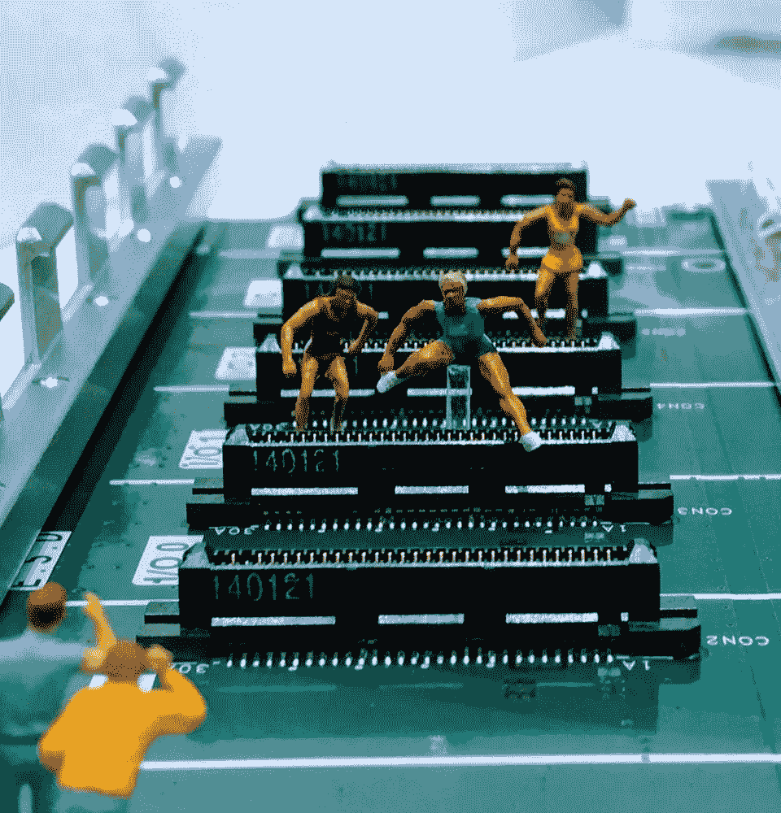

# 大数据、人工智能和物联网，第三部分:什么在阻止我们？

> 原文：<https://pub.towardsai.net/big-data-ai-iot-part-three-whats-stopping-us-b589ae5edc76?source=collection_archive---------1----------------------->

## 走进大数据、人工智能和物联网的未来| [走向人工智能](https://towardsai.net)

人工智能、大数据和物联网的进展已经得到了很好的记录，但在实现其全部潜力之前，仍有重大障碍需要跨越。约翰·卡梅伦，UNSPLASH

T 他的系列文章着眼于大数据、人工智能和物联网的前景，以及它们如何[构成一个生态系统 。因此，在查看了这些技术在](https://medium.com/towards-artificial-intelligence/big-data-iot-and-ai-part-one-three-sides-of-the-same-coin-fc49ad789c3a) [*特定环境*](https://medium.com/towards-artificial-intelligence/big-data-ai-iot-part-two-driving-industry-4-0-one-step-at-a-time-5f76b1ad6df6) 中的优势之后，有必要回顾一下在实现其全部潜力之前所面临的障碍。

> 商业领袖和媒体机构已经开始围绕人工智能、大数据和物联网的承诺大声疾呼，好像它们是解决世界问题的灵丹妙药。

但是，没有技术存在于真空中，这些技术的潜在影响目前被标准化、缺乏理解和许多组织高层不切实际的期望等障碍所削弱。涉水解决这些问题是一项挑战，但商业、企业和政府正开始意识到合作和稳步前进将比鲁莽行事带来更快的胜利。

# **物联网僵局**

任何新技术在开发和推广过程中都面临着一系列问题，但看看当前的物联网格局，就可以了解这些特定新兴技术的采用者所面临的挑战。传统上，物联网和消费设备都使用 2G，但随着越来越多的 3G 和 4G 设备(如智能手机和平板电脑)的支持，运营商已经开始“改造”2G，为更快、更有利可图的流量让路。这使得物联网用户可以选择**冒着关闭现有 2G 设备的风险**，购买一批新的 4G LTE 模块，或者信任下一代物联网网络技术。

有几种新的网络标准可供选择，它们各有利弊。低功率广域网([*lpwan*](https://www.iotforall.com/what-is-lpwan/))在很远的距离上发送微小的数据包，使用一块电池可以持续数年，但它们使用未经许可的亚 1GHz 频谱，对设备干扰和网络威胁的保护较少。 [*低功耗 LTE 选项*](https://www.iotforall.com/cellular-iot-explained-nb-iot-vs-lte-m/) 已经出现，以解决这一问题，但这些都是由独立的全球参与者(包括诺基亚、爱立信和华为)开发的，一个可互操作的标准似乎不太可能浮出水面。GSMA 的嵌入式和标准 SIM 卡标准是一个诱人的选择，因为它允许用户在一张 SIM 卡上远程编程多个网络。不幸的是，标准化的过程非常缓慢(eUICC 是在 2016 年 首次宣布的[)，但用户可以在此期间依赖**多网络和多 IMSI 蜂窝 sim，这允许网络切换，以避免锁定一个运营商**。](https://www.gsma.com/iot/iot-knowledgebase/embedded-euicc-path-standards/)

# **数据沼泽**

然而，那些在没有专家帮助的情况下设法在网络技术的迷宫中找到出路的公司不应该满足于现有的成就，因为真正的艰苦工作和纪律来自于适当的数据治理和 T21。一旦传感器网络相互连接并与云相连，公司就可以开始收集数据以备后用。但是，囤积你能找到的所有数据并不等同于为了有用的目的而保存它们，这种误解催生了一整个流行词汇家族。“数据沼泽”是无人管理的数据仓库，因为其中有大量不合格的数据，几乎不可能从中获得任何有价值的见解。

> 人工智能的好坏取决于提供给它的数据(这个概念在《数据的不合理影响》一书中得到了强调)，低质量的数据不仅会破坏一个算法的计算，而且如果结果是可信的，并在自动化过程中使用，这些错误可能会对现实世界产生毁灭性的影响。

# **不是灵丹妙药**

除了坏数据带来的敏感性，人工智能并不是一个万能的工具，可以神奇地改善所有的业务流程。红杉软件公司*的首席安全官德文·加里比安-萨基说:“人们需要诚实地知道自动化能做什么，不能做什么。当今最强大的人工智能只能完成一项任务。”对人工智能的不切实际的描述非常普遍，但商业领袖需要在期待奇迹之前调整他们对可能发生的事情的想法。例如，采用一个经过训练、能够发现生产线浪费的人工智能系统，将无法建议更高效的材料，除非连接到另一个为此目的构建的算法。在向人工智能寻求所有答案之前，企业必须意识到**尽管一种算法可以很好地解决一个问题，但要实现这一点需要时间、耐心和正确的心态**:“如果你不改变这种心态，那么你真的不会从你现在的位置迈出一大步，”加里比安-萨基说。*

# ***未来的增强功能***

*物联网、大数据和人工智能的发展和大规模采用的这些障碍当然只是暂时的，随着这些技术在不久的将来融合，它们只会相互补充和建立。例如，目前正在占据头条新闻，部分原因是来自 [*智能手机制造商*](https://5g.co.uk/phones/) 的巨大推动，但这项技术也为物联网、大数据和人工智能生态系统带来了巨大的变化。*

> *[*网络切片*](https://www.gsma.com/futurenetworks/wp-content/uploads/2017/11/GSMA-An-Introduction-to-Network-Slicing.pdf) ，5G 背后的支持技术，正在引起电信行业的兴趣，因为它允许运营商在多个虚拟子网络之间分割流量，每个虚拟子网络都针对不同的使用案例进行了优化，具有不同的速度和延迟需求。*

*这种智能网络将使用人工智能组件来运行，并可能成为可互操作生态系统的关键使能器之一，物联网、大数据和人工智能将在一个连接标准下运行。借助专为优化各种通信而设计的网络，来自消费者、企业和关键任务应用的数据可以在电波中进行分类和优先排序，成为这种生态系统发挥作用和自我优化的最佳催化剂。*

***人工智能、大数据和物联网确实是一枚硬币的三个面，但这些技术的全部潜力尚未实现**。公司需要明白，这种互联系统的增长存在重大障碍，但尽管可能需要一些试错来找出数据收集和人工智能的限制，但耐心、理解和正确类型的领导将有助于这些新技术变得司空见惯。*

**最初发表于*[T5【https://www.forbes.com】](https://www.forbes.com/sites/charlestowersclark/2019/02/22/big-data-ai-iot-part-three-whats-stopping-us/)*。**