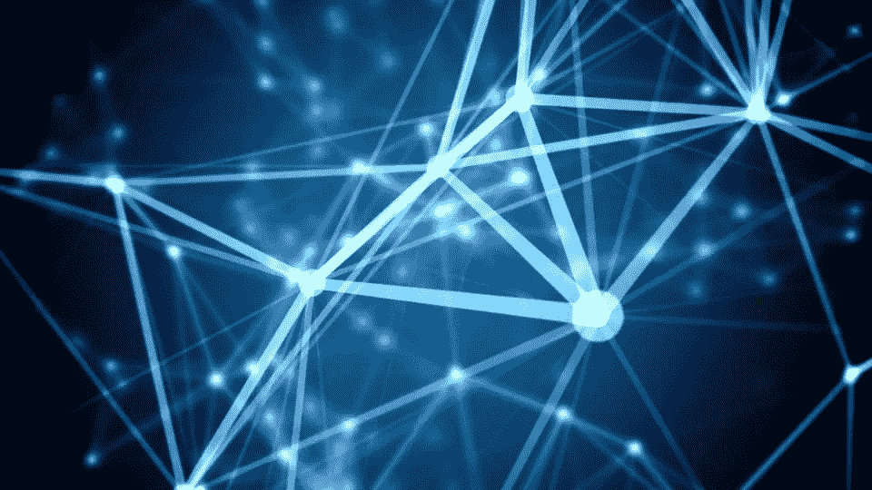

# 大数据、物联网和人工智能，第一部分:同一枚硬币的三面

> 原文：<https://pub.towardsai.net/big-data-iot-and-ai-part-one-three-sides-of-the-same-coin-fc49ad789c3a?source=collection_archive---------2----------------------->

## 展望人工智能、大数据和物联网的未来| [走向人工智能](https://towardsai.net)

大数据、人工智能和物联网都是同一个系统的组成部分，除非我们整体考虑它们，否则什么都不会改善

自从计算机被首次发明以来，人们一直在寻找“下一件大事”**现在，随着** [***接近半个世界***](https://venturebeat.com/2018/09/11/newzoo-smartphone-users-will-top-3-billion-in-2018-hit-3-8-billion-by-2021/) **拥有一部手机** [***比最早的超级计算机***](https://www.businessinsider.com/infographic-how-computing-power-has-changed-over-time-2017-11?r=US&IR=T) **还要快，我们很难记起什么是应该注意的**。虽然许多利用强大技术的发明几乎没有成为头条新闻(有人见过智能冰箱吗？)，使它们成为可能的进步经常成为同样炒作的牺牲品。

> 大数据、人工智能和物联网是近来被最广泛滥用的三个术语，许多人不知道这些技术是如何联系在一起的，也不知道它们如何为我们所期待的技术进步铺平了道路。

本文将阐明这些概念，后续文章将深入探讨它们在行业中的 [*重要性*](https://www.forbes.com/sites/charlestowersclark/2019/02/20/big-data-ai-iot-part-two-driving-industry-4-0-one-step-at-a-time/)[*它们面临的障碍*](https://www.forbes.com/sites/charlestowersclark/2019/02/22/big-data-ai-iot-part-three-whats-stopping-us/) 以及未来的前景。

# **大爆炸**

在 1989 年 [*万维网*](https://webfoundation.org/about/vision/history-of-the-web/) 推出后的几年里，相互连接的机器数量出现了巨大增长，当 [*GPS 在 1994 年至 2000 年间变得可行*](https://www.pcworld.com/article/2000276/a-brief-history-of-gps.html) 时，计算机和连接设备产生的数据量激增。这种设备网络的潜力很快就被认识到了，1999 年，麻省理工学院的凯文·阿什顿首次创造了“物联网”一词，他提出:“如果我们有知道所有事情的计算机，在没有我们任何帮助的情况下使用它们收集的数据，我们将能够跟踪和计算所有东西，并大大减少浪费、损失和成本。”

随着 GPS 技术的起飞，RFID 标签在 [*积分卡系统*](https://www.ijser.org/researchpaper/The-use-of-loyalty-cards-by-supermarkets-a-review-of-literature.pdf) 和 [*中的使用，PDA 市场*](https://www.pcworld.com/article/199243/a_brief_history_of_smartphones.html#slide5) 的升温，企业能够“看到”他们的流程，这是信息爆炸的绝佳条件。2005 年，[*Roger Mougalas*](http://radar.oreilly.com/2010/01/roger-magoulas-on-big-data.html)*首次使用“大数据”这一术语，因为产生的数据量变得太多，现有工具无法处理。*

> *2007 年推出的 iPhone*标志着大数据进入了消费者领域，从那时起，智能手机、可穿戴设备、平板电脑和各种智能设备的兴起改变了我们对物理和数字世界的看法。**

# ****大数据，大变革****

**与此同时，社交媒体和电子商务的兴起催生了数字角色的概念，数据不可思议的价值变得显而易见。**2000 年代还出现了数据行业，一些公司专门帮助企业管理组织数据，并利用它来改善流程。** Venkat Viswanathan，[*latent view Analytics*](https://www.latentview.com/)的联合创始人兼董事长，体验过数据在消费者营销领域的力量，也看到了对商业环境的兴趣维斯瓦纳坦说:“促成这种转变的是数字数据变得更加精细，公司从消费领域获取想法，并将其应用于工业领域。'**

**工业环境已经习惯于技术和数据收集，因为它们只使用数据来实时通知决策——检查压力水平、温度等。在专门的传感器数据变得足够精确并且存储成本下降之前，甚至没有考虑过存储这些数据以供以后分析和使用。维斯瓦纳坦说:“随着存储成本下降以及云存储在过去 5 到 8 年中开始使用，回顾历史数据并识别模式的机会出现了。”。**

# ****艾大放异彩的时候了****

**一旦数据存储成为各种业务的可行选择，云使收集庞大而详细的数据集成为可能，人工智能终于有了坚实的基础。多年来，人工智能研究经历了几个阶段，其中算法技术的发展因缺乏兴趣或投资而碰壁。随着越来越多的数据变得可用，人工智能研究分支到越来越窄的应用中，**最新一代的算法在基础领域**取得了巨大的进展——如自然语言处理、计算机视觉和 [*机器翻译*](https://www.nature.com/news/2006/061106/full/news061106-6.html)——因为有大量的信息可供学习。**

**这种来自大范围来源的可用训练数据的激增导致了人工智能系统的巨大改进，这种现象被称为数据的*不合理的有效性，这表明即使是简单的算法，在给定足够数据的情况下，也可以得出准确的结论。再加上几十年来不断完善这些算法的工作，以 [*近乎人类的表现*](https://venturebeat.com/2015/12/10/microsoft-beats-google-intel-tencent-and-qualcomm-in-image-recognition-competition/) 来执行特定任务，AI 终于有了可以咬紧牙关去实现有意义结果的东西。但是，大数据不仅给人工智能带来了额外的推动——正如[*Redwood Software*](https://www.redwood.com/)的首席安全官 Devin Gharibian-Saki 所说，这是必需的，***

> ***人工智能系统运行在统计模型上，所以如果没有大量数据支持，你就无法运行人工智能。***

# *****整体观点*****

***随着大量传感器、物联网设备甚至用户数据可用于为人工智能系统提供数据，现在可以在所有商业领域做出预测和决策，前提是用户理解**数据的含义和来源**。Gharibian-Saki 说，你必须知道自己最终想要什么，否则，所有的数据、技术和传感器都是无用的，尤其是在一个一切都可以衡量的环境中，丢失数据的风险比以往任何时候都大。公司必须记住，孤立地使用物联网、大数据或人工智能没有立竿见影的效果:“我们总是在寻找一种可以解决所有问题的东西，”加里比安-萨基说，“但物联网设备、传感器、机器人和人工智能都是一个系统中的组件——如果没有这种整体观点，将需要很长时间才能取得重大胜利。”***

***物联网、大数据和人工智能相互促进，创造了一个自动化的**生态系统——物联网设备收集数百万条标准的数据，然后在云中进行整理，用于训练和改进人工智能算法。因此，确保人们了解物联网、大数据和人工智能如何相互作用和相互改善，是我们能够为我们的生活带来真正改善的最重要的事情。*****

****本系列的后续文章将重点关注物联网、大数据和人工智能在工业中的交叉，这个生态系统现在面临的障碍，以及这组技术的未来。****

****最初发表于*[*【https://www.forbes.com】*](https://www.forbes.com/sites/charlestowersclark/2019/02/15/big-data-iot-and-ai-part-one-three-sides-of-the-same-coin/)*。****