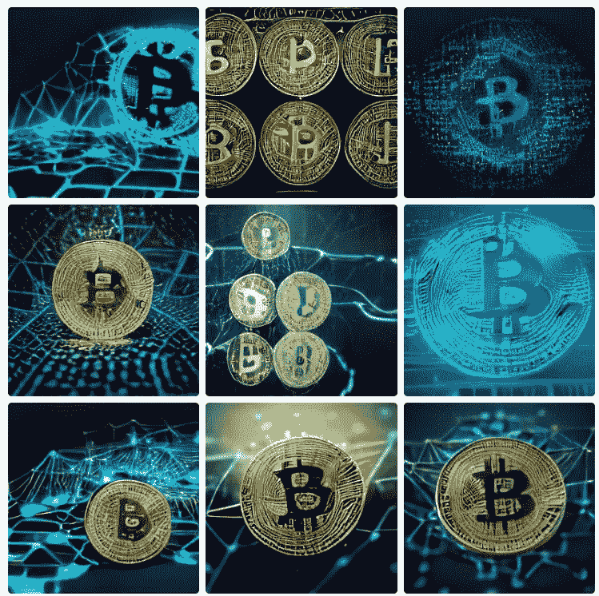

# 区块链和 NLP:十大方法和机会

> 原文：<https://pub.towardsai.net/blockchain-and-nlp-top-10-approaches-and-opportunities-916c9b1971f1?source=collection_archive---------2----------------------->

## 当区块链和 NLP 结合在一起时，它们在多个行业都有许多优势、应用和用例

Pexels 的 CocaKolaLips

# 为什么是现在:区块链和 NLP

区块链是一种新的创新技术，有可能改变我们与互联网和数字世界的互动方式。在其最简单的形式中，区块链是一个分布式数据库，允许安全、透明和防篡改的交易[1]，这意味着信息可以存储在区块链上，并在计算机网络上共享，而不需要中央机构[2]或中间人。

区块链最令人兴奋的一个方面是它有可能实现人工智能(AI)的新应用，特别是在自然语言处理(NLP)领域。NLP 是人工智能的一个分支，处理理解和生成人类语言；它以许多不同的形式无处不在，例如语音识别、机器翻译和用于情感分析的文本分析。

有了区块链，自然语言处理可以更上一层楼。例如，智能合约可用于在满足特定条件时执行合约，这种实现无需物理用户中介即可自动实现。同样，存储在区块链上的数据可以使用 NLP 算法进行分析，以提取有价值的见解。

在这篇文章中，我将探索区块链和 NLP 改变我们与数字世界互动方式的潜力。我将讨论结合使用这些技术的优势，并查看一些已经开发的应用程序示例。最后，我将考虑在区块链和 NLP 充分发挥潜力之前需要解决的一些挑战。

来自 Unsplash 的[埃里克·麦克林](https://unsplash.com/@introspectivedsgn)

# **同时使用区块链和 NLP 的 10 大优势**

**3 高等级优势**

将区块链和 NLP 结合使用有很多优点。也许最重要的是它实现了**无信任交易【3】**，这意味着交易双方无需相互信任或依赖第三方，如银行或政府。相反，他们可以依靠区块链的安全和透明。

另一个好处是区块链和 NLP 的交叉为**自动化**开启了新的可能性。例如，智能合同可以用于在满足某些条件时自动执行协议，从而可以在没有任何用户干预的情况下执行。在整个过程中或在实施过程中的关键接触点，存储在区块链上的数据也可以使用 NLP 算法进行分析，以提取有价值的见解。

最后，同时使用区块链和自然语言处理有助于保护 T2 的隐私。例如，个人数据可以存储在私人区块链上，并且只与相关用户授权的组织共享，从而使用户对其个人数据以及谁可以访问这些数据有更多的控制权。

图片归作者所有

**10 大技术优势**

1.不可变的、防篡改的记录:利用区块链技术，可以永久保存不可更改的交易记录，防止被编辑或篡改。这很重要，因为它消除了欺诈或错误交易的可能性。

2.在不同方之间轻松共享数据:因为区块链技术是分散的，所以在不同方之间共享数据可能更容易，而不需要相互信任。在组织需要共享敏感数据(如医疗记录或财务信息)的情况下，这可能很有价值。

3.降低成本和时间框架:区块链技术可能会降低进行交易所需的成本和时间框架。在需要快速无误地处理大量交易的情况下，这一点尤为重要。

4.更高的安全性:由于区块链技术是分散的，与集中式系统相比，它提供了更高的安全性(这是因为没有单一的攻击点[6]会危及系统的完整性。)

5.不变性保存历史数据:区块链技术确保历史数据是不可变的[5]，这保存了它的价值，并防止它以会使信息无效的方式被更改或破坏。

来自 Pexels 的驼鹿照片

6.验证同行评审的能力:使用区块链技术，可以验证文档的同行评审是否准确和完整。这在准确性至关重要的情况下非常有价值，例如医疗保健或法律环境。

7.轻松的支付处理:区块链技术可能会通过消除对第三方中介的需求来简化支付处理，可能会降低交易成本，使交易更加安全和高效。

8.减少欺诈:区块链技术通过为资产和交易提供安全的跟踪系统，可能有助于减少欺诈的发生。这可以保护企业免受外来者的盗窃或欺诈。

9.降低跨境交易成本:通过利用区块链技术，各组织可以避免支付中介费用，从而降低与跨境交易相关的成本。

10.提高透明度:通过使用区块链技术，企业可以通过创建一个所有参与者都知道系统内发生的所有交易的系统来提高透明度。这种方法有助于消除与业务运营相关的任何模糊或混乱。

来自 Pexels 的驼鹿照片

# **连接区块链和 NLP 的应用和用例**

1.从全球来看，有机会更好地保存记录和更可靠地核实数据。区块链可以帮助创建一个不受操纵或干扰的安全记录系统。

2.NLP 可用于识别大型数据集中的模式，并使分析更有效。这种能力对于目标市场营销、欺诈检测和产品质量控制非常有用。

3.区块链可以用来为个人或组织创建安全的在线身份。这在传统识别方法不可行或不安全的情况下，或者在需要隐私的情况下尤其有用。

4.区块链技术可以用来创建防篡改的交易记录。这对于金融、医疗保健和供应链等透明度至关重要的行业很有帮助。

5.通过识别潜在的威胁和漏洞，NLP 可用于增强区块链系统的安全性。可能会有第三方参与区块链网络的使用案例。

来自 Pexels

6.将区块链技术与 NLP 结合使用，可以做出更准确的营销决策，尤其是在涉及大数据而传统营销技术可能不足以解决问题的情况下。

7.NLP 可用于自动记录和验证区块链网络上的交易。这种实现有可能使系统更加可靠，并减轻负责维护网络的用户的负担。

8.区块链技术有可能与 NLP 结合使用，以促进智能合同。当涉及到执行多方之间的协议时，这些合同将允许规模经济和增加的准确性。

9.NLP 还可以在管理和跟踪数字内容(包括音乐、电影和电视节目)的权利所有权方面发挥重要作用，帮助确保知识产权得到适当的保护和管理。

10.最后，区块链技术和自然语言处理技术可以相互结合使用来创建新的分散式应用(dapp)[7]。这些应用程序将不受任何一方或机构的控制，为用户提供一种控制其数据的方式。

如果您有任何编辑/修改建议或关于进一步扩展此主题的建议，请考虑与我分享您的想法。

# 另外，请考虑订阅我的每周简讯:

 [## 周日报告#1

### 设计思维与 AI 的共生关系设计思维能向 AI 揭示什么，AI 又能如何拥抱…

pventures.substack.com](https://pventures.substack.com/) 

# **我写了以下与这篇文章相关的内容；他们可能与你有相似的兴趣:**

# **1。密涅瓦如何超越 GPT-3**

 [## 一个新的 NLP 模型 Minerva 如何比 GPT-3 表现得更好

### 自然语言处理的进步正在解决数学和许多其他定量推理问题。

pub.towardsai.net](/how-minerva-a-new-nlp-model-performs-better-than-gpt-3-f7713458b59b) 

# **2。顶级 NLP 模型**

 [## 16 个用于情感分析的开源 NLP 模型；一个在顶端升起

### 介绍 16 款车型，深入了解风格。

pub.towardsai.net](/16-open-source-nlp-models-for-sentiment-analysis-one-rises-on-top-b5867e247116) 

# **3。非结构化数据与结构化数据**

 [## 非结构化数据与结构化数据:5 个最重要的区别

### 结构化数据、非结构化数据的分类、各自的优势，以及如何将它们部署在一起…

medium.com](https://medium.com/@AnilTilbe/unstructured-vs-structured-data-the-5-most-important-differences-8d86078a163b) 

*参考文献:*

*1。Yaga，d .，Mell，p .，Roby，n .，&# 38；k . scarfone(2019 年 6 月 26 日)。区块链技术概述。ArXiv.Org。*[*https://arxiv.org/abs/1906.11078*](https://arxiv.org/abs/1906.11078)

*2。区块链技术可能是第二代互联网——Qrius。*[【https://qrius.com/blockchain-technology-internet/】T21](https://qrius.com/blockchain-technology-internet/)

*3。刘，吴，&# 38；徐。(2019).区块链技术将如何影响审计和会计:未经许可与经许可的区块链。当前审计问题，13(2)，A19–A29。*[*https://doi.org/10.2308/ciia-52540*](https://doi.org/10.2308/ciia-52540)

*4。区块链技术中的智能合同和使用案例概述。(未注明)。IEEE Xplore。检索到 2022 年 7 月 19 日，来自*[*【https://ieeexplore.ieee.org/abstract/document/8494045】*](https://ieeexplore.ieee.org/abstract/document/8494045)

*5。利用区块链技术重塑医疗保健行业。(未注明)。IEEE Xplore。检索 2022 年 7 月 19 日，来自*

**6。李东兴；彭维；邓文萍；郁芳·盖。基于区块链的物联网认证和安全机制。*[*https://ieeexplore.ieee.org/abstract/document/8487449*](https://ieeexplore.ieee.org/abstract/document/8487449)*

**7。吴凯东，马云，，刘玄哲。基于区块链的去中心化应用初探。*[【https://arxiv.org/pdf/1909.00939.pdf】](https://arxiv.org/pdf/1909.00939.pdf)*T21。**