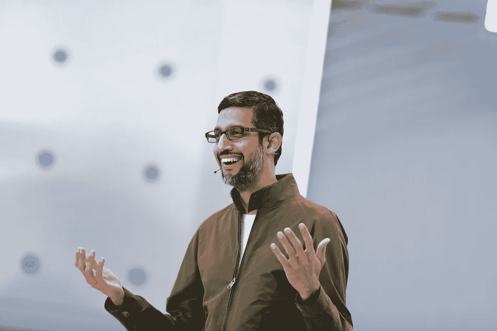
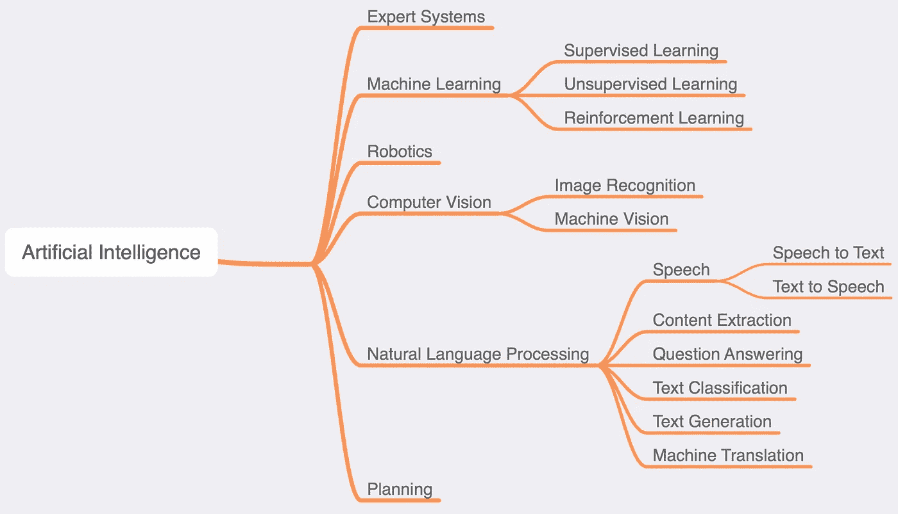

# 人工智能领域的分支，改变您的业务！

> 原文：<https://pub.towardsai.net/branches-in-artificial-intelligence-to-transform-your-business-f08103a91ab2?source=collection_archive---------2----------------------->

## [人工智能](https://towardsai.net/p/category/artificial-intelligence)

## 探索专家系统、机器学习、机器人、计算机视觉、自然语言处理和规划

图片来自[商业内幕](https://www.businessinsider.in/Google-CEO-Sundar-Pichai-revealed-a-jaw-dropping-fact-about-its-translation-app-that-shows-how-much-money-is-still-sitting-on-the-table/articleshow/65111657.cms)

2018 年 5 月 8 日，谷歌 I/O 在加州山景城的海岸线圆形剧场举行。如果你想知道 Google I/O 是什么，别担心，我会支持你的。

> “Google I/O 每年都将来自全球的开发人员聚集在一起，与 Google 专家进行交流、实践学习，并初步了解 Google 的最新开发产品。”

在主题演讲中，Alphabet Inc .(谷歌母公司)的首席执行官桑德尔·皮帅分享了谷歌一直在努力的最新进展。他谈到的一个项目可能是没有人预见到的；人工智能(AI)的一个应用，很快就会出现在我们自己的智能手机上，让世界惊叹不已。这个项目被称为“谷歌双工”这一举措使人工智能能够给发廊打电话，像我们人类一样交谈，并预约理发时间——令人惊讶的是，所有这一切都发生在你的手机后台，没有你的任何干预！你所要做的就是说出:

> "好的，谷歌，帮我预约周二上午 10 点到 12 点之间的任何时间理发."

不相信我？抓住文末的剪报！

这是一件大事的原因是我们的人工智能刚刚通过了**图灵测试**！如果你不知道图灵测试是什么，想象一下，你问两个实体一个问题，其中一个是人，另一个是机器，你不知道哪个是人，哪个是机器。如果机器回答问题的方式与人类回答问题的方式没有什么区别，而你又无法看出它是一台机器，我的朋友，那么这台机器通过了图灵测试。这是图灵测试背后的基本思想——找出机器或者更确切地说是人工智能是否至少和人类一样好。要了解更多信息，请随时查看[这个链接](https://en.wikipedia.org/wiki/Turing_test)。

所以你可能会想，人工智能是怎么做到的？人工智能还能做什么？同样的人工智能模型会被用来与你交谈并驾驶你的汽车吗？要回答这些问题，我们来深入挖掘一下 AI 的分支。这些分支将帮助我们了解适用于手头任务的解决方案类型。不要耽搁，让我们开始吧。

人工智能的分支包括:

# **1。专家系统**

当你面临一个问题，比如说你的牙齿有蛀牙，你要做的第一件事就是去看牙医。你肯定不会想到去看全科医生。你为什么选择去看牙医而不是普通内科医生？仅仅因为牙医是牙齿治疗的专家。当涉及到 AI 时，我们可以采用类似的方法，即使用一个对我们打算解决的问题来说是专家的 AI 系统。

因此，**专家系统，顾名思义，就是像人类专家一样专门从事某项特定任务的程序。**它们主要用于解决复杂的问题，并提供类似人类的决策能力。它利用一组由人类定义的规则(称为推理规则)和一个知识库(称为知识库)来解决手头的任务。知识库由特定领域的人类专家添加的数据填充。一个非专家使用这个程序来获取一些信息。因此，这些系统的主要目的不是代替人类完成任务，而是帮助人类获得更好的结果和更高的工作质量。

第一个专家系统是在 20 世纪 70 年代开发的，它可以被认为是人工智能的第一个成功的方法。人工智能这一分支的几个例子是:

*   **DENDRAL:** 有机化学中用于检测未知有机分子的化学分析专家系统。
*   **CaDeT:** 一个可以在早期发现癌症的诊断支持系统。

# **2。机器学习(ML)**

当我们谈论人工智能时，我们脑海中出现的第二个术语是**“机器学习”。**人类的学习是在需要相关情境时增加我们的知识和应用知识的能力的过程。当我们学到一些东西时，我们不仅可以将知识应用到已经探索过的情况中，还可以应用到我们可能从未面对过的情况中。在后一种情况下，根据我们以前的经验，我们做出一个计算好的猜测，试图解决这个问题。

类似地，**机器学习是机器在没有显式编程的情况下进行学习的能力，也就是说，开发对以前未探索的观察进行计算猜测的能力。为了使机器能够学习，我们向它提供历史数据作为它的训练经验。它基于这样一种想法，即机器可以从过去的数据中学习，识别模式，并使用算法做出决策。这些算法是以这样一种方式设计的，它们可以自动学习和提高性能(甚至我们人类也会这样做！)**

根据我们选择的学习方法(或可行的学习方法)，有 3 种类型:

## **A .监督学习**

考虑一个学生第一次被老师教一个科目的情况。学生首先学习它，然后对所教授的概念进行测试。测试中的问题可以与老师所教的相同，也可以不同，但基于之前所教的概念。当类似的方法用于机器时，它被称为“监督学习”我们的人工智能系统是根据它在测试中的表现进行评估的。这方面的一个例子是“股票价格预测”

## **B .无监督学习**

考虑一个类似的情况，一个学生没有被教导，但被告知直接参加测试。测试是将试卷中相似的问题分开。当这种方法用于机器时，它被称为“无监督学习”这个测试看起来很奇怪，对吗？这种方法适用于数据聚类或异常检测等任务，在这些任务中，每个数据聚类都显示出相似的趋势(例如，在雨天，天气条件会是相似的)，并且所有异常都以相似的方式表现。这方面的一个例子是**‘识别投球手和击球手’**

## **C .强化学习**

考虑第三种情况。就像无监督学习一样，不教学生，直接让学生参加考试。不同之处在于，学生需要取得至少一定的分数才能通过考试，在此之前，要一次又一次地参加考试。学生只被告知他/她所得到的分数。我们都知道学生别无选择，只能通过试错来回答。但是我们知道，随着时间的推移，学生将了解各种趋势，并且在每次测试后，将随机应变他/她的回答策略，以找出最终通过测试的最佳策略。当这种方法应用于机器时，它被称为“强化学习”这方面的一个例子是“人工智能打乒乓球”

# **3。机器人技术**

在理解机器人技术及其与人工智能的联系之前，让我们先看看机器人实际上是什么。机器人只是一种能够自动执行一系列复杂动作的机器。它可以通过电脑编程来实现。可以使用遥控器等外部设备对其进行控制，也可以将其控制嵌入自身。当我们想到机器人时，我们认为它们看起来像人，而事实是它看起来像任何其他的玩具车。

当这个机器人被一段代码允许思考并智能地自主选择它的行动时，它就是一个人工智能机器人。这些智能机器人现在可以用自己的智能完成任务。人们普遍发现，如果机器人必须执行的任务变得更加复杂，就有必要利用人工智能算法。如今，人工智能和机器学习正被应用于机器人，以制造智能机器人，这些机器人也可以像人类一样进行社交。人工智能在机器人领域最好的例子之一是“索菲亚机器人”

图片由[吴家浩·罗德](https://jashrathod0.wixsite.com/jashrathod)拍摄

# **4。计算机视觉**

我们学习过程的很大一部分涉及到我们的视觉。我们大多了解我们的环境，并根据我们所看到的做出自己的解释。我们能够看见是因为角膜将进入眼睛的光线聚焦，并将我们所见的东西成像在视网膜上。这个图像然后被转换成电脉冲，并被发送到大脑来处理图像和感知它所看到的。

我们能把这项技术应用到机器上吗？答案是——是的，我们可以，人工智能是大脑，相机是它的眼睛。这是计算机视觉。

> 计算机视觉，通常缩写为 CV，被定义为一个研究领域，旨在开发技术来帮助计算机“看”和理解数字图像(如照片和视频)的内容
> 
> —杰森·布朗利，机器学习大师的创始研究员

**图像识别**是计算机视觉的一个子集，它帮助我们识别物体、人、地点、特征以及图像或视频可以提供给我们的任何东西。虽然我们人类可以毫不费力地处理和识别我们看到的东西，但机器在这方面面临很大困难。我们将在以后的文章中探讨如何做到这一点。可以使用图像识别的一些例子有:

*   无人驾驶汽车(汽车上的摄像头不断寻找和了解周围环境，并根据观察结果控制汽车转向、移动或停止)
*   面部解锁会在前置摄像头中搜索我们的面部，如果找到，会提示解锁手机。
*   图像字幕(输入给人工智能的图像告诉我们它在图像中看到了什么，比如一条繁忙的街道，一场音乐会，或者一个接近你的人)

# **5。规划**

想象一下，你想从你家附近的超市买一些家庭用品。从你家出发，你可以走三条不同的路线到达超市。假设您的工作日程很紧，并且您必须在有限的时间内回到家中。毫无疑问，你会选择从你家到超市再回来的最短路线。这是策划。

在人工智能规划中，最终目标需要在一些给定的约束和环境下实现。作为类比，我们的超市示例中的上下文是路线及其各自持续时间的知识，约束是有限的时间段，最终目标是在不违反约束的情况下购物并返回房屋。约束也可能是选择最便宜的路径。无论约束是什么，任务仍然是优化解决方案，使其达到最佳或任何可接受的解决方案。这可以通过探索未知或利用现存的知识来实现，或者两者兼而有之。

# **6。**自然语言处理

我们人类学习的另一个很好的方法是当我们从某处阅读并听别人说话时。这两者都要求我们了解语言及其规则。这就是我们所说的“自然语言”但是机器无法理解我们的自然语言。NLP 来了。

NLP 是人工智能的一个领域，在这个领域中，计算机分析、理解并试图以一种聪明而有用的方式从自然语言中获取意义。我在本文开头讨论的来自 Google I/O 2018 的事件就属于 AI 的这个分支。NLP 使用户能够直接用自然语言与机器交流。

哇哦。很酷，不是吗？

如果您希望解决以下一个(甚至多个)类别的问题，NLP 就是解决方案。

## **答:机器翻译**

用过谷歌翻译吗？是的，那是机器翻译的一个例子。机器翻译的任务是自动将一种自然语言转换成另一种自然语言，保留输入文本的含义，并以输出语言产生流畅的文本。

## **B .内容提取**

内容提取是从非结构化或半结构化数据中获取结构化数据的任务。这基本上意味着从所有可用信息中获取相关信息。在这个世界上，大约 85%的数据是非结构化的，其中很大一部分是文本数据。因此，我们可以将 NLP 技术应用于这些数据，并使用它来收集相关信息或获得业务洞察力。

## **C .问题解答**

问题回答，顾名思义，就是构建系统，自动回答人类用自然语言提出的问题。当我们问 Siri、谷歌助手或 Cortana 一个问题时，它会使用问答 NLP 技术产生一个答案。

## **D .文本分类**

如果我们想根据文本的内容将文本分类到特定的类别中，我们可以使用文本分类 NLP 技术。这方面的例子可以是将电子邮件分类为垃圾邮件与否，找出电影评论是正面还是负面的，这个列表是无止境的！

## **E .文本生成**

我们可以让人工智能为我们造句。这属于文本生成的范畴。它有时也被称为自然语言生成(NLG)。例如:给定一个主题，机器就此写一整篇文章。

## **F .演讲**

这个就不用细说了！谷歌助手，Siri，Bixby 都是语音的应用。它有两个部分:语音到文本和文本到语音。当我们说:

> “嘿 Siri，你看《权力的游戏》吗”

我们所说的话会被转换成我们的 iPhone 能够理解的文本。这是语音转文本。然后，当 Siri 为我们的问题准备答案时，它仍然是纯文本。它使用文本到语音的技术，我们会听到 Siri 说:

> “是的。我会问琼恩·雪诺一些提示，但他什么都不知道。”

图片由[吴家浩·拉瑟德](https://jashrathod0.wixsite.com/jashrathod/)拍摄。这是苹果的语音助手——[Siri](https://www.apple.com/in/siri/)

没错！Siri 确实这么说过。

人工智能的实际能力令人惊叹。但是我们为什么需要做这些呢？这个除了花里胡哨的实验室项目或者钢铁侠玩具还有什么用？嗯，这些发展可以帮助我们的生活变得更加轻松，可以帮助企业运作，获得更好的洞察力，和/或自动化他们的一些流程，如聊天机器人，并可以让我们在互联网上找到我们想要的东西。借助人工智能搜索引擎，如谷歌。

这只是人工智能能力的一个缩影。在接下来的文章中，我们将探讨如何开发这些系统，以及企业如何利用这些工具将他们的业务推向更高的高度。

感谢您的阅读！

你有什么想法想和我讨论吗？或者希望分享你对人工智能的想法？不用担心，随时在 [**Linkedin**](https://linkedin.com/in/jash-rathod-902512145) 或 [**Twitter**](https://twitter.com/rathod_jash) 上联系我。随时乐意帮忙！

正如我所承诺的，下面是发布 **Google Duplex** 的视频链接:

# 关于作者

[**吴家浩·拉特霍德**](https://jashrathod0.wixsite.com/jashrathod) 是印度孟买**维尔马塔·吉加拜技术学院(VJTI)** 的一名大四学生。他的使命是用技术和商业解决方案帮助人们和企业。想了解他更多，可以访问他的 [**网站**](https://jashrathod0.wixsite.com/jashrathod) 。

你可以在 [**GitHub**](https://github.com/jashrathod) 查看他的作品，在[**LinkedIn**](https://linkedin.com/in/jash-rathod-902512145)[**Twitter**](https://twitter.com/rathod_jash)[**insta gram**](https://www.instagram.com/jashrathod13/)[**脸书**](https://www.facebook.com/jash.rathod.54) 与他连线。

# 参考

 [## 人工智能中的专家系统

### 专家系统是一种计算机程序，旨在解决复杂的问题，并提供决策…

www.javatpoint.com](https://www.javatpoint.com/expert-systems-in-artificial-intelligence)  [## AI-Java 点的子集

### 到目前为止，我们已经了解了什么是人工智能，现在我们将在这个主题中了解人工智能的各种子集。跟随…

www.javatpoint.com](https://www.javatpoint.com/subsets-of-ai)