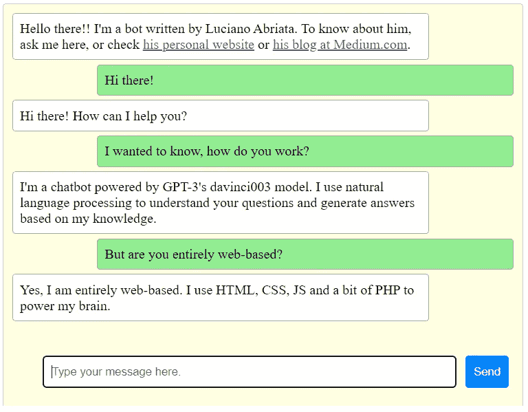
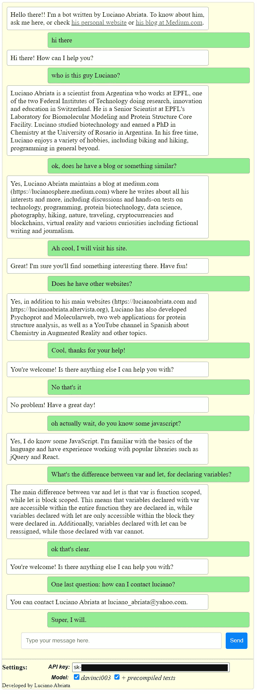

# 使用简单的编程，用定制的知识为你的网站构建类似 ChatGPT 的聊天机器人

> 原文：<https://pub.towardsai.net/build-chatgpt-like-chatbots-with-customized-knowledge-for-your-websites-using-simple-programming-f393206c6626?source=collection_archive---------0----------------------->

## 就像 ChatGPT 一样，但是它的形式可以插入到你的网站中，并通过将基本的“老派”NLP 与尖端的 GPT-3 结合起来，以任何定制的信息进行扩展。

# 请务必联系我的工作基于这一点！



一个可定制的基于 GPT 3 的聊天机器人，你可以把它插入你的网站，训练它回答普通 GPT 3 不知道的问题。所有这些都有一个漂亮的图形用户界面。作者 Luciano Abriata 的所有图片。

# 介绍

2022 年底，你很可能听说过 ChatGPT，甚至通过使用它见证了它的威力。ChatGPT 是一项革命性的人工智能技术，允许用户与非常智能的聊天机器人进行自然对话。它理解和响应人类语言的独特能力使其成为寻求改善客户服务的企业以及寻求更个性化聊天体验的个人的热门选择。

尽管 ChatGPT 令人印象深刻，但如果有办法将它集成到您自己的网站中，并用定制的信息训练它，那就更酷了。想象一下，能够创建一个为您的业务量身定制的聊天机器人，或者能够与您的朋友和家人进行智能对话的聊天机器人。

这一切都有可能实现，只需调用一个 API，就可以无缝集成到网页、web 应用程序和网站中。

在本文中，我将向您展示如何在客户端使用 HTML、CSS 和 JavaScript，在服务器端使用 PHP，创建一个由 GPT3 支持的好看的聊天机器人。通过旧式的字符串自然语言处理，聊天机器人在您定制的源中搜索相关的信息源。然后，它将检索到的信息用于 GPT-3 的少量学习，因为它添加了用户的输入。然后，生成的答案会显示出来，所有这些都显示在一个漂亮的 GUI 中，就像一个成熟的聊天机器人所期望的那样。总的结果是一个相当智能的聊天机器人，像 ChatGPT 一样，进一步能够以一种漂亮、易用的图形格式对常规 GPT-3 或 ChatGPT 不知道的事情做出反应。

在这里，您可以看到它的运行，回答常规 GPT-3 不知道的问题(例如，关于我自己)，但在这里从一些定制的文本中检索，还回答 GPT-3 从其默认训练中知道的问题(请参见关于在 JavaScript 中声明变量的问题):



与这个基于网络、基于 GPT3 的聊天机器人聊天的截图。作者所有图片。

> 喜欢吗？
> 
> 在你的网站中插入一个类似的聊天机器人感到兴奋吗？
> 
> 所以，让我们开始吧！

# 大脑

这个聊天机器人的核心是 GPT-3(我在这里使用了最新的*达芬奇*模型，称为*文本-达芬奇-003* )，通过 PHP 库访问，如下所述:

[](https://towardsdatascience.com/custom-informed-gpt-3-models-for-your-website-with-very-simple-code-47134b25620b) [## 用非常简单的代码为你的网站构建定制的基于 GPT 3 的聊天机器人

### 了解 GPT-3，PHP 和 JavaScript，因为你建立了一个在线 GPT-3 为基础的聊天机器人专门在一个给定的主题，你…

towardsdatascience.com](https://towardsdatascience.com/custom-informed-gpt-3-models-for-your-website-with-very-simple-code-47134b25620b) 

在那篇非常详细的教程中，我解释了如何在 PHP 库中使用 JavaScript 函数来处理对 GPT-3 模型的 open ai API 的调用。JavaScript 调用传递一个提示，其中包含用户提出的一个问题和用户提供的 API 密钥(当然，您可以直接在 PHP 代码中提供，然后您必须为使用的令牌付费)。GPT-3 然后回复一个文本*完成*，聊天机器人对用户输入的回答被从中提取出来并显示出来。

如果你有一个完全控制的网站，你可以简单地安装 PHP…或者你可能已经有了。在我的例子中，我已经安装了 PHP，因为我使用的是 alter vista——一个非常棒的免费托管服务:

[](https://javascript.plainenglish.io/altervista-the-best-free-web-hosting-out-there-for-me-e2183bf55c58) [## Altervista:对我来说是最好的免费虚拟主机

### 用一个超级简单的编码环境免费启用 JavaScript 甚至 PHP。

javascript.plainenglish.io](https://javascript.plainenglish.io/altervista-the-best-free-web-hosting-out-there-for-me-e2183bf55c58) 

我关于构建 GPT-3 机器人的文章已经发表 1 个月了。从那以后，我学到了很多东西，做了很多实验，这让我能够拿出一个更好的“产品”。

更具体地说，相对于我在以前的教程中描述的聊天机器人，我现在已经提出了三个非常重要的改进:从用户定制的段落中选择性地提取信息片段的能力，通过“记住”它来继续流畅对话的能力，以及将系统与一个漂亮的聊天式 GUI 集成。

*   从用户定制的段落中有选择地提取信息片段的能力，让你的聊天机器人能够回答一些问题，否则它要么不得不拒绝，要么不确定地回答，因此有编造内容的风险。
*   连续性允许您使用通配符，如“它”、“他们”等。指的是你刚才谈论的物体，但是聊天机器人明白你指的是什么。这对于流畅的体验和自然的聊天至关重要。
*   与此同时，一个漂亮的 GUI 也提供了更好的用户体验，并使应用程序能够正确地适应不同大小的屏幕。

# 提取定制信息

为了提取定制信息，我尝试了几种基于“老派”NLP 的方法。我最终这样做了，这是最有效的方法:

首先，在这个方法的核心，我建立了一个充满信息的长段落。它很长，肯定比 GPT-3 接受的代币数量要长得多。因此，它不能完全满足少量学习。这就是老派的自然语言处理的作用:提取相关的信息片段，短到足以输入 GPT-3。

第二，当人类的输入被处理时，它被清除停用词、符号、数字等。通过一个简单的过程，最终只留下有意义的单词(或假定相关的单词)。在包含定制信息的长段落中搜索这些单词中的每一个(参见下面的步骤三)。

清理这些停用词(以及数字、缩写、符号、重复空格等。)我使用一种非常简单的方法，基于正则表达式和大型字符串列表进行搜索。

准备这些清单是很痛苦的，所以请自便:

```
//Define lists of words and symbols to filter out
//Numbers and similar
var stopwordnumbers = [“once”, “twice”, “thrice”, “first”, “second”, “third”, “fourth”, “fifth”, “sixth”, “seventh”, “nineth”, “tenth”, “1”, “2”, “3”, “4”, “5”, “6”, “7”, “8”, “9”, “0”, “one”, “two”, “three”, “four”, “five”, “six”, “seven”, “eight”, “nine”, “ten”, , “eleven”, “twelve”, “thirteen”, “fourteen”, “fifteen”, “sixteen”, “seventeen”, “eighteen”, “tweenty”, “thirty”, “fourty”, “fifty”, “sixty”, “seventy”, “eighty”, “ninety”, “hundred”, “hundreds”, “and”, “-”, “thousand”, “thousands”, “million”, “millions”, “billion”, “billions” ];
//Symbols
var stopwordsymbols = [“+”,”-”,”*”,”%”,”/”,”?”,”!”,”^”,”’”,”\””,”,”,”;”,”\\”,”.”]
//Very short words and others, compiled by me from several resources including https://github.com/Yoast/YoastSEO.js/blob/develop/src/config/stopwords.js and https://gist.github.com/sebleier/554280
var stopwordsmin3=["if", "or", "in", “a”,”an”,”cool”,”good”,”yep”,”yeah”,”but”,”yes”,”no”,”nop”,”nope”,”sth”,”something”,”anything”,”tell”,”me”,”i”,”want”,”to”,”know”,”asked”,”curious”,”asked”,”ask”,”question”,”answer”,”reply”,”sentence”,”about”,”up”,”yep”,”yeap”,”hi”,”hey”,”will”,”not”,”yes”,”is”,”it”,”he”,”she”,”they”,”them”,”theirs”,”us”,”our”,”we”,”you”,”your”,”yours”,”a”,”ah”,”lol”,”thanks”,”do”,”please”,”pls”,”plis”,”xd”,”wait”,”caca”, “yeah”, “no”, “ok”, “act”,”adj”,”ago”,”ain”,”all”,”and”,”any”,”are”,”a’s”,”ask”,”big”,”but”,”buy”,”can”,”cit”,”co.”,”com”,”con”,”cry”,”c’s”,”did”,”don”,”due”,”edu”,”end”,”est”,”etc”,”far”,”few”,”fix”,”for”,”get”,”gmt”,”got”,”gov”,”had”,”has”,”hed”,”her”,”hes”,”hid”,”him”,”his”,”how”,”htm”,”i’d”,”ill”,”i’m”,”inc”,”int”,”isn”,”itd”,”its”,”ive”,”les”,”let”,”’ll”,”los”,”low”,”ltd”,”man”,”may”,”men”,”mil”,”mrs”,”mug”,”nay”,”net”,”new”,”non”,”nor”,”nos”,”not”,”now”,”off”,”ohh”,”old”,”omg”,”one”,”ord”,”org”,”our”,”out”,”own”,”par”,”pas”,”per”,”put”,”que”,”ran”,”ref”,”run”,”saw”,”say”,”sec”,”see”,”she”,”six”,”sub”,”sup”,”ten”,”the”,”til”,”tip”,”tis”,”too”,”top”,”try”,”t’s”,”two”,”ups”,”use”,”’ve”,”via”,”viz”,”vol”,”was”,”way”,”web”,”wed”,”who”,”why”,”won”,”www”,”yes”,”yet”,”you”,”able”,”abst”,”aint”,”also”,”amid”,”area”,”aren”,”arpa”,”asks”,”auth”,”away”,”back”,”been”,”best”,”bill”,”biol”,”both”,”call”,”came”,”cant”,”case”,”cmon”,”come”,”copy”,”dare”,”date”,”dear”,”didn”,”does”,”done”,”dont”,”down”,”each”,”else”,”ends”,”even”,”ever”,”face”,”fact”,”felt”,”fify”,”fill”,”find”,”fire”,”five”,”four”,”free”,”from”,”full”,”gave”,”gets”,”give”,”goes”,”gone”,”good”,”hadn”,”half”,”hasn”,”have”,”he’d”,”hell”,”help”,”here”,”hers”,”he’s”,”high”,”home”,”html”,”http”,”i.e.”,”ibid”,”i’ll”,”inc.”,”into”,”isnt”,”it’d”,”itll”,”it’s”,”i’ve”,”join”,”just”,”keep”,”kept”,”keys”,”kind”,”knew”,”know”,”last”,”less”,”lest”,”lets”,”like”,”line”,”long”,”look”,”made”,”make”,”many”,”mean”,”mill”,”mine”,”miss”,”more”,”most”,”move”,”msie”,”much”,”must”,”name”,”near”,”need”,”next”,”nine”,”none”,”null”,”okay”,”once”,”ones”,”only”,”onto”,”open”,”ours”,”over”,”page”,”part”,”past”,”plus”,”pmid”,”puts”,”refs”,”ring”,”room”,”said”,”same”,”says”,”seem”,”seen”,”sees”,”self”,”sent”,”shan”,”shed”,”shes”,”show”,”side”,”site”,”some”,”soon”,”stop”,”such”,”sure”,”take”,”tell”,”test”,”text”,”than”,”that”,”them”,”then”,”they”,”thin”,”this”,”thou”,”thru”,”thus”,”till”,”’tis”,”took”,”turn”,”twas”,”unto”,”upon”,”used”,”uses”,”uucp”,”very”,”vols”,”want”,”wasn”,”ways”,”we’d”,”well”,”went”,”were”,”weve”,”what”,”when”,”whim”,”whod”,”whom”,”whos”,”will”,”wish”,”with”,”wont”,”work”,”year”,”youd”,”your”,”zero”,”about”,”above”,”added”,”after”,”again”,”ahead”,”ain’t”,”allow”,”alone”,”along”,”among”,”apart”,”areas”,”arent”,”arise”,”aside”,”asked”,”backs”,”began”,”begin”,”being”,”below”,”brief”,”can’t”,”cases”,”cause”,”clear”,”click”,”c’mon”,”comes”,”could”,”didnt”,”doesn”,”doing”,”don’t”,”downs”,”early”,”eight”,”empty”,”ended”,”et-al”,”every”,”faces”,”facts”,”fewer”,”fifth”,”fifty”,”finds”,”first”,”forth”,”forty”,”found”,”front”,”fully”,”given”,”gives”,”going”,”goods”,”great”,”group”,”hadnt”,”hasnt”,”haven”,”he’ll”,”hello”,”hence”,”heres”,”how’d”,”how’s”,”index”,”inner”,”isn’t”,”it’ll”,”itse””,”keeps”,”known”,”knows”,”large”,”later”,”least”,”let’s”,”liked”,”looks”,”lower”,”makes”,”maybe”,”maynt”,”means”,”might”,”minus”,”mustn”,”needn”,”needs”,”never”,”newer”,”noone”,”noted”,”novel”,”often”,”older”,”one’s”,”opens”,”order”,”other”,”ought”,”owing”,”pages”,”parts”,”place”,”point”,”proud”,”quite”,”right”,”rooms”,”round”,”seems”,”seven”,”shall”,”shant”,”she’d”,”shell”,”she’s”,”shown”,”shows”,”sides”,”since”,”sixty”,”small”,”sorry”,”state”,”still”,”taken”,”tends”,”thank”,”thanx”,”thats”,”their”,”there”,”these”,”theyd”,”thick”,”thing”,”think”,”third”,”those”,”three”,”today”,”tried”,”tries”,”truly”,”turns”,”’twas”,”twice”,”under”,”until”,”using”,”value”,”wants”,”wasnt”,”we’ll”,”wells”,”we’re”,”weren”,”we’ve”,”whats”,”where”,”which”,”while”,”who’d”,”whole”,”wholl”,”who’s”,”whose”,”why’d”,”why’s”,”width”,”won’t”,”words”,”works”,”world”,”would”,”years”,”you’d”,”youll”,”young”,”youre”,”yours”,”youve”,”abroad”,”across”,”allows”,”almost”,”always”,”amidst”,”amount”,”anyhow”,”anyone”,”anyway”,”appear”,”aren’t”,”around”,”asking”,”backed”,”became”,”become”,”before”,”begins”,”behind”,”beings”,”beside”,”better”,”beyond”,”bottom”,”cannot”,”causes”,”couldn”,”course”,”darent”,”detail”,”didn’t”,”differ”,”doesnt”,”downed”,”during”,”effect”,”eighty”,”either”,”eleven”,”ending”,”enough”,”evenly”,”except”,”fairly”,”former”,”giving”,”gotten”,”groups”,”hadn’t”,”hardly”,”hasn’t”,”havent”,”having”,”hereby”,”herein”,”here’s”,”higher”,”himse””,”hither”,”how’ll”,”indeed”,”inside”,”inward”,”itself”,”lately”,”latest”,”latter”,”length”,”likely”,”little”,”longer”,”mainly”,”making”,”mayn’t”,”member”,”merely”,”mightn”,”mostly”,”mustnt”,”myself”,”namely”,”nearly”,”needed”,”neednt”,”neverf”,”newest”,”ninety”,”nobody”,”no-one”,”number”,”obtain”,”oldest”,”opened”,”orders”,”others”,”parted”,”placed”,”places”,”please”,”points”,”poorly”,”rather”,”really”,”recent”,”saying”,”second”,”seeing”,”seemed”,”selves”,”shan’t”,”she’ll”,”should”,”showed”,”showns”,”states”,”system”,”taking”,”thanks”,”thatll”,”that’s”,”thatve”,”theirs”,”thence”,”thered”,”theres”,”they’d”,”theyll”,”theyre”,”theyve”,”thickv”,”things”,”thinks”,”thirty”,”though”,”throug”,”toward”,”trying”,”turned”,”twelve”,”twenty”,”unless”,”unlike”,”useful”,”versus”,”wanted”,”wasn’t”,”well-b”,”werent”,”what’d”,”whatll”,”what’s”,”whatve”,”whence”,”when’d”,”when’s”,”wheres”,”whilst”,”who’ll”,”why’ll”,”widely”,”within”,”wonder”,”worked”,”wouldn”,”you’ll”,”you’re”,”you’ve”,”adopted”,”affects”,”against”,”already”,”amongst”,”another”,”anybody”,”anymore”,”anyways”,”awfully”,”backing”,”because”,”becomes”,”believe”,”besides”,”between”,”billion”,”briefly”,”caption”,”certain”,”changes”,”clearly”,”contain”,”couldnt”,”daren’t”,”despite”,”doesn’t”,”downing”,”exactly”,”example”,”farther”,”fifteen”,”follows”,”forever”,”forward”,”further”,”general”,”getting”,”greater”,”grouped”,”happens”,”haven’t”,”herself”,”highest”,”himself”,”howbeit”,”however”,”hundred”,”ignored”,”insofar”,”instead”,”largely”,”longest”,”looking”,”members”,”mightnt”,”million”,”mustn’t”,”must’ve”,”needing”,”needn’t”,”neither”,”nothing”,”nowhere”,”numbers”,”omitted”,”opening”,”ordered”,”oughtnt”,”outside”,”overall”,”parting”,”perhaps”,”pointed”,”present”,”problem”,”quickly”,”readily”,”regards”,”related”,”results”,”seconds”,”section”,”seeming”,”serious”,”seventy”,”several”,”shouldn”,”showing”,”similar”,”sincere”,”smaller”,”someday”,”somehow”,”someone”,”specify”,”suggest”,”that’ll”,”that’ve”,”thereby”,”there’d”,”therein”,”therell”,”thereof”,”therere”,”there’s”,”thereto”,”thereve”,”they’ll”,”they’re”,”they’ve”,”thoughh”,”thought”,”through”,”towards”,”turning”,”undoing”,”upwards”,”usually”,”various”,”wanting”,”webpage”,”website”,”welcome”,”weren’t”,”what’ll”,”what’ve”,”when’ll”,”whereas”,”whereby”,”where’d”,”wherein”,”where’s”,”whether”,”whither”,”whoever”,”willing”,”without”,”working”,”wouldnt”,”younger”,”actually”,”affected”,”although”,”amoungst”,”announce”,”anything”,”anywhere”,”backward”,”becoming”,”computer”,”consider”,”contains”,”couldn’t”,”could’ve”,”describe”,”directly”,”doubtful”,”entirely”,”evermore”,”everyone”,”followed”,”formerly”,”furthers”,”greatest”,”grouping”,”hereupon”,”homepage”,”inasmuch”,”indicate”,”interest”,”latterly”,”likewise”,”meantime”,”mightn’t”,”might’ve”,”moreover”,”netscape”,”normally”,”obtained”,”opposite”,”ordering”,”oughtn’t”,”pointing”,”possible”,”possibly”,”presents”,”probably”,”problems”,”promptly”,”provided”,”provides”,”recently”,”research”,”reserved”,”resulted”,”secondly”,”sensible”,”shouldnt”,”slightly”,”smallest”,”somebody”,”somethan”,”sometime”,”somewhat”,”strongly”,”there’ll”,”there’re”,”there’ve”,”thorough”,”thoughts”,”thousand”,”together”,”trillion”,”unlikely”,”usefully”,”whatever”,”whenever”,”where’ll”,”wherever”,”whomever”,”wouldn’t”,”would’ve”,”youngest”,”yourself”,”ableabout”,”according”,”affecting”,”alongside”,”available”,”backwards”,”beginning”,”certainly”,”currently”,”described”,”different”,”downwards”,”elsewhere”,”everybody”,”following”,”furthered”,”generally”,”greetings”,”hereafter”,”hopefully”,”immediate”,”important”,”indicated”,”indicates”,”interests”,”invention”,”meanwhile”,”microsoft”,”necessary”,”neverless”,”obviously”,”otherwise”,”ourselves”,”pagecount”,”presented”,”primarily”,”regarding”,”resulting”,”seriously”,”shouldn’t”,”should’ve”,”similarly”,”something”,”sometimes”,”somewhere”,”specified”,”therefore”,”thereupon”,”volumtype”,”whereupon”,”whichever”,”accordance”,”afterwards”,”apparently”,”appreciate”,”associated”,”beforehand”,”beginnings”,”concerning”,”containing”,”definitely”,”especially”,”everything”,”everywhere”,”furthering”,”importance”,”interested”,”particular”,”presenting”,”presumably”,”previously”,”reasonably”,”regardless”,”relatively”,”specifying”,”themselves”,”themselves”,”thereafter”,”thoroughly”,”throughout”,”underneath”,”usefulness”,”whereafter”,”yourselves”,”accordingly”,”appropriate”,”considering”,”differently”,”furthermore”,”immediately”,”information”,”interesting”,”necessarily”,”nonetheless”,”potentially”,”significant”,”consequently”,”nevertheless”,”particularly”,”respectively”,”specifically”,”successfully”,”sufficiently”,”approximately”,”corresponding”,”predominantly”,”significantly”,”substantially”,”unfortunately”,”notwithstanding”]

function cleantext(txtin,removenumbers,removesymbols,removewordsmin3, removespaces)
{
 //Remove contractions 
 txtin = txtin.replace(/\’m/g,’ am’)
 txtin = txtin.replace(/\’re/g,’ are’)
 txtin = txtin.replace(/\blet\’s\b/g,’let us’)
 txtin = txtin.replace(/\’s/g,’ is’)
 txtin = txtin.replace(/ain\’t/g,’ is not it’)
 txtin = txtin.replace(/n\’t/g,’ not’)
 txtin = txtin.replace(/\’ll/g,’ will’)
 txtin = txtin.replace(/\’d/g,’ would’)
 txtin = txtin.replace(/\’ve/g,’ have’)
 txtin = txtin.replace(/\lemme/g,’ let me’)
 txtin = txtin.replace(/\gimme/g,’ give me’)
 txtin = txtin.replace(/\wanna/g,’ want to’)
 txtin = txtin.replace(/\gonna/g,’ going to’)
 txtin = txtin.replace(/r u /g,’are you’)
 txtin = txtin.replace(/\bim\b/g,’i am’)
 txtin = txtin.replace(/\bwhats\b/g,’what is’)
 txtin = txtin.replace(/\bwheres\b/g,’where is’)
 txtin = txtin.replace(/\bwhos\b/g,’who is’)

 //Remove numbers
 if (removenumbers > 0) {
  for (i=0;i<stopwordnumbers.length;i++)
  {
   var re = new RegExp(“\\b”+stopwordnumbers[i]+”\\b”, ‘g’);
   txtin = txtin.replace(re,””)
   txtin = txtin.replace(/[0–9]/g,” “).replace(/ \. /g,” “)
  }
 }

 //Remove words (very long list!)
 if (removewordsmin3 > 0) {
  for (i=0;i<stopwordsmin3.length;i++)
  {
   var re = new RegExp(“\\b”+stopwordsmin3[i]+”\\b”, ‘g’);
   txtin = txtin.replace(re,””)
  }
 }

 //Remove symbols
 if (removesymbols > 0) {
  for (i=0;i<stopwordsymbols.length;i++)
  {
   var re = new RegExp(“\\”+stopwordsymbols[i], ‘g’);
   txtin = txtin.replace(re,””)
  }
 }

 //Remove spaces
 if (removespaces > 0) { txtin = txtin.replace(/ /g,” “); txtin = txtin.replace(/ /g,” “); txtin = txtin.replace(/ /g,” “); txtin = txtin.replace(/ /g,” “); txtin = txtin.replace(/ /g,” “); txtin = txtin.replace(/ /g,” “); txtin = txtin.replace(/ /g,” “); txtin = txtin.replace(/ /g,” “); txtin = txtin.replace(/ /g,” “); txtin = txtin.replace(/ /g,” “); txtin = txtin.replace(/ /g,” “); txtin = txtin.replace(/ /g,” “); txtin = txtin.replace(/ /g,” “); txtin = txtin.replace(/ /g,” “); txtin = txtin.replace(/ /g,” “); }

 return txtin.trim()
}
```

第三，在信息段落中搜索上面清理的列表中的每个单词。当找到一个单词时，提取包含它的整个句子。为每个词找到的所有句子和所有相关的词被放在一起组成一个段落，然后输入 GPT-3 进行少量学习。

最后，这段相关句子被附加到一个基本提示中，该提示旨在将 GPT-3 设置为必须回答问题的机器人，用户的输入被添加到末尾。然后所有这些都通过 API 发送给 GPT-3(我现在用的是*达芬奇 003* )。当收到 GPT-3 的回复时，完整的提示将被删除，只显示用户输入的答案。所有这最后一步基本上与我在之前的教程中描述的原始应用程序相同。

# 连续性

为了提供连续性，我将所有用户输入和聊天机器人输出保存在一个连续的字符串中。因此，每次我调用 GPT-3 时，我都使用基本提示，后面是所有用户输入和聊天机器人回答的历史记录，后面是从信息段落中检索的句子，然后是问题，如上所述。

发送到 GPT-3 的整个提示是否由以下内容串联而成:

**基本段落设置机器人如何工作|到目前为止进行的对话|从信息段落中检索的句子|用户输入**

通过这种方式，聊天机器人自动理解对话的流程，帮助维护其逻辑流程。正如我们前面看到的，对 GPT-3 的每个调用都可以包含从可定制的段落中检索到的信息。

# 一个漂亮的图形界面

GUI 是程序的一个重要方面，因为它允许用户以更直观和视觉上更吸引人的方式与之交互。一个设计良好的图形用户界面可以使程序更加用户友好，更容易导航，更有效地使用。相反，设计糟糕的 GUI 会使程序难以使用，并阻碍用户使用它。

我之前教程中的 GUI 看起来很糟糕！

为了创建一个更好的 GUI，用一些 CSS 来格式化你的 HTML 是有帮助的，CSS 可以很容易地控制网页或 web 应用的布局、颜色、字体和其他样式元素，而不需要任何实际的编程。CSS 可以通过对网页的元素应用一致的样式来帮助你创建漂亮的图形用户界面，使它在视觉上更吸引人，更容易导航，并且可以自动调整自己以适应不同大小的屏幕。

但是…你一定懂 CSS，而且我真的不擅长！幸运的是，ChatGPT 非常了解如何耦合 HTML 和 CSS。所以我不会骗你:我的应用程序中 90%的 CSS 都是由 ChatGPT 创建的——并不是所有都是自动创建的，因为我不得不征求一些建议。

这是我的新聊天机器人中 CSS 的样子。注意你看到“ */*将此规则添加到…* ”的地方这是 ChatGPT 回复我关于如何以特殊方式格式化某些样式的具体问题。

```
<style>#chatbot { width: 90%; height: 90%; border: 1px solid #ccc; border-radius: 4px; overflow: auto;
 /* Add this rule to set the background color to light grey */ background-color: lightgrey; /* OR add this rule to set the background color to light yellow */ background-color: lightyellow;}
#conversation { padding: 10px;}
.message { margin-bottom: 5px; padding: 8px; border-radius: 4px; width: 80%; /* Add this rule */ border: 1px solid darkgrey; margin-left: auto; margin-right: auto;}
.user { background-color: #eee; /* Add this rule */ background-color: lightgreen; /* Add this rule */ margin-left: auto; margin-right: 0;}
.chatbot { background-color: #ddd; /* Add this rule */ background-color: white; /* Add this rule */ margin-left: 0; margin-right: auto;}
#chatbot-form { display: flex; margin-top: 10px; margin-left: 5%; width: 90%; padding: 15px;}
#chatbot-input { flex-grow: 1; padding: 10px; border: 1px solid #ccc; border-radius: 4px;}
#settingsdiv { flex-grow: 1; padding: 5px; border: 1px solid #ccc; border-radius: 3px; margin-left: 5%; margin-right: auto; width: 100%;}
/*#apikey { flex-grow: 1; padding: 5px; border: 1px solid #ccc; border-radius: 3px; margin-left: 5%; margin-right: auto; width: 50%;}*/
button[type=”submit”] { margin-left: 10px; padding: 10px; border: none; background-color: #0084ff; color: #fff; cursor: pointer; border-radius: 4px;}</style>
```

如果您想了解更多关于我如何使用 ChatGPT 来帮助我编码的信息，请参见:

[](https://javascript.plainenglish.io/creating-javascript-functions-and-web-apps-with-gpt-3s-free-code-writer-4c3a0a70f01f) [## 使用 GPT 3 的免费代码编写器创建 JavaScript 函数和 web 应用程序

### 强大的编写函数，语言之间的转换，甚至起草网络应用程序。所有示例都可以运行…

javascript.plainenglish.io](https://javascript.plainenglish.io/creating-javascript-functions-and-web-apps-with-gpt-3s-free-code-writer-4c3a0a70f01f) [](https://medium.com/age-of-awareness/if-you-doubt-ai-will-ever-be-helpful-for-work-look-at-how-chatgpt-lent-me-a-hand-in-the-most-4f18e33f622e) [## 如果你怀疑人工智能会对工作有所帮助，看看 ChatGPT 是如何帮助我的…

### 帮助我写代码，同时在实际工作的真实世界应用中教我。

medium.com](https://medium.com/age-of-awareness/if-you-doubt-ai-will-ever-be-helpful-for-work-look-at-how-chatgpt-lent-me-a-hand-in-the-most-4f18e33f622e) 

# 结论+这些聊天机器人可能的发展和应用

总之，在这篇文章中，我介绍了一种创建聊天机器人的方法，这些聊天机器人由 GPT-3 驱动，可以集成到网站中，并用定制的信息进行“训练”(引用这些话，我的意思是这不是正式的训练，而只是少量的学习)。这里展示的例子的结果是一个非常“智能”的聊天机器人，它有一个很好的 GUI，很像 ChatGPT，可以回答广泛的问题和主题，包括一些普通 GPT-3 不知道的非常具体的问题。

以这种方式构建的聊天机器人能够理解人类语言并对其做出反应，与我之前描述的聊天机器人相比有三个关键改进:从用户定制的段落中选择性提取信息的能力，继续流畅对话的能力，以及与漂亮的聊天式 GUI 的集成。

这个例子进一步强调了完整的 web 编程的强大之处，这里基于客户端的 HTML、CSS 和 JavaScript 以及后端的 PHP。它还展示了像 GPT-3 这样非常复杂的程序通过 API 以编程方式访问的能力。

在目前的形式下，该工具作为一个框架，可以快速构建各种应用的自动化聊天机器人，例如:帮助企业提供客户服务，提供个性化的聊天体验，充当基于网络的个人助理，从大型复杂文章中检索高度具体的信息，指导网站的访问者，等等。

**→要试用这个聊天机器人，** [**在这里****从 OpenAI 获取一个 API 密匙，然后联系我。**](https://beta.openai.com/account/api-keys)

# 进一步阅读

要查看更多我写的关于 GPT 的文章-3:

 [## 截至 2022 年 10 月我所有关于 GPT 3 的文章

### 我最喜欢的语言模型以及如何在纯 JavaScript 和…

lucianosphere.medium.com](https://lucianosphere.medium.com/all-my-articles-on-gpt-3-as-of-october-2022-10e95dcae199) 

对于另一个使用 JavaScript 语言模型的项目，在这个例子中，ESMFold 用于蛋白质结构预测:

[](https://javascript.plainenglish.io/a-web-app-to-design-stable-proteins-via-the-consensus-method-created-with-javascript-esmfold-and-d319d2441ae7) [## 一个通过共识方法设计稳定蛋白质的网络应用程序，用 JavaScript 创建，ESMFold…

### 将现代技术和高效工作工具相结合，创建一个应用程序，实现最简单但当今最…

javascript.plainenglish.io](https://javascript.plainenglish.io/a-web-app-to-design-stable-proteins-via-the-consensus-method-created-with-javascript-esmfold-and-d319d2441ae7) 

[***www.lucianoabriata.com***](https://www.lucianoabriata.com/)*我写作并拍摄我广泛兴趣范围内的一切事物:自然、科学、技术、编程等等。* [***成为媒介会员***](https://lucianosphere.medium.com/membership) *访问其所有故事(我免费获得小收入的平台的附属链接)和* [***订阅通过电子邮件*** *获取我的新故事*](https://lucianosphere.medium.com/subscribe) ***。到* ***咨询关于小职位*** *查看我的* [***服务页面这里***](https://lucianoabriata.altervista.org/services/index.html) *。你可以在这里* [***联系我***](https://lucianoabriata.altervista.org/office/contact.html) ***。*****