# 构建和部署一个具有短期和长期记忆的电报机器人

> 原文：<https://pub.towardsai.net/build-deploy-a-python-bot-with-short-term-and-long-term-memory-a3f1cd6254b8?source=collection_archive---------0----------------------->


## [编程](https://towardsai.net/p/category/programming)

## 从头开始创建一个聊天机器人，用 Python 记住并提醒事件

## 摘要

在本文中，我将使用 Telegram 和 Python，展示如何构建一个具有多种功能的友好 Bot，它可以用问答对话聊天(短期信息)，并存储用户数据以供将来回忆(长期信息)。

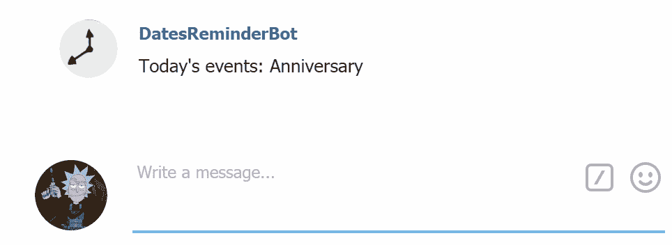

聊天示例(作者图片)

这一切都是因为我的一个朋友因为我不记得她的生日而对我大喊大叫。我不知道你有没有遇到过这种情况。所以我想我可以假装我记得生日，而实际上我有一个机器人为我做这件事。现在我知道你在想什么了，为什么要从头开始构建一些东西，而不是使用周围数百万个日历应用程序中的一个？你是对的，但是对于像我们这样的书呆子来说…那有什么意思呢？

通过本教程，我将以我的约会提醒机器人(以下链接)为例，一步步讲解**如何用 Python 和 MongoDB 构建智能电报机器人以及如何用 Heroku 和 Cron-Job 免费部署**、。

[](https://t.me/DatesReminderBot) [## DatesReminderBot

### 可以马上联系@DatesReminderBot。

t.me](https://t.me/DatesReminderBot) 

我将展示一些有用的 Python 代码，这些代码可以很容易地应用于其他类似的情况(只需复制、粘贴、运行)，并通过注释遍历每一行代码，以便您可以复制这个示例(下面是完整代码的链接)。

[](https://github.com/mdipietro09/Bot_TelegramDatesReminder) [## mdipietro 09/Bot _ TelegramDatesReminder

### GitHub 是超过 5000 万开发者的家园，他们一起工作来管理和…

github.com](https://github.com/mdipietro09/Bot_TelegramDatesReminder) 

特别是，我将经历:

*   设置:架构概述，新*电报* Bot 生成， *MongoDB* 连接， *Python* 环境。
*   前端:编写用户与 *pyTelegramBotAPI* 交互的机器人命令。
*   后端:用 *flask* 和 *threading* 创建服务器端 app。
*   通过 *Heroku* 和 *Cron-Job* 部署机器人

## 设置

我想从这个应用程序的总体架构开始，这样我们就能清楚地知道这个短暂而有趣的旅程的最终目的地。我将构建一个 Python 应用程序，部署在 [Heroku](https://www.heroku.com/) 上，通过[电报机器人](https://telegram.org/blog/bot-revolution)与用户交互，将信息存储到 [MongoDB](https://www.mongodb.com/) 中，并通过 [Cron-Job](https://cron-job.org/en/) 向用户发送重复消息。

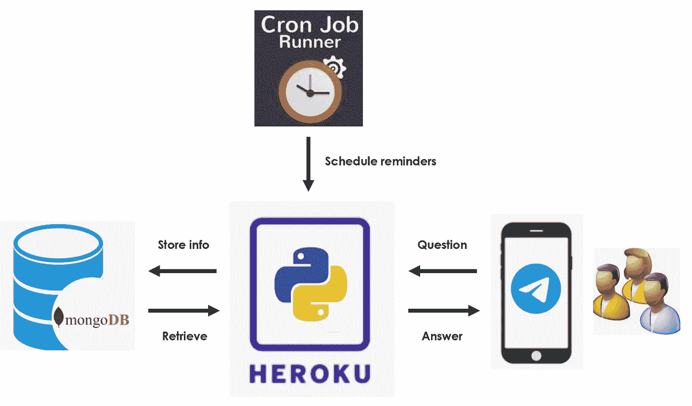

应用架构(图片由作者提供)

这个架构对于网络/移动应用来说是非常标准的。事实上，我们正在开发一个适当的应用程序，它使用 Telegram 作为前端。

在开始编码之前，我们必须用 Telegram 生成 Bot 并创建 MongoDB 实例。

Telegram 可以让你在不到一分钟的时间内**生成一个新的机器人**，只需给[机器人父亲](https://telegram.me/botfather)发一条消息，然后按照它的指示去做，就像这样:

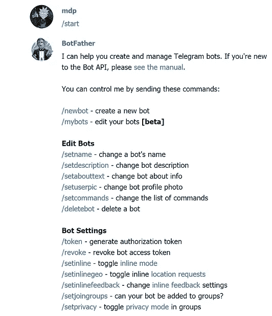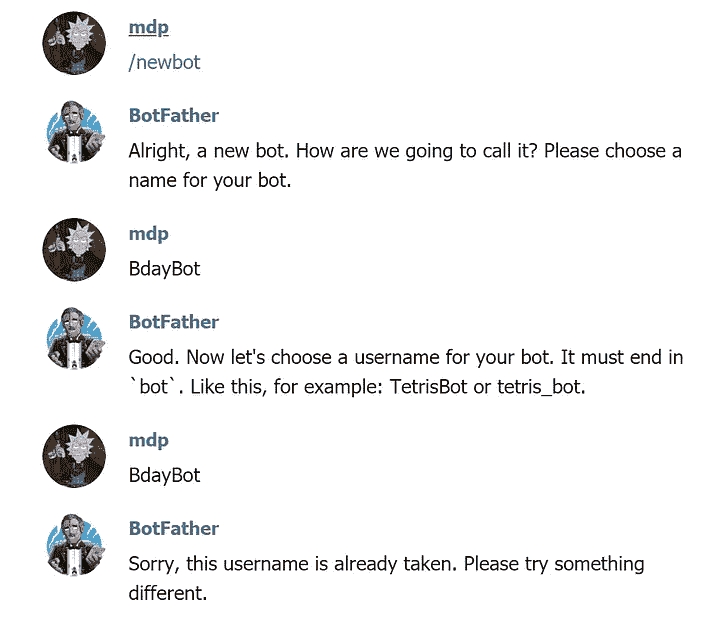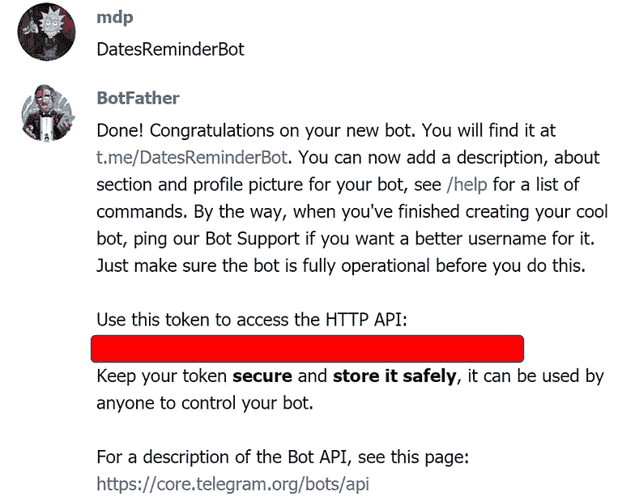

作者图片

BotFather 提供了一个秘密的 API 令牌，我们稍后会用到它。至于我们的机器人可能的命令，我将设置以下选项:

*   启动功能(当用户启动机器人时运行)
*   保存和删除事件
*   查看今天的活动并查看我保存的所有活动
*   帮助功能

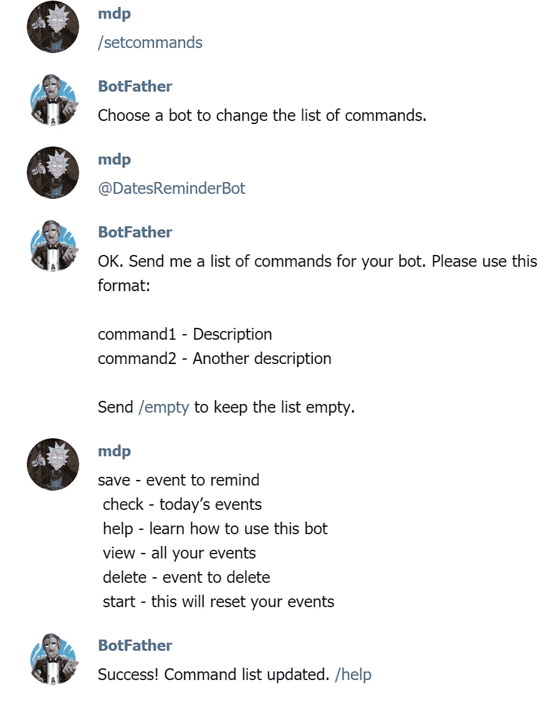

作者图片

这将使您能够在机器人启动并运行时，在与机器人的聊天中可视化并选择命令:

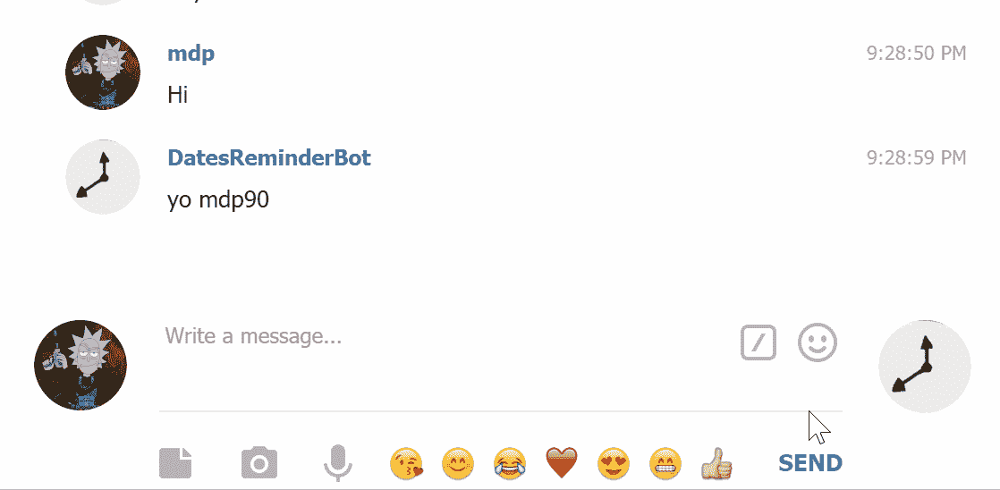

作者图片

让我们继续进行 **MongoDB 设置**并注册/登录 [MongoDB Atlas](https://www.mongodb.com/cloud/atlas) ，一个云数据库服务。他们给你一个有 500 MB 存储空间的免费账户(创建集群时选择 M0 沙盒选项)。

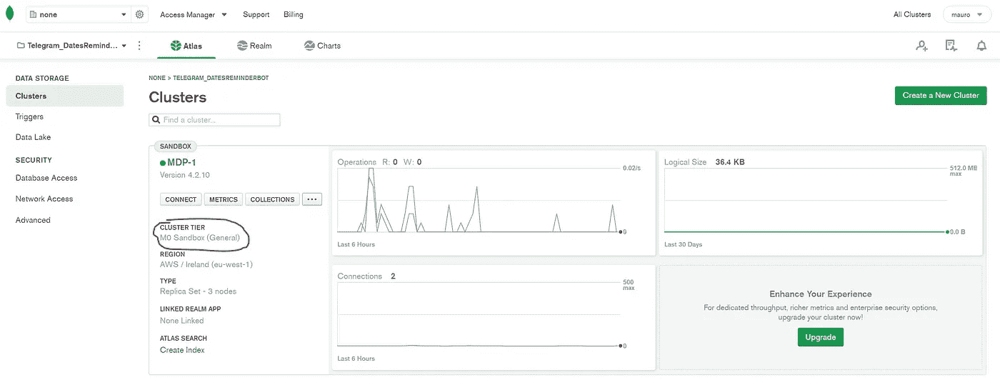

作者图片

在“集合”中，您可以创建您的数据库和集合:

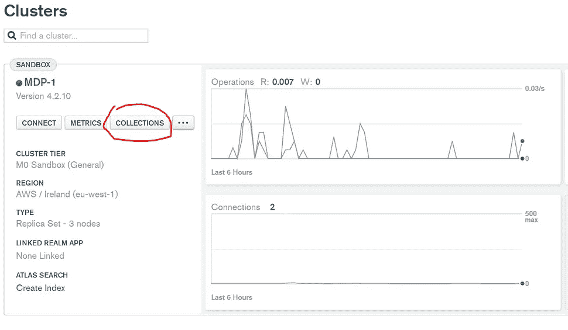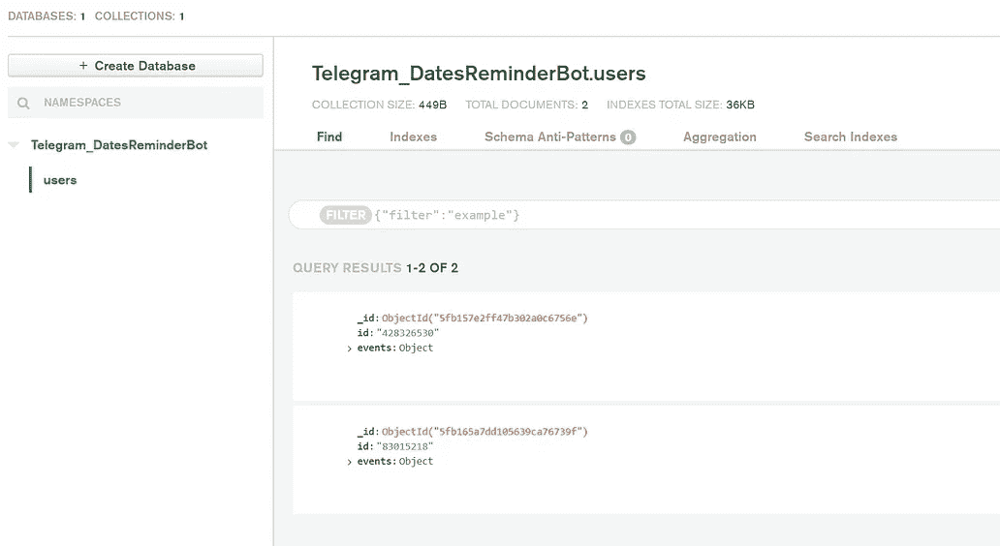

作者图片

在“connect”中，您可以创建您的用户并设置您的密码，您应该将密码放入他们提供给您的字符串中，以便将您的应用程序连接到数据库。保存完整的字符串，因为我们以后会用到它。

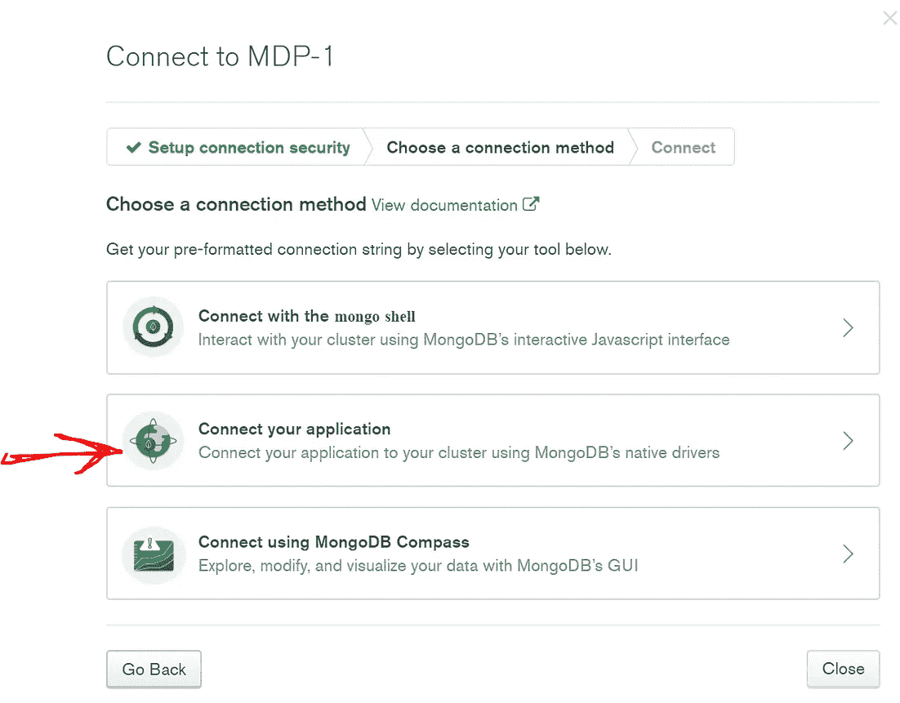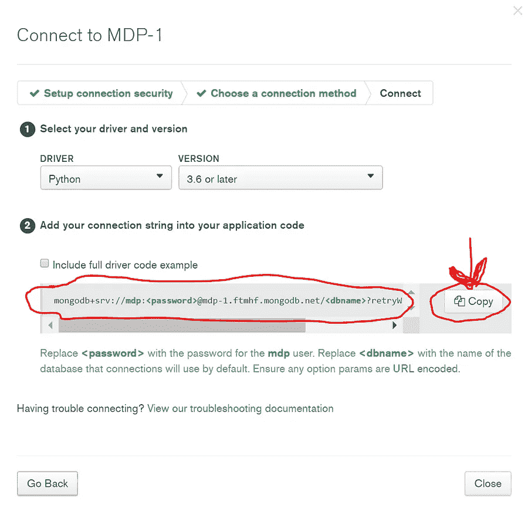

作者图片

为了编写我们的应用程序，我们需要设置我们的 **Python 环境**。我将通过终端安装以下库:

```
pip install **pyTelegramBotAPI** pip install **pymongo** pip install **dnspython**
pip install **dateparser**
pip install **flask**
```

我认为 [*pyTelegramBotAPI*](https://github.com/eternnoir/pyTelegramBotAPI) 是 Telegram APIs 的最佳 Python 库，因为它提供了轻松构建复杂聊天机器人的所有工具。人们可以直接使用 Telegram APIs，但是这里没有必要重新发明轮子。 *pymongo* 和 *dnspython* 包是用 python 连接 MongoDB 所必需的。为了让 Bot 理解日期，我将使用[*date parser*](https://dateparser.readthedocs.io/en/latest/)*。*

如果你正在阅读这篇文章，我假设你已经知道了[*flask*](https://flask.palletsprojects.com/en/1.1.x/)*(请注意，如果你不打算部署你的 bot，你就不需要它)。*

*现在都准备好了，让我们开始吧。*

## *前端(电报机器人)*

*我们可以开始编写机器人了。首先调用 *pyTelegramBotAPI* 实例，插入 BotFather 提供的 Telegram API TOKEN:*

```
*import **telebot**bot = **telebot**.TeleBot(**"insert the Telegram API TOKEN"**)*
```

*其次，使用 *pymongo* 和从 MongoDB Atlas 获得的字符串连接到数据库:*

```
*import **pymongo**client = **pymongo**.MongoClient(**"mongodb+srv://..."**)
db_name = "Telegram_DatesReminderBot"
collection_name = "users"
db = client[db_name][collection_name]*
```

*然后，我将定义一个空字典，其任务是存储临时用户信息(如用户 id):*

```
*dic_user = {}*
```

*现在，我将浏览之前定义的**主命令**(启动、保存……)并为机器人编写适当的动作。让我们从“ */start* ”开始，这是当你第一次开始与机器人聊天时自动执行的命令。我将让机器人以一条欢迎消息和下一步该做什么的建议开始:*

**

*作者图片*

```
***@bot.message_handler(commands=['start'])**
def **_start**(message):
    msg = "Hello "+str(message.chat.username)+\
          ", I'm a date reminder. Tell me birthdays and events to remind you. To learn how to use me, use \n/help"
    bot.send_message(message.chat.id, msg)*
```

*有没有你认不出来的细节？让我来帮你:*

**

*简单对吗？但那只是热身。现在“ */save* ”命令将变得更加棘手，因为它涉及到一个问答对话:*

*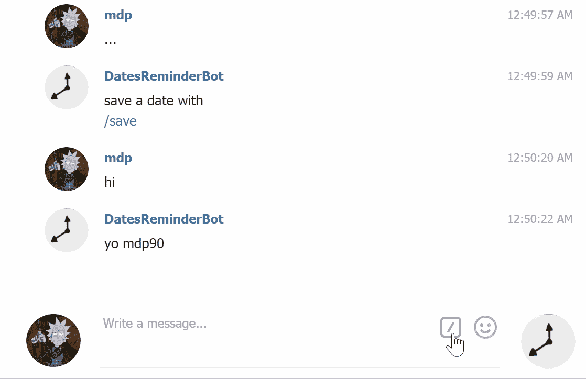*

*作者图片*

```
***@bot.message_handler(commands=['save'])**
def **_save**(message):
    msg = "Set an event in the format 'month dd', for example: \n\
            xmas day: Dec 25 \n\
I also understand: \n\
today, tomorrow, in 3 days, in 1 week, in 6 months, yesterday, 3 days ago ... so you can do: \n\
            meeting: tomorrow"
    message = bot.reply_to(message, msg)
    bot.register_next_step_handler(message, **save_event**)*
```

*可以看到，这次我用了 *bot.reply_to()* 而不是 *bot.send_message()。*后者发送一般的聊天消息，前者发送响应特定输入的消息。我使用它是因为这是用户和机器人之间的真实对话:用户请求保存信息，机器人回复并等待用户响应。来自用户的新消息将由*bot . register _ next _ step _ handler()*处理，作为 *save_event()* 函数的输入，我们现在将定义该函数，然后进行编码。*

*按照上面的例子，我想挽救我妈妈的生日。为此，我输入“ *mum: Oct 15* ”。机器人必须识别事件的名称，文本中的“*妈妈*和日期“*10 月 15 日*”。之后，必须存储信息，考虑返回用户(已经在数据库中，所以我们需要更新用户的事件)和新用户(必须添加到数据库中)两种情况。*

*用 Python 的术语来说:*

```
*import **dateparser**def **save_event**(message):
    dic_user["id"] = str(message.chat.id) **## get text**
    txt = message.text
    name= txt.split(":")[0].strip() 
    date = txt.split(":")[1].strip() **## check date**
    date = **dateparser**.parse(date).strftime('%b %d') **## save**
    lst_users = db.distinct(key="id")
    if dic_user["id"] not in lst_users:
        db.insert_one({"id":dic_user["id"], "events":{name:date}})
    else:
        dic_events = db.find_one({"id":dic_user["id"]})["events"]
        dic_events.update({name:date})
        db.update_one({"id":dic_user["id"]}, {"$set":
                      {"events":dic_events}})

    **## send done**
    msg = name+": "+date+" saved."
    bot.send_message(message.chat.id, msg)*
```

*注意，我使用了 *dateparser* 来识别人类可读的日期。这允许用户以不同的格式书写日期:*

*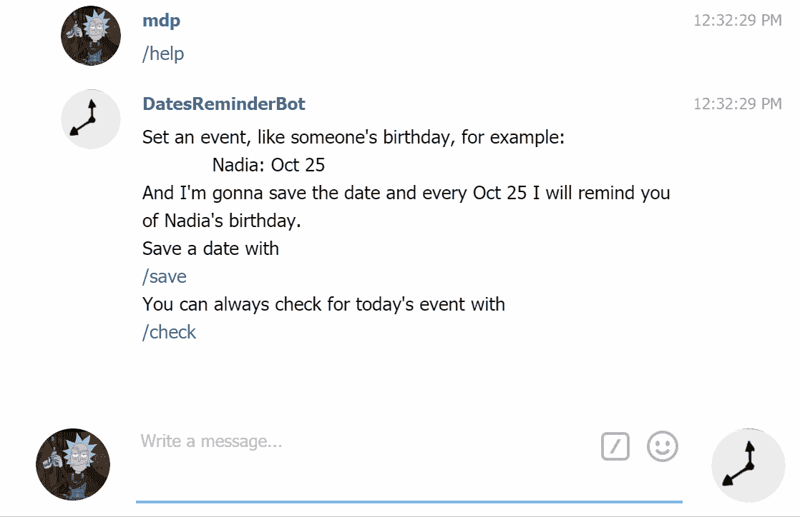*

*作者图片*

*类似地，您可以构建其他函数来检查和删除 db 中的事件(我将在文章末尾提供完整的代码，或者您可以查看本教程开头的 GitHub 链接)。*

*如果用户发送一些**随机文本**没有链接到任何特定命令会怎样？如果我们不包括这种事件，机器人将什么也不做。因此，我预计机器人应该正确响应的两种情况(问候和感谢消息)以及机器人用标准消息回答的所有其他情况。*

*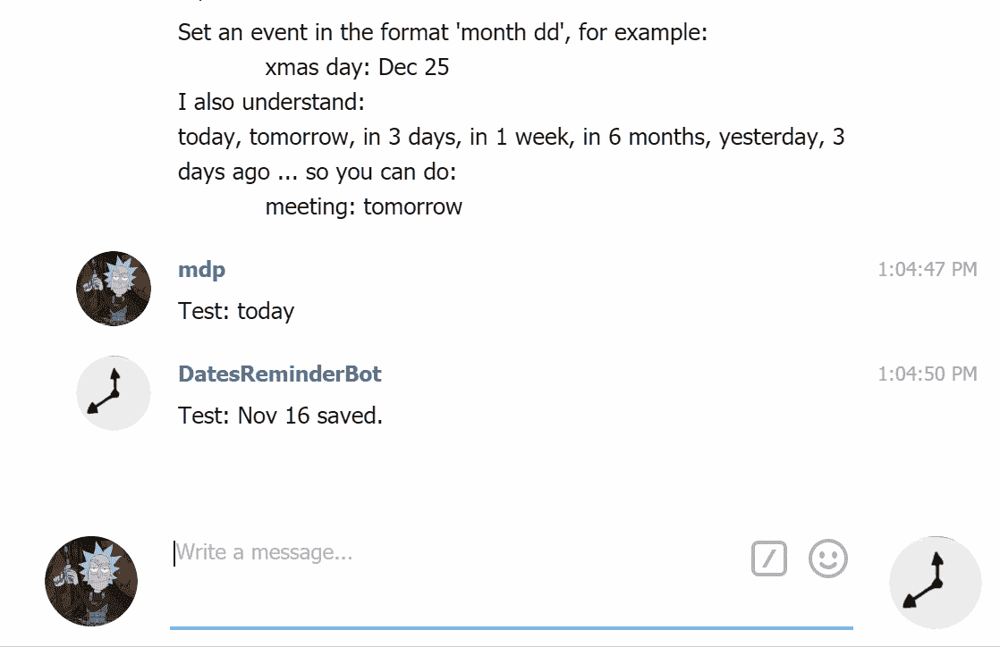*

*作者图片*

```
***@bot.message_handler(func=lambda m: True)**
def **chat**(message):
    txt = message.text
    if any(x in txt.lower() for x in [**"thank","thx","cool"**]):
        msg = "anytime"
    elif any(x in txt.lower() for x in [**"hi","hello","yo","hey"**]):
        msg = "yo" if str(message.chat.username) == "none" else 
              "yo "+str(message.chat.username)
    else:
        msg = "save a date with \n/save"
    bot.send_message(message.chat.id, msg)*
```

*我保持这部分相当基础，因为它不是本教程的主要焦点，但是人们可以使用更高级的 NLP 技术来使聊天机器人更加智能和健谈。*

*话虽如此，我们的机器人已经足够熟练，可以**运行和测试**。您可以在代码的末尾添加下面一行，然后执行整个脚本。*

```
*bot.infinity_polling(True)*
```

*现在，您的机器人已经启动并运行，由您的笔记本电脑托管。你可以在电报上玩它。如果您不打算部署您的 bot，您可以在这里停下来，因为本文的其余部分解释了部署的步骤。*

## *后端(烧瓶应用程序)*

*我们将首先在 [Heroku](https://www.heroku.com/) **，**云平台即服务上创建一个**新的应用程序项目**，该项目只需一个免费帐户即可部署 PoC 应用程序。您可以链接您的 GitHub 项目并部署其中一个分支。*

*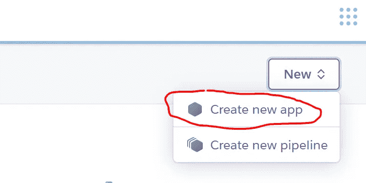**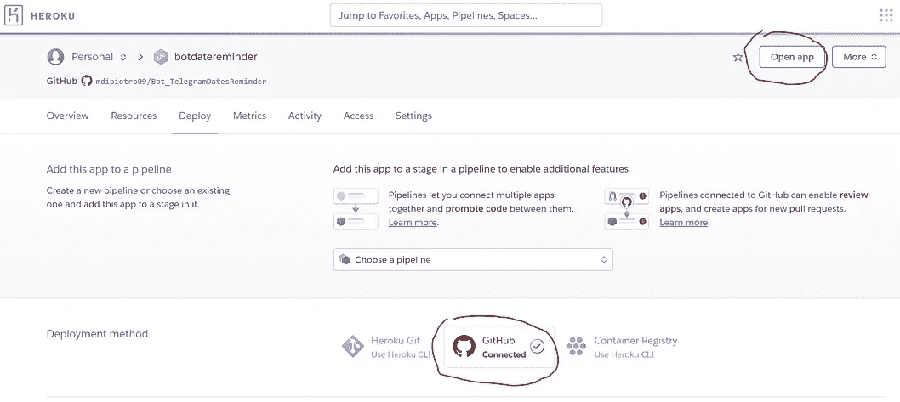*

*作者图片*

*目前，我们还没有准备好部署应用程序。我们只需要 Heroku 生成的 app 网址。保存它；你很快就会需要它。*

**

*作者图片*

*让我们回到编码上来，从添加一个新的带有 *flask* 的服务器端应用程序到我们已经编辑过的 Python 脚本 *:* 开始*

```
*import **flask**server = **flask**.Flask(__name__)*
```

*我们必须**设置一个 webhook** ，这是 web 开发中用于将实时信息从一个应用程序传递到另一个应用程序的常用方法。多亏了 webhook，Telegram Bot 将实时数据推送到 Heroku 应用程序。*

```
***@server.route('/Telegram API TOKEN', methods=['POST'])** def **getMessage**():
   bot.process_new_updates([**telebot**.types.Update.de_json(
      **flask**.request.stream.read().decode("utf-8"))])
   return "!", 200**@server.route("/")** def **webhook**():
   bot.remove_webhook()
   bot.set_webhook(url=**'Heroku App Web Address /'**
                      +**'Telegram API TOKEN'**)
   return "!", 200*
```

*所以现在我们的 Bot 几乎什么都有了，它还需要最后也是最重要的功能:**提醒**。它聊天并保存信息，但这款应用的主要目的是自动发送警报。因此，我将构建一个调度程序，它会在每次运行时检查今天的事件并发送事件提醒。*

```
*import **datetime**def **scheduler**():
    lst_users = db.distinct(key="id")
    for user in lst_users:
        dic_events = db.find_one({"id":user})["events"]
        today = **datetime**.datetime.today().strftime('%b %d')
        res = [k for k,v in dic_events.items() if v == today]
        if len(res) > 0:
            msg = "Today's events: "+", ".join(res)
            bot.send_message(user, msg)*
```

*当应用程序被执行时，这个调度程序将在不同于主*烧瓶*应用程序的线程上运行。换句话说，这个应用程序将同时发生两件事:聊天机器人功能和日程提醒。你可以把这两个主要动作放在脚本的末尾，当全部代码执行时，它们会让一切正常工作。*

```
*import **threading**
import **os**if __name__ == "__main__":
   **threading**.Thread(target=scheduler).start()
   server.run(host="0.0.0.0", 
              port=int(**os**.environ.get("PORT", 5000)))*
```

## *部署*

*最后，是时候部署应用程序了。在继续之前，我将展示我的存储库的**结构:***

*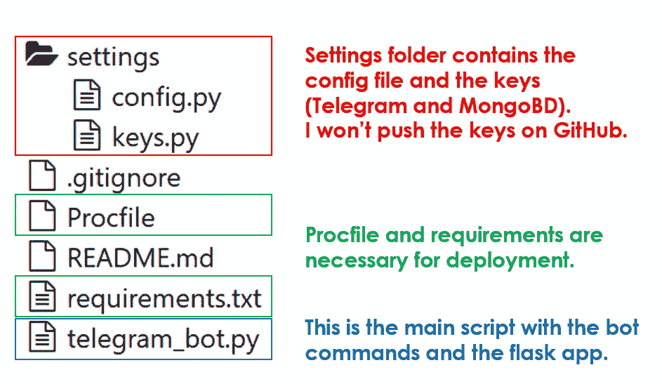*

*作者图片*

*您不必保持相同的回购结构，但是您肯定需要 Heroku 需要的两个文件:requirements.txt，您可以从终端创建*

```
*pip freeze > requirements.txt*
```

*和 *Procfile* (没有扩展名)，包含部署后要执行的命令*

```
*web: python telegram_bot.py*
```

*关于**电报和 MongoDB 密钥**，我们需要将它们作为配置变量放在 Heroku 上(我将它们命名为“ *telegram_key* ”和“ *mongodb_key* ”):*

*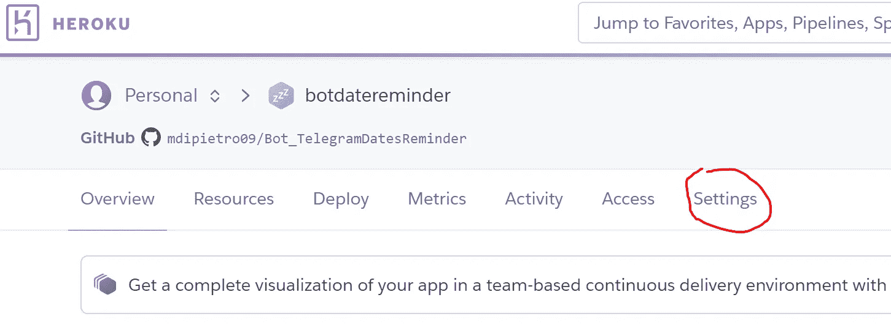**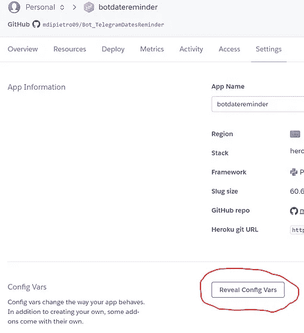*

*作者图片*

*当应用程序在 Heroku 上运行时，我的*设置*文件夹中的 *config.py* 文件负责检索和使用密钥。以下是 *config.py:* 中的完整代码*

```
*import **os****ENV = "PROD"**  **#<--- change here DEV or PROD****## keys**
**if ENV == "DEV":**
 **from settings import keys**
 telegram_key = **keys**.telegram_key
 mongodb_key = **keys**.mongodb_key**elif ENV == "PROD":**
 import **ast**
 telegram_key = **ast**.literal_eval(**os**.environ["telegram_key"])
 mongodb_key = **ast**.literal_eval(**os**.environ["mongodb_key"])**## server**
host = "0.0.0.0"
port = int(**os**.environ.get("PORT", 5000))*
```

*这里是 *telegram_bot.py* 中的**完整代码**，这是我们在整个教程中一直在做的机器人和应用程序的主脚本:*

*酷，让我们**部署**这个坏小子上 Heroku:*

*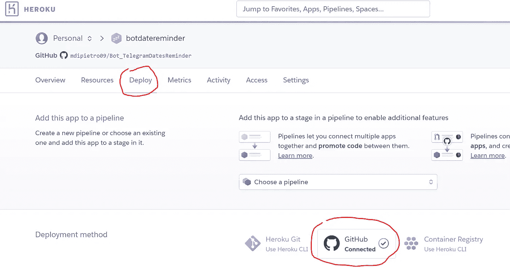***

*作者图片*

*现在，您应该已经安装并运行了 Heroku web 应用程序，并且能够在 Telegram 上使用该机器人。试试吧！*

*最后，我将**设置一个**[**Cron-Job**](https://cron-job.org/en/)来 ping Heroku web 地址。这将使页面重新加载，应用程序重新启动，预定提醒将在其线程上运行。*

***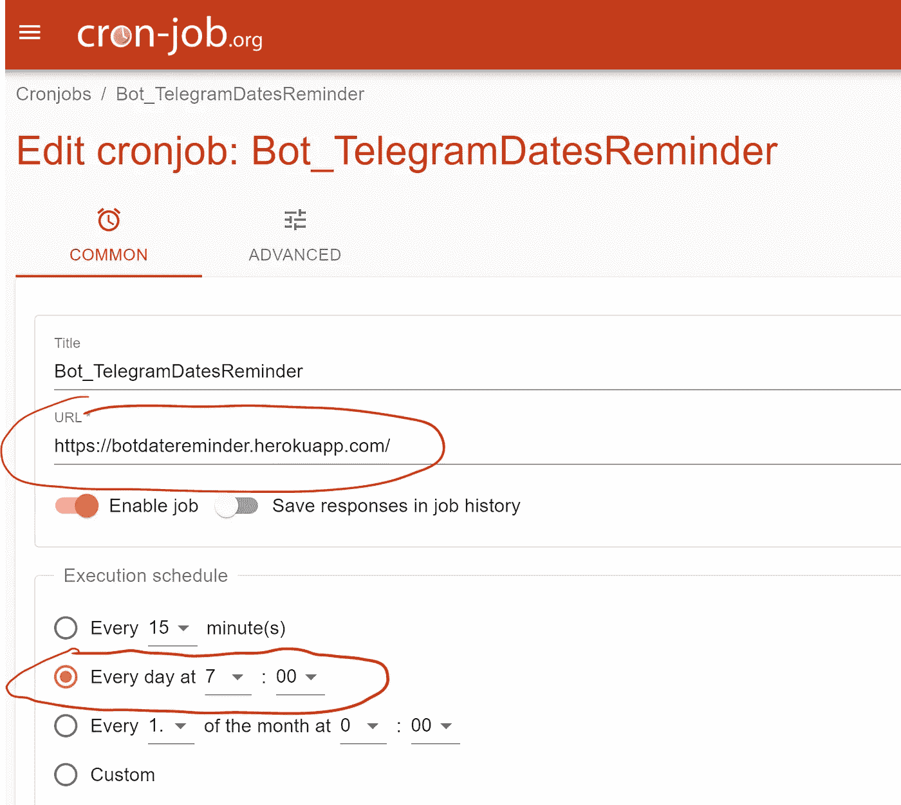*

*作者图片*

*所以明天，当我们醒来的时候，我们会发现一条关于今天发生的事情的消息。*

*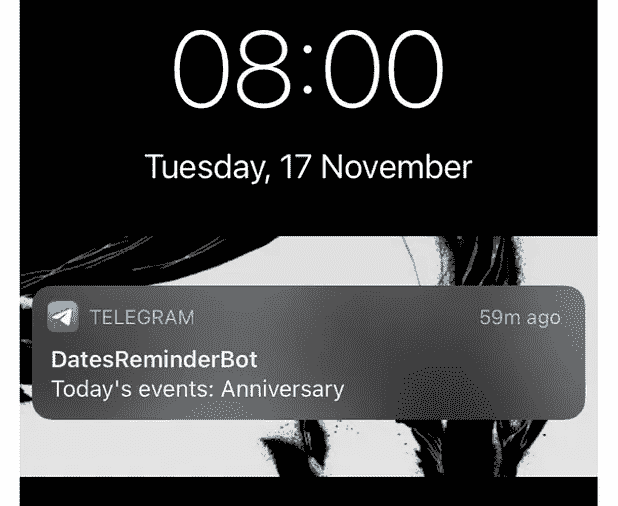***

*作者图片*

## *结论*

*本文是一个教程，展示了如何用 Python 构建一个漂亮的电报机器人，它将用户数据存储在 MongoDB 中，并通过 Cron-Job 检索信息。现在你知道它是如何工作的了，你可以开发你自己的聊天机器人来玩。*

*我希望你喜欢它！如有问题和反馈，或者只是分享您感兴趣的项目，请随时联系我。*

> *👉[我们来连线](https://linktr.ee/maurodp)👈*

> *本文是使用 Python 开发**应用程序系列的一部分，另请参见:***

*[](https://towardsdatascience.com/web-development-with-python-dash-complete-tutorial-6716186e09b3) [## 用 Python 进行 Web 开发:Dash(完整教程)

### 用 Plotly 绘图，嵌入引导 CSS，上传和下载文件，选择后改变输入，导航条，微调器，和…

towardsdatascience.com](https://towardsdatascience.com/web-development-with-python-dash-complete-tutorial-6716186e09b3) [](https://towardsdatascience.com/how-to-embed-bootstrap-css-js-in-your-python-dash-app-8d95fc9e599e) [## 如何在你的 Python Dash 应用中嵌入引导 CSS & JS

### 使用 Dash Bootstrap 组件构建新冠肺炎感染预测应用程序

towardsdatascience.com](https://towardsdatascience.com/how-to-embed-bootstrap-css-js-in-your-python-dash-app-8d95fc9e599e) [](https://towardsdatascience.com/surpass-excel-vlookup-with-python-and-nlp-ab20d56c4a1a) [## 字符串匹配:用 Python 和 NLP 超越 Excel VLOOKUP

### 为所有 Excel 爱好者(和讨厌者)构建一个字符串匹配应用程序

towardsdatascience.com](https://towardsdatascience.com/surpass-excel-vlookup-with-python-and-nlp-ab20d56c4a1a)*