# 使用 Amazon Lex、Google Knowledge Graph 和 CloudFront 为网站构建端到端搜索引擎聊天机器人

> 原文：<https://pub.towardsai.net/building-end-to-end-search-engine-chatbot-for-the-website-using-amazon-lex-google-knowledge-graph-60b001c7d2fb?source=collection_archive---------2----------------------->

## [云计算](https://towardsai.net/p/category/cloud-computing)，[编程](https://towardsai.net/p/category/programming)

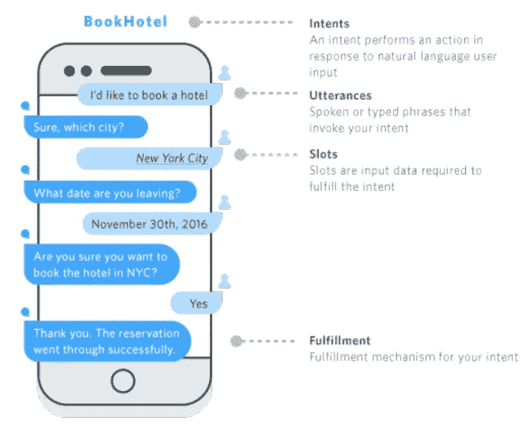

图片提供:AWS

Chabot 一词是从 1994 年创造的原始术语“ChatterBot”中创造出来的，该术语本身表示可以进行人类对话的机器。虽然学习聊天机器人很有趣，但它的真正力量在于解决实际的商业世界用例，在这些用例中，你可以自动化大部分由人类进行的体力劳动。

想象一下，今天你正与一个智能扬声器互动，为你预订机票或点餐，十年前没有人会想到用同样的便利做这些事情。想象一下今天的客户支持，自动聊天机器人通过自动回复来处理客户。做同样的工作需要多少时间和金钱。这就是对话人工智能的力量，无论是基于语音的系统还是基于聊天的系统。

亚马逊提供了一个强大的服务，可以创建对话 AI 聊天机器人的亚马逊 Lex，现在亚马逊 Lex 使用了与亚马逊 Alexa(基于语音的系统)相同的对话引擎。

今天，我们将使用 Amazon Lex 创建一个搜索机器人，它可以从 web 上为我们找到信息，并使用基于 web 的 UI 和 AWS CloudFront 上托管的 web 应用程序来部署它。

在我们深入构建对话人工智能聊天机器人之前，让我们首先了解对话人工智能领域中使用的重要术语。

重要术语:

1.  **意图:**用户想要执行的动作。比如预订航班，我们称之为**预订航班**意向。
2.  **话语:**为了实现这一意图，用户可以通过哪些方式进行对话，例如，我想预订机票，你能帮我预订机票吗，等等。
3.  **Slot:** 这些是在任何对话中，当用户发声执行意图时的参数。例如，预订一张上午 **10 点**从**纽约**到**巴黎**的机票。这里我们有 3 个时隙:时间、源和目的地。
4.  **时间段类型:**每个时间段需要有一个数据类型，例如上午 10 点是**日期**，来源和目的地是**城市**。
5.  **评分卡:**Bot 生成的响应卡，信息为卡片 UI 格式，底部有按钮。该卡使用图像以视觉格式提供背景。对订购产品的查询返回产品的照片。
6.  **知识图** : 这个术语不是聊天机器人专用的，而是更接近于实体关系建模，涉及到互连实体的集合或网络。
7.  **云形成**:不特定于对话式人工智能，但这种 AWS 服务允许将整个基础设施创建为代码(如 web 应用程序)，可以在几分钟内部署到任何地方。
8.  **CloudFront:** 不要将其与云形成混淆，它是一种内容交付网络服务，在离用户最近的边缘位置缓存静态数据(图像、视频或页面)，使应用程序快速加载。

我们将按照以下步骤创建一个端到端的解决方案。

1.  我们将从构建聊天机器人蓝图开始。
2.  然后我们将建立知识图服务
3.  添加 AWS lambda 函数来实现响应
4.  使用用于 Bot UI 的 Cloudformation 堆栈部署网站

让我们从第一步开始:

1.  **构建聊天机器人蓝图:**

如果你是 AWS 的新手，那么你可以注册一个 AWS 账户，否则，AWS 用户可以在 AWS 控制台内的机器学习服务下搜索 Amazon Lex。

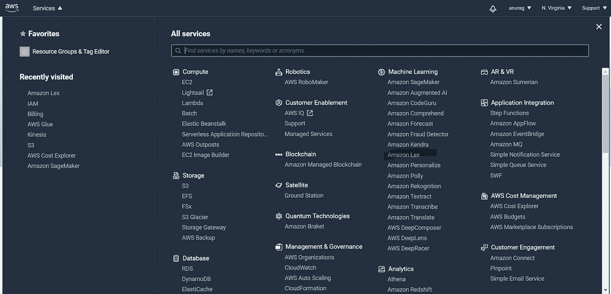

屏幕截图 1

您可以选择预定义的模板，但是对于我们的用例，我们将创建一个自定义 bot。

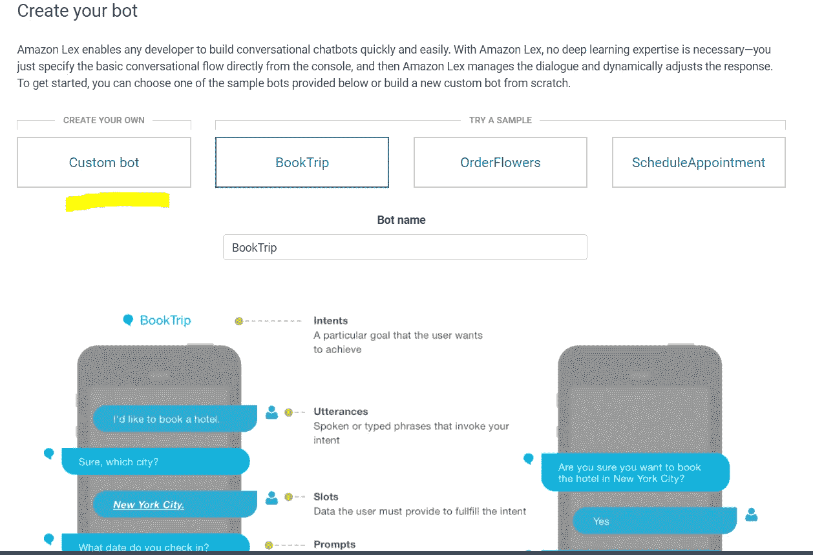

屏幕截图 2

对于其他信息，我将它们保留为默认值。

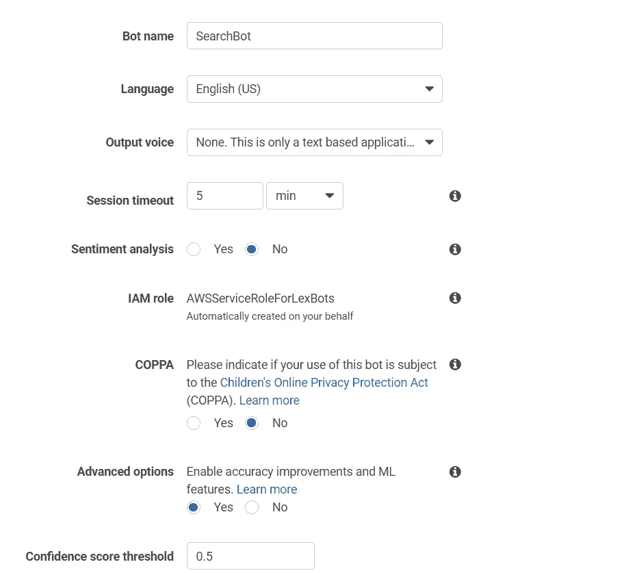

屏幕截图 3

第一步是为用户可以执行的特定操作创建意图。在这种情况下，我们将为问候用户创建 WelcomeIntent。

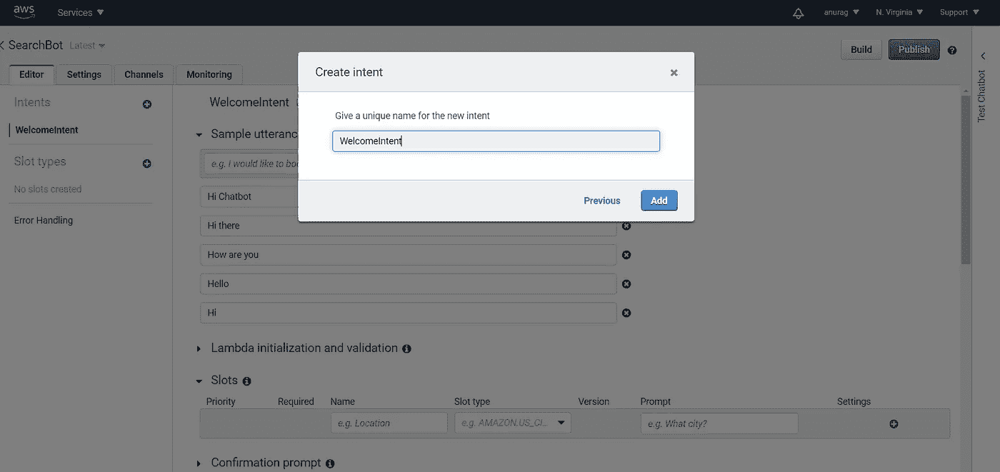

屏幕截图 4

现在我们将注意到用户可以要求调用这个意图的所有可能的话语(在我们的例子中是问候)

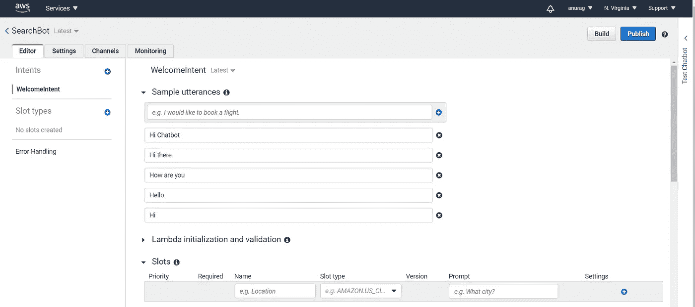

屏幕截图 5

一旦您记录了所有的话语，您将使用响应选项添加您希望您的聊天机器人给出的响应:

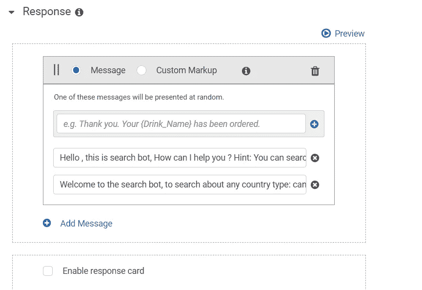

屏幕截图 6

让我们来测试聊天机器人的第一个意图。为此，您必须构建 bot 并使用 test bot 部分。

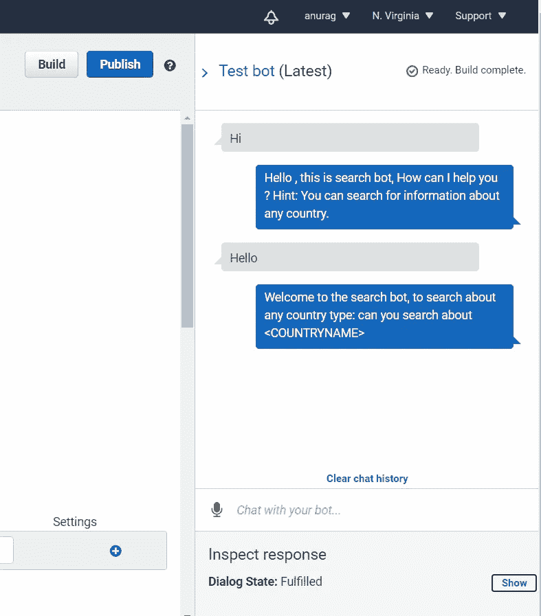

屏幕截图 7

现在我们已经有了一个简单的 bot 基础，让我们更进一步添加新的意图:SearchCountry。这种意图允许用户请求聊天机器人搜索关于该国家的信息。

**2。设置 Google 知识图服务:**

现在，我们还需要一个搜索引擎，可以为我们搜索有关国家的信息。我们将使用 Google 知识图 API 服务。

为此，谷歌已经建立了一个关于如何开始谷歌知识图搜索 API 服务的详细记录的部分。

 [## 谷歌知识图搜索 API |谷歌开发者

### 知识图搜索 API 允许您在 Google 知识图中查找实体。API 使用标准的 schema.org…

developers.google.com](https://developers.google.com/knowledge-graph) 

本质上，我们将获得一个 API 键来使用知识图服务 API，并使用任何编程语言来发送带有查询字符串参数的 HTTP 请求(当在 google search 上搜索任何内容时，相同的机制起作用，observer address URL bar)。

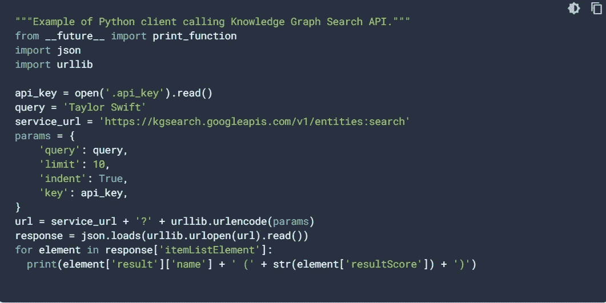

截图 8:谷歌提供

**3。添加 AWS lambda 函数以实现响应**

一旦我们可以访问该服务，我们将添加一个新的意图，并将该意图与谷歌服务联系起来。

为此，我们将为用户搜索操作创建一个新的意图:SearchQuery

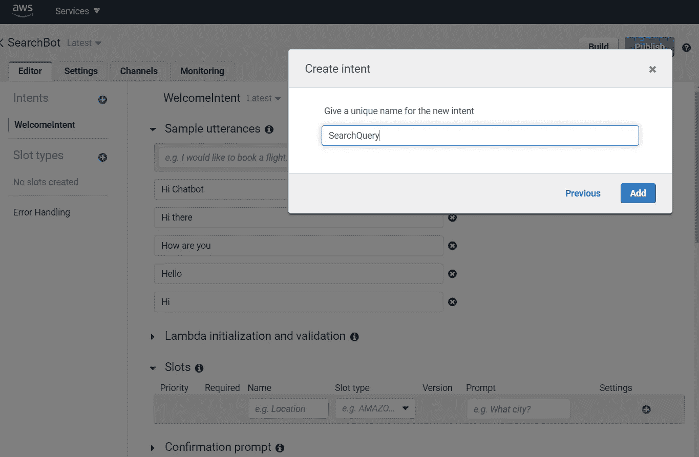

屏幕截图 9

现在我们必须在用户查询中标识**槽(实体)**，在本例中，目的是搜索国家信息，因此我们可以得出结论，国家是槽之一。我们将添加一个名为 country 的插槽，并选择类型为 AMAZON.country。

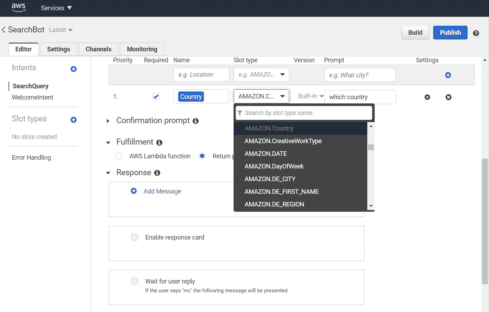

截图 10

现在我们将添加话语，但这一次我们将用位置占位符替换实际的查询词，在我们的例子中是**国家**。

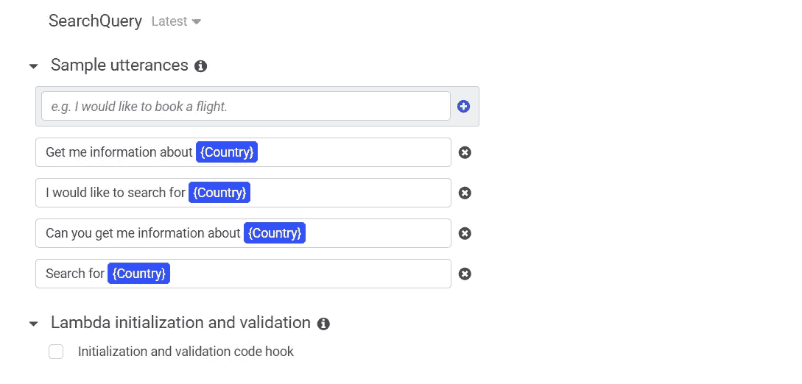

屏幕截图 11

到目前为止，我们已经创建了一个捕获国家值的机制，但是我们将如何返回搜索结果。为此，我们将使用 AWS lambda 函数通过调用知识图 API 服务来获取相关信息。

我们将前往搜索控制台，在计算服务下，我们将选择 AWS lambda。

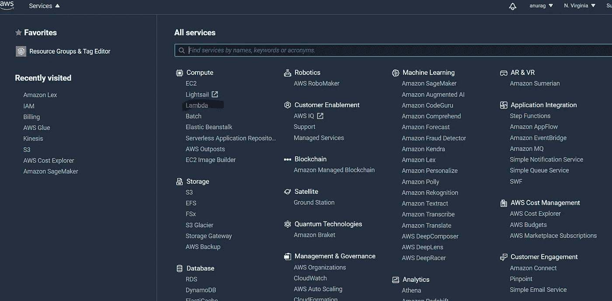

屏幕截图 12

我们将使用右上角的 create function 按钮创建一个新的 AWS Lambda 函数。

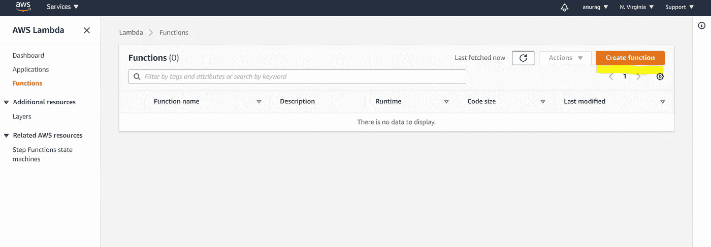

屏幕截图 13

让我们从预定义的模板中选择一个用 python 编程的模板，如下所示:

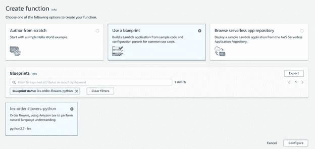

屏幕截图 14

接下来，我们将填充相关信息来创建我们的函数

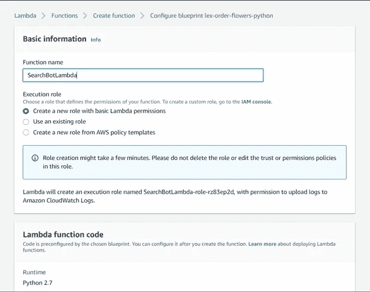

屏幕截图 15

一旦创建了函数，让我们添加以下代码并注释现有的函数定义。

> def search _ query(intent _ request):
> 
> query = get _ slots(intent _ request)[" Country "]
> params = {
> ' query ':query，
> 'limit': 10，
> 'indent': True，
> 'key': api_key，
> }
> 
> # URL = service _ URL+'？'+URL lib . parse . urlencode(params)
> # response = JSON . loads(URL lib . request . URL open(URL))。read())
> 
> # response = JSON . loads(requests . get(URL))
> URL = service _ URL
> response = JSON . loads(requests . get(URL，params=params)。内容)
> 尝试:
> 信息=响应['itemListElement'][0]['结果']['详细描述']['文章正文']
> 
> 除了:
> information= '对不起，找不到您要找的东西。'
> 
> 返回关闭(intent _ request[' session attributes ']，
> '已履行'，
> {'contentType ':'明文'，
> '内容':信息})
> 
> def dispatch(intent _ request):
> " "
> 当用户为这个机器人指定一个意图时调用。
> " " "
> 
> logger . debug(' dispatch userId = { }，intentName={} '。格式(intent_request['userId']，intent _ request[' current ent '][' name ']))
> 
> intent _ name = intent _ request[' current ent '][' name ']
> 
> #如果 intent _ name = = ' search query ':
> 返回 search_query(intent_request ),则分派给机器人的意图处理程序
> 
> 引发异常(“不支持名为“+ intent_name +”的意图”)
> 
> " " " "— ——主处理程序——" " "
> 
> def lambda_handler(事件，上下文):
> """
> 根据意图路由传入的请求。
> 请求的 JSON 主体在事件槽中提供。
> """
> #默认情况下，将用户请求视为来自美洲/纽约时区。
> os.environ['TZ'] = '美洲/纽约'
> time . tz set()
> logger . debug(' event . bot . name = { } '。格式(事件['bot']['name']))
> 
> 退货派遣(事件)

你可以在这里找到完整的 lambda 函数。

一旦函数准备就绪，单击 deploy 按钮来部署 lambda 函数。

部署 lambda 函数后，我们可以选择特定的 lambda 函数来完成聊天机器人的响应。

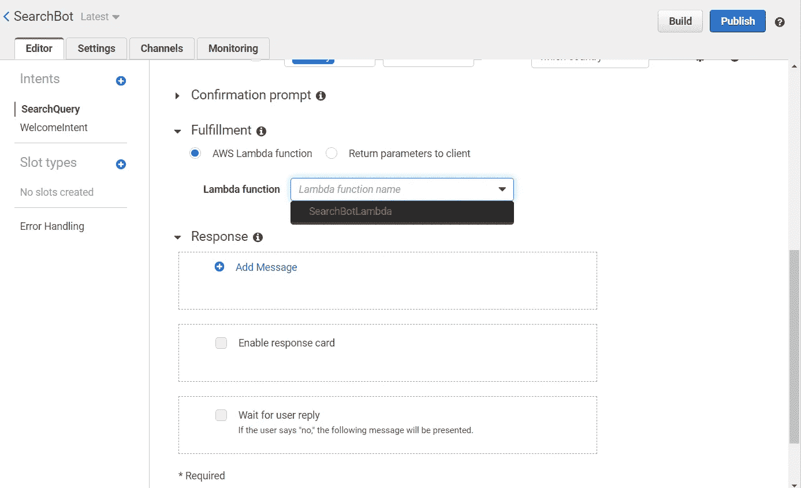

屏幕截图 16

现在，让我们再次构建机器人，现在是时候测试我们的机器人是否可以搜索任何国家相关的信息。

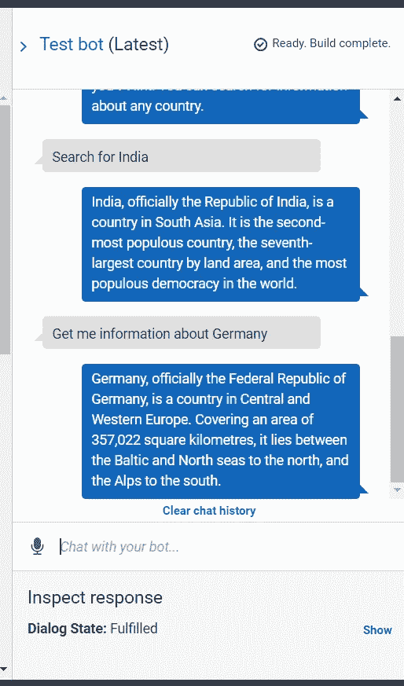

屏幕截图 17

**4。使用 Cloudformation stack for Bot UI 部署网站**

现在我们已经准备好了搜索机器人，但我们必须考虑托管这个机器人的用户界面，最简单的方法是使用预定义的模板作为来自亚马逊[链接](https://aws.amazon.com/blogs/machine-learning/deploy-a-web-ui-for-your-chatbot/)的参考。

在这个活动中，我们将创建一个 AWS 云结构堆栈，只需点击几下鼠标就可以部署整个 web 应用程序。这种类型的部署方法被称为基础设施即代码。

确保您选择的区域与我们的 bot 相同:

北弗吉尼亚:[链接](https://us-east-1.console.aws.amazon.com/cloudformation/home?region=us-east-1#/stacks/create/review?templateURL=https://s3.amazonaws.com/aws-bigdata-blog/artifacts/aws-lex-web-ui/artifacts/templates/master.yaml&stackName=lex-web-ui&param_BootstrapBucket=aws-bigdata-blog)

俄勒冈州:[链接](https://us-west-2.console.aws.amazon.com/cloudformation/home?region=us-west-2#/stacks/create/review?templateURL=https://s3.amazonaws.com/aws-bigdata-blog-replica-us-west-2/artifacts/aws-lex-web-ui/artifacts/templates/master.yaml&stackName=lex-web-ui&param_BootstrapBucket=aws-bigdata-blog-replica-us-west-2)

爱尔兰:[链接](https://eu-west-1.console.aws.amazon.com/cloudformation/home?region=eu-west-1#/stacks/create/review?templateURL=https://s3.amazonaws.com/aws-bigdata-blog-replica-eu-west-1/artifacts/aws-lex-web-ui/artifacts/templates/master.yaml&stackName=lex-web-ui&param_BootstrapBucket=aws-bigdata-blog-replica-eu-west-1)

悉尼:[链接](https://ap-southeast-2.console.aws.amazon.com/cloudformation/home?region=ap-southeast-2#/stacks/create/review?templateURL=https://s3.amazonaws.com/aws-bigdata-blog-replica-ap-southeast-2/artifacts/aws-lex-web-ui/artifacts/templates/master.yaml&stackName=lex-web-ui&param_BootstrapBucket=aws-bigdata-blog-replica-ap-southeast-2)

你还必须填写如下所述的机器人的一些细节:

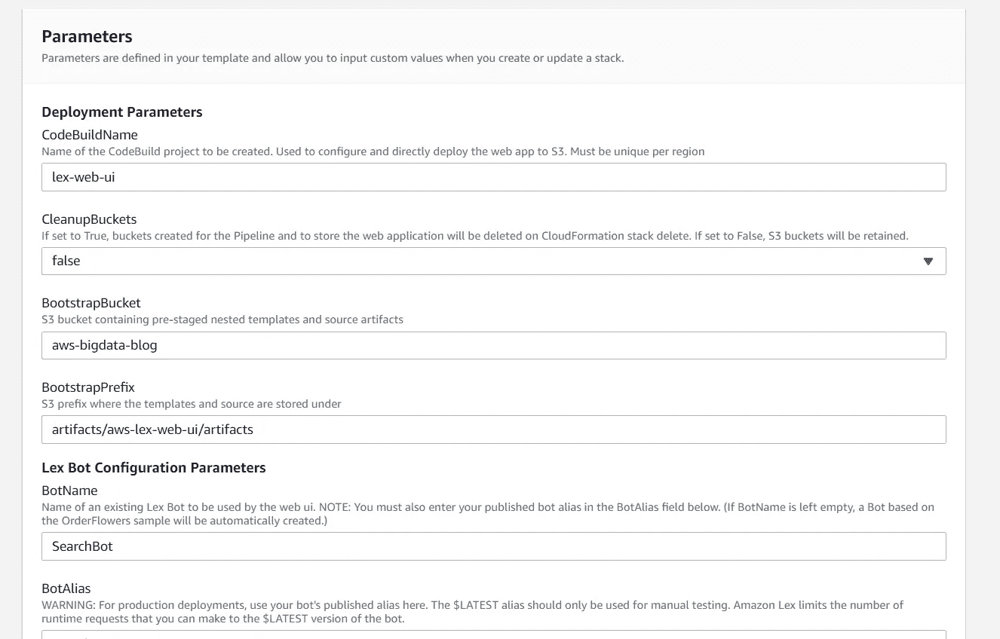

屏幕截图 18

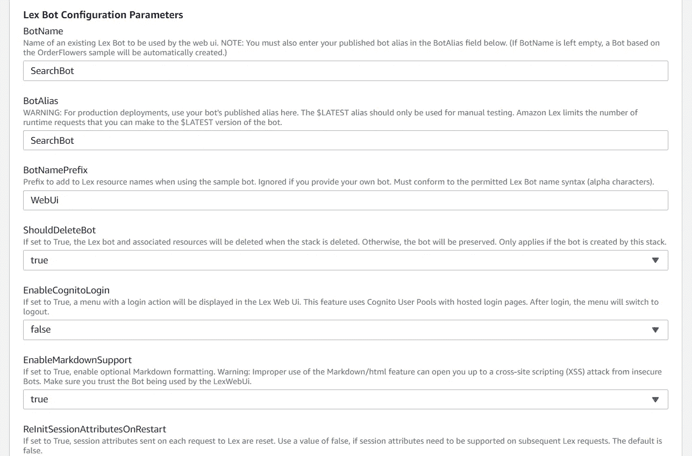

屏幕截图 19

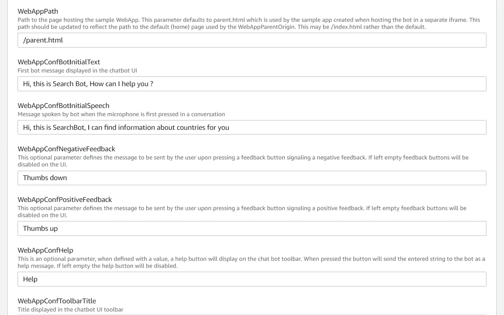

截图 20

单击“创建”按钮将为我们创建一个堆栈。一旦创建并部署了堆栈，我们将会看到屏幕截图中提到的以下条目。

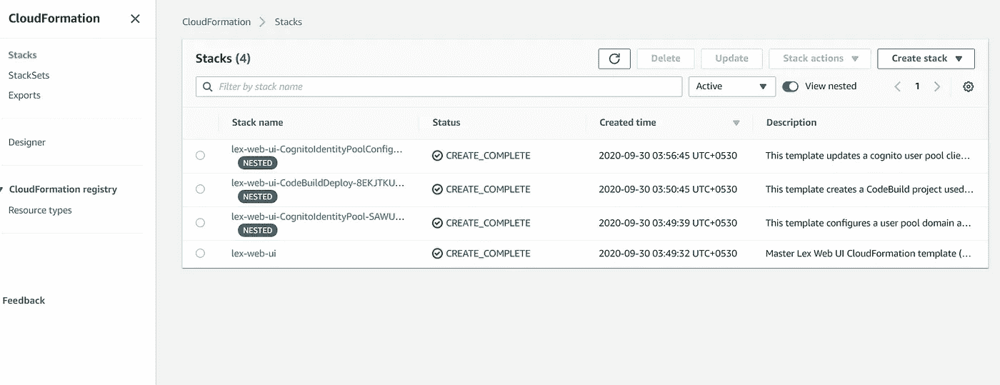

屏幕截图 21

现在让我们来看看部署的 CloudFront 端点的域名(这是一种在离用户最近的边缘位置托管静态数据的服务)。

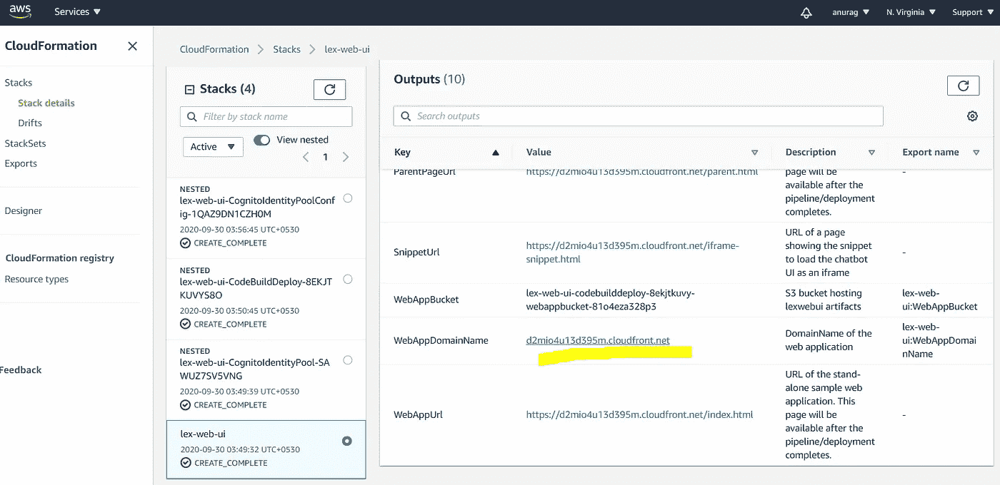

屏幕截图 22

现在让我们来玩一下我们部署的搜索机器人。在一个新标签中打开 URL，你会看到你的聊天机器人作为一个完整的页面展开。

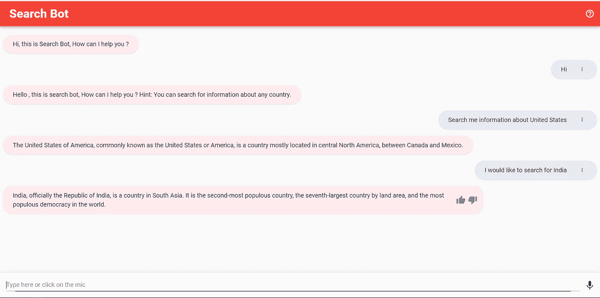

屏幕截图 23

恭喜你。您已经准备好了一个基本的工作搜索机器人，现在您可以通过使用 Iframe 作为 UI 并使用一个比全屏小的对话框屏幕来进一步增强它。您可以在 **SnippetUrl** 查看更多代码片段。此外，您可以启用 AWS 匿名服务，为谁可以访问 web 应用程序提供一个安全层，但这超出了本文的范围。如果你想了解更多，请在回复部分告诉我你的想法。

如果你真的喜欢这篇文章，请继续关注更多关于人工智能/机器学习、数据分析和商业智能的教程。

在 [LinkedIn](https://www.linkedin.com/in/anurag-bisht-39935a59/) 上查看我