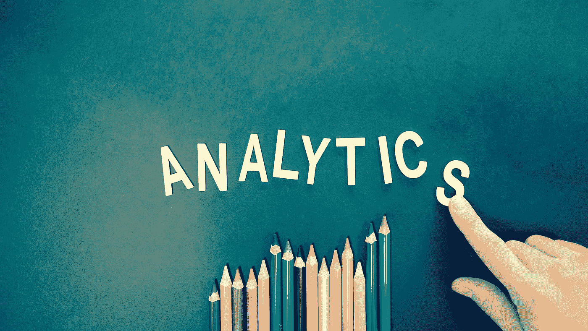

# 商业分析还是数据科学学位？

> 原文：<https://pub.towardsai.net/business-analytics-or-data-science-degree-876a784bc79?source=collection_archive---------0----------------------->

图像来源:[像素](https://www.pexels.com/search/analytics/)

## 教育

## 为什么商业分析学位可能比数据科学学位更好

# 一.导言

M ost 数据相关的学术培训项目有不同的类型，如数据科学硕士、数据分析硕士或业务分析硕士。在决定一个特定的专业领域之前，理解不同学位选择或专业之间的区别是很重要的。在本文中，我们重点比较数据科学硕士和业务分析硕士。我们首先检查数据科学和商业分析项目的典型课程，然后我们将讨论每个项目的利弊。数据科学课程来自加州大学伯克利分校的信息和数据科学硕士课程，而对于商业分析课程，我们使用塔尔萨大学的商业分析科学硕士课程作为案例研究。

# 二。数据科学和业务分析课程

## 二 a .数据科学硕士课程

**核心课程(18 学分，6 门课程)**:数据科学编程导论；数据和分析的研究设计和应用；数据科学统计学；数据工程基础；应用机器学习；和数据可视化。

**选修课(9 学分，以下任意 3 门课程)**:数据背后:人与价值观；实验和因果推断；云端和边缘的深度学习；大规模的机器学习；深度学习的自然语言处理；离散响应、时间序列和面板数据的统计方法

**顶点(3 学分)**:一个为期一学期的小组项目，在该项目中，学生团队提出并选择项目想法，开展并交流他们的工作，接收并提供反馈(在非正式小组讨论和正式课堂演示中)，并提交引人注目的演示文稿以及基于网络的最终可交付成果。包括相关阅读资料、案例讨论以及来自与领先数据科学专家和行业从业者的小组讨论的真实示例和观点。

## 商业分析硕士课程

**核心课程(24 学分，12 门)**:商业决策模型；R 研讨会；统计和数据可视化；决策工具套件研讨会；数据挖掘和预测分析；分析基础；商业分析实习；企业数据系统；数据分析项目的管理；SAS 研讨会；领导和管理分析组织；回归和统计学习。

**选修课(6 小时，3 门课程):**来自不同领域，如营销和消费者行为、会计、运营管理、信息系统、金融、医疗保健、能源。

# 三。数据科学与业务分析

数据科学学位似乎更倾向于理论和学术。课程深入许多理论概念，但较少接触商业/工业应用。商业分析学位提供了更多从事商业相关项目的机会，培训项目也更倾向于商业。因此，商业分析与现实世界的联系更加紧密。

对于实际应用来说，一个非常重要的技能是商业头脑。商业敏锐性是从模型中得出有意义的结论的能力，这些结论可以导致重要的、节省成本的数据驱动的决策。商业分析培训提供了更多从事商业相关项目的机会，因此在获取商业敏锐技能方面比纯数据科学学位更有优势。

改进纯数据科学培训课程以反映现实世界的一种方法是设计具有工业/商业影响的顶点项目。如果可能，这些计划应该与对数据科学感兴趣的本地公司/行业合作，并让他们参与顶点项目设计。参与该项目的学生必须在整个项目期间与行业官员合作。这样，学生就有机会在一个多学科和多元化的团队中工作。这种解决问题的多学科方法将使他们能够发展在现实世界中取得成功所需的基本团队合作、沟通、领导能力和商业敏锐度技能。

# 四。摘要

总之，我们已经讨论了数据科学和商业分析硕士项目的课程。该计划课程显示，纯数据科学培训计划提供了更多的深入，理论和学术倾向的培训。另一方面，商业分析培训计划提供了更多的商业和现实世界的应用，因此可能对商界的潜在雇主更有吸引力。

# 动词 （verb 的缩写）参考

[加州大学伯克利分校信息与数据科学硕士项目课程](https://www.ischool.berkeley.edu/courses/datasci)。

[塔尔萨大学商业分析硕士课程。](https://bulletin.utulsa.edu/preview_program.php?catoid=22&poid=3190)

## 其他数据科学/机器学习资源

[数据科学最低要求:开始从事数据科学工作需要知道的 10 项基本技能](https://towardsdatascience.com/data-science-minimum-10-essential-skills-you-need-to-know-to-start-doing-data-science-e5a5a9be5991)

[数据科学课程](https://medium.com/towards-artificial-intelligence/data-science-curriculum-bf3bb6805576)

[机器学习的基本数学技能](https://medium.com/towards-artificial-intelligence/4-math-skills-for-machine-learning-12bfbc959c92)

[3 个最佳数据科学 MOOC 专业](https://medium.com/towards-artificial-intelligence/3-best-data-science-mooc-specializations-d58da382f628)

[进入数据科学的 5 个最佳学位](https://towardsdatascience.com/5-best-degrees-for-getting-into-data-science-c3eb067883b1)

[2020 年开始数据科学之旅的 5 个理由](https://towardsdatascience.com/5-reasons-why-you-should-begin-your-data-science-journey-in-2020-2b4a0a5e4239)

[数据科学的理论基础——我应该关心还是仅仅关注实践技能？](https://towardsdatascience.com/theoretical-foundations-of-data-science-should-i-care-or-simply-focus-on-hands-on-skills-c53fb0caba66)

[机器学习项目规划](https://towardsdatascience.com/machine-learning-project-planning-71bdb3a44349)

[如何组织你的数据科学项目](https://towardsdatascience.com/how-to-organize-your-data-science-project-dd6599cf000a)

[大型数据科学项目的生产力工具](https://medium.com/towards-artificial-intelligence/productivity-tools-for-large-scale-data-science-projects-64810dfbb971)

[数据科学作品集比简历更有价值](https://towardsdatascience.com/a-data-science-portfolio-is-more-valuable-than-a-resume-2d031d6ce518)

[数据科学 101 —包含 R 和 Python 代码的中型平台短期课程](https://medium.com/towards-artificial-intelligence/data-science-101-a-short-course-on-medium-platform-with-r-and-python-code-included-3cdc9d489c6d)

***如有疑问和咨询，请发邮件给我***:benjaminobi@gmail.com