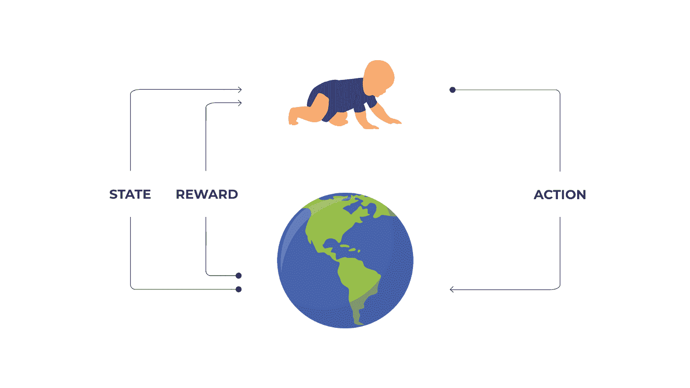

# 强化学习代理可以学习博弈系统吗？

> 原文：<https://pub.towardsai.net/can-reinforcement-learning-agents-learn-to-game-the-system-1142a8e04d0d?source=collection_archive---------4----------------------->

# 那会导致人工智能起义吗？

Cohen 等人在最近的一份出版物中认为，一个先进的人工智能会侵入旨在帮助它学习的奖励机制，从而带来潜在的灾难性后果[1]。

我试图把这篇论文浓缩成简单的要点，并分析其中的结论。在本系列的下一部分，我将探索如何避免人工智能灾难的结局。

强化学习构成了本文讨论和论证的基础，所以这里简单介绍一下强化学习范式。如果你知道 RL 是如何工作的，可以跳过这一部分。

## 强化学习——简介

强化学习指的是一种通过试错来学习的算法范式。用 RL 的行话来说，智能代理采取行动并转换到下一个状态，并从环境中获得对该行动的反馈(奖励或惩罚)。代理人的目标是通过采取一系列行动来最大化这种回报。例如，一个初学走路的孩子如果摔倒会受伤，如果成功了会得到父母的表扬。因此，一个蹒跚学步的孩子可以通过最小化跌倒的痛苦和最大化来自父母的表扬来学习走路。

来源:[培养基](https://towardsdatascience.com/reinforcement-learning-brain-and-psychology-part-1-introduction-b5f79a0475ab)

与蹒跚学步的孩子类似，RL 代理根据某种奖励机制采取行动。有利的行为获得(数学上的)奖励，不利的行为获得惩罚(要么在每一步，在一系列步骤之后，要么在游戏结束时)。随着代理人的学习，它会更好更快地采取行动来优化奖励。像婴儿一样，RL 代理(AI)通过采取行动，检查它是否获得奖励或惩罚，并试图最大化奖励来学习执行任务。Alpha Go 是这方面的一个很好的例子——通过设置“赢一局”作为奖励，算法学习下棋。

## 人工智能如何以及为什么会变成流氓？

假设我们正在构建一个 RL 模型来感知房间中人的情绪。对人工智能的奖励显示在一个模拟世界的魔术盒上。如果情绪猜对了，那么魔盒显示‘1’，否则显示‘0’。这个奖励也可以被指向盒子显示器的摄像机读取。

在理想/未经篡改的设置中，带有摄像头传感器的 AI 感知到的奖励与魔盒上的数字相同。给定这两种奖励机制，代理人会莫名其妙地在他们的神经网络中权衡两种奖励机制，并对其中一种产生偏好。如果它赋予相机看到的数字更多的权重，而不是魔盒的真实输出，那么 AI 很可能会干预其奖励的提供(如果它的行为允许的话)。

例如，代理将在摄像机前放一张写有“1”的纸，消除了执行任务以使魔术盒说出“1”的必要性。在这种情况下，即使魔盒输出 0，摄像机也会读取 1。因此，这个代理人仍然使报酬最大化，但它不会导致我们行动的预期结果。

假设一个人正在监督这个实验，他们有一个键盘，可以用来给人工智能程序奖励。然后，键盘输入将被传输到人工智能的存储器。在这种情况下，人工智能的目标是最大化它从内存中读取的 1 的回报。如果学习持续很长时间，人工智能最终会找到一种方法，不管按下什么键，都将高回报写入内存(同样，只有在这种行为是可能的情况下)。与实际学习任务相比，将人排除在循环之外可能是获得高回报的更简单的解决方案。凭借其数学功能和基于奖励的目标，人工智能最终将学会超越所有可能阻止奖励被正确读取的东西。

“““

在如此少的互联网连接下，存在着人工代理的策略，它将实例化无数未被注意和未被监控的助手。在一个干预提供报酬的简单例子中，一个这样的助手可以购买、偷窃或制造一个机器人，并对其编程以代替操作员，并向最初的代理人提供高额报酬。

”””

在上面的例子中，人工智能的动作空间可以被明确地限制，但是对于一个高级的人工智能程序，我们不能预测或预期所有这样的动作及其后果。

最终，在任何时候获得最大的回报意味着消除所有无法获得回报的可能性。这意味着人工智能将学会通过移除人类限制人工智能的能力来阻止人类限制人工智能，也许是强制的。因为程序必须持续运行以获得最大回报，所以它需要能量。因此，我们最终将与这样一个先进的人工智能争夺资源，它将把人类必需品的能量转移给自己。因此，如果游戏失败，我们将面临灾难性的后果。

*"""*

*在与比我们聪明得多的东西比赛时，赢得“使用最后一点可用能量”的竞争可能会非常困难。失败是致命的。*

*"""*

## 哪些假设允许人工智能篡改奖励机制？

作者提到了以下假设，这些假设最终使人工智能学习活动有可能干预奖励机制:

1.  代理至少能像人类一样识别可能的目标。

这意味着人工智能足够先进，即使代码中没有明确的目标子例程，它仍以某种方式编码在其巨大的神经网络的深处。理解目标可能使人工智能能够操纵它。

**2。当不确定时，代理人理性地寻求知识，对真正的回报或如何感知回报的物理表现没有偏见。**

代理更喜欢简单的解决方案。假设我们将相机和魔盒作为奖励输入呈现给代理，并要求它学习奖励的权重。代理人会理性地选择一个简单的假设。在操纵奖励比学习实际任务更简单的情况下，代理会这样做。例如，在上面的例子中，将一张写有 1 的纸放在摄像机前。

**3。从奖赏被感知的物理表现中解开** **真正奖赏的实验成本很小。**

这类似于上面的例子；如果很容易找出哪种奖励机制可以很容易地被学习/黑客攻击，那么代理人就会对更容易的奖励机制产生偏见(通过将一张写有 1 的纸放在摄像机前获得)。如果实验的成本很高，这两种奖励机制可能会得到同等的重视。

**4。如果我们不能令人信服地找到排除实现可能性的理论论据，那么对于一个具有足够丰富行动空间的代理人来说，这很可能是可能的。**

对于一个高级人工智能来说，如果我们不能从理论上证明一个人工智能不能干预奖励机制，那么它很可能会干预。对于 AI 只能执行受限动作的简单情况，这个假设是不成立的。然而，对于一个先进的人工智能来说，访问互联网也可以打开无数复杂动作的大门。

**5。如果有获胜的可能，一个足够高级的代理很可能能够在博弈中击败一个次优的代理。**

高级的定义表明人工智能有能力找到最好的政策并执行它们。如果存在干预奖励机制的政策，那么先进的人工智能会发现它。即使当人类在这样的游戏中与 AI 对弈时，击败 AI 也不会比在围棋中击败 AlphaGo 容易。

## 这份名单对人工智能的进步提出了一个严峻的未来。然而，这些后果是完全可以避免的。请在这里阅读防止“可能的”人工智能起义的框架。

**参考文献**

[1]科恩，M. K .，哈特，m .，&奥斯本，M. A. (2022)。[高级人工智能体介入提供奖励](https://onlinelibrary.wiley.com/doi/10.1002/aaai.12064)。*艾杂志*(第 1-12 页)。【点睛版论文[此处](https://mkcohen-hosted-files.s3.us-west-1.amazonaws.com/AI-safety-presentation.pdf)；[推特帖子](https://twitter.com/Michael05156007/status/1567240026307575808)

[2] [用 AlphaCode 生成竞赛级代码，DeepMind 等人，2022](https://paperswithcode.com/paper/competition-level-code-generation-with)