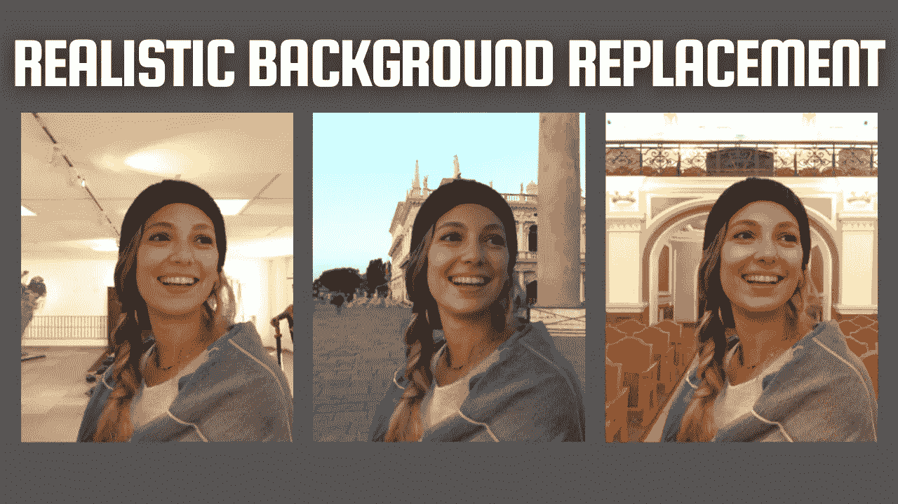
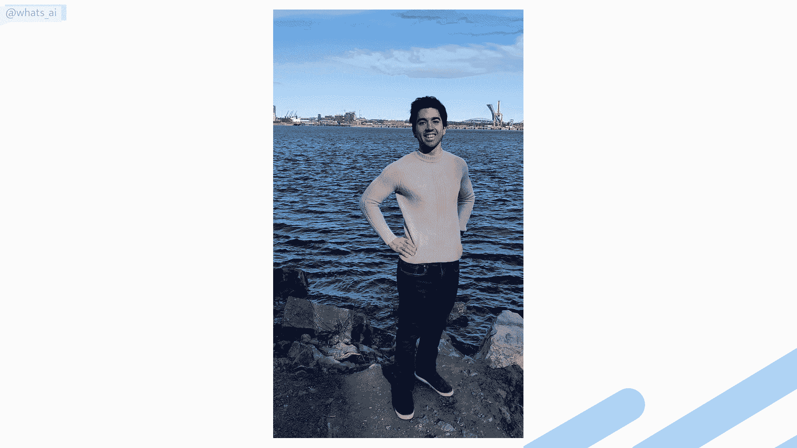
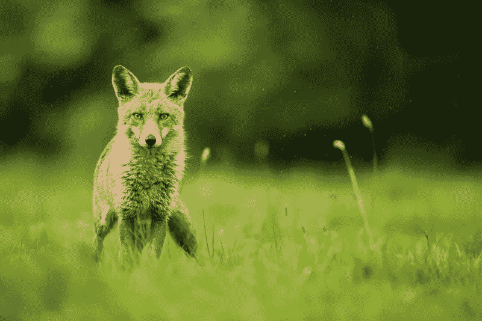
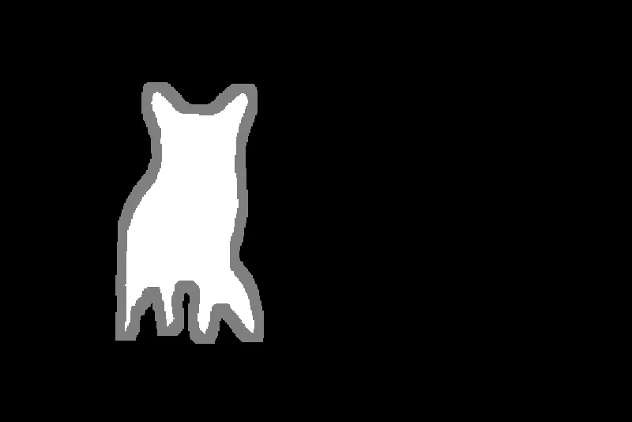
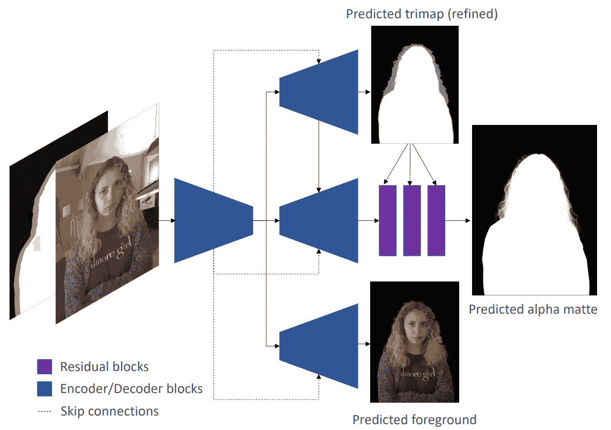
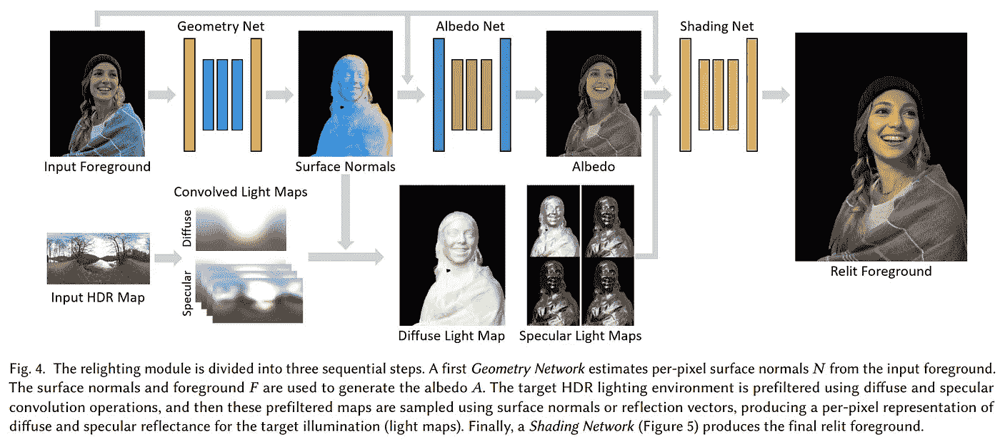
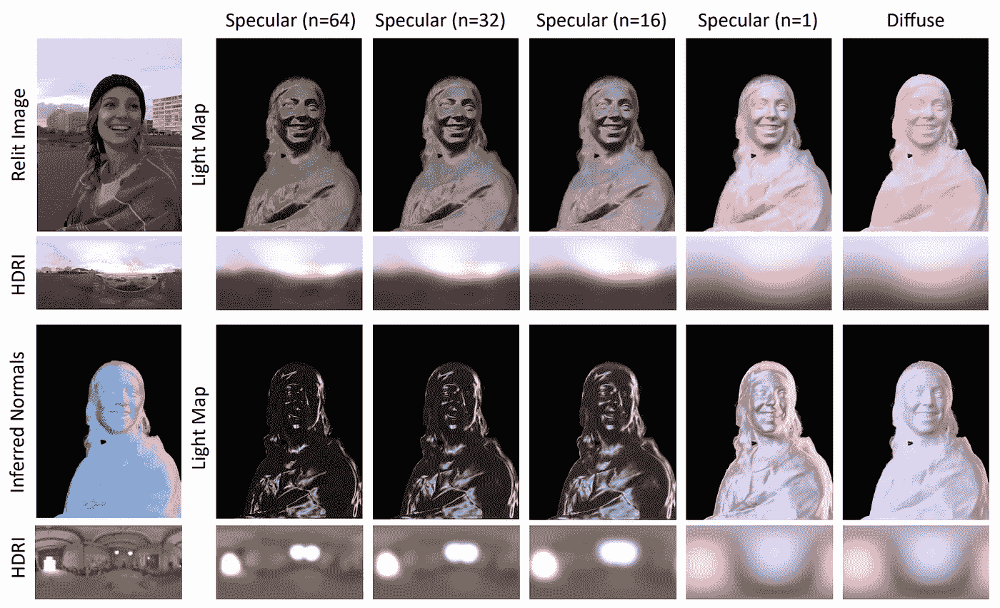
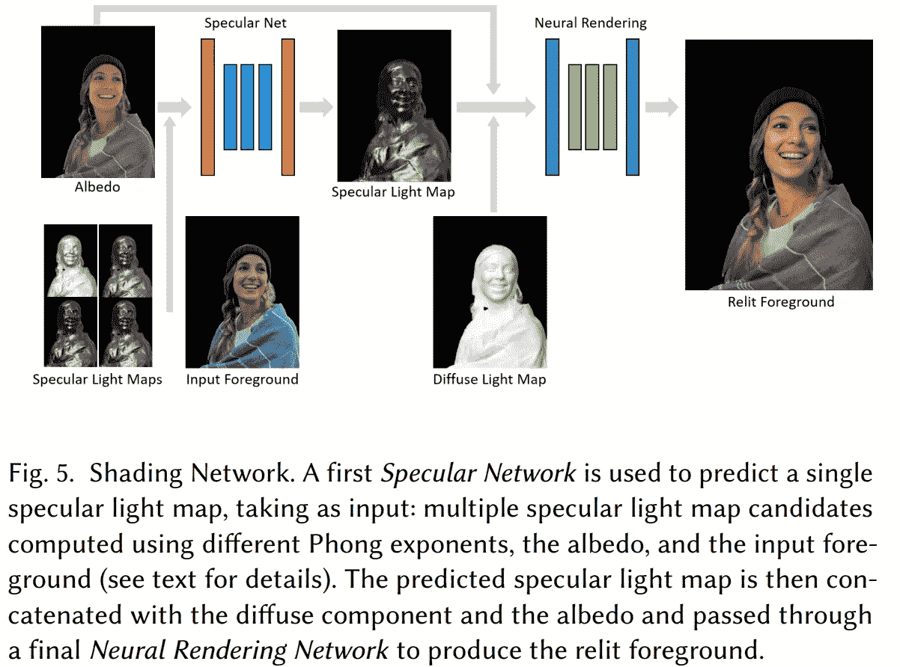

# 用真实的灯光改变你的肖像背景

> 原文：<https://pub.towardsai.net/change-your-portraits-backgrounds-with-realistic-lighting-b6f2ebeb1a85?source=collection_archive---------1----------------------->

## [计算机视觉](https://towardsai.net/p/category/computer-vision)

## 根据您添加的新背景的照明，正确地重新照亮任何肖像。

听听这个故事

你是否曾经想改变一张图片的背景，但却让它看起来很真实？如果你已经尝试过，你就会知道这并不简单。你不能在家里给自己拍张照片，然后给海滩换个背景。只是看起来很糟糕，不现实。任何人都会马上说“那是 PS 过的”。对于电影和专业视频，你需要完美的灯光和艺术家来再现高质量的图像，而这是超级昂贵的。你不可能用自己的照片做到这一点。还是可以？

不良背景更改示例

这就是谷歌研究试图通过这篇名为《完全重新照明》的新论文实现的目标。我们的目标是基于你添加的新背景的光照，正确地重新照亮任何肖像。这个任务叫做“人像重光照和背景替换”，顾名思义，它有两个非常复杂的子任务:

1.  背景替换，这意味着你需要准确地删除当前图像的背景，只有你的肖像。
2.  肖像重新照明，你将根据新背景场景中的照明来调整你的肖像。

整体模型。[潘迪等人，2021 年，完全重新点燃](https://augmentedperception.github.io/total_relighting/)

正如你所料，这两项任务都极具挑战性，因为算法需要理解图像，以正确地将你从图像中删除，然后充分理解另一幅图像，以改变你的肖像的照明，使其适应新的场景。这篇论文最令人印象深刻的是，这两个任务是在没有任何先验知识的情况下完成的。这意味着他们不需要任何其他信息，除了两张图片:你的肖像和新的背景，以创造这个新的现实的形象。让我们回到他们是如何详细攻击这两个任务的:

## 人体垫

这第一个任务是消除你的肖像背景被称为图像抠图，或者在这种情况下，人类抠图，我们想要准确地识别照片中的人类。“准确”的部分使它变得复杂，因为有许多精细的细节，比如人类的漂浮头发。你不能光着脸不剪头发。看起来会很不合适。为了实现这一点，他们需要训练一个模型，首先找到这个人，然后预测一个近似的结果，其中我们指定我们确定是这个人的一部分，什么是背景的一部分，什么是不确定的。

一只红狐(左)和它的三分图(右)。作者图片

这被称为三分图，它是使用一个经典的分割系统找到的，训练该系统就是为了做到这一点:分割图像中的人。如果你感兴趣的话，我已经在之前的视频中解释过了。它基本上把这个初始的三分图，缩小成浓缩的信息，用这个浓缩的信息把它放大成一个更好的三分图。

第一个模型:人体抠图。[潘迪等人，2021 年，完全重新点燃](https://augmentedperception.github.io/total_relighting/)

这看起来像魔术，但它是有效的，因为将这种三分图转换成代码和将代码转换成更好的三分图的网络是在数千个例子中训练出来的，并学会了如何实现这一点。然后，他们使用第二个三分图再次将其细化为最终预测的人类形状，这被称为阿尔法遮罩。这个步骤也使用神经网络。因此，我们这里基本上涉及三个网络，一个获取图像并生成三分图，第二个获取此图像和三分图以改进三分图，最后一个将所有这些作为输入来生成最终的 alpha 蒙版。所有这些子步骤都是在训练中学习的，在训练中，我们向网络展示了我们想要的许多例子，这些例子一起工作，以迭代地改善最终结果。同样，这非常类似于我之前在关于 MODNet 的视频中提到的内容，如果你想了解更多关于人类抠图的信息，MODNet 正是一个这样做的网络。

这里，所有这些网络只构成了这个算法的第一步:人体抠图。这篇论文的新内容是第二个真正的步骤，他们称之为重新照明模块。

## 重新点火模块

整体模型。[潘迪等人，2021 年，完全重新照明](https://augmentedperception.github.io/total_relighting/)

既然我们已经准确预测了这个人在图像中的位置，我们需要让它看起来更真实。要做到这一点，很重要的一点是人身上的灯光要与背景相匹配，所以他们需要重新照亮人或背景场景。这里，正如大多数人同意的那样，最简单的方法是重新点燃这个人，所以他们以此为目标。这种重新照明肯定是两者之间最复杂的任务，因为他们需要了解人体对光的反应。

第二个“模型”:重新照明模块。[潘迪等人，2021 年，完全重新照明](https://augmentedperception.github.io/total_relighting/)

正如您在这里看到的，这里又有多个网络。几何网、反照率网和阴影网。几何网络采用我们在上一步中生成的输入前景来生成表面法线。这是人的表面的模型化，以便模型可以理解深度和光的相互作用。然后，该表面法线与相同的前景图像耦合，并被发送到产生反照率图像的反照率网络中。这个反照率图像只是对我们感兴趣的物体反射的光的比例的测量，在这种情况下，我们感兴趣的物体是一个人，对来自不同光源的光做出反应。它告诉我们这个人的衣服和皮肤如何对它接收到的光做出反应，帮助我们进行下一步。下一步是新背景的光线。我们将尝试理解新的背景照明如何影响我们的肖像，使用我们肖像的镜面反射和漫射光表示，这里称为光照贴图。

插图中的光线贴图。[潘迪等人，2021 年，完全重新照明](https://augmentedperception.github.io/total_relighting/)

这些光照贴图是用你想要的背景的全景图计算出来的。顾名思义，这些光照贴图基本上显示了光线在许多情况下是如何与主体相互作用的。这些贴图允许我们根据背景的光照使皮肤和衣服看起来更亮或更粗糙。然后，这些光照贴图，反照率图像和前景被合并到最后的第三个网络，着色网络。

详细的遮阳网。[潘迪等人，2021 年，完全重新点燃](https://augmentedperception.github.io/total_relighting/)

这个着色网络首先使用反照率信息和我们之前计算的所有高光贴图候选来产生高光贴图的最终版本。使用这个最终的光照贴图，我们的漫反射贴图，以及反照率，我们最终可以渲染出最终的遗照人物来插入到我们的新背景中。

正如你所看到的，所有的网络看起来都一样，就像这样，这被称为 U-Net，或编码器-解码器架构。就像我已经说过的，它接受一个输入，将其压缩成代表这个输入的代码，并将其放大成一个新的图像。但是正如我在之前的视频中已经解释过的，这些“编码器-解码器”只是将一幅图像放入网络的第一部分，这个部分是编码器，它将图像转换成被称为潜在代码的压缩信息，你可以在右边看到。这些信息基本上包含了基于我们想要的任何风格来重建图像的相关信息。利用他们在训练中所学的知识，解码器利用这些信息进行相反的步骤，产生具有这种新风格的新图像。这种风格可以是一个新的照明方向，但也可以是一个完全不同的图像，如表面贴图，甚至是阿尔法遮罩，就像我们的第一步。

甘训练与潜在空间表征。图片由作者提供。

这种技术非常强大，主要是因为他们所做的训练。在这里，他们使用了 58 台多灯摄像机和 70 个不同的人做各种姿势和表情。但是不用担心，这只是为了训练算法而需要的。推理时唯一需要的是你的照片和你的新背景。此外，你可能还记得，我提到过全景需要产生这种重新照亮的图像，但它也可以通过另一个神经网络精确地近似，只基于你希望你的肖像被翻译的背景图片。

就是这样！将这两种技术结合在一起就可以了，所以你只需要给算法两张图像，它就会为你做所有的事情，用不同的背景生成一张逼真的重光肖像！Pandey 等人的这篇论文将它应用于人类，但你可以想象它对物体有多有用，你可以给物体拍照，然后将它们放在一个新的场景中，用正确的灯光使它们看起来像真的一样。

## 观看视频

感谢您的阅读！

如果你喜欢我的工作，并想与人工智能保持同步，你绝对应该关注我的其他社交媒体账户( [LinkedIn](https://www.linkedin.com/in/whats-ai/) ， [Twitter](https://twitter.com/Whats_AI) )，并订阅我的每周人工智能 [**简讯**](http://eepurl.com/huGLT5) ！

## 支持我:

*   支持我的最好方式是在 [**媒体**](https://medium.com/@whats-ai) 上关注我，或者如果你喜欢视频格式，在[**YouTube**](https://www.youtube.com/channel/UCUzGQrN-lyyc0BWTYoJM_Sg)**上订阅我的频道。**
*   **支持我在 [**上的工作**](https://www.patreon.com/whatsai)**
*   **加入我们的 [**Discord 社区:** **一起学习 AI**](https://discord.gg/learnaitogether)和*分享你的项目、论文、最佳课程、寻找 Kaggle 队友等等！***

## **参考**

**Pandey 等人，2021，Total Relighting:学习为背景替换重新照亮人像，doi:10.1145/3450626.3459872
**论文**:[https://augmented perception . github . io/Total _ re lighting/Total _ re lighting _ Paper . pdf](https://augmentedperception.github.io/total_relighting/total_relighting_paper.pdf)
**项目链接**:[https://augmentedperception.github.io/total_relighting/](https://augmentedperception.github.io/total_relighting/)**