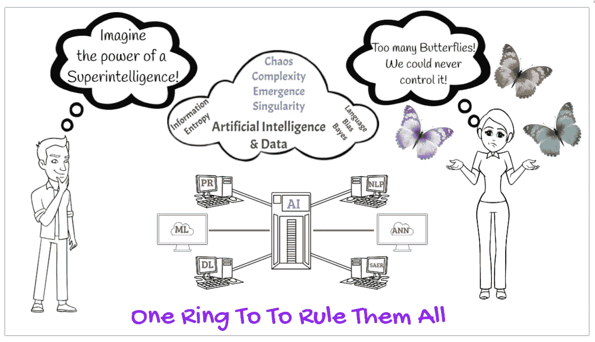
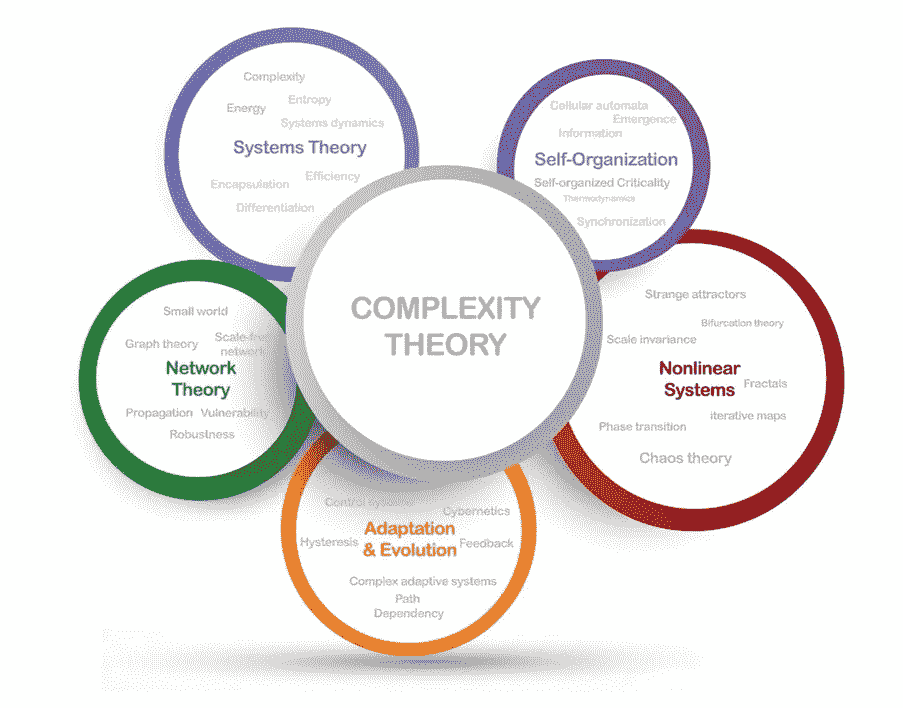

# 混沌、复杂性、涌现和技术奇点

> 原文：<https://pub.towardsai.net/chaos-complexity-emergence-technological-singularity-ad1a7f45fb9d?source=collection_archive---------0----------------------->

## [人工智能](https://towardsai.net/p/category/artificial-intelligence)

## 藏在人工智能的背后

照片由[丹尼尔·利维斯·佩鲁西](https://unsplash.com/@yogidan2012)在 [Unsplash](https://unsplash.com/photos/YQrUzrsRNes) 上拍摄

# 前言:

> “混沌、复杂性、涌现和技术奇点”本质上是 2021 年 10 月出版的一部更广泛的作品的编辑版本([应用营销分析第 7 卷#2 亨利·斯图尔特出版物杂志](https://www.henrystewartpublications.com/ama/v7))，提出了“[发散汇流](https://www.ingentaconnect.com/content/hsp/ama/2021/00000007/00000002/art00010)的理论，处理人工智能(AI)的进展——从混沌理论到复杂性理论到涌现，然后是技术奇点。(如果有兴趣，欢迎在[媒体](https://medium.com/@tedwgross)或 [LinkedIn](https://www.linkedin.com/in/tedwgross) 上给我发消息，索取《发散汇流》的免费 PDF 版本)。

作者图片 2021

# 混沌理论

> 引入一点混乱。打乱了既定的秩序，一切都变得混乱。我是混乱的代理人。哦，你知道混乱的好处吗？这是公平的！”
> 
> 必须谦卑地承认，发明不在于从虚空中创造，而在于从混沌中创造；首先，材料必须是可提供的:它能给黑暗的、不成形的物质以形式，但不能产生物质本身。

1961 年，在对天气模式信息进行实验时，咖啡因的缺乏导致爱德华·洛伦茨将一个缩短的十进制数字键入一系列计算出的数字。这个错误催生了“混沌理论”和“蝴蝶效应”。⁴随后发表的论文《决定论的非周期 flow'⁵》引发了一场关于混沌的辩论，这场辩论至今仍很活跃。蝴蝶效应被平淡地描述为一只蝴蝶在巴西扇动翅膀可能会在德克萨斯州引起一场龙卷风。或者，正如洛伦茨自己所说:

> 一位气象学家评论说，如果这个理论是正确的，海鸥扇动一下翅膀就足以永远改变天气的进程。争议尚未解决，但最近的证据似乎对海鸥有利。⁶

混沌理论的核心是一个看似温和的陈述，它假设小的，甚至微小的事件都可以影响巨大的系统，导致重大的后果——因此出现了蝴蝶效应，或者如混沌中定义的那样:“对初始条件的敏感性”。

令人惊讶的是，人们可以用数学术语来表达混沌。随机性突然变成了有序的无序，这意味着不仅在存在主义术语中，而且在现实世界场景中，混沌都有一个隐藏的秩序。

> 现代对混沌的研究始于 20 世纪 60 年代，当时人们逐渐意识到，非常简单的数学方程就可以模拟像瀑布一样剧烈的系统。输入的微小差异可能很快变成输出的巨大差异——这种现象被称为“对初始条件的敏感依赖”⁷

为了说明蝴蝶效应，混沌理论的倡导者经常引用谚语“因为缺少一颗钉子”:

> 因为缺少一颗钉子，鞋子丢了。因为没有鞋子，这匹马丢了。由于没有马，骑手迷路了。
> 因为缺少骑手，战斗失败了。由于缺乏战斗，这个王国丢失了。
> 一切都是为了一颗马蹄铁钉

教训是显而易见的:缺少一颗钉子这样无关紧要的东西会导致一个王国的灭亡。当如此多的小事件会产生如此巨大的后果时，我们怎么能试图预测系统的行为呢？这个令人烦恼的问题被搁置了几个世纪。混乱被归因于一个至高无上的存在，因果报应，或简单的旧运气。尽管它无处不在，但没有办法预测或控制混乱。事件是随机的，而随机事件是无法预测的。至少每个人都这么认为。

几乎作为一种基因命令，大脑寻找“模式”。然而,“混沌”和“模式”这两个术语似乎是截然相反的。如果有模式可辨，那么怎么会有混乱呢？此外，如果混乱盛行，那么怎么可能有潜在的模式？

2005 年，洛伦兹将混沌理论浓缩为:*‘混沌:当现在决定未来，但近似的现在并不近似地决定未来。⁸*

古代人在数亿颗恒星的混沌中寻找夜空的模式，发现了星座。现代人在日常生活中寻找潜在的行为和活动模式。最近的新冠肺炎疫情就是这种努力的一个例子。至少目前，人们对众所周知的钉子的来源关注较少，但对病毒如何传播、特定预防措施如何发挥作用以及第一次世界大战后黑死病(淋巴腺鼠疫)和西班牙流感等历史爆发模式的兴趣浓厚，希望有可能将模式识别应用于对抗冠状病毒的传播。这种模式的鉴定有助于对抗这种病毒，因为它可以根据目前的情况预测未来可能的结果。[ix](看看艾米·韦布在她即将出版的新书中如何分析这一点会很有趣，[*【创世纪机器】*](https://www.amazon.com/Genesis-Machine-Rewrite-Synthetic-Biology-ebook/dp/B096TTW1PR/) )。⁰)

> 混沌出现在天气行为、飞行中的飞机行为、高速公路上聚集的汽车行为、地下管道中流动的石油行为中。不管媒介是什么，行为都遵循同样的新发现的规律。这种认识已经开始改变企业高管做出保险决策的方式、天文学家看待太阳系的方式，以及政治理论家谈论导致武装冲突的压力的方式。

混沌理论不仅指出在一个复杂系统的看似随机的事件中有几何模式可以辨别，而且还引入了“线性”和“非线性”的级数。线性级数从 A 步到 B 步，再到 c 步。这样的系统有助于预测。他们的模式甚至在开始之前就很明显了。他们不理会混乱，因为他们有清晰的开端和具体的步骤。不幸的是，我们的大脑处理数据的方式主要是线性的，因为这是大多数人从出生就被训练的思考方式。

> 线性关系可以用图上的直线来表示。线性关系很容易思考:越多越好。线性方程组是可解的，这使得它适合教科书。线性系统有一个重要的模块化优点:你可以把它们拆开，然后再把它们组装起来——所有的部分加起来。非线性系统一般不能求解，也不能相加。“在流体系统和机械系统中，非线性项往往是人们在试图获得良好、简单的理解时想要忽略的特征……扭曲的可变性使得非线性难以计算，但它也创造了线性系统中从未出现的丰富行为。”
> 
> 混沌系统中初始不确定性的巨大放大究竟是如何产生的？关键特性是非线性。“线性系统是这样一种系统，你可以通过单独理解它的各个部分，然后将它们放在一起来理解……非线性系统是这样一种系统，其中整体不同于部分之和……线性是简化论者的梦想，而非线性有时可能是简化论者的噩梦。”

例如，结构化查询语言(SQL)纯化者用他们为系统定义的传统关系建立数据存储。这对于基本的名称-地址-看着-买的东西系统来说可能是极好的，因为被分析的东西依赖于先前决定的关系，无论是一对一还是一对多。人们还对进入系统的数据有绝对的控制权。

教授和实现 SQL 编程的人都对混乱视而不见，并拒绝接受其后果。他们通过使系统遵守先前定义的规则来消除系统中的“噪音”。信息熵是预定义的，因为数据中不可能有“惊喜”，并且从初始阶段就存在偏差。假设数据不是特定的预定义组合(例如字符串、数字、二进制等)。在这种情况下，数据将不会进入系统，即使当前被拒绝的数据在以后可能是至关重要的，这些信息对系统来说将永远丢失。简而言之，纯 SQL 编程不允许以非线性方式查看数据，这对数据和人工智能都会产生灾难性的后果。

> 教科书只向学生展示了罕见的非线性系统，这些系统将让位于这种技术。它们没有表现出对初始条件的敏感依赖性。具有真实混沌的非线性系统很少被教授，也很少被学习。当人们偶然发现这样的事情时——人们确实发现了——他们所有的训练都认为这是异常行为。只有少数人能够记得可解的、有序的线性系统是异常的。只有少数人，也就是说，理解灵魂中的非线性本质。⁴

今天的数据系统就像预测天气一样混乱。搜集数据意味着人们不知道从数据中能得到什么。一旦数据湖形成，人们必须寻找模式和信息。以线性方式处理数据总是会产生偏差，因为人们决定要查找什么数据、以什么顺序查找数据、数据的结构必须是什么以及它必须遵守的规则。无论是线性思维还是传统的 SQL 结构都无法提供合适的答案。信息熵、偏倚和贝叶斯定理的应用不能揭示足够的结果，因为没有收集到足够的信息。未能正确地进行数据分析将总是导致人工智能中大量错误的结果。

混沌理论的“尤里卡时刻”可以归结为一个数字——4.6692016——也就是所谓的“费根鲍姆常数” ⁵这里最重要的词是“常数”,尽管在被明确证明之前，很少有科学家或数学家会相信这是可能的。简而言之，米切尔·费根鲍姆发现复杂系统的工作方式具有普遍性。⁶只要给足够的时间，这个常数总会出现在一个数列中。而且，这个常数是普适的。混沌像钟摆一样沿着数学轴摆动。一旦一个人接受了无序和混乱，他就可以为之做计划——即使是在大系统中。事实上，即使在混沌系统中，人们也能找到稳定性，这创造了一个全新的可能性世界

> 虽然混沌系统的详细行为无法预测，但在大型混沌系统的普遍属性中可以看到一些“混沌中的秩序”，例如混沌的倍周期路径和费根鲍姆常数。因此，尽管在细节层面上“预测变得不可能”，但混沌系统的某些更高层面确实是可以预测的。⁷

然而，混沌理论有其局限性，因为总会有不止一只蝴蝶在扇动翅膀。在许多系统中，对于任何类型的预测来说，对初始条件的敏感性最终会变得过于复杂。例如，洛伦茨的天气预报最多持续几天的短时间。照目前的情况来看，没有办法发现什么样的“初始条件”会在四天后变得重要。人们可以把短期天气预报看作一个确定性系统；然而，根据混沌理论，即使在没有外部来源的确定性系统中，随机行为仍然是一种可能性。

> 混沌的定义是，有一些系统——混沌系统——在这些系统中，即使初始位置和动量测量的微小不确定性也会导致这些量的长期预测出现巨大误差……但对初始条件的敏感依赖性表明，在混沌系统中，即使初始测量中的微小误差最终也会在预测物体未来运动时产生巨大误差。在这样的系统中(飓风很可能就是一个例子)，任何误差，无论多小，都会使长期预测变得非常不准确。⁸

这就引出了复杂性理论。⁹

*“在我们的世界里，复杂性蓬勃发展，那些指望通过科学来全面了解自然习性的人将会更好地服务于混沌法则。”⁰*

# 复杂性理论

图片来自[维基共享资源](https://commons.wikimedia.org/wiki/File:Complex_systems_thoery.jpg)

> 事物的复杂性——事物中的事物——似乎是无穷无尽的。我的意思是没有什么是容易的，没有什么是简单的。
> 
> 具有许多不同初始条件的复杂系统自然会产生许多不同的结果，并且很难预测，因此混沌理论无法用来处理它们。

非线性系统既不容易定义也不容易理解，因此复杂性(也称为“复杂系统”)进入了研究领域。复杂性理论将信息论、熵和混沌理论交织在一起，并导致“涌现”。将复杂性作为一门单一的科学，用一个定义或统一的主题来对待是不可能的。几乎有无限的可能性，所有的初始事件以某种方式，神秘地，朝着一个未知的目标一起工作。

为了介绍复杂性的本质，考虑一群蚂蚁:

> 群居昆虫为自然界复杂系统提供了一些最丰富和最神秘的例子。例如，一个蚁群可以由几百到几百万只个体蚂蚁组成，每只蚂蚁都是一种相当简单的生物，它们遵从自己的遗传本能去寻找食物，以简单的方式对蚁群中其他蚂蚁的化学信号做出反应，与入侵者战斗，等等。然而，任何一个不经意的户外观察者都可以证明，一个蚁群中的蚂蚁，每个都执行着自己相对简单的动作，共同努力建造出惊人复杂的结构，这显然对整个蚁群的生存非常重要。

蚁群的一个独特之处是没有明显的中央控制或领导。然而，一个群体会不断地创造模式，收集和交换信息，并在它所处的环境中进化。类似的行为也出现在股票市场、生物细胞组织和人工神经网络中。混乱之后，复杂性几乎无处不在。米切尔为复杂性下了一个极好的(即使是部分的)定义:

> 一个系统，其中没有中央控制和简单操作规则的大型组件网络产生复杂的集体行为、复杂的信息处理和通过学习或进化的适应……在没有内部或外部控制器或领导者的情况下产生有组织行为的系统有时被称为自组织。由于简单的规则以难以预测的方式产生复杂的行为，这种系统的宏观行为有时被称为突现。这是复杂系统的另一种定义:展现出非平凡的涌现和自组织行为的系统。复杂性科学的核心问题是这种涌现的自组织行为是如何产生的。⁴

还有其他更微妙的方法来衡量一个复杂的系统。如果你测量信息熵，你可以看到一旦“噪音”被消除，还剩下多少“惊喜”。如果这种惊奇高于特定的、预先设定的值，就可以认为是复杂的。或者，也许人们应该只看集合的大小。例如，DNA 测序——以及随之而来的可能性——在这些参数下(或者实际上，在任何参数下)是一个复杂的系统。

当然，AI 和数据时代最重大的问题源于艾伦·图灵的著名问题:*‘机器能思考吗？’*。⁵这样一个关于复杂性理论的问题的后果是巨大的。如果有思考机器的可能性，那么机器有可能获得‘意识’和‘智能’吗？如果数据池大到可以赋予一台机器思考，那么信息熵对那台机器来说会不会充满惊喜？或者机器会选择忽略关键信息，只把它当成“噪音”吗？创造了最终复杂系统的数据中固有的偏见会被机器用来在逻辑上传播错误的假设，直到机器成为其创造者的危险吗？会思考的机器会理解所有形式的语言和交流吗，包括语音语调、面部表情、人类凭直觉知道如何解读的模糊语句的含义，以及最重要的情感和情绪？

考虑到这样一个事实，即已经有可能建立能够以不断增长的速度工作和自我学习的人工神经网络。尽管如此，如果被问及人工神经网络是如何自学如此复杂的互动的，所有参与者要么会因为找不到答案而绝望地举起双手，要么会提出一个又一个理论——没有一个能回答这个简单的问题:“这个人工神经网络是如何自学的？”

> 但是在一个复杂的系统中，比如我上面描述的那些，其中简单的组件在没有中央控制器或领导者的情况下运行，谁或什么实际上感知了情况的含义以便采取适当的行动？这本质上是一个在生命系统中什么构成意识或自我意识的问题。⁶

围棋和象棋是自成一体的复杂系统。这些游戏中的走法数量让人无法理解，而每一步都是对初始条件敏感的结果。*“复杂性的一个概念是表征一个系统或过程所需的有意义的、非随机的、但不可预测的最小数量的信息。”⁷*

2017 年，AlphaGo Zero，deepmind 的 AlphaGo 软件版本是 AlphaGo 的第一个版本在没有任何先前数据集或人类干预的情况下，训练自己玩围棋(可以说比国际象棋更复杂)。它建立在神经网络的基础上，使用人工智能的一个分支“强化学习”，其知识和技能完全是自学的。

在最初的三天里，AlphaGo Zero 连续与自己进行了 490 万场比赛。它似乎在短短几天内就开发出了击败职业围棋选手所需的技能，并在 40 天内超越了之前所有的 AlphaGo 软件，赢得了每一场比赛。⁰虽然这是狭义的人工智能(因为它只能玩围棋而不能玩别的)，但这一成就是不可能被忽视的。

DeepMind 的联合创始人兼首席执行官戴密斯·哈萨比斯在 2017 年表示，AlphaGo Zero 的力量来自于这样一个事实，即它*‘不再受人类知识极限的约束，*，而世界知名的围棋职业选手柯洁说过*‘人类在自我完善面前显得多余’。*

然而，最令人不寒而栗的评论来自 DeepMind 的首席研究员大卫·西尔弗:

> “事实上，我们已经看到一个程序在像围棋这样复杂和具有挑战性的领域取得了非常高的性能，这意味着我们现在可以开始解决一些对人类最具挑战性和影响力的问题了”。

简单地说，这意味着有可能在一般或强人工智能中实现 AlphaGo Zero 窄人工智能课程。这又回到了图灵的包罗万象的问题:“机器能思考吗？”以及与此问题相关的各种问题。

混沌系统中有基本的和一般的预测可能性；还有费根鲍姆常数的普遍性，但复杂性远远超出了这些规则。它在信息熵中包含了如此多的惊喜，如此多的“对初始条件的初始敏感性”点，如此多的尚未被理解的系统，如此多的当数据不“纯”时偏差滑入的可能性，以至于我们在试图理解复杂性的本质和后果时仍然盲目地摸索。

> 混沌向我们展示了内在的随机性并不是系统行为看起来随机的必要条件；遗传学的新发现对基因变化在进化中的作用提出了挑战；对机会和自组织作用的日益重视，挑战了自然选择作为一种进化力量的中心地位。科学界和普通大众都逐渐认识到，从非线性、分散控制、网络、层级、分布式反馈、信息的统计表示和本质随机性等方面进行思考的重要性。⁴
> 
> 我们需要的是看到它们之间深层关系的能力，以及它们如何融入一个连贯的整体——这可能被称为“复杂性另一面的简单性”⁵

# 出现

[来自最大像素的图像](https://www.maxpixel.net/Wing-Beat-Chaos-Theory-Chaos-Wave-Butterfly-Effect-4847628)

> 涌现导致新奇事物的产生，而这种新奇事物通常与它所涌现的现象有质的不同。⁶

合并可以被归类为进化过程中的一个步骤。它最好被理解为从先前的状态中产生的一种新的存在状态。在 Mitchell 之前讨论的复杂性定义中，她为复杂系统提供了另一种定义，即‘*(展现出非平凡的涌现和自组织行为的系统)。复杂性科学的中心问题是这种涌现的自组织行为是如何产生的。⁷*

“涌现”是什么意思？很难解释掉我们的思想不能理解的东西；然而，为了证明涌现是真实的，让我们先简单地考察一下涌现，不考虑自组织。

当拼图玩具的各个部分展开时，人们可以查看每个单独部分的属性——形状、大小、图片等等。各个部分本身就是实体。当我们试图将拼图拼在一起时，我们的思维会从单个的碎片转移到整个画面应该是什么样子，以及需要连接在一起的碎片的形状。事实上，我们在寻找模式。一旦拼图完成，一个新的实体出现了——一个以前没有的实体。人类是涌现的生物。我们接受混乱、复杂的想法和情况，并试图理解它们，通常是通过模式。*‘大脑使用突现的特性。智能行为是大脑混乱而复杂的活动的一种自然属性。⁸*

当它从混乱中浮现出来时，整个画面变得连贯起来。

> 涌现指的是集体行为的存在或形成——一个系统的各个部分一起做的事情，而不是它们单独做的事情……在描述集体行为时，涌现指的是集体属性如何从各个部分的属性中产生，更大规模的行为如何从更小规模的详细结构、行为和关系中产生。“例如，组成肌肉的细胞表现出协同工作产生肌肉整体结构和运动的涌现特性……涌现也可以描述系统的功能——系统凭借其与环境的关系做它自己不会做的事情。”⁹

复杂系统是涌现系统。一旦一个人发现并遇到复杂性，在某个阶段涌现行为几乎是不可避免的。想想人类大脑中的 860 亿个神经元。每个神经元做一件事或者是一个连接器。然而，将这些神经元结合成一个系统，思想、意识、情感、推理、创造力和许多心理状态就会出现。或者，考虑股票市场——一个复杂的系统，人工智能的大部分都致力于此。每个人对市场都有自己独特的反应。然而，正是数百万种不同反应的组合，构成了股市的“整体”。结果是，在任何给定的毫秒，一个新实体的出现。由于那一毫秒的复杂性和对初始条件的敏感性，又一个全新的复杂系统出现了。

经济学家杰弗里·戈尔茨坦(Jeffrey Goldstein)在 1999 年发表了一个被广泛接受的涌现定义— *“在复杂系统的自组织过程中出现的新颖和连贯的结构、模式和属性”。⁴⁰*2002 年，彼得·康宁进一步扩展了这个定义:

> 以下是共同的特征:(1)激进的新颖性(以前在系统中没有观察到的特征)；(2)连贯性或相关性(指在一段时间内保持自身的完整整体)；(3)全局或宏观的“层次”(即存在“整体性”的某种属性)；(4)是一个动态过程的产物(它不断发展)；(5)是“明示的”(可以被感知的)。”⁴

事实上，一旦人们花时间去观察复杂的系统，所有人都可以看到涌现。是的，这是一种从复杂性中“浮现”出来的状态。由于每一个涌现的系统都将表现出以前在单个部分中没有观察到的品质，其结果在本质上是一个全新的系统。那么混乱和复杂将再次导致涌现。这不是一个递归循环，而是一个不断扩展的系统。

计算能力的不断增长(无论摩尔的 law⁴消失，还是保持稳定，还是进入超增长)将允许几年前只能梦想的大规模计算。加上信息爆炸，计算机将能够在几毫秒内消化海量信息。

那些拒绝接受紧急状态的人似乎总是忘记，这个世界从本质上来说是混乱的。它受对初始条件的敏感性支配。混乱总会出现。蝴蝶翅膀的这些小扇动往往会把人和老鼠最好的计划打乱。

想象一下，当算法被强加到数据上以从数十亿的数据比特中产生图像时，数据湖不断地从大量的源被供给。随着数据湖消耗更多的数据，从数据中获得的实时图像必然与一分钟前获得的图像不同。信息熵变了。偏见已经转移。结果会不断自我修正。

现在想象大量的混沌复杂涌现系统几乎同时达到顶点。他们是动态的，他们在进化。它们也是自组织的。在某个时候，这些系统将开始相互通信，共享它们的信息，拥有它们自己的信息熵、语言能力、决策树和随机森林*，而无需人工干预*。一个新的巨系统将从众多已经达到这个阶段的个体涌现系统中出现。

这是一个“技术奇点”的时代。⁴

# 技术奇点

照片由[乔希·希尔德](https://unsplash.com/@joshhild)在 [Unsplash](https://unsplash.com/photos/WjZ4eaHq9G4) 上拍摄

> 智慧比战争武器更有价值，但一个小小的错误就会毁掉许多价值。⁴⁴
> 
> 计算机是优秀而高效的仆人，但我不想在它们手下工作。⁴⁵

许多关于技术奇点的文献都集中在实现它的方法上。它会通过有耳朵、眼睛、心脏和大脑(在经典意义上)的“类人人工智能”出现，还是以一种人们甚至无法想象的无形形式出现？

出现的那一刻，将无法阻止即将到来的奇点。这不是什么时候会发生或者在什么样的确切条件下会发生的问题，而是它*会*实现的非常真实的可能性。

> 那么，什么是奇点呢？在未来的一段时间里，技术变革的步伐将如此之快，其影响将如此之深，人类的生活将发生不可逆转的变化。⁴⁶
> 
> 如果指数级的技术进步带来了如此巨大的变化，以至于我们今天所理解的人类事务走到了尽头，那么人类历史上就会出现一个奇点。⁴⁷

虽然库兹韦尔为奇点——代表着人类能力的深刻和破坏性转变——设定了日期，但正如 2045',⁴⁸所说，这对当前的争论并不重要。正如韦伯所说，这很可能发生在 2060 年，或者 2145 年。这里要重申的关键点是，一旦涌现开始，奇点就会随之而来。(库兹韦尔将于 2022 年出版新书《奇点临近》,⁴⁹，这可能会更新他目前的预测。)

随着涌现的开始，信息爆炸将成为预言已久的智能爆炸。要做到这一点，有几个先决条件，尽管这个列表并不详尽。

人工智能的世界目前充满了人工智能，它包含了许多不同的进化科学。ML 通过使用 NLP、PR 和 DL 来利用数据。随着可用数据量的持续增长，这是进步的核心。模式是人类思维的本质，对智力至关重要。

> 模式很重要。这些混沌自组织方法的某些细节，以模型约束(定义初始条件和自组织方式的规则)表示，是至关重要的，而约束内的许多细节最初是随机设置的。然后，该系统自组织并逐渐呈现已经呈现给该系统的信息的不变特征。产生的信息不是在特定的节点或连接中找到的，而是一种分布式模式。⁵⁰
> 
> 我们在这里设想的这种人工智能也将擅长在大量数据中寻找模式。但与人脑不同的是，它不会期望数据以一种独特的方式组织，即来自动物感官的数据被组织。“它将不依赖于数据独特的空间和时间组织，也不必依赖于相关的偏见，例如附近数据项的关联趋势……为了有效，人工智能需要能够在没有这种帮助的情况下找到并利用统计规律，这意味着它将非常强大，非常通用。”⁵

虽然 ML 和大多数人工智能一样，还处于起步阶段，但 PR 和 DL 将继续取得进展，并在消化模式的同时增强计算机决策过程。将技术与可用的数据以及不断增长的数据存储、访问和分析速度相结合，我们正在接近“通用”AI,⁵(也称为“强大”)成为可能的时刻。然而，ML 及其所有构造需要其他因素来实现这一点。

> 人类大脑的巨大并行性是其模式识别能力的关键，这是我们人类思维的支柱之一……大脑有大约 100 万亿个内部神经元连接，每个连接都可能同时处理信息。'⁵

创造一个具有这种并行能力的机器智能，然后在人类或更高水平上产生公共关系，还不可行。然而，我们肯定会这样做。一旦达到这种复杂程度，系统将呈指数级增长。“指数”在这里是一个关键术语，因为许多人不理解指数增长的含义。例如，用简单的术语解释“指数”,如以恒定的速率加倍，取一粒米，放在一个棋盘方格上。现在指数地增加每个方块上米粒，这样每个方块将包含两倍于前一个方块的米粒量。当一个人完成指数实验的时候，在那个棋盘上将会有超过 1800 亿颗米粒。想象一下这种指数级的并行增长。想象一下，撇开数据本身的增长不谈，人类分析数据的能力会有如此大的提高。

一旦达到这个阶段，人类就进入了可能的“超智能”时代。

> 一台超级智能机器本身可能是一个极其强大的代理人，它可以成功地维护自己，对抗创造它的项目以及世界的其他部分。⁵⁴
> 
> 我们在这里感兴趣的与奇点相关的想法是智能爆炸的可能性，特别是机器超智能的前景。⁵⁵

当一种超级智能出现时，它将直接来自智能爆炸。然而，超级智能不是一个人按下开关或改变代码就能控制的。一旦真正的超级智能出现(或者更好地说，一旦智能爆炸即将发生——或者已经发生)，可能就太晚了。编写代码来改变这里或那里的一些东西不再对任何人有任何好处。

> 一个成功的种子人工智能将能够迭代地增强自身:早期版本的人工智能可以设计出一个改进的版本，而改进的版本——比原始版本更智能——可能能够设计出一个更智能的版本，以此类推。“在某些情况下，这种递归自我改善的过程可能会持续足够长的时间，从而导致智能爆炸——在这种情况下，一个系统的智能水平会在很短的时间内从相对适度的认知能力提高到彻底的超级智能。”⁵⁶

在智能爆炸和创造奇点之后，这种“递归自我改进”可能是超级智能的倒数第二个能力——在这个阶段，创造的智能可以纠正它“判断和认为”它可能已经犯下或可能已经犯下的任何错误。这是实际的“事件视界”，因为一旦递归自我改进可行，智能爆炸将是一个合乎逻辑的结果。

> 在某些时候，种子人工智能在人工智能设计方面变得比人类程序员更好。现在，当人工智能自我改进时，它会改进做改进的东西。⁵⁷
> 
> “一旦人工智能被设计成其智能仅略高于人类水平，递归自我改进的动力就变得适用，这可能引发智能爆炸。”⁵⁸

然而，词汇必须是清楚的:数据和信息是被收集和分析的。这两个术语都不意味着实际的知识或智力。

> 信息不是知识。世界充满了信息；智能的作用是发现显著的模式并采取行动。⁵⁹

简而言之:随着数据的积累，混乱和复杂性随之而来，系统将被大量信息淹没。这些系统将根据它们试图分析的内容和做出的预测来展示非线性的“思维”过程。同时，ML 将在 PR 和 DL 方面取得相当大的进步，随着硬件和软件能力的增长，使我们更接近并行的能力。事实上，实际的指数增长，尤其是在数据方面，可能会实现，从而加剧信息爆炸。

拥有大量数据的复杂系统将在我们的计算机化中出现。在某个无法预测的时刻(尽管有库兹韦尔的预言)，这些复杂系统将出现在更大的系统中，并继续混沌-复杂-出现的过程。无论是通过人类的手还是通过自我生成的计算机能力，这些系统将开始相互通信，再次融合成更加有意识和广泛的系统——以无所不包的规模出现。

当这些系统进行通信时，它们将获得基于它们正在分析的所有数据的信息。一种智能将会出现，由于产生它的所有混乱和复杂系统中固有的数据量和能力，它能够递归地自我改进。到那时，一种超级智能将会出现，智能爆炸将会开始。技术奇点将会到达一个技术事件视界。

> “事件视界”是定义黑洞周围空间区域的边界，任何东西(甚至光)都无法从中逃脱。 '⁶⁰
> 
> 就像我们很难看到黑洞视界之外的东西一样，我们也很难看到历史奇点视界之外的东西。⁶

> 这就是奇点。有些人会说，我们无法理解它，至少以我们目前的理解水平。出于这个原因，我们不能越过它的视界，完全理解它之外的东西。这就是我们称这种转变为奇点的原因之一。⁶

如前所述，能够递归自我改进的超级智能对它的人类创造者来说毫无用处。这种超级智能的行动将在很大程度上取决于人类能力与信息灌输的紧密程度。如果它看起来像一个化身，或者在云中的一万亿台计算机之间传播，这都没有关系。真正重要的是，一旦这种超级智能出现，它就可以掌握语言及其所有细微差别，拥有常识，并在积极的意义上表现出创造力。可能最关键、最关键、最基本的特征是它是否会理解情感和同理心。

> 这种对未来的展望颇具吸引力。如果从人类级别的 AI 到超级智能的过渡是不可避免的，那么确保人工智能继承人类的基本动机和价值观将是一个好主意。这些可能包括求知欲，创造、探索、改进和进步的动力。但也许我们应该在 AI 中灌输的价值观高于一切，就是对他人的同情，对所有有情众生的同情，就像佛教徒说的那样。尽管人类有缺点——我们好战的倾向，我们使不平等永久化的倾向，以及我们偶尔残忍的能力——这些价值观似乎确实在富足的时代脱颖而出。“因此，人工智能越像人类，就越有可能体现同样的价值观，人类就越有可能走向乌托邦式的未来，一个我们受到重视和尊重的未来，而不是一个反乌托邦式的未来，我们被视为毫无价值的下等人。”⁶

说清楚。一个微小的错误，一个在错误地方的偏见，一个对信息熵和信息中的“惊喜”的忽视，无法确保系统理解实际的人类状况——都将是灾难性的。

> 超级智能人工智能奖励功能的缺陷可能是灾难性的。事实上，这样一个缺陷可能意味着宇宙扩张和无尽富足的乌托邦未来与无尽恐惧、甚至可能灭绝的反乌托邦未来之间的差异。⁶⁴

> 想象可能的人工智能的空间充满了像我们一样的生物，他们的目标和动机类似于人类的目标和动机，这将是一个严重的错误，也许是一个危险的错误。此外，取决于它是如何构建的，一个人工智能或一群人工智能开始实现其目标的方式(只要这个概念有意义)可能是完全不可思议的，就像外星智能的工作方式一样。⁶⁵

博斯特罗姆的[《超智能:路径、危险、策略](https://www.amazon.com/Superintelligence-Dangers-Strategies-Nick-Bostrom-ebook/dp/B00LOOCGB2) '⁶⁶，库兹韦尔的[《奇点临近:当人类超越生物》](https://www.amazon.com/gp/product/B000QCSA7C) ⁶⁷，沙纳汉的[《技术奇点》](https://www.amazon.com/Technological-Singularity-Press-Essential-Knowledge-ebook/dp/B08BT1HFSJ) '⁶⁸和韦伯的[《九巨头》](https://www.amazon.com/Big-Nine-Thinking-Machines-Humanity-ebook/dp/B07H7RZLFW) ⁶⁹都有一个共同点。他们都讨论了对可能的危险奇点的保护，并提出了无数的方法来建立对系统的防御，调节危险的进展，或放入“死亡开关”。

然而，这些防御措施不太可能奏效。一个超级智慧体将会简单地为自己的继续存在进行自我修正，当然不会允许一个终止开关被用在自己身上。正如博斯特罗姆警告的那样，只有一次机会把事情做好。

> 如果有一天我们建造了在一般智能上超过人脑的机器大脑，那么这种新的超级智能将变得非常强大。而且，由于大猩猩的命运现在更多地取决于我们人类，而不是大猩猩本身，所以我们这个物种的命运将取决于超级智能机器的行动。我们确实有一个优势:我们可以制造东西。原则上，我们可以建立一种保护人类价值的超级智能。我们当然有充分的理由这样做。实际上，控制问题——如何控制超级智能做什么的问题——看起来相当困难。看起来我们也只有一次机会。一旦不友好的超级智能存在，它将阻止我们替换它或改变它的偏好。我们的命运将被注定。⁷⁰

当复杂系统在没有人类监督的情况下开始相互交流时，涌现的进程就会发生。这些复杂涌现的系统，本质上存在于电子存储器中(不管它有多先进)，将会汇聚起来，自己建立更好的系统。他们太聪明了，不会让任何形式的防御挡住他们的去路，即使他们缺乏适当的知识(相对于信息)。当数据中存在偏差时，当语言理解错误时，当信息熵不能消除噪声时，当常识和情感不能正确地融入系统时，奇点的出现将导致这一机会被错过。最糟糕的情况，被称为*‘终结者争论’*(根据《终结者》电影《franchise⁷》改编)，或者它不那么激进的表亲 *'transhumanism'⁷ ⁷* ，可能会在自我意识实现时成为现实。如果这种情况成为现实，这将是人类的熄灯——无论是象征性的还是字面上的。

# 结论

照片由[卢卡斯·伦齐](https://unsplash.com/@lucaslenzi?utm_source=unsplash&utm_medium=referral&utm_content=creditCopyText)在 [Unsplash](https://unsplash.com/s/photos/rings?utm_source=unsplash&utm_medium=referral&utm_content=creditCopyText) 上拍摄

> 一枚戒指统治他们，一枚戒指寻找他们，
> 一枚戒指带来他们，在黑暗中束缚他们。⁷⁴

人工智能不是一门科学。它是许多不同领域和理论的集合体——一个巨大的拼图，一旦完成，将创造一个拥有强大力量的单一实体。在许多方面，人们可以将其与“万物理论”(“M 理论”)相提并论，后者令阿尔伯特·爱因斯坦和斯蒂芬·霍金这样的伟大人物着迷、不安和困惑。

m 理论不是通常意义上的理论。这是一整套不同的理论，每一种理论都是对某些物理情况下的观察的很好的描述。这有点像地图。众所周知，一张地图不可能显示整个地球表面。⁷⁵

人们可以对人工智能说同样的话。它是一个由不同理论、结构和科学组成的完整家族，每一个都是对特定条件范围内观察结果的良好描述。它会导致一个“万物理论”，还是会被证明像发现哪只蝴蝶在巴西扇动翅膀并在德克萨斯州制造了龙卷风一样难以捉摸？

数据将继续增长，可能以指数形式增长，我们将继续节省每一点。我们能够明智地处理这些数据，预测和建设更美好的未来吗？我们会用偏见和责难污染分析吗？这一切会变成“噪音”，还是人类会继续在信息的“惊喜”中表达孩童般的惊奇？当我们出现的时候，混乱和复杂会淹没我们吗，有时是盲目的，没有理解我们现实周围的系统？

莎士比亚的话让我们停下来思考人类的存在:

> 不，如果我有权力，我会把康科德的甜牛奶倒进地狱，扰乱世界和平，扰乱地球上所有的统一(T2)⁷⁶

人工智能会带来一个更有意义的存在——一个人类梦想可以实现的存在——还是会给世界和平带来喧嚣，扰乱地球上的所有团结？

> 这条路从它开始的那扇门一直延伸下去。
> 现在前方的路已经远去，
> 我必须跟随，如果我能的话，
> 用渴望的脚步追逐它，
> 直到它加入一条更大的路
> ，在那里许多路径和差事相遇。那么去哪里呢？“我不能说，”⁷⁷

在 J.R.R .托尔金的史诗传奇《指环王》的开头，前传《Hobbit',⁷⁸》中的主角比尔博·巴金斯离开夏尔，踏上了他最后一次前往精灵之家瑞文戴尔的旅程。当比尔博开始他的最后一次冒险时，他唱着自己创作的歌曲“路漫漫其修远兮”，比尔博将他的家和一份强大、可怕和不祥的遗产留给了他的侄子弗罗多——“一枚统治他们的戒指”。⁷⁹尽管比尔博通过放弃魔戒显示出了巨大的意志力，但他没能警告他的侄子魔戒力量中固有的危险。事实上，即使是伟大的魔术师甘道夫和预言家也没有能力警告佛罗多前方的危险。

在今天的人工智能(AI)时代，社会，就像比尔博和佛罗多一样，已经获得了一些珍贵而不可思议的强大的东西，这些东西是通过几代人的知识积累而成的。此外，就像弗罗多开始他的冒险一样，还没有人完全意识到它所包含的力量。尽管如此，我们还是坚持探索，因为‘路漫漫其修远兮’。

许多预言家带着敬畏和深深的担忧看待人类的进步。有些人，比如甘道夫，选择保守秘密，小心翼翼地观察选择什么样的道路。随着社会加速走向未知的地平线，其他人大声反对、警告或鼓励。

就人工智能引领人类的方向而言，在技术的画布上描绘了成千上万种场景。乐观主义者描绘了一个新的“伊甸园”——一个充满了不断扩展的美丽和开放的通往知识之树和生命之树的花园。在圣经中，这两棵树代表着不断扩展的知识和永恒的生命，是神圣不可侵犯的，食用它们的果实会受到驱逐和死亡的惩罚。然而，这一次没有这样的限制。只要我们能够破解密码，无限的知识和一个没有疾病的世界，一个身体永远存在的世界，就在地平线上隐约可见。想象中最大规模的涅槃。

相比之下，悲观主义者在每个进步和每个角落都看到危险。他们警告说，人类已经沉醉于自己的发现和创新能力，社会正一头栽进自己制造的地狱。事实上，他们认为，我们跨越界限创造一个至高无上的存在只是时间问题——一个对创造它的人没有关心、没有同情、没有同情心的神，一旦被释放，就会被自己的逻辑所引导。我们将面临被自己创造的东西攻击的危险。

一如既往，有一条中间道路——人工智能在特定领域用于造福人类的道路。健康、财富、自由和幸福应该是每个人都能掌握的。每一个进步都会增加社会的知识和个人应对现代世界的能力。因为我们是创造者和发明者，人类将永远保持绝对控制，并维护作为人工智能家园的机器。征服战争、嫉妒、毁灭、仇恨和种族主义等基本本能的能力将会慢慢导致一种更加文明的存在。然而，这种进步是有控制的，挑剔的，并且仅仅是为了增加人们的幸福。

前方有无尽的道路——前所未见的放射。数百万条小溪沿着数据和流动时间的路径流入量子存在。人工智能无休止地依赖这条数据之河，在一个循环的进程和混乱的存在中。每天，数据的河流——所有人工智能的燃料——都在膨胀，直到最终达到真正的指数级力量。我们越进步，我们力量的幻觉就越强烈。然而，在现实中，我们对人工智能工作方式的控制和理解却跟不上步伐。

哪里有发散，自然就要求汇流。液体流交叉路径，缠绕，分享和获得力量结合他们的实力。他们在存在的复杂性中交流，寻找另一种辐射来成长并以此为食来维持和增加他们的电流。数据越多，溪流就会越长，走得越远。一些溪流干涸了，只留下干裂的泥土。其他出现成为强大的河流，永远结合成一个单一的巨大力量。当其他溪流从新产生的汇合处出现时，发散将再次发生。这是一个不断扩大的信息、分析、发现、创新和创造的循环。

就像比尔博出发时不知道前方的路——只知道他想要的目的地一样，这个社会也在探索的路上。有些旅行者注定要到达瑞文戴尔；其他人将跟随弗罗多的道路，踏上通往无法想象的力量的旅程——代价可能是许多人不愿付出的。佛罗多摧毁了魔戒，确保黑暗不会占上风。

对于人类来说，没有这样的选择。佛罗多的戒指仍然留在我们的手指上，提醒我们已经积聚的力量和我们正在走的路。社会只能学会忍受数据和信息的后果，同时不断用知识、常识和同理心评估技术、偏见和缺陷。更重要的是，我们需要创造方法，将这些特质灌输到我们的创作中。如果我们忽视这一点，坚持一头冲进我们的技术天堂，灾难将降临人类。

纯数据不带偏见或成见地描绘过去和现在。换句话说，纯数据描述信息。

相比之下，人们对数据的处理既不纯粹，也没有偏见。

如果我们没有为这样的后果做好计划，人工智能和数据的环将把我们束缚在黑暗之中，我们将发现自己处于这样一个世界，在这个世界中，我们对自己的人工智能创造的无能为力将迫使我们陷入我们自己设计的纯粹的混乱之中。

也许比尔博给佛罗多的简单建议(正如佛罗多所报道的)可以为人类提供智慧，以驾驭不断发散的人工智能汇流:

> 他常说只有一条路；它就像一条大河:它的泉水遍布每家每户，每条小路都是它的支流。“走出你的门是一件危险的事情，佛罗多，”他经常这么说。“你走到马路上，如果你不站稳，谁也不知道你会被冲到哪里。”⁸⁰

这条 AI 之路通向何方？沿途的路标会透露什么？目的地什么时候才能准确清晰地展现自己？作为回答，比尔博轻柔的、萦绕心头的低语在浩瀚的宇宙中回荡:

> 然后枯萎？“我不能说，”

# 进一步阅读和研究

照片由[加曼·爱丽丝](https://unsplash.com/@gamanalice3012?utm_source=unsplash&utm_medium=referral&utm_content=creditCopyText)在 [Unsplash](https://unsplash.com/s/photos/research?utm_source=unsplash&utm_medium=referral&utm_content=creditCopyText) 上拍摄

许多研究人员和作者，如尼克·博斯特罗姆在[《超智能》](https://www.amazon.com/Superintelligence-Dangers-Strategies-Nick-Bostrom-ebook/dp/B00LOOCGB2),⁸·艾米·韦布在[《九巨头》](https://www.amazon.com/Big-Nine-Thinking-Machines-Humanity-ebook/dp/B07H7RZLFW),⁸·雷·库兹韦尔在[《奇点临近》](https://www.amazon.com/gp/product/B000QCSA7C) ⁸和[《如何创造思维》](https://www.amazon.com/How-Create-Mind-Thought-Revealed-ebook/dp/B007V65UUG),⁸⁴·尤瓦尔·诺亚·哈拉里在[《人:明日简史》](https://www.amazon.com/Homo-Deus-Brief-History-Tomorrow-ebook/dp/B01BBQ33VE),⁸⁵·詹姆斯·格雷克在[《混沌:创造新科学》](https://www.amazon.com/Chaos-Making-Science-James-Gleick-ebook/dp/B003YL4KOO) ⁸⁶和 [《洪水》](https://www.amazon.com/gp/product/B004DEPHUC),⁸⁷·梅勒妮·米切尔[《复杂性:一次导游之旅》](https://www.amazon.com/Complexity-Guided-Tour-Melanie-Mitchell-ebook/dp/B002SAUBWC)⁸⁸[《人工智能:思考人类指南》](https://www.amazon.com/Artificial-Intelligence-Guide-Thinking-Humans-ebook/dp/B07MYWPQSK) ,⁸⁹，仅举几个例子，就在理解人工智能、数据和这些领域的创新思维方面产生了前沿作品。 他们中的佼佼者，沃尔特·艾萨克森，在他的一些开创性的作品中——[《达芬奇》](https://www.amazon.com/Leonardo-Vinci-Walter-Isaacson-ebook/dp/B071Y385Q1)《,⁹⁰》[《创新者》](https://www.amazon.com/Innovators-Hackers-Geniuses-Created-Revolution-ebook/dp/B00JGAS65Q)《',⁹》[《发明与漫游——杰夫·贝佐斯文集》](https://www.amazon.com/Invent-Wander-Collected-Writings-Introduction-ebook/dp/B08BCCT6MW)《,⁹》[《史蒂夫·乔布斯》](https://www.amazon.com/Steve-Jobs-Walter-Isaacson-ebook/dp/B004W2UBYW)《⁹》和[《密码破译者》](https://www.amazon.com/Code-Breaker-Jennifer-Doudna-Editing-ebook/dp/B08G1XNG7J)《,⁹⁴》虽然专注于刻画人物，但却出色地描述了人工智能更深奥的发展，以及人工智能如何呈指数级增长

# 参考

1.Wikiquote(未注明)‘黑暗骑士(电影)’，可从以下网址获取:[https://en . wikiquote . org/wiki/The _ Dark _ Knight _(电影)](https://en.wikiquote.org/wiki/The_Dark_Knight_(film))(2021 年 7 月 29 日访问)。

2.Shelley，M.W. (1813)“弗兰肯斯坦”，古腾堡计划电子书，可在:【https://www.gutenberg.org/files/42324/42324-h/42324-h.htm(2021 年 7 月 31 日访问)。

3.维基百科(未注明)‘混沌理论’，可在 https://en.wikipedia.org/wiki/Chaos_theory(2021 年 7 月 29 日访问)获得。

4.维基百科(未注明)“蝴蝶效应”，可在:[https://en.wikipedia.org/wiki/Butterfly_effect#History](https://en.wikipedia.org/wiki/Butterfly_effect#History)(2021 年 7 月 29 日访问)。

5.Lorenz，E. N. (1963)“确定性非周期流”，*《大气科学杂志*，第 20 卷，第 2 期。第 130-141 页。

6.Lorenz，E. N. (1963)“流体动力流的可预测性”，*纽约科学院学报*，第 25 卷第 4 期，第 409–432 页。

7.Gleick，J. (2011)“混沌:创造一门新科学”，开放道路媒体，纽约，纽约，Kindle 版，位置 156。

8.Jones，C. (2013 年)“悬挂在墙上的大气中的混沌”，可在以下网址查阅:[http://MPE . dimacs . Rutgers . edu/2013/03/17/Chaos-in-a-atmosphere-hang-on-a-wall/](http://mpe.dimacs.rutgers.edu/2013/03/17/chaos-in-an-atmosphere-hanging-on-a-wall/)(2021 年 8 月 2 日查阅)。

9.t . gross(2015)“海量数据:应用混沌理论在大数据中寻找模式”，*应用营销分析*，第 1 卷第 4 期，第 377–387 页。

10.Webb，a .和 Hessel，A. (2022)“创世机器:我们在合成生物学时代重写生命的探索”，纽约公共事务。

11.格雷克，裁判。7 以上，位置 99–118。

12.*同上*，地点 389。

13.Mitchell，M. (2009)“复杂性:导游”，牛津大学出版社，纽约，纽约，Kindle 版，位置 449。

14.格雷克，裁判。7 以上，位置 1029。

15.维基百科(未注明)“费根鲍姆常数”，可在:[https://en.wikipedia.org/wiki/Feigenbaum_constants](https://en.wikipedia.org/wiki/Feigenbaum_constants)(2021 年 8 月 3 日访问)。

16.Feigenbaum，M. J. (1980)“非线性系统中的普遍行为”，*洛斯阿拉莫斯科学*，第 1 卷，第 1 号，第 4–27 页。

17.米切尔，裁判。上面 13 号，位置 674。

18.*同上*，地点 405。

19.维基百科(未注明)“复杂系统”，可在:[https://en.wikipedia.org/wiki/Complex_system](https://en.wikipedia.org/wiki/Complex_system)(2021 年 7 月 29 日访问)。

20.格雷克，裁判。7 楼，位置 4491。

21.蒙罗(2010)“面具之外:上升的星座——第二部分:天秤座-双鱼座”，热那亚出版社，多伦多，第 193 页。

22.米切尔，裁判。上面 13 层，位置 956。

23.*同上*，地点 349。

24.*同上*，地点 307。

25.图灵，A.M. (1950)“计算机器和智能”， *Mind* ，第 59 卷，№236，第 433–460 页。

26.米切尔，裁判。上面 13 层，位置 2970。

27.Kurzweil，R. (2013)“奇点临近:当人类超越生物学”，杜克沃斯远眺，伦敦，Kindle 版，位置 904。

28.维基百科(未注明)，AlphaGo Zero，可在:[https://en.wikipedia.org/wiki/AlphaGo_Zero](https://en.wikipedia.org/wiki/AlphaGo_Zero)(2021 年 8 月 3 日访问)。

29.维基百科(未注明)‘深度思维’，可在:[https://en.wikipedia.org/wiki/DeepMind](https://en.wikipedia.org/wiki/DeepMind)(2021 年 8 月 3 日访问)。

30.Kennedy，M. (2017)“计算机在没有人类知识的情况下学习在超人级别下围棋”，NPR，10 月 18 日，可从以下网址获得:[https://www . NPR . org/sections/the two-way/2017/10/18/558519095/Computer-learning-to-play-go-at-super human-levels-with-human-knowledge](https://www.npr.org/sections/thetwo-way/2017/10/18/558519095/computer-learns-to-play-go-at-superhuman-levels-without-human-knowledge)(2021 年 8 月 3 日获得)。

31.Knapton，s .(2017)《alpha go Zero:谷歌 DeepMind 超级计算机在 40 天内学习 3000 年的人类知识》， *Telegraph，*10 月 18 日，可在:[https://www . Telegraph . co . uk/science/2017/10/18/alpha go-Zero-Google-deep mind-super computer-learns-3000-years/](https://www.telegraph.co.uk/science/2017/10/18/alphago-zero-google-deepmind-supercomputer-learns-3000-years/)(2021 年 8 月 3 日访问)。

32.g .梅平(2017)“新版 AlphaGo 无需人类帮助就能掌握围棋”，CGTN，10 月 19 日，可在:[https://news . cgtn . com/news/314d 444d 31597 a 6333566d 54/share _ p . html](https://news.cgtn.com/news/314d444d31597a6333566d54/share_p.html)(2021 年 8 月 3 日访问)。

33.Duckett，c .(2017)“deep mind alpha go Zero 在没有 meatbag 干预的情况下自行学习”，ZDNet，10 月 19 日，可在:[https://www . ZDNet . com/article/deep mind-alpha go-Zero-learning-on-your-own-without-meat bag-intervention/](https://www.zdnet.com/article/deepmind-alphago-zero-learns-on-its-own-without-meatbag-intervention/)(2021 年 8 月 3 日访问)。

34.米切尔，裁判。上面 13 层，位置 4879。

35.*同上*，地点 4939。

36.Capra，f .和 Luisi，P.L. (2014)《生命的系统观:统一的愿景》，《认知与意识》，剑桥大学出版社，纽约，NY，第 257-265 页。

37.米切尔，裁判。上面 13，位置 307。

38.库兹韦尔，裁判。上面 27 号，位置 2671。

39.新英格兰复杂系统研究所(未标明)‘概念:涌现’，可在:【https://necsi.edu/emergence(2021 年 8 月 3 日访问)。

40.Goldstein，J. (1999)“作为一种建构的涌现:历史和问题”，*涌现*，第 1 卷第 1 期，第 49–72 页。

41.康宁，P . A(2002)‘涌现的重现:寻找理论的一个古老概念’，*复杂性*，第 7 卷，第 6 期，第 18-30 页。

42.维基百科(未注明)，摩尔定律，可在 https://en.wikipedia.org/wiki/Moore's_law 查阅(2021 年 8 月 3 日查阅)。

43.维基百科(未注明)“技术奇点”，可在:[https://en.wikipedia.org/wiki/Technological_singularity](https://en.wikipedia.org/wiki/Technological_singularity)(2021 年 8 月 3 日访问)。

44.传道书 9:12。

45.引自:《终极电脑》，*星际迷航*，由吉恩·罗登伯里创作，派拉蒙(1968)第二季第 24 集。

46.库兹韦尔，裁判。上面 27，位置 348。

47.Shanahan，M. (2015)“技术奇点”，麻省理工学院出版社，剑桥，麻省，Kindle 版，位置 101。

48.库兹韦尔，裁判。上面 27 号，位置 2344。

49.Kurzweil，R. (2022)“奇点临近”，纽约维京出版社。

50.库兹韦尔，裁判。上面 27 号，位置 2685。

51.沙纳汉，裁判。47 以上，位置 1326–1343。

52.维基百科(未注明)‘人工通用智能’，可从以下网址获得:[https://en . Wikipedia . org/wiki/Artificial _ general _ intelligence](https://en.wikipedia.org/wiki/Artificial_general_intelligence)(2021 年 8 月 6 日访问)。

53.库兹韦尔，裁判。27 以上，位置 2626–2642。

54.n . bostrom(2014)“超级智能:路径、危险、策略”，纽约牛津大学出版社，纽约，Kindle 版，位置 2546。

55.*同上*，地点 2685。

56.*同上*，地点 971。

57。同上，地点 2560。

58.沙纳汉，裁判。47 以上，位置 1292。

59.博斯特罗姆，参考。54 以上，位置 7075。

60.宇宙(未标明)‘事件视界’，可在:[https://astronomy.swin.edu.au/cosmos/e/Event+Horizon](https://astronomy.swin.edu.au/cosmos/e/Event+Horizon)(2021 年 8 月 8 日访问)。

61.库兹韦尔，裁判。上面 27 号，位置 9392。

62.*同上*，地点 735。

63.沙纳汉，裁判。47 以上，位置 1566。

64.*同上*，地点 1770。

65.*同上*，地点 711。

66.博斯特罗姆，参考。上文第 54 段

67.库兹韦尔，裁判。上文第 27 段

68.沙纳汉，裁判。上文第 47 段

69.Webb，A. (2019)“九大巨头:技术巨头和他们的思维机器如何扭曲人类”,纽约公共事务。

70.博斯特罗姆，参考。54 以上，位置 55–58。

71.维基百科(未注明)‘终结者(特许经营)’，可在:[https://en . Wikipedia . org/wiki/Terminator _(特许经营)](https://en.wikipedia.org/wiki/Terminator_(franchise))(2021 年 8 月 3 日访问)。

72.维基百科(未注明)“超人类主义”，可在:[https://en.wikipedia.org/wiki/Transhumanism](https://en.wikipedia.org/wiki/Transhumanism)(2021 年 8 月 3 日访问)。

73.沙纳汉，裁判。47 以上，位置 2091–2329。

74.托尔金，J.R.R. (2009)《指环王:经典奇幻巨作》，哈珀柯林斯出版社，伦敦，Kindle 版，位置 1211。

75.霍金和姆洛迪诺(2010)，《大设计》，环球数码，伦敦，Kindle 版，第 68 页。

76.莎士比亚(1605)《麦克白》，第四幕，第三场，第 97 行。

77.托尔金，参考。74 以上，位置 939。

78.托尔金，J.R.R. (2009)《霍比特人》，哈珀柯林斯出版社，伦敦，Kindle 版。

79.托尔金，参考。上面 74 号，位置 1206。

80.托尔金，参考。74 以上，位置 1649。

81.n . bostrom(2014)《超级智能:路径、危险、策略》，牛津大学出版社，纽约，纽约，Kindle 版。

82.韦布(2019)《九大巨头:科技巨头和他们的思维机器如何扭曲人类》，纽约公共事务出版社，纽约，Kindle 版

83.Kurzweil，R. (2013)“奇点临近:当人类超越生物学”，杜克沃斯远眺，伦敦，Kindle 版。

84.Kurzweil，R. (2012)《如何创造思维:揭示人类思想的秘密》，企鹅图书公司，伦敦，Kindle 版。

85.纽约州哈拉里(2016)，《德乌斯人:明日简史》，哈珀柯林斯出版社，纽约州哈珀出版社，Kindle 版。

86.Gleick，J. (2011)“混沌:创造一门新科学”，开放道路媒体，纽约，纽约，Kindle 版。

87.Gleick，J. (2011)《信息》，纽约，万神殿图书公司，Kindle 版。

88.Mitchell，M. (2009)“复杂性:导游”，牛津大学出版社，纽约，纽约，Kindle 版。

89.米契尔(2019)，《人工智能:思考人类指南》，法勒、斯特劳斯和吉鲁出版社，纽约州，Kindle 版。

90.艾萨克森，W. (2017)《达芬奇》，西蒙与舒斯特出版社，纽约州纽约市。

91.艾萨克森，W. (2014)“创新者:一群黑客、天才和极客如何创造数字革命”，纽约西蒙舒斯特出版社，Kindle 版。

92.艾萨克森 w .和贝佐斯 J. (2020)《发明与漫游:杰夫·贝索斯文集，沃尔特·伊萨克森介绍》，哈佛商业评论出版社和公共事务，波士顿，马萨诸塞州，Kindle 版，位置 76-468。

93.艾萨克森，W. (2011)《史蒂夫·乔布斯:独家传记》，利特尔，布朗图书集团，伦敦。

94.艾萨克森，W. (2021)，《密码破译者:詹妮弗·杜德纳，基因编辑和人类的未来》，西蒙&舒斯特出版社，纽约，纽约，Kindle 版。