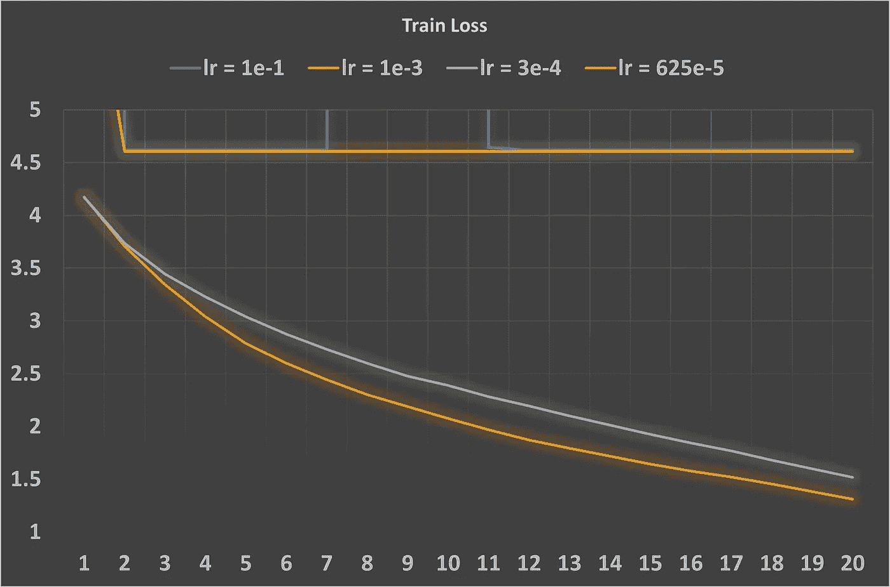
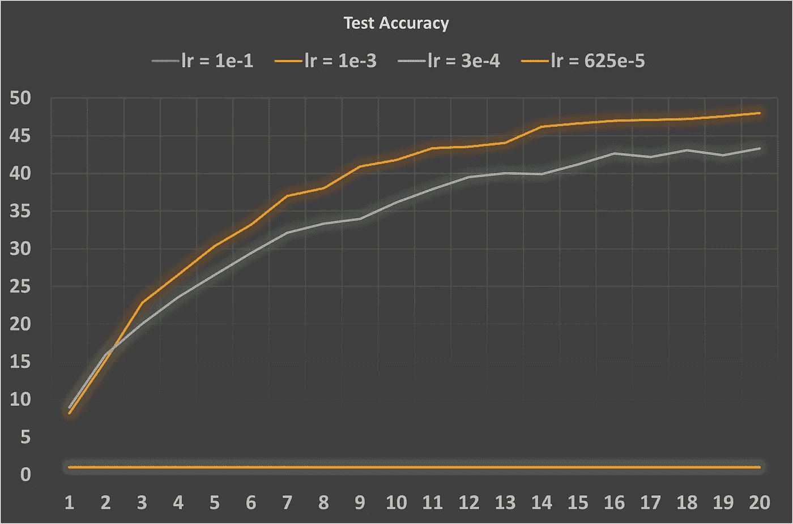

# 为 DNNs 选择学习率

> 原文：<https://pub.towardsai.net/choosing-a-learning-rate-for-dnns-35c201b1b49b?source=collection_archive---------4----------------------->


在申请一家基于人工智能的公司的过程中，我得到了一个带回家的评估，其中包括一项机器学习任务。其中一个挑战是提高定制深度卷积神经网络(DCNN)在小型直接数据集(MNIST)上的性能。DCNN 在测试集上表现不佳。在检查代码时，我没有发现设置的任何问题。事实上，所使用的超参数与在线教程中常见的参数一致(即学习率[lr]为 1e-3)。在我学习人工智能的早期，我在 Coursera 上参加了一个名为斯坦福机器学习课程的在线课程，该课程由吴恩达教授。在一次讲座中，Ng 解释说，较大的学习速率会导致不稳定的学习，并使模型更难收敛。

回到我的故事，我没有意识到我从讲座中学到的规则还有其他因素要考虑。认为学习率太高，应该降低，就把 1e-3 改成了 3e-4。不幸的是，这并没有改善测试集上的糟糕性能，尽管它确实改善了训练集上的性能。这非常令人沮丧！然后，我将学习率提高到 1e-1(一个相对较大的值)，并惊讶地发现测试性能得到了提高。然而，大学习率的有效性可能取决于数据集的复杂性。例如，它可能适用于像我正在处理的简单数据集，但不适用于更复杂的数据集。此外，有可能一个看起来太大而无效的学习率实际上可能是特定任务的最佳值。

你如何为你的任务选择最佳的学习速度？让我们进行一个快速的实际实验，观察不同学习速率的效果，使用 Adam 优化器在复杂的 CIFAR-100 数据集上训练一个定制的 7 层卷积神经网络。下面是用 Pytorch 搭建的架构。

```
class CNN(nn.Module):
    def __init__(self, img_channels=3, num_classes=100):
        super(CNN, self).__init__()
        self.conv1 = nn.Conv2d(in_channels=img_channels, out_channels=16, kernel_size=3, stride=2, padding=1)
        self.pool = nn.MaxPool2d(kernel_size=2)
        self.act = nn.ReLU()
        self.conv2 = nn.Conv2d(in_channels=16, out_channels=64, kernel_size=3, padding=1)
        self.conv3 = nn.Conv2d(in_channels=64, out_channels=128, kernel_size=3, padding=1)
        self.conv4 = nn.Conv2d(in_channels=128, out_channels=256, kernel_size=3, padding=1)
        self.conv5 = nn.Conv2d(in_channels=256, out_channels=512, kernel_size=3, padding=1)
        self.conv6 = nn.Conv2d(in_channels=512, out_channels=512, kernel_size=3, padding=1)
        self.conv7 = nn.Conv2d(in_channels=512, out_channels=256, kernel_size=3, padding=1)
        self.fc  = nn.Linear(in_features=1024, out_features= num_classes)
        self.ln = nn.Flatten()

    def forward(self, x):
        x = self.act(self.conv1(x))
        x = self.pool(self.act(self.conv2(x)))
        x = self.act(self.conv3(x))
        x = self.pool(self.act(self.conv4(x)))
        x = self.act(self.conv5(x))
        x = self.pool(self.act(self.conv6(x)))
        x = self.ln(self.act(self.conv7(x)))
        x = self.fc(x)
        return x
```

下面的图显示了四种不同学习速率的训练损失和测试精度:1e-1、1e-3、3e-4 和 625e-5。



在这个例子中，我们可以看到，当学习率太高(1e-1)或太低(625e-5)时，CNN 模型的测试性能受到影响。虽然使用 1e-3 和 3e-4 的学习率会导致训练期间的逐渐下降，但该模型在其他学习率下是不稳定的。同样值得注意的是，在 CIFAR-100 数据集上，3e-4 学习率似乎比 1e-3 收敛得更慢。要使用不同的学习率值并观察结果，请在 kaggle 上编辑此[代码](https://www.kaggle.com/toluwaniaremu/impact-of-lr)。

选择最佳的学习速度可能是一项具有挑战性的任务。这篇文章旨在解决和阐明这个问题。让我们从一个标准定义开始。

## **DNN 的学习率是多少？**


学习率是一个超参数，它控制模型在训练期间更新其权重的步长。它决定了模型学习的快慢，是模型整体性能的一个重要因素。

此外，学习率决定了响应于从损失函数接收的误差，模型的权重被调整多少。如果学习率太小，模型需要很长时间才能收敛到好的解，但会更稳定。另一方面，如果学习率过大，模型可能永远不会收敛，甚至可能发散，从而导致性能不佳。在这两个极端之间找到一个好的平衡很重要。

## **可能影响学习速度的外部因素**

有几个因素会影响学习率，包括数据集的复杂性、所用模型的类型、可用于训练的数据量以及所采用的优化算法。例如，复杂的数据集可能需要较大的学习率来取得足够的进展，而较简单的数据集可能需要较小的学习率来防止过度拟合。使用的模型类型也会影响学习速度。一些模型，如神经网络，可能需要更大的学习速率来有效地学习，而其他模型，如线性回归，可能对学习速率更敏感。

可用于训练的数据量也会影响学习速度。如果模型有大量的数据要处理，它可能能够在不过度拟合的情况下提供更大的学习速率。另一方面，如果模型具有少量数据，则可能更容易过度拟合，在这种情况下，可能需要较小的学习速率。使用的优化算法也会影响学习速度。有些算法，如梯度下降，对学习速率很敏感，可能需要仔细调整以找到最佳值。其他的，比如随机梯度下降，对学习速率不太敏感，可以使用更大的值而没有问题。

## 用于最佳学习率选择的技术


通常需要试验不同的学习率，并仔细监控模型的性能，以找到最佳值。然而，手动迭代这些值是费时的，最好利用更自动化的技术。为机器学习模型选择最佳学习速率有几种策略。一些常见的方法包括:

1.  **网格搜索**:这包括定义一系列可能的学习率，用每个值训练模型，在每个值的验证集上评估模型的性能。导致最佳性能的学习率被选为最佳值。网格搜索是一种简单而可靠的方法，但它的计算开销很大，因为它需要多次训练模型。
2.  **随机搜索**:这涉及到从定义的范围内随机抽样学习率，用每个值训练模型，在每个值的验证集上评估模型的性能。导致最佳性能的学习率被选为最佳值。随机搜索通常比网格搜索更快，因为它需要较少的模型训练运行。一个缺点是，它可能不太可靠，因为它依赖于随机抽样，可能无法彻底探索学习率的范围。
3.  **自适应学习率方法**:这些方法根据损失函数的梯度调整训练时的学习率。例如 Adam 和 RMSProp。这些方法通常可以找到好的学习率值，而不需要显式调整。有了这个优于其他优化器的优势，以一个糟糕的学习率开始可能会导致他们永远不会收敛。它们可能不总是找到绝对最优值，并且它们可能比其他方法需要更多的计算资源。
4.  **学习率调度器**:选择最佳学习率的一种策略是使用学习率调度，它以高学习率开始，并随着时间的推移逐渐降低。这允许模型在训练开始时取得快速进展，同时随着训练的继续仍然微调其权重。我个人认为这种方法是有效的。我在实验中使用过 PyTorch 中有几种学习率调度器。虽然学习率计划在模型的性能在一定数量的训练时期后处于平稳状态或开始下降的情况下可能是有用的，但它们可能需要仔细调整以找到最佳计划，并且可能不总是产生最佳的可能结果。

如上所述，最佳学习率可取决于数据集的复杂性、所用模型的类型、可用于训练的数据量以及所采用的优化算法。因此，可能有必要试验不同的学习率，并仔细监控模型的性能，以找到最佳值。使用上面列出的技术将有助于最佳学习率的选择，并使训练更容易。

如果你喜欢读这篇文章，请给它一个赞并关注它。如有疑问，请使用评论部分。如果你想聊天，可以通过 LinkedIn 或 T2 Twitter 联系我。