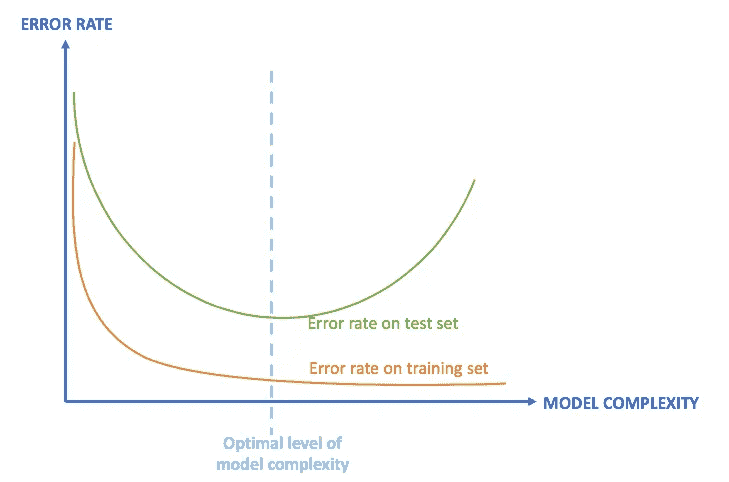
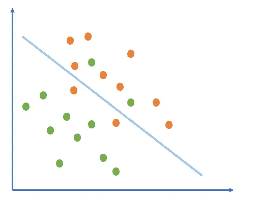
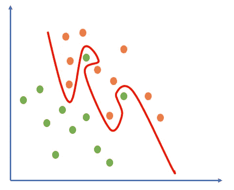
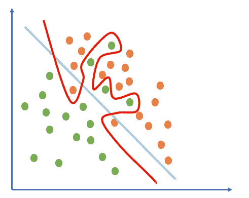

# 人工智能和机器学习中的 7 个重要概念

> 原文：<https://pub.towardsai.net/clarification-of-concepts-and-definitions-in-artificial-intelligence-and-machine-learning-b1a547e8cafe?source=collection_archive---------1----------------------->

## 在开始任何项目之前你应该知道的概念

照片由 [Unsplash](https://unsplash.com?utm_source=medium&utm_medium=referral) 上的 [Clément Hélardot](https://unsplash.com/@clemhlrdt?utm_source=medium&utm_medium=referral) 拍摄

人工智能(AI)和机器学习(ML)应用程序正被广泛应用于商业和工业的各个领域。

***但是 AI 和 ML 到底是什么？***

人工智能和机器学习是通常与计算机科学研究相关的术语。人工智能是对动物和机器智能行为的科学研究。相比之下，机器学习是自动化学习的科学。从本质上讲，机器学习就是让计算机能够学习。

机器学习是一组算法的总称，这些算法允许计算机从先前记录的数据中学习，以 ***监督*** 或 ***非监督*** 的方式做出后续预测和决策。

***无监督方法:***

使用这种方法，我们没有结果变量或标签变量。这样，算法在所有数据和所有变量中搜索模式。一些常用的方法包括聚类和关联。当研究人员不太了解数据，并希望在观察结果中找到模式或关联时，无监督方法特别有用。

***监督方法:***

在监督方法中，我们有一个目标变量。这意味着该算法输入了包含几个特征和一个结果变量的例子。结果变量可以是二元的或多因素的。

***数据科学/大数据中的统计意义***

→在数据科学和大数据领域，我们通常拥有大量数据，而不仅仅是重要样本。有时我们甚至与全体人口一起工作。由于这些原因，当应用统计方法时，我们几乎总是能达到统计显著性。但是，我们应该记住，统计意义并不总是意味着实际意义。

→在传统的统计分析中，研究人员通常会制定一个他们想要检验的先验假设。在机器学习中，我们通常没有先验的假设，我们可以自由地在数据中寻找有意义的模式。

***训练集和测试集***

训练数据应该包含所有信息，包括目标变量，而测试数据应该省略目标变量。ML 算法使用训练集来构建模型。但是，模型可能会有偏差，因此测试集用于评估新的未知数据样本中的模型准确性。

在 ML 训练期间，训练集数据用于建立模型，然后将预测值与训练数据中的真实值进行比较。如果预测值与实际值不一致，该算法会进行必要的调整以提高性能，直到训练数据的性能达到最大值。

为了减少由于训练数据和测试数据之间的差异而产生的偏差，我们必须确保两个子样本中的目标变量具有相同的代表性。分析软件可以为我们完成这项任务，但如果我们有两个数据集，我们应该测试均值、比例和同质性的显著差异。

***过拟合问题***

当模型在训练集中比在测试集中具有更好的准确性时，就定义了过度拟合。这是因为，在模型建立期间，算法试图考虑训练集中结构的每个方面。

下图显示了 ML 模型在训练过程中的行为:

***建立尽可能简单的模型的重要性***

在机器学习中，更复杂的模型通常比简单的模型精度更高。在上图中，我们可以看到，如果我们移动到蓝色虚线的左侧，我们降低了模型的复杂性，但我们也增加了错误率。

*那么，为什么找到复杂度较低的最佳模型如此重要呢？
我们来看一个例子。*

这是一个低复杂度的模型，错误率很高。我们可以看到四个点没有很好的分类。

这是一个高复杂度的模型，错误率很低。如我们所见，没有点被错误分类。

***但是如果我们给模型增加更多的数据会怎么样呢？***

当添加更多数据时，低复杂度模型仅需要进行小的调整来适应新数据。高复杂性模型将需要更多的修订，以便在保持相同准确性的同时对所有新数据点进行分类。

***基线绩效***

最好的方法是通过实地知识或其他以前的模型进行比较。例如，在医学领域，医生能够准确地对 95%的实验室结果进行分类。为了有用，期望 ML 模型表现得同样好或者更好。

另一个例子是，如果我们有一个检测到 90%欺诈交易的模型，如果我们正在构建一个新模型，新模型应该性能更好，或者至少具有相同的性能，但复杂性更低。一个好的实践是报告基线性能，然后将新的模型性能与以前的模型或现场知识的预期进行比较。

感谢您的阅读。

如果:你喜欢这篇文章，别忘了关注我，这样你就能收到关于新出版物的所有更新。

**其他如果:**你想了解更多，你可以通过[我的推荐链接](https://cdanielaam.medium.com/membership)订阅媒体会员。它不会花你更多的钱，但会支付我一杯咖啡。

**其他:**谢谢！