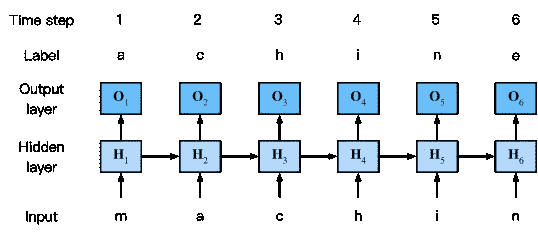
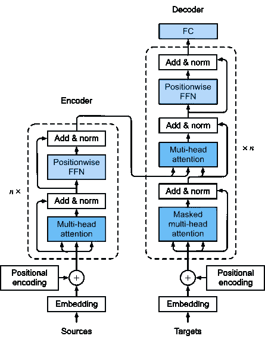
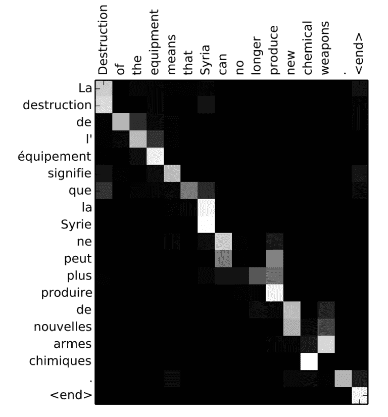
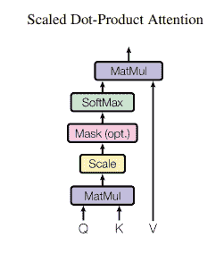
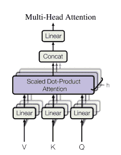
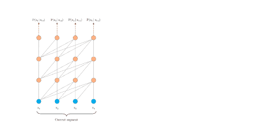
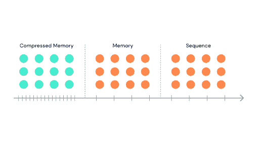

# 变压器综合指南

> 原文：<https://pub.towardsai.net/comprehensive-guide-to-transformers-6c73a9e6e2df?source=collection_archive---------1----------------------->

## [自然语言处理](https://towardsai.net/p/category/nlp)

## 关注是你所需要的，甚至更多

你有一张写有文字的纸，你想建立一个模型，可以把这些文字翻译成另一种语言。你如何处理这个问题？

第一个问题是文本的可变大小。没有线性代数模型可以处理不同维数的向量。

由[埃琳娜·塔拉年科](https://unsplash.com/@elenatrn?utm_source=unsplash&utm_medium=referral&utm_content=creditCopyText)在 [Unsplash](https://unsplash.com/?utm_source=unsplash&utm_medium=referral&utm_content=creditCopyText) 上拍摄的照片

处理这类问题的默认方式是使用单词袋模型( [1](https://en.wikipedia.org/wiki/Bag-of-words_model) )。在这个模型中，数据将是一个巨大数量的向量，与一种语言的字数一样大，并且大多数向量元素将是零，因为大多数术语在本文中没有使用。为了最小化计算向量的大小，我们只存储呈现单词的位置。

然而，单词袋模型忽略了单词的顺序，而这是至关重要的。例如:“**为生活而工作**”不同于“**为工作而生活**”为了保持数据的顺序，我们将增加图的维度( **n-gram** )以将顺序添加到我们的等式中。

在 n-gram 模型中，一个单词的概率取决于( **n-1** )条之前的评论，这意味着模型不会与早于( **n-1** )条的单词进行关联。为了克服这一点，我们将不得不增加 n，这将成倍地增加计算复杂度( [2](http://d2l.ai/chapter_recurrent-neural-networks/rnn.html) )。

所以，这是我们目前的问题:

1.  文本的可变长度。
2.  应用词袋模型后的海量数据。
3.  当我们增加维度时，计算成本增加。

似乎我们需要一个新的模型，它不依赖于单词袋。这就是 RNN 模式发挥作用的地方。

# 递归神经网络(RNN)

RNN 与 n-gram 模型相同，只是当前输入的输出将取决于之前所有计算的输出。RNN 有其内部状态，作为一种记忆。它非常适合自然语言处理和语音识别。

*人物级语言模型基于 RNN [* [*来源*](https://d2l.ai/chapter_recurrent-neural-networks/rnn.html)

*该图显示了在某个时间(t+6)的输入取决于每个先前步骤的隐藏状态和当前输入。它允许网络保存以前学习的参数的历史，并使用它来预测下面的输出，这克服了单词顺序的问题，并消除了计算成本，因为我们将在我们的模型中单独传递单词。*

*这个模型看起来很完美，但是在实践中，它有一些问题:*

1.  *消失或爆炸梯度问题。*
2.  *我们不能并行计算，因为输出取决于之前的计算。*

*好吧，RNN 模型并不完美。因此，它被进一步修改以克服这些缺陷。*

*了解更多:[递归神经网络指南——深入 RNN](https://neptune.ai/blog/recurrent-neural-network-guide)*

# *长短期记忆(LSTM)*

*这种特殊的 RNN 增加了一种遗忘机制，因为 LSTM 单位被分成细胞。每个单元格有三个输入:*

*   *电流输入，*
*   *隐藏状态，*
*   *上一步的记忆状态( [6](http://d2l.ai/chapter_recurrent-modern/lstm.html#gated-memory-cell) )。*

*这些输入通过门:*

*   *输入门，*
*   *忘了盖特吧，*
*   *输出门。*

*门调节进出细胞的数据。*

*遗忘门决定何时记忆，何时跳过先前隐藏状态的输入。这种设计主要是为了克服消失和爆炸梯度的问题。*

**

**计算 LSTM 的隐藏状态* [*来源*](https://d2l.ai/chapter_recurrent-modern/lstm.html)*

**LSTM 能够克服 RNN 模型中的消失和爆炸梯度，但是仍然存在从 RNN 模型继承的问题，例如:**

1.  **没有并行化，我们仍然有数据的顺序路径，甚至比以前更复杂。**
2.  **硬件资源还是个问题。**

**这些解决方案不足以克服内存和并行性问题。所以，是时候引入另一种模式了。**

****

**LSTM 模块[ [来源](http://colah.github.io/posts/2015-08-Understanding-LSTMs/)**

# **变形金刚(电影名)**

**在前面的章节中，我们介绍了我们面临的问题，以及一些解决部分问题的建议方案。但是仍然有研究的空间。**

**我们提到了序列到序列翻译的变长问题，这个问题还没有解决。**

**为了解决这个问题，2017 年推出了一种依赖于注意力机制的模型。我们不是单独处理标记，而是将文本分成段，并学习它们之间的依赖关系。**

**这个模型是基于另一个架构设计的，由两个主要组件组成。**

**输入首先通过编码器。**

**该编码器将接受可变长度的输入，并将其转换为固定长度的隐藏状态。**

**然后，隐藏状态将通过第二个组件，这是一个解码器，将固定长度的状态转换为可变长度的输出。**

**这种架构被称为 ***编解码架构*** ( [4](http://d2l.ai/chapter_recurrent-modern/encoder-decoder.html#sec-encoder-decoder) )。**

****

***编解码器架构* [*来源*](https://d2l.ai/chapter_recurrent-modern/encoder-decoder.html)**

******

****顺序到顺序学习* [*来源*](https://d2l.ai/chapter_recurrent-modern/seq2seq.html)***

***在 Transformers 中，输入标记被转换为向量，然后我们添加一些位置信息(位置编码),以便在模型的并发处理过程中考虑标记的顺序。***

***变形金刚修改了这个模型，使其能够抵抗我们之前讨论的问题，对编码器和解码器都使用了堆叠自关注和完全连接的层。***

***另请阅读:[关于 BERT 和正在重塑人工智能格局的 Transformer 架构，你需要知道的 10 件事](https://neptune.ai/blog/bert-and-the-transformer-architecture-reshaping-the-ai-landscape)***

*****编码器:**由一堆多个相同的层组成，每层包含两个子层，多头自关注机制后跟残差连接，简单的全连接前馈网络。***

*****解码器:**由一堆多层组成，每层三个子层；前两层与编码器层相同，第三层是对编码器堆栈输出的多头关注。***

******

****变压器架构* [*来源*](https://d2l.ai/chapter_attention-mechanisms/transformer.html)***

# ***注意机制***

***这个模型的灵感来自于人类的视觉系统( [7](https://arxiv.org/pdf/1706.03762.pdf) )。当大脑从眼睛接收大量信息输入，超过大脑一次处理的能力时，眼睛感觉系统中的注意力线索使人类能够关注眼睛接收的一小部分。***

***我们可以将这种方法应用于手头的问题。如果我们知道了能够影响我们翻译的部分，我们就可以专注于那些部分，忽略其他无用的信息。***

***这将影响系统的性能。当你在读这篇文章的时候，你在关注这篇文章，而忽略了这个世界的其他部分。这伴随着一种可以被称为机会成本的成本。***

***我们可以从不同类型的注意力机制中进行选择，比如注意力集中和全连接层。***

***在注意力集中中，对注意力系统的输入可以分为三种类型:***

*   *****键**(非暴力提示)，***
*   *****查询**(意志提示)，***
*   *****值**(感官输入)。***

***我们可以将关键字和查询之间的注意力权重可视化。值和密钥是编码器的隐藏状态，查询是前一个解码器的输出。***

******

****可视化注意力权重矩阵(* [*来源*](http://www.wildml.com/2016/01/attention-and-memory-in-deep-learning-and-nlp/) *)****

## **标度点积注意力**

**缩放的点积是评分函数的更有效的计算设计。**

**我们用相同的向量长度(d)计算输入查询(Q)和键(K)的点积。然后，我们对它们进行缩放，以确保方差保持不同的向量长度，然后应用 softmax 函数来获得值(V)的权重。**

************

***成比例的点积注意力&多头注意力* [*来源*](https://arxiv.org/pdf/1706.03762.pdf)**

## ***多头注意力***

***我们并行执行单点乘积注意 **h** 时间。***

******

***w 是键、查询和值的权重，O 是输出线性变换。***

***多头注意力在我们的模型中用于:***

*   ***解码器层；Queries 是前一个解码器层的输出，Keys 是编码器的输出。***
*   ***编码器自我关注层；关键字、查询和值来自编码器的前一层。***

## ***自我关注***

***一种特殊的注意机制，其中的查询、键和值都来自同一个源。当序列长度(n)小于表征维度(d)时，自我注意(内部注意)比循环层更快。***

***自我注意被用来学习一个句子中不同单词的相关性，来计算同一个句子的表示。***

# ***位置式前馈网络***

***编码器和解码器的每一层都包含完全连接的前馈网络，该网络利用两个线性变换和一个 ReLU 激活函数的相同前馈网络来变换每个位置中的表示。***

******

# ***嵌入和 softmax***

***将输入和输出记号转换成模型维度的向量，并将解码器的输出转换成预测概率。***

***另请查看:[训练、可视化和理解单词嵌入:深入定制数据集](https://neptune.ai/blog/word-embeddings-deep-dive-into-custom-datasets)***

# ***位置编码***

***由于该模型没有递归和卷积，因此添加了一个层来利用序列顺序。在编码器和解码器堆栈的末尾，注入的信息包含关于令牌在该序列中的相对或绝对位置的信息。***

# ***普通变压器概述***

***Vanilla Transformer 是克服 RNN 模型缺点的一个很好的模型，但是它仍然有两个问题:***

*   *****有限的上下文依赖:**对于字符级语言建模，该模型被发现优于 LSTM。然而，由于模型被设计为在几百个字符的独立固定长度段上进行训练，并且没有在段之间进行关联的信息，这引入了一个问题，即没有保存超过配置的上下文长度的长期依赖信息。有限的上下文相关性也使得该模式不能与几个片段之前出现的任何单词相关联。***
*   *****上下文碎片:**在每个片段的前几个符号中，没有存储上下文信息，因为模型是为每个片段从头开始训练的，这导致了性能问题。***

***因此，我们仍然需要另一种增强来解决这些问题并克服这些缺点。***

******

****香草变压器带 4 段* [*来源*](https://ai.googleblog.com/2019/01/transformer-xl-unleashing-potential-of.html)***

# ****变压器-XL****

****transformer XL 是 transformer 的更新版本(超长)。它是从普通的 Transformer 派生出来的，但是引入了递归机制和相对位置编码。****

****在 Transformer-XL 中，模型将保留以前学习的段的隐藏状态，并将其用于当前段，而不是从头开始计算每个段的隐藏状态。****

****该模型解决了普通变压器模型中引入的问题，并克服了长期依赖性问题。另一个优点是，它还解决了由使用最近初始化的或空的上下文信息引起的上下文碎片问题。因此，新模型现在可以用于字符级语言建模和单词级建模。****

# ****重现机制****

****为了保持段之间的依赖性，Transformer-XL 引入了这种机制。Transformer-XL 将像普通的 Transformer 一样处理第一段，然后在处理下一段时保持隐藏层的输出。****

****递归也可以加快评估速度。我们可以使用先前的分段表示，而不是在评估阶段从头开始计算。****

****因此，每个图层的输入将是以下内容的串联形式:****

*   ****前一层的输出，与 vanilla Transformer 中的相同(下图中的灰色箭头)。****
*   ****先前处理的隐藏层输出(下图中的绿色箭头)作为扩展上下文。****

********

*****分段长度为 4 的 Transformer-XL*[*来源*](https://ai.googleblog.com/2019/01/transformer-xl-unleashing-potential-of.html)****

# ****相对位置编码****

****循环机制似乎可以解决我们所有的问题。然而，递归机制引入了另一个问题:存储在隐藏状态中的位置信息从前面的段中重复使用。****

****正如在普通的 transformer 中一样，位置编码步骤提供的位置信息可以使我们从不同的片段中获得一些具有相同位置编码的标记，尽管它们的位置和重要性不同。****

****该模型中添加的基本概念只是对隐藏状态中的相对位置信息进行编码，足以知道每个键与其查询之间的位置偏移，并且足以进行预测。****

# ****变压器 XL 摘要****

****Transformer-XL 将递归和注意力机制相结合，将受上下文碎片和有限上下文依赖影响的 vanilla transformer 模型转换为词级语言模型，并通过添加递归机制和相对位置编码来提高其评估速度。****

****这导致长期依赖性增强。根据 Transformer-XL 的原始论文，它可以学习比 RNNs 长 80%的依赖性，比 vanilla transformers 长 450%，并在长序列和短序列上实现比 vanilla transformer 快 1800+倍的更好性能。****

****该模型在 TensorFlow 和 PyTorch 中实现，并可通过[开源](https://github.com/kimiyoung/transformer-xl/)获得。****

# ****压缩变压器****

****保持所有这些隐藏状态的一个缺点是，它增加了参与每个时间步的计算成本，以及保持所有这些信息的存储成本。****

****已经创建了几种方法来减少注意力的计算成本，例如稀疏访问机制，但是这并没有解决存储成本。****

****压缩变压器是变压器的简单扩展，灵感来自睡眠的概念。众所周知，睡眠会压缩记忆，从而提高推理能力。****

****压缩变换器利用注意力从过去中选择信息，然后将其压缩到压缩记忆中。这种压缩是通过用损失函数训练的神经网络来完成的，以保持相关信息。****

********

*****抗压变压器[* [*来源*](https://deepmind.com/blog/article/A_new_model_and_dataset_for_long-range_memory)****

# ****压缩功能****

****建立在变压器 XL 之上。XL 为每个层保留过去的激活，只有当它们过时时才丢弃它们。实现压缩模型是为了压缩旧的内存，而不是丢弃它们。****

****该模型使用多种压缩函数:****

****合用被认为是最快和最简单的。最常用的压缩函数受差分神经计算机中垃圾收集机制的启发，数据按其平均使用量存储。卷积压缩函数需要训练一些权重。****

# ****压缩变压器总结****

****压缩变换有助于长程建模。如果这不适用于您的项目，那么压缩变换不会增加任何好处。****

****从下面的比较中可以看出，结果非常接近 transformer-XL，但是在优化内存使用方面有很大的好处。****

********

*****对比结果来自原论文* [*来源*](https://deepmind.com/blog/article/A_new_model_and_dataset_for_long-range_memory)****

# ****相关著作****

## ****改革家****

****用对位置敏感的散列法代替点积注意力，这种散列法将模型的复杂度从 O(L2)变为 O(L log L ),并使用残差层的可逆版本而不是使用标准残差层。这些变化降低了计算成本，并使模型在更快的同时与变压器模型的状态竞争。****

# ****结论****

****仅此而已。我们探索了三种类型的变形金刚模型，希望现在能弄清楚它们为什么会复活。****

****受人类视觉和记忆的启发，这些模型让我们更接近真正像人脑一样工作的模型。我们离它还很远，但是变形金刚是朝着正确方向迈出的一大步。****

****感谢阅读！****

****查看我的最新文章:****

**** [## ML 模型的版本控制:为什么需要它，它是什么，如何实现它— neptune.ai

### 版本控制在任何软件开发环境中都很重要，在机器学习中更是如此。在 ML 中…

medium.com](https://medium.com/coderbyte/version-control-for-ml-models-why-you-need-it-what-it-is-how-to-implement-it-neptune-ai-497ff85b2b1a) 

# 关于变形金刚的其他资源

*   [深入研究深度学习参考书](https://d2l.ai/index.html) —一本在线书籍，包含了对大多数深度学习算法的解释，并附有良好的代码样本。
*   [注意力是你所需要的全部](https://arxiv.org/abs/1706.03762)——最初介绍变形金刚的原文。
*   [变形金刚——你只需要关注](https://mchromiak.github.io/articles/2017/Sep/12/Transformer-Attention-is-all-you-need/#.YIDgVpAzbIX)——一篇文章用大量细节和代码示例展示了变形金刚。
*   [图示变压器](http://jalammar.github.io/illustrated-transformer/)
*   [压缩变压器与 LSTM](https://medium.com/ml2b/introduction-to-compressive-transform-53acb767361e)
*   [可视化神经机器翻译模型](https://jalammar.github.io/visualizing-neural-machine-translation-mechanics-of-seq2seq-models-with-attention/)
*   [改革者:高效的变压器](https://arxiv.org/pdf/2001.04451.pdf)
*   [图像转换器](https://arxiv.org/pdf/1802.05751.pdf)
*   [Transformer-XL:专注语言模型](https://arxiv.org/pdf/1901.02860.pdf)
*   [用于长程序列建模的压缩变压器](https://arxiv.org/abs/1911.05507)
*   [Transformer-XL 由](https://towardsdatascience.com/transformer-xl-explained-combining-transformers-and-rnns-into-a-state-of-the-art-language-model-c0cfe9e5a924) [Rani Horev](https://medium.com/u/53f9e9fdd8d8?source=post_page-----6c73a9e6e2df--------------------------------) 解释

*原载于 2021 年 5 月 7 日*[*https://Neptune . ai*](https://neptune.ai/blog/comprehensive-guide-to-transformers)*。***** **** [## 加入我的介绍链接媒体-艾哈迈德哈希什

### 作为一个媒体会员，你的会员费的一部分会给你阅读的作家，你可以完全接触到每一个故事…

medium.com](https://medium.com/@ahmhashesh/membership)****