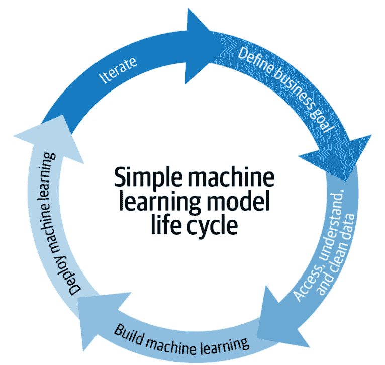
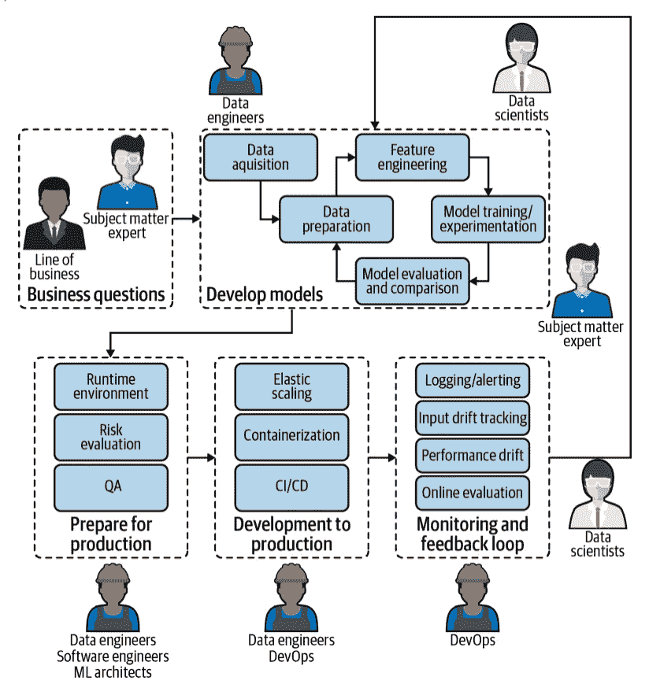

# MLOps 的可视化介绍:第 1 部分

> 原文：<https://pub.towardsai.net/comprehensive-introduction-to-mlops-part-1-6919cbeb1d0f?source=collection_archive---------2----------------------->

由 Unsplash 的[最大焦点](https://unsplash.com/@maximalfocus)

一开始，让我们来定义 MLOps:

M **LOps 是一个生命周期实施框架，将高级分析部署的执行与基于方法的变更管理联系起来。**

将高级分析视为人工智能领域，如深度学习、机器学习和自然语言处理。

它不再是可选的，也不是一个很好的管理变量，人们可以在他们的组织内部非正式地展示:机器学习作为一种实现能力已经达到了复杂的水平，以至于它不能通过临时或非正式的习惯来管理。随着深度学习、机器学习和自然语言处理(NLP)领域的巨大研究进步，特别是在过去几年中，高级分析已经发展到许多人甚至无法远程尝试理解它是什么，它会变成什么。

2019 年，VentureBeat 显示，87%的机器学习项目从未投入生产。Gartner 通过一项相关预测揭示了这一比率背后的前提，即在 2022 年，只有 20%的分析见解能够带来业务成果。普华永道在 2021 年证实了这一预测，即只有 25%的组织看到广泛采用机器学习。

机器学习操作(MLOps)不是一个过时的领域，没有大量的行业知识或实验验证来展示最佳实践。事实上，它甚至一直在经历命名惯例的转换，以确定(从 2018 年一直到 2019 年)这一新学科将如何通过标识符正式构建:它将被称为“MLOps”；或“ModelOps”；还是" AIOps "？

理论上，并且在其核心，一种看待机器学习生命周期的方式可以这样呈现(图 2):

图二[2]

在工具和组织设计之前优先考虑用例的原则(通过策略、人力资源和变更管理，等等)转移到这个技术生命周期实现。无论工具或资源的价值如何，高级分析领域的执行都是一个非常小的创新。

MLOps 的当前命名约定与 DevOps 有相似之处。相似之处包括:

> *—自动化；
> —信任；
> —集成协作；以及
> ——“持续交付高质量”【3】。*

MLOps 和 DevOps 之间的差异包括，我认为这是最好的解释之一:

> “将软件代码部署到生产中与将机器学习模型部署到生产中有着根本的不同。虽然软件代码是相对静态的(“相对”是因为许多现代软件即服务[SaaS]公司确实有 DevOps 团队，他们可以非常快速地迭代，每天多次部署到生产中)，但数据总是在变化，这意味着机器学习模型不断学习和适应——或者不适应，视情况而定——新的输入。这种环境的复杂性，包括机器学习模型由代码和数据组成的事实，使得 MLOps 成为一个新的独特的学科" *[4]。*

关于风险管理，一些审计功能作为内置的持续监控功能可以包括:

> *—模型精度；
> —输出伦理；
> —为模型训练集成的功能；
> —高效的代码开发(例如，通过 Python 使用“lambda”进行编码所增加的重量，这样它可以在一行代码中实现一个循环可能需要几十行代码才能实现的更多)；和
> —技能管理:GPT-2 部署所需的技能，即如何调整其 1.5B 管道模型以通过 NLP 进行情感分析，可能不会完全转移到基于 TextBlob 和 Vader 的 NLP 管道建模。*

风险评估的一个重要方面不在于何时进行，而在于识别您在测试和预生产中使用了哪些数据来训练模型。认识到在生产过程中接收到的、输入到训练模型中的数据可能不是(并且在许多情况下不可能是)与用于建立模型的训练数据相似或相似的数据类型。在许多情况下，评估准确性也是非常主观的，很难量化。认识到预测仅与用于训练模型的数据一样好(在相关的情况下)是风险评估中的一个关键区别。

为了对管理层如何为 MLOps 建立基础的复杂性有所了解，可以这样来呈现(图 3)。

图 3 [5]。

**数据工程师:**

> *—建立数据管道；
> —在如何检索和整合数据以支持机器学习模型方面实现优化【6】；和
> —发现、解决和优化生产挑战。
> —* ***他们需要:*** *完全访问(1)“性能”和(2)“个人数据管道”[7]与数据科学家建立紧密的合作伙伴关系。*

**数据科学家:**

> *—与最终用户开展问题框架研讨会，以确定需要数据响应的问题；
> —开发和测试模型；
> —开发用于发布结果的分析报告；
> —持续监控模型质量；和
> ——持续地与最终用户集成，围绕用例进行迭代。
> —* ***他们需要:*** *直接接触最终用户，并深入了解以人为中心的设计和设计思维原则，以告知所使用的方法(1)问题框架和(2)与最终用户的持续合作关系。*

**软件工程师:**

> — *将代码包装到软件中，用于各种端到端输入/输出用途；
> —将模型集成到软件的各种组件中以供执行；以及
> —将相关的机器学习“代码、培训、测试和部署应用到持续集成/持续交付(CI/CD)管道中”[8]。
> —* ***他们需要:*** *亲密接触数据科学家获得的关于模型开发的全部知识(它们是什么，它们如何工作，它们为什么工作以及它们如何工作)以及与这些模型相关的分析。*

**DevOps:**

> *—引线 CI/CD 管道；
> —用组织开发运维策略简化内部开发运维策略；和
> ——“进行和构建操作系统和测试，以确保机器学习模型的安全性、性能和可用性”[9]。
> —* ***他们需要:*** *信息和访问:与数据科学家就投资回报和价值主张进行积极而非激烈的合作，并就影响和实现的成果权威地领导管理信息。*

**机器学习架构师:**

> *—告知并设计内部架构，使其适合企业架构；
> —不断发现如何通过架构或工具实现更好性能的效率；
> —* ***他们需要:*** *访问整个团队进行信息共享和监控；全面了解整个生命周期的要素。*

**模型风险经理/审计师(**模型风险管理“或 MRM) [10]:

> *—监控并通报监管影响；
> —制定政策；
> —分析以最小化或解决风险；
> —在问题框架期间以及在与最终用户的持续协作过程中，与数据科学家进行整合。
> —* ***他们需要:*** *实时了解最终用户和内部团队关于缺陷和效率的信息，以及他们的进度状态(什么已经完成，什么已经计划，什么正在进行)。*

在接下来的文章中，我们将讨论如何实现 MLOps。

参考文献[1–10]:tre veil，m .，Omont，n .，Stenac，c .，Lefevre，k .，Phan，d .，Zentici，j .，Lavoillotte，a .，Miyazaki，m .，& Heidmann，L. (2020)。*介绍 MLOps:如何在企业中扩展机器学习*(第 1 版。).奥莱利媒体。