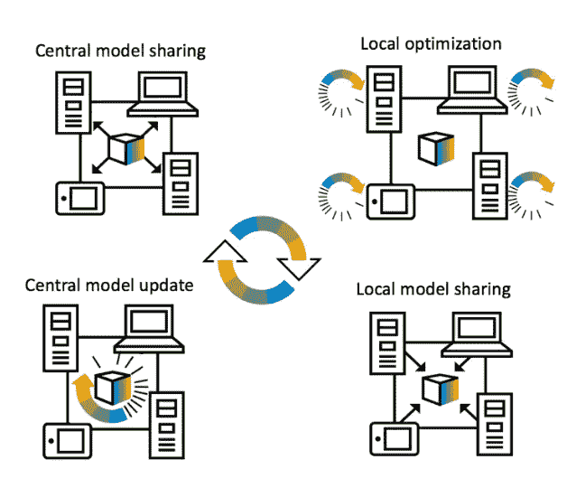
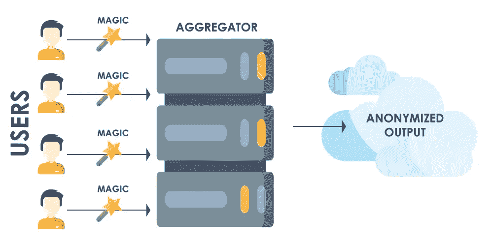
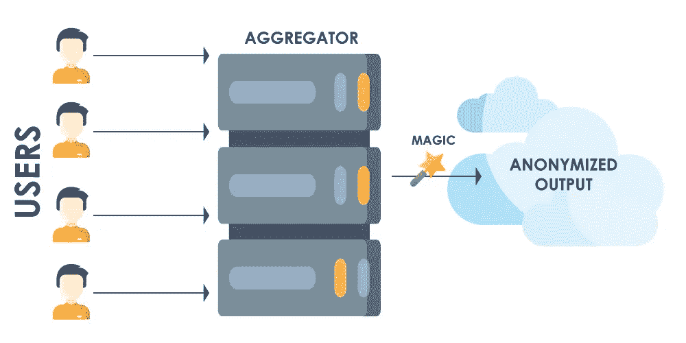

# 调和人工智能与隐私:规则与良好实践

> 原文：<https://pub.towardsai.net/conciliating-ai-privacy-rules-and-good-practices-7859541c4977?source=collection_archive---------3----------------------->

作者图片

## [隐私和安全](https://towardsai.net/p/category/privacy-and-security)

## 如何在不侵犯客户隐私的情况下从数据中获取最大价值

## 1.人工智能和个人数据:一场敏感的辩论

按照严格的计算机科学定义，人工智能(AI)是指由计算机、机器人或其他机器呈现的任何类型的人类智能。普遍使用将这一定义扩展到计算机或机器模仿人类思维能力的能力——从经验和例子中学习，识别物体，理解和回答语言，做出决定——以及这些能力与其他能力的结合，以完成人类可以完成的功能，如问候酒店客户或驾驶汽车。

就其本身而言，私人数据的定义根据每种情况下适用的法律而有所不同，但我们可以将其概括地描述为一条关于个人或实体的信息，可以合理地排除在公众视野之外。**例如，欧盟的通用数据保护条例(GDPR)** 定义[1]:

> “个人数据”是指与已识别或可识别的自然人(“数据主体”)直接或间接相关的任何信息

对人工智能的商业应用或学术研究的概述表明，**随着这些模型和算法继续推进最先进的边界，他们消费任何可用数据的欲望以侵犯隐私利益的方式增长。**

关于 AI 的争论和私人数据的使用往往凸显了这些所谓智能应用的局限性和缺点。隐性偏见、大规模收集和技术的快速发展使隐私法变得非常复杂，而且往往滞后。

本文将讨论**隐私保护新范式的挑战**。然后，我们将重点关注**可用于实现高效人工智能系统的工具**，同时遵守《通用数据保护条例》规定的规则。

> [**下载我们的白皮书《成功的大数据迁移》**](https://datavalue-consulting.com/livre-blanc-migration-vers-le-big-data/)

# 2.人工智能系统中保护个人数据的四大支柱

因此，确保人工智能系统的隐私并监管消费者数据的使用，需要一种范式转变。这一新愿景以更全面的方式处理人工智能背景下的隐私和相关风险，采取旨在规范个人数据处理和识别违规案例的措施。

许多组织、公司和一些立法者提供了不同的变体，但它们都围绕着 4 个支柱:

*   **交代:**

理解数据是如何被用来得出一个特定的决定的，以及哪些特征在结论中扮演了重要的角色，这并不是一件容易的事情。这需要:

1.  识别 AI 所做的决定
2.  对具体决策的分析
3.  建立个人寻求解释的途径

**对机器学习算法进行逆向工程可能很困难，如果不是不可能的话**在深度学习算法的情况下，这种困难甚至会增加。

> 《GDPR》要求，对于任何“对其产生法律效力或对其产生类似重大影响”的自动决定(信贷、保险等)。数据主体可以求助于能够审查决策并解释其逻辑的人[2]。

将人的因素纳入决策循环中，除了会带来巨大的监管负担之外，还会在开发过程中增加一个额外的步骤。

*   **透明度:**

**明确回答“公司如何处理您的数据？”极大地促进了公司的责任感，消除了用户和/或合作伙伴的顾虑。**

“隐私政策”就是一个具体的例子。对于大多数消费者来说，这些传统上冗长且不必要的文档可以由声明代替:

1.  提供了收集、使用和保护数据的性质和方式的完整描述，
2.  它确定了人工智能个人数据的重要用例，以及产品中实施的各种决策算法。

*   **风险评估:**

这是 GDPR 对新技术或高风险数据使用的另一个要求。在这种情况下，它是关于**提前评估和减轻保密风险，**包括人工智能系统和提供给该系统的数据的设计中的潜在偏差，以及对用户的潜在影响。例如，Twitter 在去年九月引起了争议，因为用户证明它的照片裁剪算法带有“种族”偏见[3]。

*   **审计:**

无论是内部(自我审核)还是外部(由第三方组织进行)， [**审核对于监控和符合要求仍然是必要的。**](https://datavalue-consulting.com/pilotage-transformation/consulting-it/) 由于审计本质上是回顾性的，一个好的策略是将审计结果与风险评估结合起来进行人工智能决策，这是前瞻性的。这可以更好地告知该公司在人工智能和隐私方面的立场，尽管——正如可解释性的情况一样——审计机器学习算法很困难，仍在开发中。

# 3.人工智能与隐私:主要技术趋势

在保持 AI 系统性能的同时满足所有之前列出的约束似乎很困难，如果不是不可能的话，但有几种解决方案可供探索，特别是联邦学习和差分隐私。

**联合学习是一种创新的方法**以分散的方式训练机器学习模型。培训过程与内部存储数据的需求之间的分离使公司能够释放更多的能力，同时降低可能的费用和风险。

这种学习方法超越了在用户设备上进行预测的本地模型的使用，走向了作为该架构成员的设备之间的真正协作:

*   首先在所有设备上部署相同的机器学习模型，
*   然后，这些设备用它们的本地数据完成训练阶段，并本地更新模型的权重和超参数，
*   然后，他们使用加密通信将这些更新分别发送到云或中央服务器，
*   然后对这些更新进行汇总和平均，以获得共享模型的平均权重和超参数。

最重要的是，所有训练数据都保留在用户的设备上，没有任何个人更新以可识别的方式存储在云中。

联合学习架构中的沟通[4]

这类应用的一个旗舰例子是为 Android 智能手机开发的“Gboard”功能:当 Gboard 显示一个建议时，你的手机会在本地存储关于当前上下文以及你是否点击了该建议(该建议是否有帮助)的信息。)，联邦学习模型根据这一历史在本地进行训练，数百万台 Android 设备共享它们的结果(新的权重和参数)，以在 Gboard 的 AI 模型的下一次迭代中进行改进。

谷歌键盘服务如何工作[5]

**差分隐私将数据从原始状态转换为一种格式，允许组织从大部分数据中学习**，同时确保结果不会区分或重新识别个人数据。

自 21 世纪初以来，研究表明，87%的美国人口可以通过{出生日期，性别，邮政编码} [6]的组合来唯一识别。2007 年，研究人员对网飞发布的一个匿名数据库进行了逆向工程，揭露了该平台 50 万用户的偏好和观点[7]。

微软、谷歌和苹果等主要公司已经转向差分隐私，以帮助确保敏感数据的机密性。大型科技公司的这种关注有助于将差分隐私推出研究实验室，并将其集成到应用程序设计和产品开发中。

差异保密现在是 SME(中小型企业)和软件初创公司采用的一种技术，因为他们发现它有很大的附加值。

匿名数据集的示例

差分隐私机制本质上向原始数据添加噪声(通常是高斯或拉普拉斯)，以实现可量化的机密性级别。知道了这个水平，我们就可以估计出我们的数据集中可以公开的最大信息量。有两种主要方法:

**本地差分隐私=** 噪声被添加到数据集中的每个单独的数据点(或者由公司的一名雇员在获得数据后添加，或者由个人自己在发布他们的数据之前添加。公司可用)。

局部差分机密性图

**全局差分隐私=** 保护个人隐私所需的噪声被添加到原始数据查询的输出中。

全局差分隐私图

一般来说，与局部差异隐私相比，全局差异隐私可以产生更准确的结果，同时保持相同的隐私级别。另一方面，当使用全局差分隐私时，捐赠数据的人应该相信接收实体会添加必要的噪声来维护他们的隐私。

# 结论

人工智能的性能和尊重数据隐私之间的联盟是一项艰巨的任务，但充满了机遇和希望。显然，任何孤立实施的措施都不能完全有效地防止滥用。因此，在智能算法的决策具有重要意义的情况下，将几个层次的测量结果结合起来使它们协同工作是有意义的。

> **注:本文最初发表于 it 的法文版** [**此处**](https://datavalue-consulting.com/ia-et-vie-privee-regles-bonnes-pratiques/)

## 参考资料:

*   [1][GDPR 第四条第一款](https://gdpr-info.eu/art-4-gdpr/)
*   [2][GDPR 第 71 场独奏会](https://gdpr-info.eu/recitals/no-71/)
*   [3] [Twitter 裁剪算法](https://memeburn.com/2020/09/twitter-investigating-cropping-algorithm-after-users-flag-racial-bias/)
*   【4】[保护隐私的协同机器学习；](https://medium.com/sap-machine-learning-research/privacy-preserving-collaborative-machine-learning-35236870cd43)作者:Robin Geyer、Moin Nabi 和 Tassilo Klein
*   [5] [联邦学习:没有集中训练数据的协同机器学习](https://ai.googleblog.com/2017/04/federated-learning-collaborative.html)，谷歌 AI 博客
*   [6] [政策与法律:去识别数据的可识别性](http://www.latanyasweeney.org/work/identifiability.html)，作者 Latanya Sweeney 博士
*   【7】[如何打破 Netflix 奖项数据集的匿名性](https://arxiv.org/abs/cs/0610105)；作者:阿尔温德·纳拉亚南，维塔利·什马蒂科夫