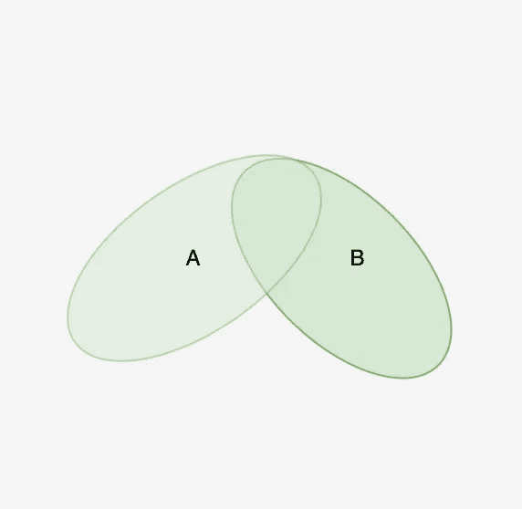
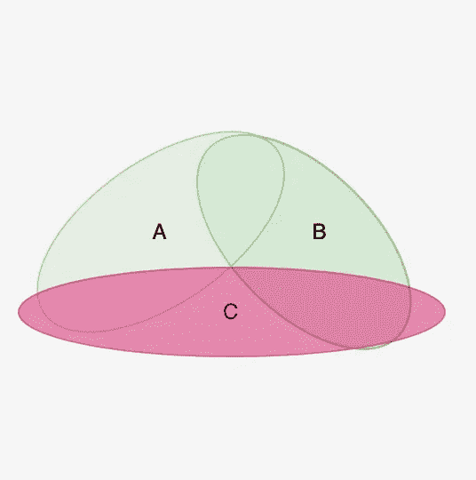

# 条件独立性

> 原文：<https://pub.towardsai.net/conditional-independence-cf5564c88ee0?source=collection_archive---------1----------------------->

## 现实世界中可以实现的独立

谈到概率论，我们都可能听说过联合分布、边际分布、独立性等等。在本文中，我将把注意力集中在独立性上，尤其是有条件的独立性。如果两个事件 A 和 B 满足以下条件，则它们是独立的:

换句话说，如果事件 A 的发生不影响事件 B 发生的概率，这两个事件就被认为是独立的。从信息论的观点来看，可以解释为:如果知道 A 不提供关于 B 的任何附加信息，那么称 A 和 B 是独立的。这些是对独立概念的不同解释。把互斥事件想成独立事件有一个巨大的误区，这是完全错误的。早些时候我也有这种误解，认为如果一个事件已经发生，另一个事件不能发生，那么它们应该是独立的。但这不是真的，就像上面提到的两个事件 A 和 B 是独立的，当 A 发生时不应该提供关于 B 发生的信息，但如果 A 和 B 是互斥事件，即 A 和 B 不能同时发生。所以如果我们知道 A 已经发生了，那么我们肯定 B 不会发生，换句话说，如果我们知道 A 已经发生了，它就有了 B 发生所需的所有信息，这与独立事件的定义完全相反。所以互斥事件永远不可能是独立事件。

在现实世界中，实现(无条件的)独立将是罕见的，因为每个事件都很可能影响其他事件，这些影响大多是通过一个中间事件来引导的。所以，如果中间事件的发生被实现了，那么在其他两个事件之间就不会有其他的影响，这个概念被称为条件独立性，并且可以在现实世界的场景中观察到。条件独立性的正式定义如下:

现在我们有了依赖性和条件独立性，现在我们来看看这两者是否有任何联系。

1.  独立是否意味着有条件的独立？

考虑两个事件 A 和 B 是独立的

现在给定一个事件 C 已经发生，事件 A 和 B 已经成为互斥事件(两者不可能同时发生)，因此不是独立的。所以独立并不意味着有条件的独立。

2.有条件的独立是否意味着独立

假设我们有两个硬币，一个有偏见，另一个是公平硬币，如果我们以选择公平硬币或有偏见硬币为条件，那么硬币的翻转将相互独立，相反，如果我们不以硬币为条件，那么通过观察某段时间的结果，我们可以确定我们是否有一个有偏见的硬币，这将为我们提供关于其他硬币翻转结果的信息。所以有条件独立并不意味着独立。