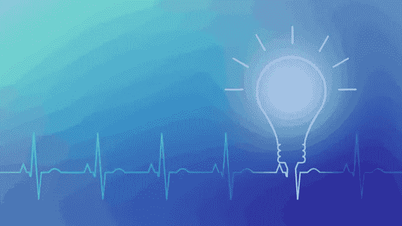
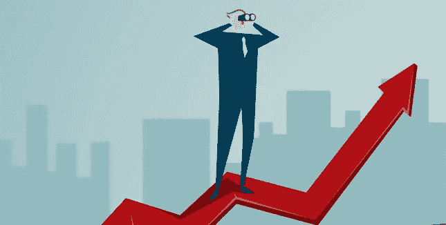

# 新冠肺炎:算法杀手？

> 原文：<https://pub.towardsai.net/covid-19-the-algorithm-killer-158d7b165734?source=collection_archive---------3----------------------->

## [数据科学](https://towardsai.net/p/category/data-science)，[观点](https://towardsai.net/p/category/opinion)

*毫无疑问，疫情改变了我们的行为，但这对数据有什么影响呢？*

来源: [Gfycat](https://gfycat.com/frailofficialdegus)

数据是新的石油。从电网管理到天气预报，数据以及我们可以利用数据产生的见解被用来帮助我们管理日常生活的各个领域。在许多行业，我们已经看到了由于冠状病毒疫情最近的重大转变。这对我们在生活各个领域记录的数据产生了连锁反应，这可能会影响我们使用这些数据进行预测的质量。一个糟糕的预测的影响可能是毁灭性的。这就提出了一个问题，那就是我们如何处理疫情期间产生的数据。我们是将它包含在我们的模型中，还是将这一时期视为异常并全部移除？虽然我肯定许多人都希望今年从记录中抹去，但也许这不是正确的做法。

在全球封锁期间，人类行为发生了深刻的变化。几十年来长期形成的模式被打破了。随着世界陷入抢购狂潮，决定我们购物时看到的广告的推荐系统全都疯了。这导致了后台问题，因为自动化库存管理算法不再知道发生了什么[1]。这些算法都是针对正常行为进行训练的，那么它们是如何应对这种新常态的呢？

在电力行业，由于大多数商业和电力负荷关闭了四个月，我们看到了前所未有的低需求水平，这提出了一个严重的问题，即当系统与风力和太阳能发电机的有利天气条件下的高发电量相结合时，系统将如何应对。这可能导致电网过载的风险，并降低电力系统应对频率下降的能力。整个行业的合作努力消除了这一低需求时期给系统带来的风险。制定并实施了新的机制和规则，否则这一过程将需要数年时间。

天气预报已经严重受损。世界气象组织(WMO)表示，疫情正在影响天气预报的质量。这是因为预测模型在很大程度上依赖于来自飞机的气象测量，而飞机的气象测量平均下降了 75-80%[2]。这种数据的缺乏导致我们的天气预报非常不可靠，如果你在日常散步中湿透了，你可能会注意到这一点。

我们面临的一个问题是，我们不清楚什么是常态，是会有一个新的常态，还是我们会回到疫情之前的生活？这就留下了一个问题，如果未来看起来一点也不像过去，预测模型怎么可能预测未来。在我们的预测中有如此多的不确定性，很容易认为从我们的数据集中移除疫情只是一个错误，至少目前是这样。一旦我们对新冠肺炎如何长期影响我们的生活有了更好的理解，我们就可以决定保留还是删除这些数据。

[Pic 信用](https://www.cc.lu/uploads/pics/economic-forecast1.png)

同样值得考虑的是，这些数据作为测试集可能有很大的用处。如果数据的整体形状是相同的，但集中在不同的级别上，则在此期间累积的数据可能会对模型理解数据集和推断正确关系的程度形成很大的测试，或者它是否过度适合定型数据。随着我们生活在越来越多的不确定性和气候变化等其他危机带来的变化中，这一点将变得极为重要。

然而，至少就目前而言，这是我们掌握的最新数据。因此，这些数据很有可能会扭曲预测模型并扭曲输出。许多人想象，到明年的这个时候，世界将出现某种程度的正常，但如果我们使用一个基于疫情期间积累的数据训练的预测模型，就无法知道该模型会输出什么。它可以预测接近疫情期间所看到的东西，它可以预测现实，或者它可以变得疯狂并预测完全不同的东西。这在训练具有如此多未知数的模型时是一个问题，并且是在选择模型时必须考虑的事情。

我们还必须考虑忽略数据子集的潜在伦理问题。由于所讨论的数据代表发生的真实事件，这将向模型呈现真实事件的主观观点，这是道德上有问题的行为，通常不是好的实践。即使在这个前所未有的时代，这样的行动也可能是极端的。虽然我们必须考虑使用对我们的系统有潜在问题的数据的可能影响，但可以认为，由于数据代表了真实发生的事件，如果要用数据来代表现实，就必须将数据包括在我们的模型中。

也许我们问错了问题。也许我们不应该考虑使用这些数据的影响，也许我们应该问我们的模型是否有足够的弹性来处理它，如果没有，也许我们应该寻找更合适的模型。虽然这不是本文的重点，但也许这个疫情向我们表明，我们应该选择具有更好特性的模型，以提高它们对当前情况的适应能力。

考虑到以上各点，在写这篇文章的时候，我想起了人类干预自治系统的重要性。无论最终的决定是什么，哪一个对你的模型最有效，都需要一个人来做这个决定，一个了解所使用的模型及其优缺点的人。2020 年已经是疯狂的一年，谁知道我们会感受到它的影响多久。

[1] W. Heaven，[我们在疫情期间的怪异行为正在搞乱人工智能模型](https://www.technologyreview.com/2020/05/11/1001563/covid-pandemic-broken-ai-machine-learning-amazon-retail-fraud-humans-in-the-loop/) (2020)，《麻省理工科技评论》

[2]世界气象组织，[新冠肺炎影响观测系统](https://public.wmo.int/en/media/press-release/covid-19-impacts-observing-system) (2020)