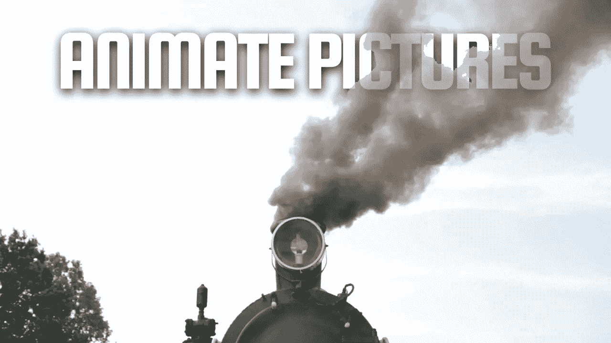
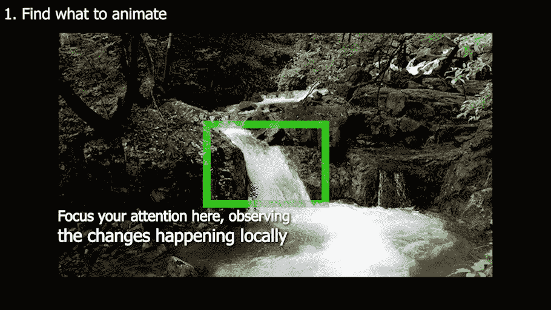
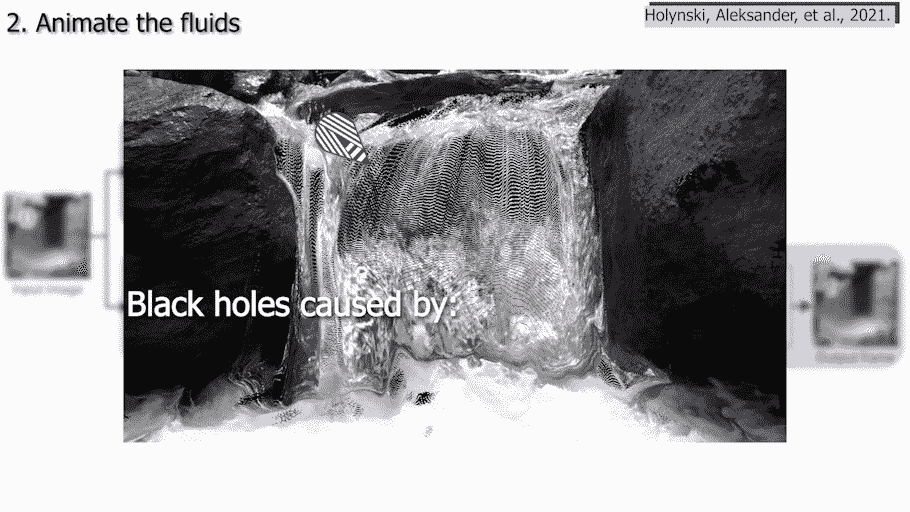
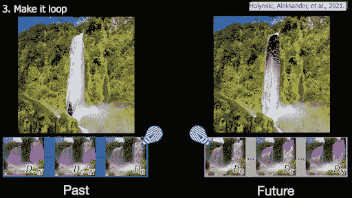

# 从图片创建逼真的动画循环视频

> 原文：<https://pub.towardsai.net/create-realistic-animated-looping-videos-from-pictures-58debf6f139?source=collection_archive---------1----------------------->

## [计算机视觉](https://towardsai.net/p/category/computer-vision)

## 该模型拍摄一张照片，了解哪些粒子应该在移动，并在无限循环中逼真地动画化它们，同时完全保留照片的其余部分，仍然创建像这样看起来令人惊叹的视频。

> 原载于 [louisbouchard.ai](https://www.louisbouchard.ai/animate-pictures/) ，前两天在[我的博客](https://www.louisbouchard.ai/animate-pictures/)上看到的！

听听这个故事…

你有没有拍过一张美丽的风景照，后来你发现它不如你在那里的时候好看。这可能是因为你无法冻结这样一个现实生活中的景观，并期望它看起来一样好。在这种情况下，如何将这张照片动画化，让正常运动的粒子不断运动，就像你拍照的那一刻一样？观察水流或看到烟在空气中散开。

动画例子。[霍林斯基、亚历山大等人，2021。](https://eulerian.cs.washington.edu/)

你有没有拍过一张美丽的风景照，后来你发现它不如你在那里的时候好看。这可能是因为你无法冻结这样一个现实生活中的景观，并期望它看起来一样好。在这种情况下，如何将这张照片动画化，让正常运动的粒子不断运动，就像你拍照的那一刻一样？观察水流或看到烟在空气中散开。这就是脸书和华盛顿大学的一种新算法所做的。它拍摄一张照片，了解哪些粒子应该在移动，并在无限循环中逼真地动画化它们，同时完全保留照片的其余部分，仍然创建像这样看起来令人惊叹的视频。老实说，我不知道为什么，但我喜欢它的样子，并希望分享他们的工作。你对这些结果有什么看法，你会如何使用它们？就我个人而言，一旦代码发布，我就把它们作为桌面背景。

现在我们已经看到了它所能达到的效果，我希望你能像我发现这篇论文时一样兴奋。让我们进入更有趣的事情。那就是:他们如何拍摄一张照片，并从中创建一个逼真的动画循环视频？这分三个重要步骤完成。第一步是从需要静止的东西中找出需要动画的东西。换句话说，找到要制作动画的水、烟或云。

当然，检测这些移动的粒子对人类来说极其容易，因为我们可以想象真实的场景以及它实际上是怎样的，但一台只看到图片而不了解世界的计算机如何做到这一点？答案就在这个问题中:我们需要多教它一些关于这个世界的知识，以及它是如何运转的，或者在这个例子中，它是如何运动的。这是通过在真实景观场景的视频而不是图片上训练人工智能模型来完成的。通过这种方式，它可以了解水、烟和云通常如何以流场的形式表现。这个流场是输入图像的一个版本，其中每个像素值都是它们在冻结时间的方向和速度的近似值。它被称为欧拉流场。欧拉流场着眼于流体如何在固定位置移动，而不是跟随流体的粒子。

a)输入图像，b)欧拉场，以及 c)帧中需要的运动。[霍林斯基，亚历山大等人，2021。](https://eulerian.cs.washington.edu/)

你可以看到这就像坐在瀑布前，观察同样的位置，观察那里的水是如何变化的，而不是跟着水顺着瀑布流下。这正是我们在这种情况下所需要的，因为图像准确地表达了:静止状态下的流水。

图像中的欧拉运动。关注粒子在固定空间位置内的运动，而不是跟随粒子。[霍林斯基，亚历山大等人，2021。](https://eulerian.cs.washington.edu/)

因此，他们使用许多风景视频，从识别每个视频的这些字段开始。这很容易做到，因为它实际上在视频中移动，我们可以使用众所周知的技术来识别每一帧中的移动粒子。然后使用每个帧的这个识别的流作为界标来训练他们的算法。训练从使用视频帧作为输入的图像到图像的翻译网络开始。这些识别的流场用于比较输出，以监督的方式教导网络我们想要达到的目标。这是通过基于生成的图像和我们已知的流场之间的差异迭代地校正和改进网络来完成的。在这样的训练之后，网络可以在没有任何外部帮助的情况下为接收到的任何风景图像生成该流场。这就像任何其他 GAN 架构一样，或者更准确地说，就像任何与解码器耦合的编码器一样。它首先对输入帧(风景图像)进行编码，然后对其进行解码以生成同一图像的新版本，从而保留空间特征并改变图像的风格。在这种情况下，改变的样式是标识运动场的像素值，而不是图像的实际颜色。一旦网络被训练，它可以生成一个看起来就像这样的地图，它将用于整个动画，因为这个欧拉流场表示不需要在视频期间随时间改变，因为它显示了每个像素在下一帧中的行为。

第一步，第一个网络。[霍林斯基，亚历山大等人，2021。](https://eulerian.cs.washington.edu/)

第二步是将图像的这些部分制作成动画，并做到逼真。为此，我们只需要两样东西:输入图像和我们刚刚为图像找到的欧拉或静态流量估计。使用该信息，我们知道基于像素的速度和方向，像素下一步应该去哪里，但是直接应用该信息会导致一些问题，因为一些像素在转换后可能没有任何值，导致黑洞从图片中运动开始的地方开始。这是因为:

1.  预测的运动场并不完美
2.  一些像素将在它们的位移之后到达相同的结果像素

这意味着随着时间的推移，它会变得更糟，并产生类似这样的东西。

黑洞的例子。[霍林斯基，亚历山大等人，2021。](https://eulerian.cs.washington.edu/)

那么，我们如何让它变得更加智能呢？同样，它是使用编码器和解码器，并在两者之间多做一步来完成的。因此，他们使用不同的编码器对输入帧进行第二次编码，产生他们所谓的深度特征。这些深层特征是输入图像的编码，这意味着它是关于图片的这项任务的重要信息的集中。这里被判断为“重要信息”的是他们在培训期间优化他们的模型要做的事情。使用这些由指示下一帧看起来如何的位移场控制的深度特征，他们使用一个经过训练的解码器，从我们给它的关于帧和流场的压缩信息中生成下一帧。

整体架构。[霍林斯基，亚历山大等人，2021。](https://eulerian.cs.washington.edu/)

注意，在训练过程中，他们使用了两种不同的帧，第一帧和最后一帧，来学习流体的真实流动，并试图避免这种黑洞的发生。现在是第三步，也是最后一步:循环部分。使用同一个帧作为起始帧，它们在两个方向上生成动画，一个向前移动，一个向后移动，直到它们到达第二帧。这使得他们能够通过合并两个视频来产生循环效果，因为一个视频在另一个视频结束时开始，并在中心相遇。然后，在推理的时候，或者换句话说，当你实际使用模型的时候，它做同样的事情，只有一个开始帧，这是你给模型的图像。瞧，你有你的动画形象！

他们的视频循环是如何工作的。[霍林斯基，亚历山大等人，2021。](https://eulerian.cs.washington.edu/)

我希望你喜欢这篇文章，就像我喜欢发现这项技术一样。如果是这样，我也邀请你阅读他们的论文，以获得更多关于这个超级酷的模型的技术细节。做得非常好！

感谢您的阅读！

# 观看视频

来我们的 [**Discord 社区与我们聊天:** **一起学习 AI**](https://discord.gg/learnaitogether)和*分享你的项目、论文、最佳课程、寻找 Kaggle 队友，以及更多！*

如果你喜欢我的工作，并想了解人工智能的最新动态，你一定要关注我的其他社交媒体账户( [LinkedIn](https://www.linkedin.com/in/whats-ai/) ， [Twitter](https://twitter.com/Whats_AI) )，并订阅我的每周人工智能 [**简讯**](http://eepurl.com/huGLT5) ！

# 支持我:

*   支持我的最好方式是成为这个网站的成员，或者如果你喜欢视频格式，在 [**YouTube**](https://www.youtube.com/channel/UCUzGQrN-lyyc0BWTYoJM_Sg) 上订阅我的频道。
*   在经济上支持我在 [**地区**](https://www.patreon.com/whatsai) 的工作
*   在 [**中**](https://whats-ai.medium.com/) 跟我来

# 参考

*   论文:霍林斯基，亚历山大等人，《用欧拉运动场制作动画》IEEE/CVF 计算机视觉和模式识别会议录。2021.，[https://arxiv.org/abs/2011.15128](https://arxiv.org/abs/2011.15128)
*   项目链接(马上有代码):[https://eulerian.cs.washington.edu/](https://eulerian.cs.washington.edu/)