# 创建用于对象检测的数据集

> 原文：<https://pub.towardsai.net/create-your-dataset-for-object-detection-99f1ed04f2e5?source=collection_archive---------0----------------------->

## 计算机视觉


来源: [Unsplash](https://unsplash.com/@toddquackenbush)

## 介绍

大多数计算机视觉任务(如分类、分割或检测)的第一步是为您的问题集准备自定义数据。创建标签数据有多种方式；一种这样的方法是注释。

注释技术在图像中手动创建区域并分配标签。

为了简单起见，我们将使用两个工具像素注释工具和微软 VoTT。你可以阅读更多关于这个工具，[像素](https://github.com/abreheret/PixelAnnotationTool)和[微软 VoTT](https://github.com/microsoft/VoTT) 。

## 像素注释工具

【macOS 的安装。

```
git clone [https://github.com/abreheret/PixelAnnotationTool](https://github.com/abreheret/PixelAnnotationTool)
```

然后使用**brew 更新 *brew 更新。***

接下来，你需要安装一个跨平台的应用开发框架，比如 qt。

```
brew install qt
```

像素注释工具使用分水岭算法进行图像分割。

读者可以使用此[链接](https://www.researchgate.net/publication/233950923_Segmentation_The_Watershed_Transformation_Mathematical_Morphology_in_Image_Processing)详细阅读关于分水岭算法的更多信息。

```
brew install opencv
```

在已经安装了 Mac curl 的情况下，你可以通过在终端中键入 ***curl -V*** 来检查它。


会出现类似这样的东西，否则用 brew 安装 curl。

```
brew install curl
```

像素标注工具没有拿出 ***。dmg*** 文件或者图形界面，所以需要通过 build 把源代码转换成独立的形式。

```
cd PixelAnnotationTool
```

在这个目录中创建构建

```
mkdir build
cd build
```

接下来，在内部构建中使用以下命令:

```
cmake .. -DCMAKE_BUILD_TYPE=$CONFIG -DDISABLE_MAINTAINER_CFLAGS=off -DCMAKE_PREFIX_PATH=$(brew --prefix qt) -DQMAKE_PATH=$(brew --prefix qt)/bin
```

最后，

```
cmake --build .
```

我们已经准备好运行和使用像素注释工具。

转到聚光灯，搜索像素注释工具。

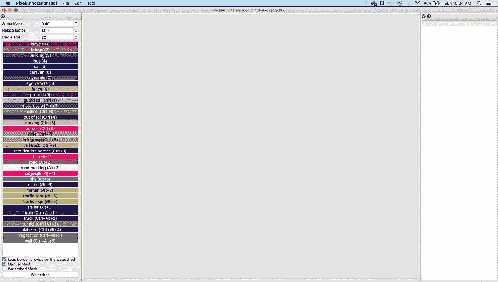

像素注释工具

## 创建数据集。

转到左上方的文件选项，选择*打开目录。*

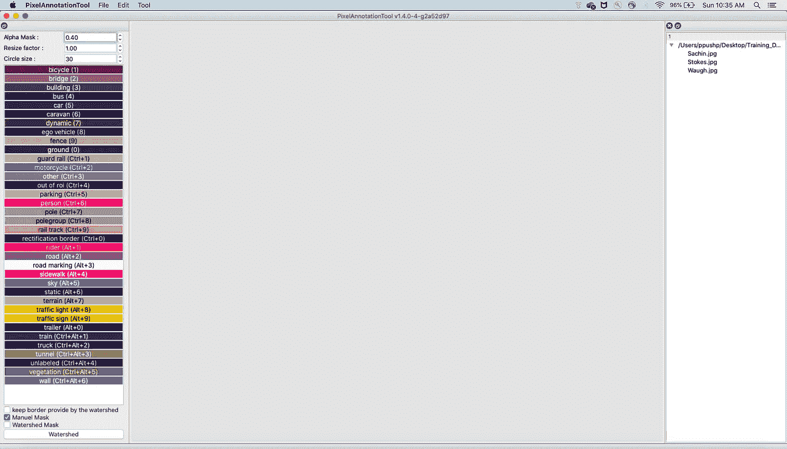

在右上方，查看所有文件名。

选择一张图片，比如 *'Sachin.jpg.'*

去左边的颜色面板选择任何颜色，让我设置*天空。*

将光标移至人物(Sachin)周围。

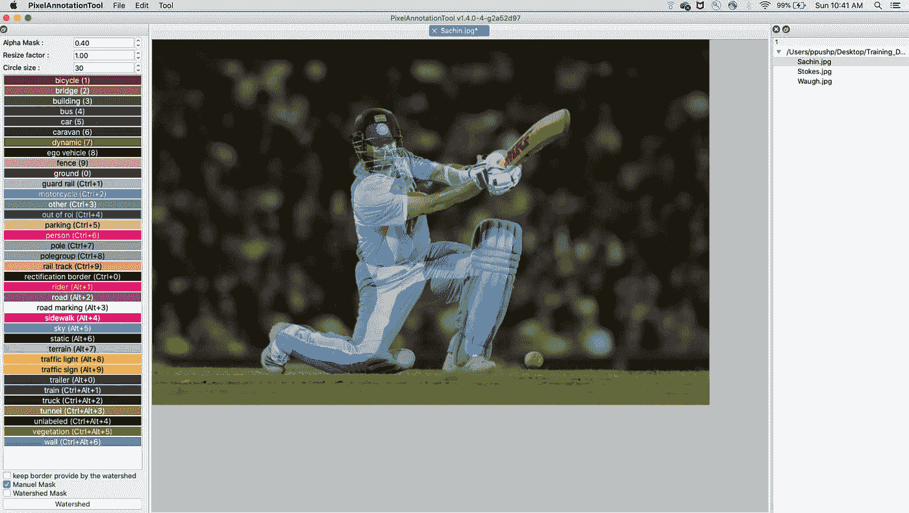

然后选择另一种颜色，比如说*“ROI 外”,然后*将光标移至整个区域，除了一个人。

然后点击左下角的分水岭选项，按 Command + S 保存图像。

最后，你会得到这个面具。

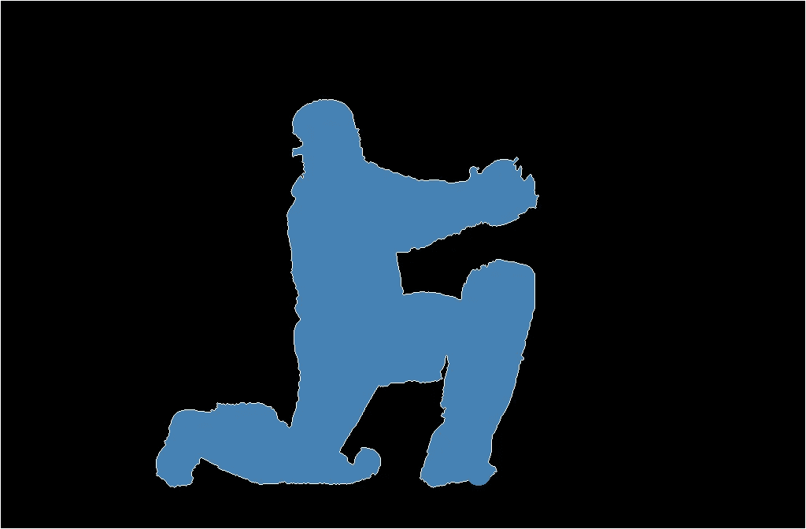

**结果**

投入


输出


该遮罩用作任何对象检测模型的输入。

## Microsoft 可视对象标记工具(VoTT)

**MAC OS 的安装。**

与像素注释工具不同，VoTT 附带了 **D** isk 图像(dmg)文件。

*   您可以从下面的链接[https://github . com/Microsoft/VoTT/releases/download/v 2 . 1 . 0/VoTT-2 . 1 . 0-Darwin . dmg](https://github.com/microsoft/VoTT/releases/download/v2.1.0/vott-2.1.0-darwin.dmg)下载并安装该工具。
*   去聚光灯下搜索 VoTT 和 launch。

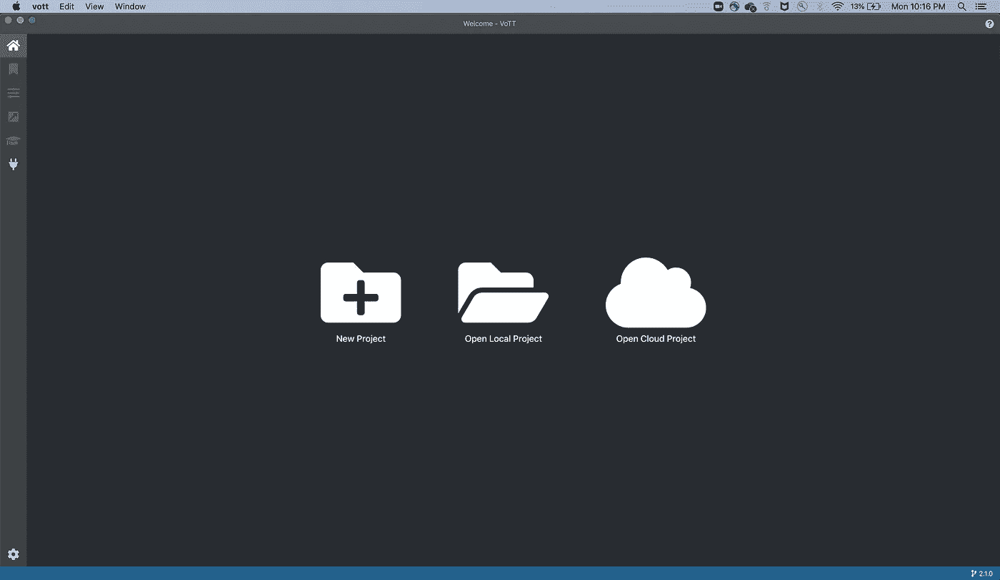

工具显示如下。

*   点击新项目

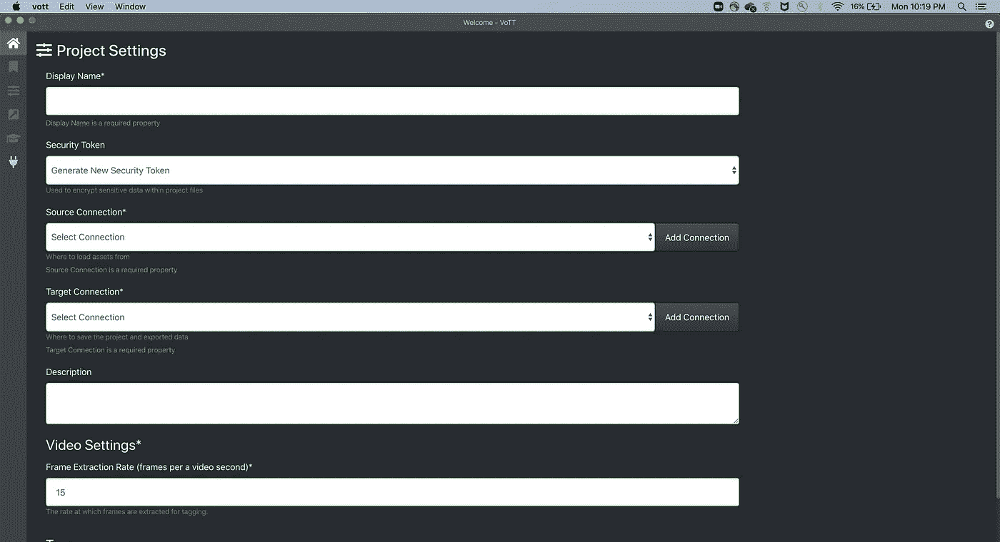

*   填写显示名称，比如我的板球运动员。
*   添加源连接，点击将弹出一个屏幕，如下所示

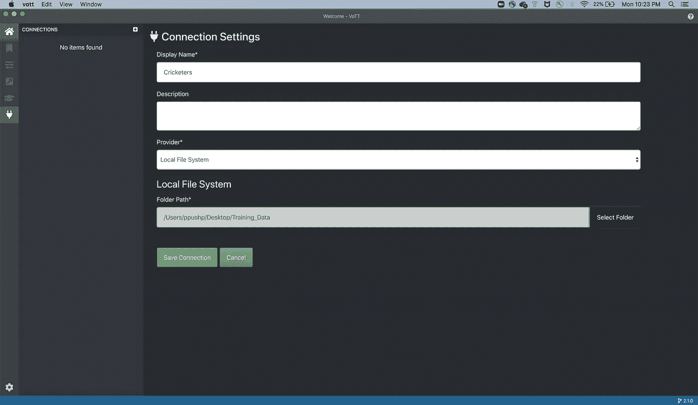

*   如果要注释的文件在便携式计算机上，请在提供程序中选择本地文件系统。
*   选择图片所在的文件夹，点击“保存连接”
*   一旦保存，类似下面的东西会出现，从源连接下拉选择'板球'，这是我们已经创建的。

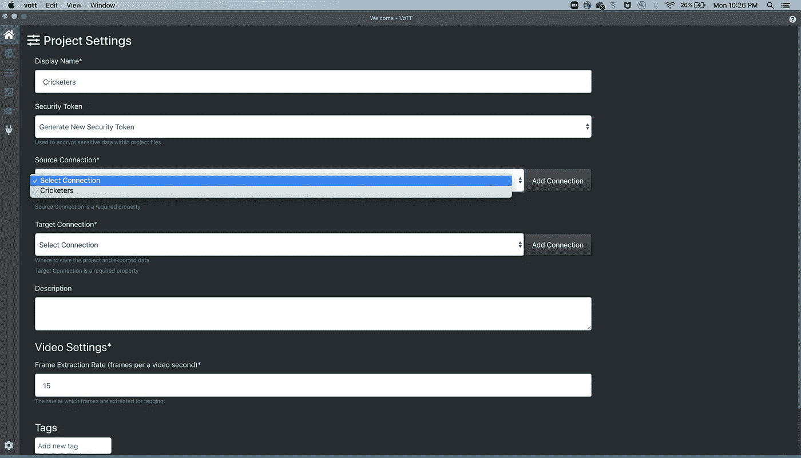

*   接下来，转到目标连接并添加一个连接。

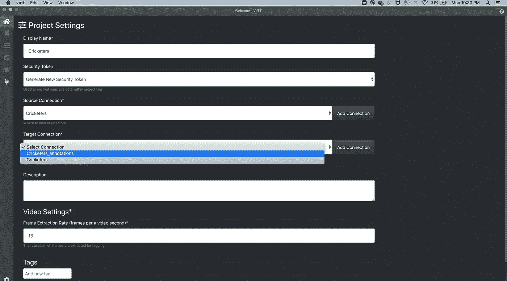

与源相同，对于目标选择板球运动员 _ 注释。

*   在底部，会有标签。

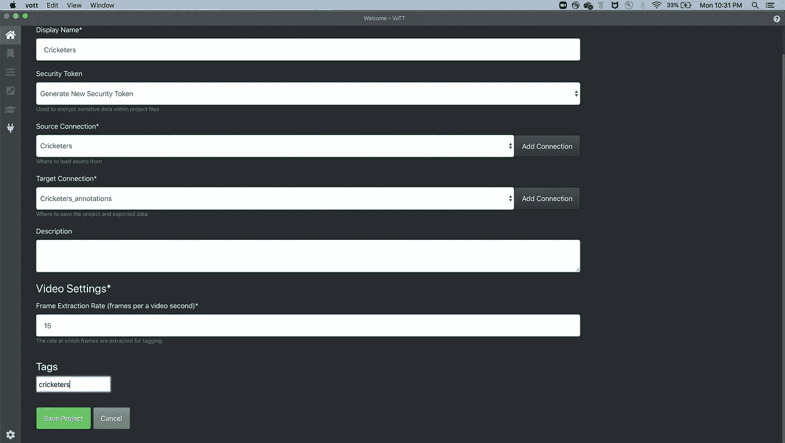

输入你想要的标签，在我们的例子中是板球运动员。

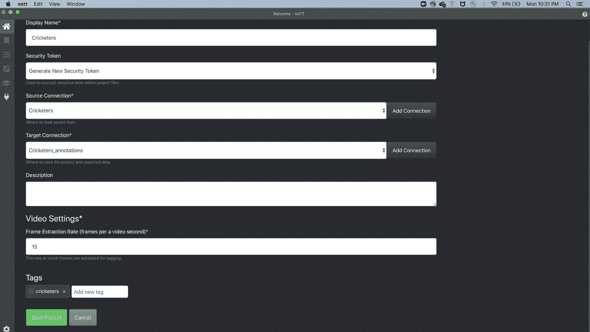

*   保存项目

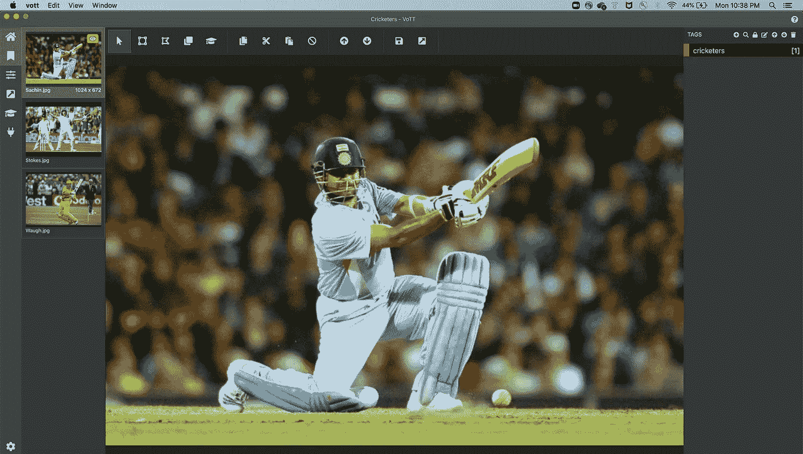

将出现与此类似的屏幕。

*   在左侧面板中，您会看到一个箭头标记(第四行)，单击它将出现下面的屏幕。

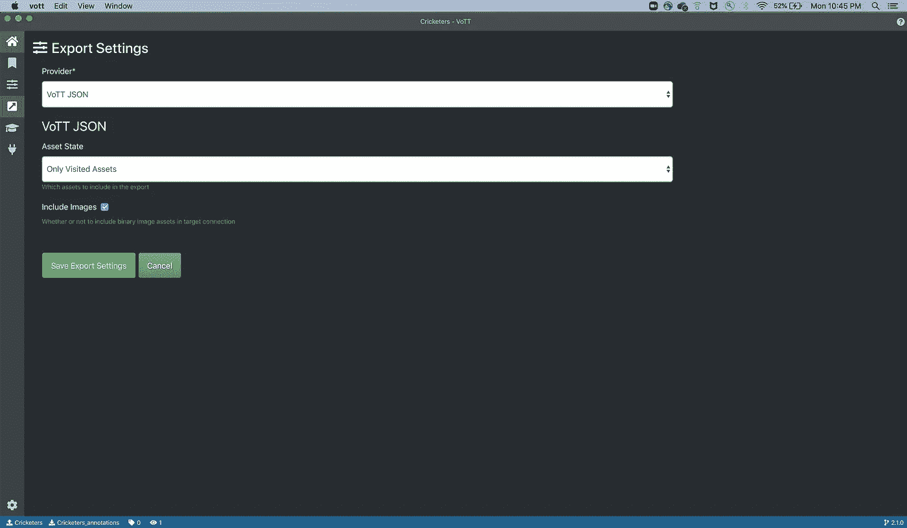

从提供者下拉菜单中，选择 Pascal VOC 并输入“保存导出设置”

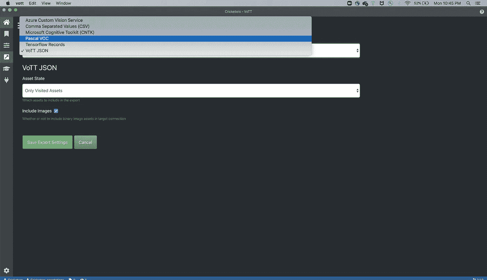

在玩家周围创建一个框，从右边选择标签，然后从顶部的保存选项保存它。

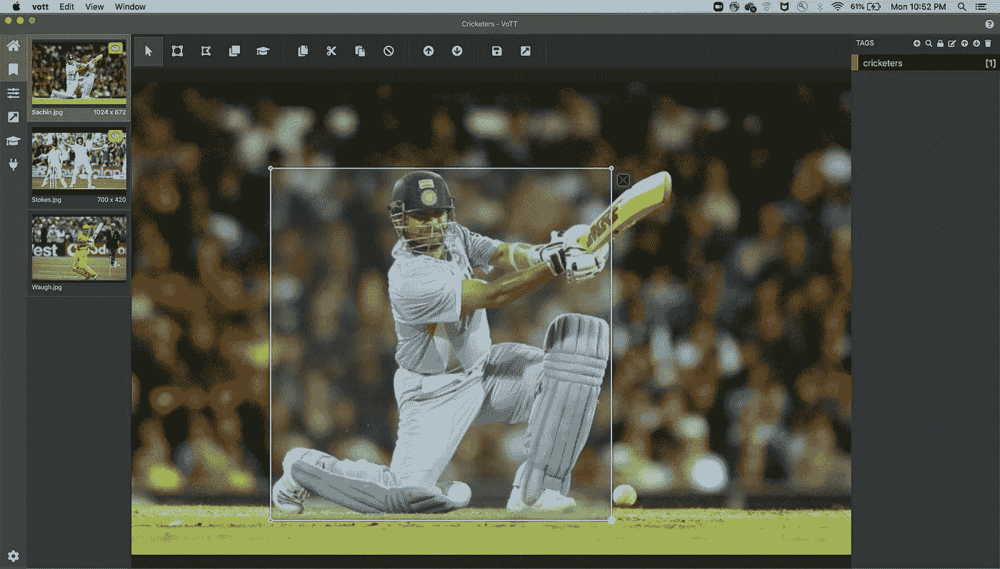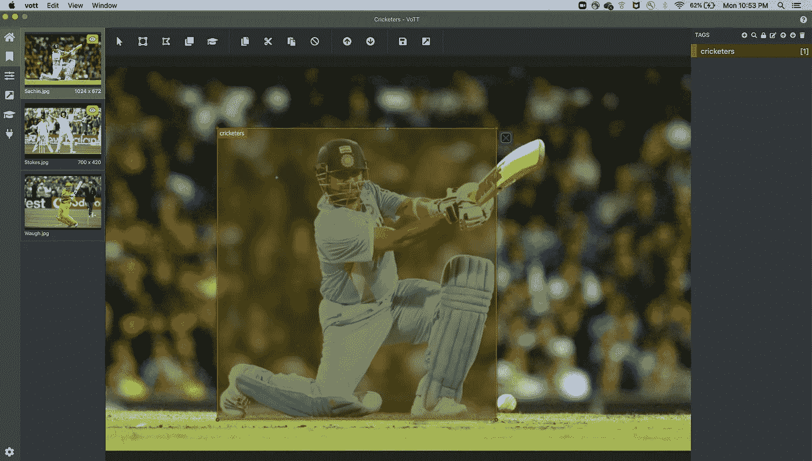

*   对文件夹中的所有图像重复此过程。完成后，我们需要导出输出。

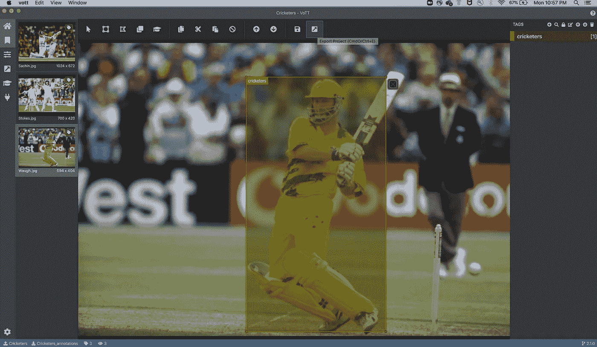

*   在图像的顶部，有一个导出项目选项。

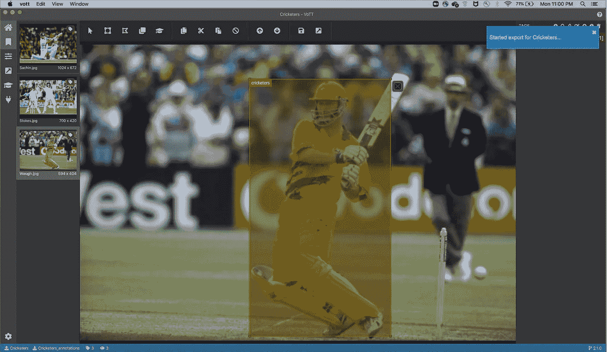

导出后，转到该文件夹。


在这篇博客中，我们学习了如何创建一个用于对象检测和分割的数据集。接下来，我将通过转换这个面具到多边形坐标，注释。

在前面提供的目标位置创建一个目录 Cricketers-PascalVOC-export。

尽情享受吧！