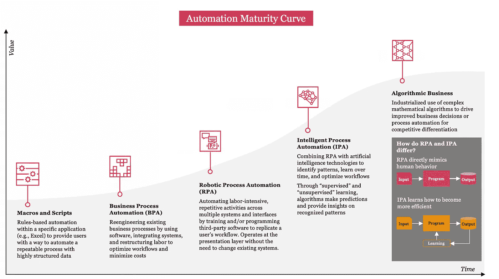
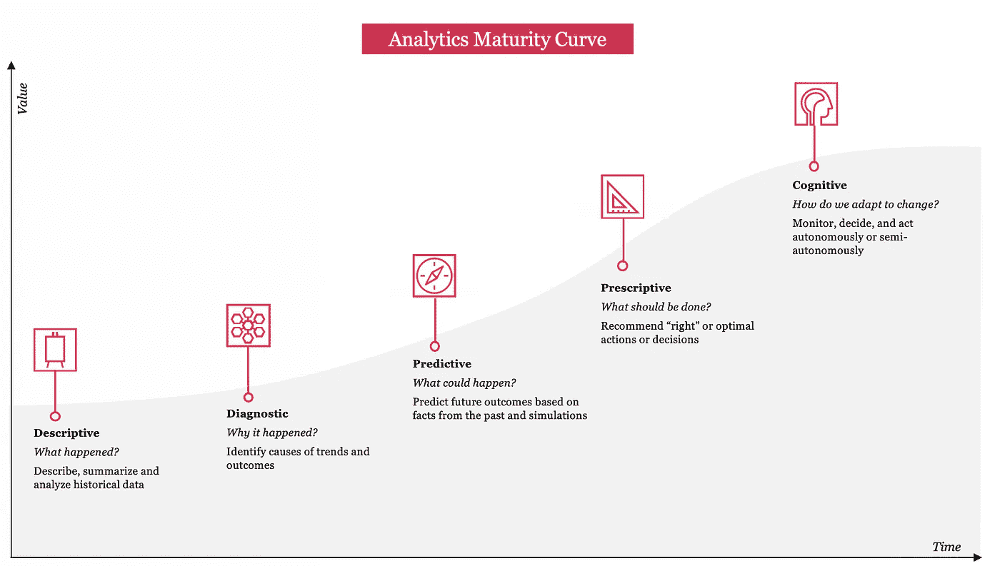
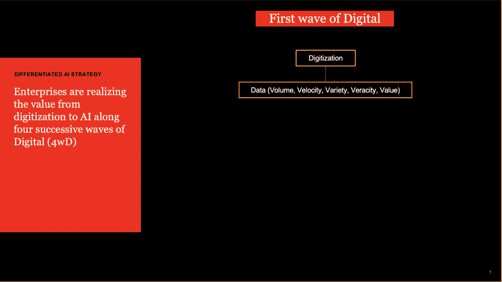

# 数据、自动化、分析、人工智能——无与伦比的四重奏

> 原文：<https://pub.towardsai.net/data-automation-analytics-ai-the-unbeatable-quartet-509536b2f097?source=collection_archive---------2----------------------->

## [未来](https://towardsai.net/p/category/future)，[科技](https://towardsai.net/p/category/technology)

## [来自数字四轮驱动的竞争优势(第一部分)](https://medium.com/the-innovation/tagged/strategy)

作者图片

商业世界受到了一场又一场革命的冲击。数字革命已经成为一个口号，每个组织都已经经历或正在经历数字化转型。然而，数字革命或数字转型这个词对许多人来说可能意味着许多事情。数字革命是一个宽泛的术语，涵盖了自 20 世纪下半叶计算机问世以来信息技术的所有进步。

在一系列文章中，我将探讨数字革命的四个不可分割的部分——无与伦比的四重奏中的明星表演者。自动化和分析是弦乐四重奏中的两把小提琴，分别提供效率优势和有效性优势。数据是四重奏中的中提琴，是和谐的组成部分，通常伴随着自动化和分析。人工智能是四重奏的大提琴，最接近人类的音域，整合了其他三个方面。这四项对于创造竞争优势都至关重要。但是我们已经看到许多公司单独或成对地对待他们，而不是真正欣赏四重奏的美妙音乐。对于海洋爱好者，我们将这些等同于数字的四个浪潮。对于户外爱好者来说，这变成了 4wD (4 波数字)。无论哪种类比最适合你——我们想要传达的关键信息是，这四者必须结合在一起，并且是你竞争优势不可或缺的组成部分。

## 数据和大数据—第一波数字化浪潮

使用数据作为资产和开发可计算知识的历史可以追溯到 20，000 年前。来自非洲中部部落的伊桑戈人用它作为计数的手段。系统数据和可计算知识的漫长而迷人的历史是一条[五英尺长的时间线](https://writings.stephenwolfram.com/2011/08/advance-of-the-data-civilization-a-timeline/)，可以在这个 [WolframAlpha 站点](https://www.wolframalpha.com/docs/timeline/)找到。

虽然数据及其用途在计算机出现之前就已经存在，但在二十世纪的最后二十年中，数字革命(或其计算部分)加速了存储的使用和数据的使用。这些数据在很大程度上是以数据库中的标准格式组织的。第一次提到“数据库”可以追溯到 1962 年。

20 世纪 90 年代末，互联网迎来了数字革命的新阶段。随之而来的是半结构化数据以及大量文本和图像形式的非结构化数据。随着智能手机的出现，数据量呈指数级增长，以音频、图像和视频的形式添加了更多的非结构化数据。此外，随着互联网和智能手机时代的到来，我们已经看到数据的焦点从企业转移到了消费者。数据也变得更加社会化和行为化——捕捉个人、群体之间的关系，他们的情感、偏好、态度等。这导致了所谓的[“大数据”革命](https://hbr.org/2012/10/big-data-the-management-revolution)和“大数据”的五个 V——数量、多样性、速度、准确性和价值。

虽然有些人声称大数据时代的[结束了](https://www.kdnuggets.com/2019/07/death-big-data-multi-cloud-era.html)，但正在转变的是围绕 Hadoop 的特定技术，而不一定是大量数据的使用或流数据的使用。大数据的这些方面不仅蓬勃发展，而且随着物联网、工业物联网、5G 的发展而加速发展。我们将看到更多来自数十亿传感器和互联设备的传感器数据流。正如我们看到了从业务数据到消费者数据的转变一样，我们也将看到从人类生成的数据到机器生成的数据的转变。商业数据或人类生成的数据不会消失，但与消费者和机器生成的数据相比，它们现在和将来都会相形见绌。

总之，在过去的半个世纪里，我们已经看到了我们所做的一切以及商业、科学和技术各个领域的数字化。从农业到高科技，每个行业都在被数字革命所改变。这种数字化(无论一个行业是数据密集型还是信息密集型(如金融服务业)还是非数据密集型(如农业、采矿业))导致越来越多的数据不断增长，并继续以指数速度增长。

当您拥有大量数据时，组织通常会选择自动化途径或分析途径，或者同时选择这两种途径来利用数据。这将我们带到下两个数字浪潮。

## 自动化——第二波数字化浪潮

有了大量的数据，组织必须首先**标准化**他们的业务流程。随着他们开始标准化之旅，他们将意识到流程中有许多可能不再需要或不再有效的例外。此外，可以取消业务流程中的一些步骤。这些变化将不可避免地导致业务流程的**简化**。移除流程的异常和流程的变更，给业务用户和高级用户更多的控制权(参见我的文章[AI 的民主化——一把双刃剑](https://towardsdatascience.com/democratization-of-ai-de155f0616b5))可以进一步简化业务流程。一旦简化，这些过程就可以自动化。

自动化这个词是由福特汽车公司的一位工程经理在 1946 年首次提出的。然而，业务流程再造的概念在 20 世纪 90 年代很流行，当时迈克尔·哈默呼吁[‘不要自动化，抹杀’](https://hbr.org/1990/07/reengineering-work-dont-automate-obliterate)。接下来是 2000 年的[业务流程管理](https://www.bptrends.com/publicationfiles/06-05%20WP%20ABPMP%20Activities%20-%20Lusk%20et%20al2.pdf)和工作流管理浪潮 RPA 的前身。机器人流程自动化(RPA)这个词在 21 世纪初开始流行。多年来，它已经从简单的宏和脚本发展到机器人桌面自动化，然后是 RPA。[这一旅程随着智能流程自动化而发展，智能流程自动化使用机器学习和自然语言处理来扩展 RPA](https://www.pwc.com/us/en/services/consulting/library/unlocking-automation-value/business-processes.html) 。

自动化成熟度曲线(来源:普华永道分析)

自动化的商业利益主要集中在效率上。自动化减少了做**重复性**任务所需的时间。这些重复性的任务可以是**手动**或**认知**。重复手动任务的一个例子是将信息从一个应用程序剪切并粘贴到另一个应用程序。重复认知任务的一个例子可能是银行的信用分析师收集评级机构数据、交易数据、政府数据等。在对贷款申请做出决定之前。自动化这些任务可以节省时间并减少流程的周转时间。这反过来又提高了员工或劳动生产率，并降低了总体劳动力成本。这些直接的成本(或底线)收益也会带来间接的顶线收益。缩短周转时间可以提高客户满意度，更好地留住客户，从而提高盈利能力。机器人桌面自动化和机器人流程自动化可以自动化大部分重复的手动和认知任务。

当谈到非重复性或[可变任务](https://hbr.org/2019/02/how-to-break-down-work-into-tasks-that-can-be-automated)时，我们需要像机器学习和自然语言处理这样的技术——更像是人工智能的领域——来自动化它们。流程挖掘使用机器学习技术来获取工作流日志或事务日志，并发现异常、瓶颈、资源争用、周转时间等。然后可以使用它来更好地对任务进行分类，并将它们分配给组织内正确的技能类型。例如，一家投资银行的客户服务故障单系统在一天内收到了多个故障单或服务请求。由于法规要求，这些请求必须在一定期限内(例如，24 小时内)得到处理。故障单从简单的修复到需要主题专家或技术人员技能的更复杂的都有。这是一个经典的例子，你有一些“例行”的修复和一些“非常规”的修复。这家投资银行能够使用 NLP 和机器学习来解析故障单，按照复杂程度对它们进行分类，并将其发送给合适的专家，以加快问题的解决。

自动化可以在减少任务时间、提高员工生产率以及降低劳动力成本方面产生显著的效益。然而，仍然有大量的前期投资可以从储蓄中收回。计算此类计划的投资回报(ROI)需要对某些活动所花费的时间有一个良好的基线，而且生产力的好处可能并不总是转化为人员的减少(参见我的文章[将模型误认为软件的后果](https://towardsdatascience.com/consequences-of-mistaking-models-for-software-94d813f115f5))。

## 分析——第三次数字化浪潮

随着数据越来越多，标准化、简化和自动化并不是唯一的途径。组织还可以选择利用数据的替代途径。这条路径使用数据来**个性化**与用户的交互和体验。这里的用户可能是您的客户、供应商或员工。个性化发生在三个不同的阶段。首先，T4 利用这些数据来了解用户的行为。理解阶段之后是预测用户行为的**。第三，也是最后一个阶段是实际上**改变**(或推动)用户的行为。例如，考虑你最喜欢的流媒体服务——该公司首先了解你的偏好、你的观看习惯、你喜欢的类型等。，然后预测你有可能看什么，并做出适当的推荐。随着你越来越依赖某个特定的流媒体服务，它们也可以微妙地改变你的观看习惯，并产生让你保持参与的内容。**

个性化可能会导致凯文·凯利所说的认知——让事情变得更聪明。想象一下查看迄今为止所有语言制作的所有电影的详细目录(多达数百万部)与您最喜欢的流媒体服务之间的差异，流媒体服务可以根据您的兴趣和类型向您推荐电影(例如，最新的动作电影或您最喜欢的英雄主演的最新宝莱坞电影！！).该推荐是根据我们每个人的偏好定制的，并且还会随着我们偏好的改变和生成内容类型的改变而改变。这是他们“聪明”的原因。我们现在都明白，这一过程不仅发生在消费者世界，也发生在企业世界(或 B2B 或 B2B2C 价值链)。

与自动化路径不同，分析路径中的关键竞争驱动因素是能够从数据中获得洞察力，将这些洞察力转化为更好的决策和行动，从而为客户和公司带来更好的结果。因此，重点是**决策**或采取比我们在没有数据和数据分析的情况下采取的*更好的*行动。

分析的商业利益主要集中在**效率**上。它们有助于改善用户体验、做出更好的决策或采取更好的行动。这导致了更好的客户保持率、对客户更好的价值以及因此对提供商更好的价格/利润，并且最终对能够个性化和认知他们的产品和服务的公司有更多的收入和利润。与自动化一样，量化分析的投资回报率也是一项艰巨的任务，因为有效性的提高是基于人的基线表现。不幸的是，在许多情况下，我们在许多领域没有人类决策的基线(参见我的文章[将模型误认为软件的后果](https://towardsdatascience.com/consequences-of-mistaking-models-for-software-94d813f115f5))。

分析通常被分为四个逐渐复杂的阶段— **描述性分析**(问问题*发生了什么？*)、**诊断分析** ( *为什么会发生？*)，**预测分析** ( *会发生什么？*)和**规定性分析学** ( *我们能做什么？*)。在某些情况下，增加了第五个阶段，称为**认知分析** *(我们如何适应变化？)*。这是一个宽泛的范畴，包括所有可以与一些传统分析技术结合使用的人工智能技术。这就引出了第四次数字化浪潮。

分析成熟度曲线(来源:普华永道分析)

## 人工智能——第四次数字化浪潮

当我们到达自动化和分析的成熟曲线的顶端时，我们总是会转变为人工智能。在自动化领域，随着我们走向智能自动化，我们越来越多地使用机器学习和自然语言处理，这是人工智能的领域。类似地，当我们进入认知领域，或者更进一步进入规定和认知分析领域时，我们就进入了人工智能领域。

我们喜欢使用的人工智能的定义是斯图尔特·拉塞尔和彼得·诺维格在他们的书中阐述的经典定义。我们认为人工智能是*任何软件系统或代理，它位于一个环境中，与其他人类和机器交互，能够* ***感知*******思考*******行动*** *以实现某种目的或目标*。**

**人工智能自 1956 年以来一直存在——这个术语最初是由一小群学者和人工智能的创始人在达特茅斯的一次会议上使用的。然而，在许多公司中，人工智能仍然被认为是一种新兴技术。人工智能在过去至少经历了两次繁荣-萧条周期，自 2007 年以来一直处于受欢迎的高潮。**

**人工智能的好处来自效率和成本降低，以及效率和收入/利润的增加。我们之前概述的投资回报率估计和实现的挑战仍然存在于人工智能中——另外一个挑战是解决围绕人工智能的“炒作”和归因于人工智能拟人化的神奇品质。**

**而数据推动了自动化、分析和人工智能浪潮；人工智能是结合自动化和分析的粘合剂。下图展示了数字的四个阶段以及这四个阶段之间的相互关系。**

****

**数字的四次浪潮(来源:普华永道分析)**

**在本文中，我们介绍了四个主要的数字浪潮，并认为任何竞争优势，由于其中一个应该考虑与其他三个的相互作用。在随后的文章中，我将更深入地探讨这些主题，并研究如何为每一次浪潮制定战略、每一次浪潮的关键经济杠杆以及建立竞争优势的机制。**