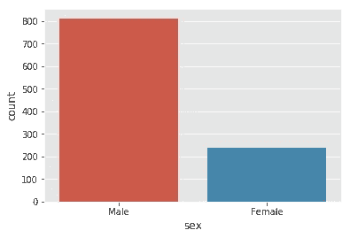
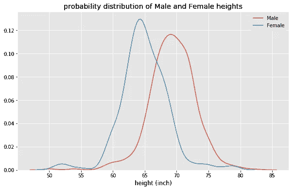

# 数据总是不完美的

> 原文：<https://pub.towardsai.net/data-is-always-imperfect-8611d667dd10?source=collection_archive---------1----------------------->


[米盖尔](https://unsplash.com/@voodoolx?utm_source=medium&utm_medium=referral)在 [Unsplash](https://unsplash.com?utm_source=medium&utm_medium=referral) 上的照片

## 数据科学

## 即使看起来完美的数据集也可能包含错误

# 一.导言

数据是任何数据科学和机器学习任务的关键。数据有不同的形式，如数字数据、分类数据、文本数据、图像数据、语音数据和视频数据。 ***模型的预测能力取决于构建模型时所用数据的质量*** 。因此，在执行任何数据科学任务(如探索性数据分析或构建模型)之前，检查数据的来源和可靠性非常重要，因为即使看起来完美的数据集也可能包含错误。

在本文中，我们将讨论影响数据质量的几个因素。我们还将讨论可以采取的措施，以保持您的数据没有缺陷。

# 二。数据问题

在本节中，我们将讨论几个可能降低数据质量的因素。我们还讨论了有助于减少数据缺陷的解决方案。

## 1.错误数据

数据收集会在不同层面产生错误。例如，调查可以设计为收集数据。然而，参与调查的个人可能并不总是提供正确的信息。例如，参与者可能输入了错误的年龄、身高、婚姻状况或收入信息。当在为记录和收集数据而设计的系统中存在错误时，也可能发生数据收集中的错误。例如，温度计中的传感器故障会导致温度计记录错误的温度数据。人为错误也可能导致数据收集错误，例如，技术人员可能在数据收集期间错误地读取仪器。

由于调查通常是随机的，因此几乎不可能防止参与者提供虚假数据。通过对测量仪器进行定期质量保证检查，确保它们以最佳水平运行，可以减少使用仪器收集的数据的误差。通过让另一名技术人员或工作人员复查读数，可以减少仪器读数中的人为误差。

## 2.缺失数据

大多数数据集包含缺失值。处理缺失数据的最简单方法是简单地丢弃数据点。但是，删除样本或删除整个特性列是不可行的，因为我们可能会丢失太多有价值的数据。在这种情况下，我们可以使用不同的插值技术来估计数据集中其他训练样本的缺失值。最常见的插值技术之一是**均值插补**，我们只需用整个特征列的平均值替换缺失值。输入缺失值的其他选项有**中值**或**最频繁(模式)**，后者用最频繁的值替换缺失值。无论您在模型中采用何种插补方法，您都必须记住，插补只是一种近似值，因此可能会在最终模型中产生误差。如果所提供的数据已经过预处理，那么您必须找出丢失的值是如何被考虑进去的。原始数据被丢弃的百分比是多少？使用什么插补方法来估计缺失值？

## 3.数据中的异常值

离群值是与数据集的其余部分非常不同的数据点。异常值通常只是坏数据，例如，由于传感器故障；受污染的实验；或者记录数据中的人为错误。有时，异常值可能表示真实的情况，例如系统中的故障。离群值非常常见，在大型数据集中是意料之中的。检测数据集中异常值的一种常用方法是使用箱线图。**图 1** 显示了一个包含大量异常值的数据集的简单回归模型。离群值会显著降低机器学习模型的预测能力。处理异常值的常见方法是简单地忽略数据点。然而，去除真实数据异常值可能过于乐观，导致模型不现实。处理异常值的高级方法包括 RANSAC 方法。


**图 1** :使用带有异常值的数据集的简单回归模型(图片由 Benjamin O. Tayo 制作:[好坏回归分析](https://medium.com/towards-artificial-intelligence/bad-and-good-regression-analysis-700ca9b506ff))。异常值的存在显著降低了模型的质量(低 R2 分数)。

## 4.数据冗余

包含数百或数千个要素的大型数据集通常会导致冗余，尤其是当要素相互关联时。在具有太多特征的高维数据集上训练模型有时会导致过度拟合(模型捕获真实和随机影响)。此外，一个拥有太多特征的过于复杂的模型可能很难解释。解决冗余问题的一种方法是通过特征选择和维度缩减技术，如 [PCA(主成分分析)](https://medium.com/towards-artificial-intelligence/mathematics-of-principal-component-analysis-with-r-code-implementation-595a340908fa)或使用[协方差矩阵图](https://medium.com/towards-artificial-intelligence/feature-selection-and-dimensionality-reduction-using-covariance-matrix-plot-b4c7498abd07)。

## 5.不平衡数据

当数据集中不同类别的数据比例不相等时，就会出现不平衡数据。使用 [***高度***](https://github.com/bot13956/Bayes_theorem) 数据集可以演示不平衡数据集的示例。

```
import numpy as npimport pandas as pddf = pd.read_csv("heights.csv")plt.figure()sns.countplot(x="sex", data = df)plt.show
```



**图二**。数据集的分布。N=1050: 812(男性)和 238(女性)身高。这表明我们有一个非常不平衡的数据集，男性身高占 77%，女性身高占 23%。

从**图 2** 中，我们观察到数据集在男性和女性类别中并不一致。如果有人对计算数据的平均身高感兴趣，这将给出一个偏向男性平均身高的值。处理这个问题的一个方法是计算每个类别的平均高度，如图**图 3** 所示。此外，基于单个身高变量的用于预测性别(男性或女性)的[机器学习模型](https://medium.com/towards-artificial-intelligence/bayes-theorem-explained-66ebf8285fcc)在预测男性类别方面比女性类别表现更好。



**图 3** 。男女身高的概率分布。

## 6.数据缺乏可变性

当数据集包含的要素太少而不能代表全貌时，它就缺乏可变性。例如，基于平方英尺预测房屋价格的数据集只缺少可变性。解决这个问题的最好方法是包含更多的代表性特征，如卧室数量、浴室数量、建造年份、地段大小、HOA 费用、邮政编码等。

## 7.数据丢失

存储数据可能会导致错误，因为一些数据可能会被错误地保存，或者部分数据可能会在存储过程中丢失。检索数据也会产生错误，因为数据的某些部分可能会丢失或损坏。

## 8.动态数据

在这种情况下，数据不是静态的，而是依赖于时间并且每次都在变化，例如股票数据。在这种情况下，应使用时间相关的分析工具(如时间序列分析)来分析数据集和进行预测建模(预测)。

## 9.数据的大小

在这种情况下，样本数据的大小可能太小，不能代表整个人口。这可以通过确保样本数据集足够大并能代表总体来解决。包含大量观测值的大样本会减少方差误差(方差误差根据 [**中心极限定理**](https://towardsdatascience.com/proof-of-central-limit-theorem-using-monte-carlo-simulation-34925a7bc64a) 随样本量减少)。较大样本的主要缺点是收集数据可能需要大量时间。此外，就计算时间(训练和测试模型所需的时间)而言，用非常大的数据集构建机器学习模型在计算上可能非常昂贵。

# 三。摘要

总之，我们已经讨论了可能影响数据质量的几个因素。仔细检查后，即使看起来完美的数据集也可能包含错误。因此，在使用数据进行进一步分析或建模之前，充分理解数据是极其重要的。确保仔细检查和评估数据的可靠性和质量总是好的。请记住，质量差的数据会产生伪造和不可靠的预测模型。

# 其他数据科学/机器学习资源

[数据科学最低要求:开始做数据科学需要知道的 10 项基本技能](https://towardsdatascience.com/data-science-minimum-10-essential-skills-you-need-to-know-to-start-doing-data-science-e5a5a9be5991)

[数据科学课程](https://medium.com/towards-artificial-intelligence/data-science-curriculum-bf3bb6805576)

[机器学习的基本数学技能](https://medium.com/towards-artificial-intelligence/4-math-skills-for-machine-learning-12bfbc959c92)

[3 个最佳数据科学 MOOC 专业](https://medium.com/towards-artificial-intelligence/3-best-data-science-mooc-specializations-d58da382f628)

[进入数据科学的 5 个最佳学位](https://towardsdatascience.com/5-best-degrees-for-getting-into-data-science-c3eb067883b1)

[2020 年开始数据科学之旅的 5 个理由](https://towardsdatascience.com/5-reasons-why-you-should-begin-your-data-science-journey-in-2020-2b4a0a5e4239)

[数据科学的理论基础——我应该关心还是仅仅关注实践技能？](https://towardsdatascience.com/theoretical-foundations-of-data-science-should-i-care-or-simply-focus-on-hands-on-skills-c53fb0caba66)

[机器学习项目规划](https://towardsdatascience.com/machine-learning-project-planning-71bdb3a44349)

[如何组织你的数据科学项目](https://towardsdatascience.com/how-to-organize-your-data-science-project-dd6599cf000a)

[大型数据科学项目的生产力工具](https://medium.com/towards-artificial-intelligence/productivity-tools-for-large-scale-data-science-projects-64810dfbb971)

[数据科学作品集比简历更有价值](https://towardsdatascience.com/a-data-science-portfolio-is-more-valuable-than-a-resume-2d031d6ce518)

[数据科学 101 —包含 R 和 Python 代码的中型平台短期课程](https://medium.com/towards-artificial-intelligence/data-science-101-a-short-course-on-medium-platform-with-r-and-python-code-included-3cdc9d489c6d)

***如有疑问，请发邮件给我***:benjaminobi@gmail.com