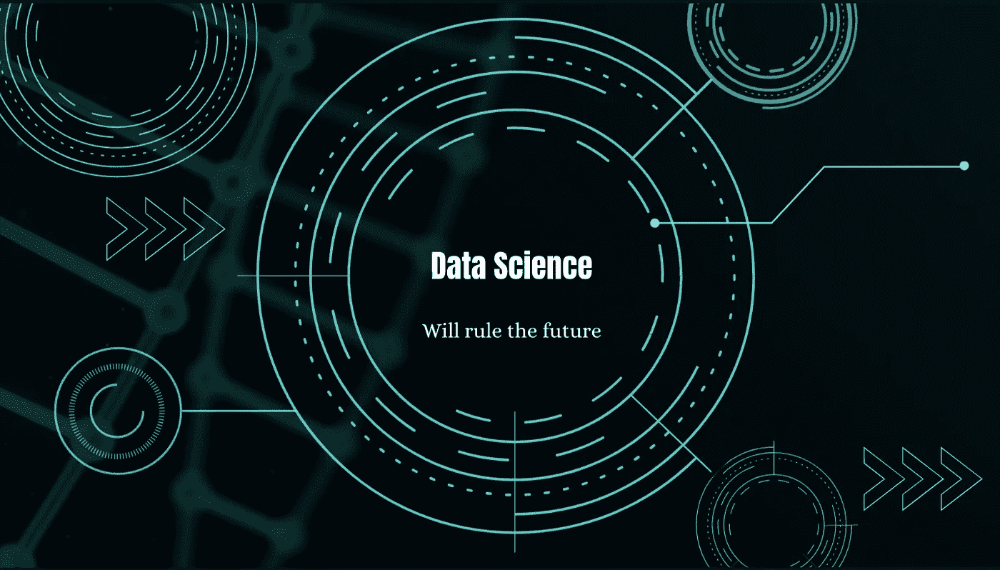
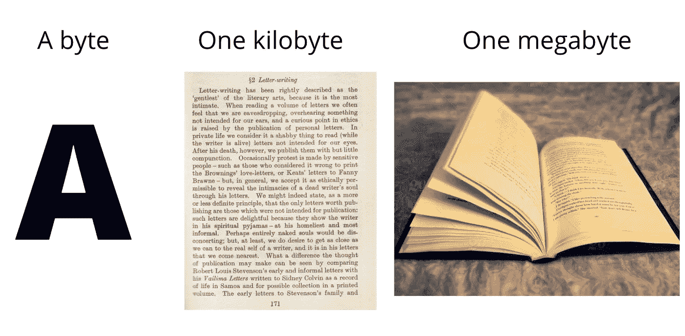
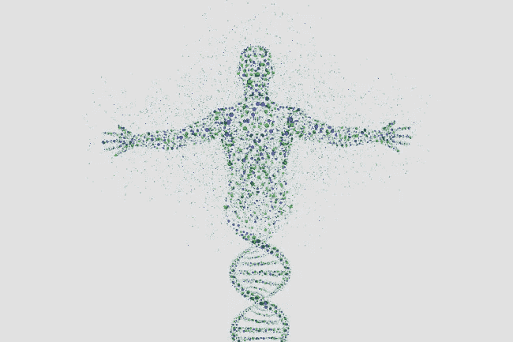
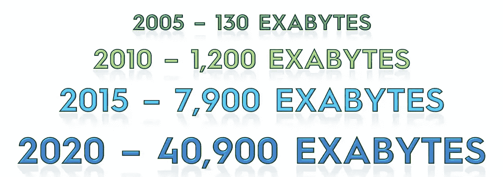
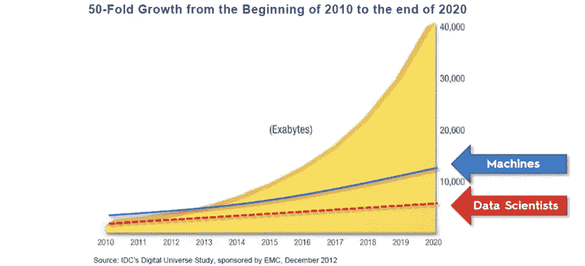

# 数据科学，未来时代的亚历山大

> 原文：<https://pub.towardsai.net/data-science-alexander-of-the-times-ahead-1f9caa8f9c4d?source=collection_archive---------1----------------------->

## 我坚信数据科学将在未来统治世界

使用 Canva 设计。

如果你听说过**数据科学，请举手！这是最近的流行语。这一领域可以在市场上保持并长期存在，并为通过利用数据增加价值的人提供大量机会。我坚信数据科学是未来几年甚至几十年的发展方向。**

**首先，什么是数据科学？**

数据科学是一个使用算法、流程和模型从数据中提取知识并产生洞察力的领域。想了解更多关于数据科学的知识，可以在这里阅读我之前的文章[。](https://medium.com/datadriveninvestor/data-science-demystified-what-is-data-science-ef031f6d0b6d)

世界上有大量的数据。最终，数据是我们科学家工作的资源。如果数据多，工作就多，如果数据少，工作就少。让我们直入主题吧。从有史以来直到 2005 年，人类已经使用了 130 艾字节的数据。好吧，这绝对什么也没告诉我们。

**什么是艾字节？这为什么让人印象深刻？**

好吧，让我们从头开始。让我们从一个字节开始，这里我们有一个字母 a，它占据了一个字节的空间。

现在，假设我们有一页信。每一页的字母可以有两千到五千个。所以我们会说半页文本对于一千字节来说是合适的。

让我们放大一千倍，你会得到一本书。所以一本大约 500 页的书将占用大约 1 兆字节。

使用 Canva 设计

现在，让我们再缩小一千倍。我们得到的是一千兆字节，一千兆字节足以容纳整个人类基因组。所以一个人类基因组，一旦被编码(在理想世界中)就可以装进一个十亿字节。

来源—由 [Elymas](https://www.shutterstock.com/g/Lonely) 通过快门库存

所以如果你这样想，你可以把一个完整的人放进一千兆字节。但是在这里你可以反驳说一个人的基因组不足以告诉你这个人的一切。一个人有人生经历。不同的人过着不同的生活。对一个人来说，不仅仅是基因组。

那么，让我们再缩小一千倍，我们会得到一万亿字节。如果你用一台高清摄像机，跟踪一个人生命中的每一天，每一个小时，每一分钟，每一秒钟，拍摄他们 70 年或 80 年来所做的一切，你可以把所有的材料都装进一个**太字节**。

来源——由唐纳德·唐通过 Pexels 提供

**那怎么样？**

这似乎已经相当令人印象深刻了。所以**1tb**可以容纳你一生中每一秒钟拍摄的所有生活经历。

接下来呢？这越来越好了。

来源:Tom Fisk 通过 Pexels

以占地约 14 亿英亩的亚马逊雨林为例。这相当于 14 亿英亩的树木。每英亩大约有 500 棵树，大约有 7000 亿棵树(估计)。现在，如果你把所有这些树都砍倒，然后把它们变成纸，在纸的两面都写满字母，那么这将会产生大约**几千兆字节的数据。**

现在，如果你再缩小 1000 倍，你会得到一艾字节，一个**艾字节就是 1000 千兆字节。**

我猜你对我们使用的大量数据有所了解。

等等！我只提到了 2005 年之前的 130。今天呢？到今天为止，我们消耗了多少数据？

使用 Canva 设计

所以你可以看到世界上的数据增长非常非常快。随着时间的推移，大量数据正在生成。

## 现在，数据科学家的机会在哪里？为什么这是一个如此赚钱的职业？

让我们在图表上画出可用数据的总量和计算机能处理的数据量，看看计算机如何处理这些数据。该图表还将包括数据科学家目前正在处理的数据。

来源—由 EMC 赞助的 ITC 数字世界。

上图显示了可用数据量与机器和数据科学家分析的数据量之间的巨大差异。你会注意到，世界上有如此多的数据可供机器和数据科学家使用和理解。

到 2010 年，这些差距将继续呈指数级增长，久而久之。这就是为什么未来对科学家的需求会不断增长，我们可以看到数据科学家变得越来越受欢迎。

工资不断上涨，尤其是对于非常合格的数据科学家来说，他们知道自己在做什么，可以增加价值，可以利用世界上所有的数据做一些事情。我们可能会看到数据科学在未来成为人们的一种规范。我还相信，在未来十年左右的时间里，每个人都应该了解一定程度的数据科学，这样他们就可以在自己的工作中应用它。

现在，*如果你认为数据科学只在计算机科学领域有用，*那你就错了。我将在这里解释数据科学在广告领域的应用。

> 在数据科学和机器学习发展之前，广告会在网站上放置特定的时间。无论谁访问这个网站，总是显示同一个广告。这种方法的问题在于瞄准。针对 40 岁以上观众的广告也可以给 25 岁的人看，这是不正确的。这带来了实时竞价(RTB)的出现，这是程序化广告的第一个例子。

RTB 是一种通过实时拍卖交易广告的方式，意味着**广告商之间的交易在加载一个网页的时间内完成，**大约是 100 毫秒。它是这样工作的 **:**

当用户访问网站时，用户数据被发送到广告交易所。然后将这些信息与可用的广告公司进行匹配，在广告公司之间进行实时拍卖。

*例如，*假设你访问了一个销售太阳镜的网站，但没有购买任何东西。过了一会儿，你访问你最喜欢的新闻网站，突然你看到到处都是关于太阳镜的广告！

这些广告通过使用实时竞价的概念来显示。

销售太阳镜的公司只是简单地说:“我想在一些网站上展示我的广告(比如你访问的新闻网站)——但只对那些访问过我的网站但什么也没买的用户(也就是对你！).

在你加载网站的过程中，太阳镜品牌和其他有兴趣向你展示广告的人之间会进行拍卖。

如果没有使用访问者的数据，这对于太阳镜品牌来说是不可能的。

# 结论

我希望你能意识到各种领域中未被充分利用的数据的巨大数量。随着时间的推移，数据量将会增长，在不久的将来，数据科学将会成为每本商业手册的一部分。

参考资料 Kirell Emenko 的数据科学 A-Z。

请随意分享关于这篇文章的反馈。感谢阅读！
待在家里，注意安全！

由[向艾](https://towardsai.net/)发布