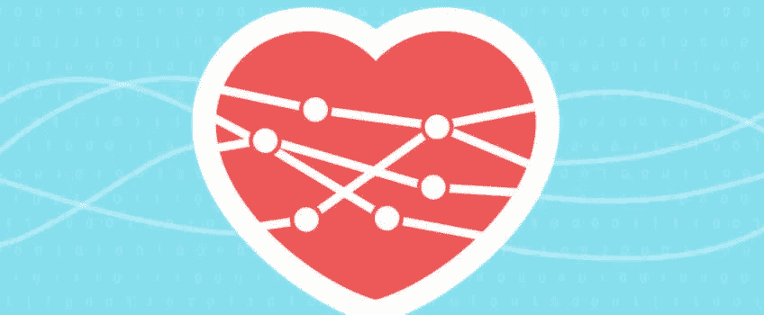
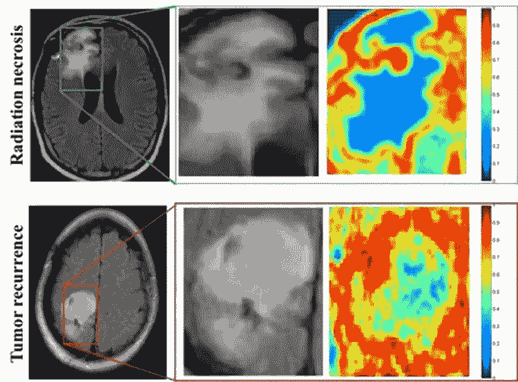
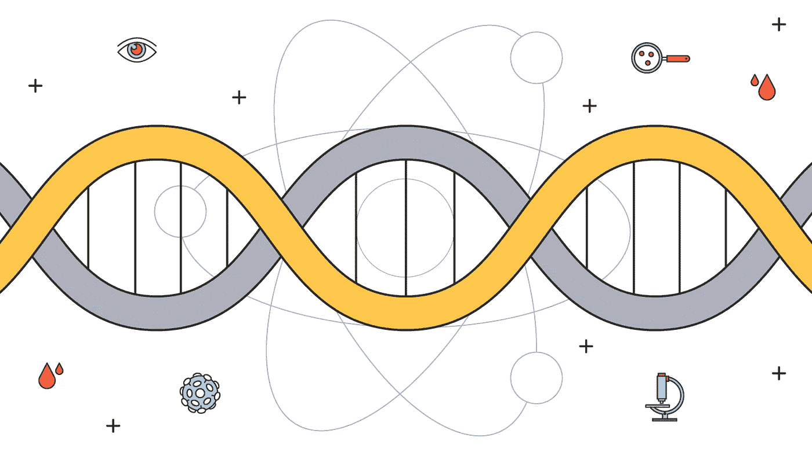
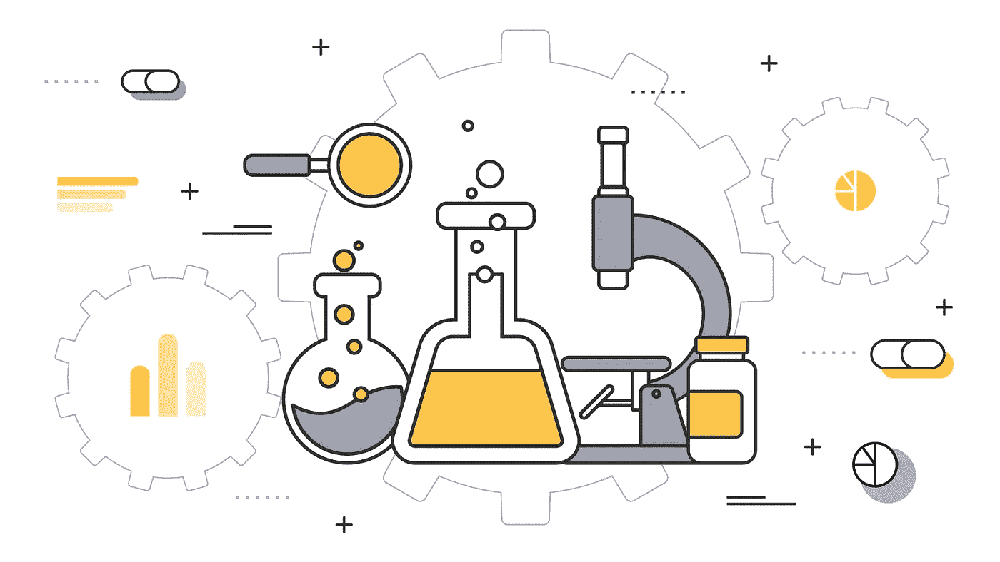
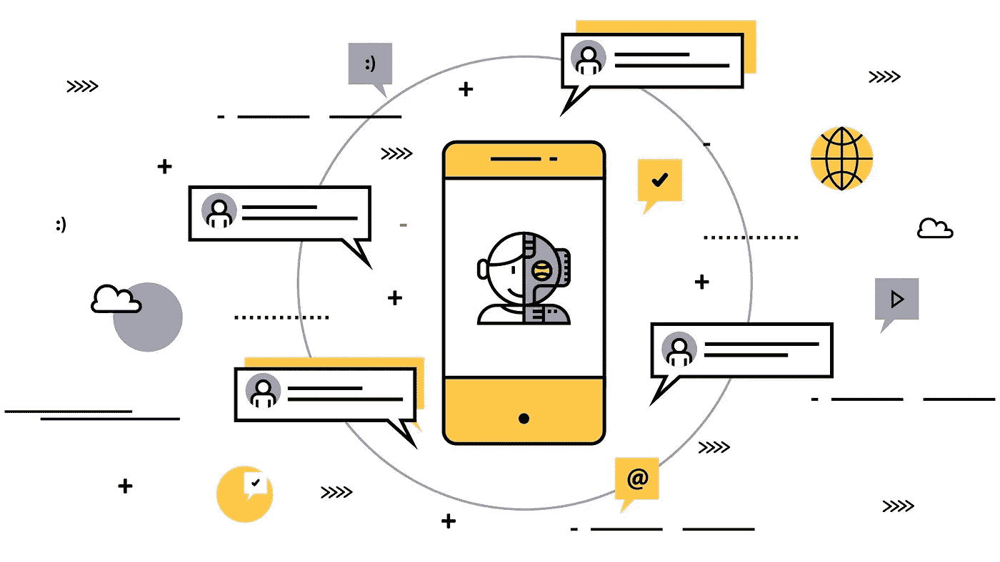
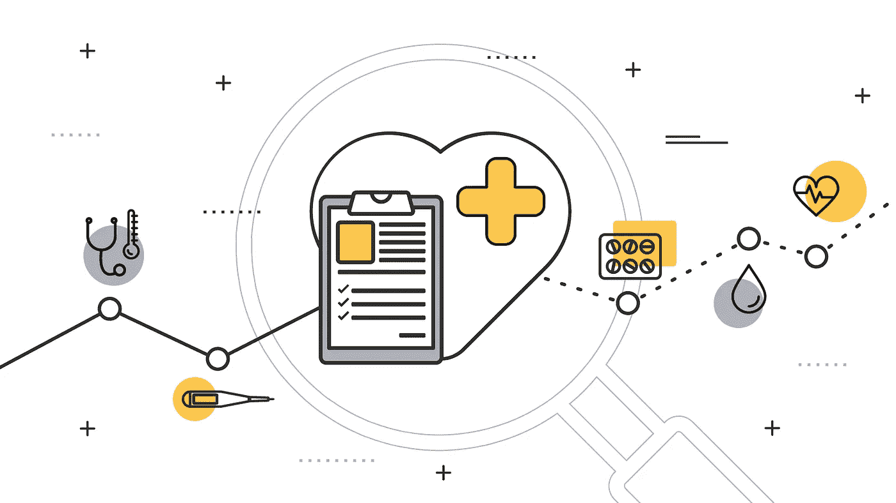

# 医疗保健中的数据科学

> 原文：<https://pub.towardsai.net/data-science-in-healthcare-5cc1a79aee05?source=collection_archive---------1----------------------->

对于实施数据科学解决方案而言，医药和医疗保健是一个革命性的、充满希望的行业。数据分析正在将医学科学推向一个全新的水平，从计算机化医疗记录到药物发现和遗传疾病探索。而这仅仅是开始。

医疗保健和数据科学经常通过财务联系在一起，因为该行业试图借助大量数据来减少支出。数据科学和医学正在快速发展，重要的是它们要共同进步。

以下文章讨论了数据科学的使用案例，这些案例对医学和医疗保健的未来发展具有最大的影响和最大的潜力。

# 医学图像分析

医疗保健行业从医学成像中的数据科学应用中获益匪浅。这一领域有很多研究，其中一项主要研究是发表在国际生物医学研究杂志上的[医疗保健中的大数据分析](https://www.hindawi.com/journals/bmri/2015/370194/)。根据这项研究，流行的成像技术包括磁共振成像(MRI)、X 射线、计算机断层扫描、乳房 X 线照相术等。许多方法被用来处理这些图像在形态、分辨率和尺寸上的差异。更多的正在开发中，以提高图像质量，更有效地从图像中提取数据，并提供最准确的解释。基于深度学习的算法通过从以前的例子中学习来提高诊断准确性，然后建议更好的治疗方案。

最流行的图像处理技术侧重于增强、分割和去噪，以便对器官解剖结构进行深入分析，并检测各种疾病状况。

最有前景的应用旨在检测肿瘤、动脉狭窄、器官描绘等。不同的方法和框架有助于医学成像的各个方面。 [Hadoop](http://hadoop.apache.org/) ，一个流行的分析框架，使用 MapReduce 为诸如肺纹理分类的任务寻找最佳参数。它将机器学习方法、支持向量机(SVM)、基于内容的医学图像索引和小波分析应用于固体纹理分类。

其他例子包括用于生物医学计算的 [iDASH](https://www.ncbi.nlm.nih.gov/pmc/articles/PMC3277627/) (整合数据进行分析、匿名化和共享)，用于处理大图像的[仓鼠/MPI GraphLab](http://pivotalhd-210.docs.pivotal.io/doc/2100/webhelp/topics/GraphLab.html) 等等。

# 遗传学和基因组学

遗传学和基因组学的研究使个性化治疗达到了更高的水平。目标是了解 DNA 对我们健康的影响，并找到遗传学、疾病和药物反应之间的个体生物学联系。数据科学技术允许在疾病研究中整合不同种类的数据和基因组数据，这提供了对特定药物和疾病反应中的遗传问题的更深入理解。让我们回顾一下最流行的技术和框架。

MapReduce 允许读取基因序列图谱，缩短了高效数据处理的时间。SQL 有助于检索基因组数据、BAM 文件操作和计算。[深度基因组学](https://www.deepgenomics.com/)在预测对 DNA 解释至关重要的遗传变异的分子效应方面产生了显著影响。他们的数据库使科学家能够理解基因变异如何影响遗传密码。

尽管近年来 DNA 测序技术取得了重大进展，但仍有许多有待探索，前景看起来令人鼓舞。由于基因和外部变量之间的持续相互作用，许多挑战仍然存在。一旦我们获得可靠的个人基因组数据，我们将对人类 DNA 有更深入的了解。先进的遗传风险预测将是向更多个体化治疗迈出的重要一步。

# 药物的创造

药物发现过程非常复杂，涉及许多学科。最伟大的想法往往受到数十亿次测试、巨大的财务和时间支出的束缚。平均来说，一种药物[正式提交](https://www.drugs.com/fda-approval-process.html)需要十二年时间。数据科学和机器学习算法简化并缩短了这一过程，为从药物化合物的初始筛选到基于生物因素的成功率预测的每个步骤添加了一个视角。这种算法可以使用先进的数学建模和模拟而不是“实验室实验”来预测化合物在体内的作用。计算药物发现背后的想法是创建计算机模型模拟作为生物相关网络，以高精度简化未来结果的预测。它允许选择应该做哪些实验，并将所有的新信息整合到一个连续的学习循环中。类似的技术被用来预测某些特定化学组合的副作用。

计算药物发现还改进了药物开发过程中不同类型的历史数据的收集和应用。将基因研究与药物-蛋白质结合数据库相结合可以带来显著的结果。此外，它允许针对不同细胞类型、基因突变和其他条件的每种可能组合来测试化学化合物。使用这些数据、无监督学习和下一代测序等技术，科学家可以建立模型，从各种独立变量中预测结果。

# 对患者和客户支持的虚拟帮助

临床过程的优化建立在这样一个概念上，即对于许多病例来说，病人实际上没有必要亲自去看医生。使用移动应用程序可以通过“将医生带到病人面前”来给出更有效的解决方案。人工智能驱动的移动应用程序可以提供基本的医疗支持，通常作为聊天机器人。你只需描述你的症状，或者问一些问题，然后从一个联系症状和原因的广泛网络中获得关于你的医疗状况的关键信息。应用程序可以提醒你按时吃药，如果有必要，还可以预约医生。这种方法通过鼓励患者做出健康的决定来促进健康的生活方式，节省他们排队等待预约的时间，并允许医生专注于更重要的病例。

机器学习算法使用自然语言处理和生成来提供正确的信息，创建用户状况的复杂地图，并提供个性化的体验。如今最流行的应用程序是你的。MD 、[巴比伦健康](https://www.babylonhealth.com/)、[阿达](https://ada.com/)等等。

通过这种方式，可以创建最合适的客户支持，这显然不能完全依赖医疗保健中的机器。因此，机器学习的主要任务是在医生和计算机之间找到完美的平衡。关键是自动化简单的例行程序，就像我们刚刚解释的那样，并给予专业人员专注于更复杂问题的能力。

# 预测医学:预后和诊断准确性

数据科学预测分析方法从历史数据中学习，并对结果做出准确预测。他们处理患者数据，理解临床记录，发现症状的相关性和关联性，熟悉的病史、习惯、疾病，然后做出预测。某些生物医学因素(如基因组结构或临床变量)的影响被考虑在内，以预测某些疾病的演变。常见的情况包括疾病进展的预后或预防，以减少风险和负面的结果。主要的好处是提高了病人的生活质量和医生的工作条件质量。

# 管理客户数据

在数据管理领域，机器学习允许创建全面的医疗数据登记册，其中所有的文书工作都将被转换为更有前景的数字形式。一个人的全部病史将储存在一个系统中。像支持向量机和光学字符识别这样的技术在这种数字化中是非常有用的。不断改进的机器学习算法将使使用和交换信息以辅助诊断和治疗决策成为可能，这是使用简单数据的巨大贡献。接下来，每个病人都可以使用电子卡，每个处理不同病例的医生都可以使用。

# 行业知识

医疗保健中的知识管理对于改善服务和提供最佳治疗至关重要。它意味着内部知识和外部产生的信息的结合。该行业变化迅速，新技术不断涌现，需要有效地收集、存储和分发各种事实。数据科学工具可确保不同知识来源的整合及其在治疗过程中的集体使用，这有助于医疗保健组织实现进步的结果。

# 结论

数据科学解决方案重塑了医药行业，揭示了新的见解，并将大胆的想法变为现实。随着数据量每天都在快速增长，技术也在不断改进，数据科学和医疗保健相结合的可能性也在不断扩大。

我们只涵盖了可能的用例的一小部分，这个列表可以不断补充。许多通用案例，如欺诈检测和自动化，适用于医疗保健行业，而一些特定案例仅适用于该行业。

总之，数据科学革新现代医学的潜力是巨大的，未来看起来光明而有希望。