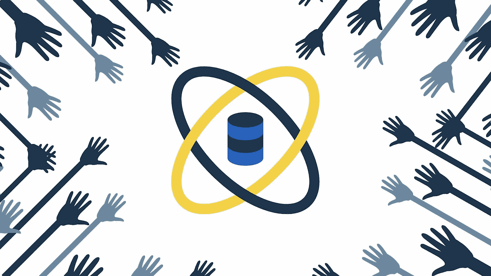

# 数据科学将会大众化(不到 10 年)

> 原文：<https://pub.towardsai.net/data-science-will-be-democratized-9263d6ac009d?source=collection_archive---------0----------------------->

## [数据科学](https://towardsai.net/p/category/data-science)

## 我们开始数据科学所需要的一切都是负担得起的和可获得的

数据科学的民主化——图片由作者[创建。](https://thuwarakesh.medium.com)

我相信第一次深刻的尝试是在 1985 年的*。一款革命性的软件改变了我们看待数据的方式。它允许普通人进行非凡的数据分析。我们称之为 [**Excel**](https://www.britannica.com/technology/Microsoft-Excel) ，最初是微软为 Machintosh 开发的。*

*从那时起，数据科学领域不断发展，每个人都可以访问。*

*   ***获取知识**有了显著的进步**。**如果你一直在听数据科学相关的采访，你可能会注意到十分之一的人会提到[吴恩达的机器学习课程](https://www.coursera.org/learn/machine-learning)。这是一个免费的在线资源，任何渴望成为数据科学家的人都可以使用。*
*   *负担得起的基础设施— 训练一个模特的花费还不到一杯咖啡。在云计算之前，人们购买重型硬件，并努力维护它。你可以租一辆，而且今天要便宜得多。如果你的机器学习模型需要在 96 CPU，192 GB RAM 的硬件上进行一个小时的训练，一个 EC2 实例只需要 4.08 美元。那是星巴克的一种咖啡摩卡。*
*   *开源软件统治世界。数据科学家的大部分工具箱都是开源软件。大多数商业用途也是免费的。数据科学的编程语言，比如 Python 和 R，也是开源的。与专有项目不同，全球开发者社区支持每一个开源项目。*
*   ***可访问数据—** 收集和维护数据变得前所未有的简单。移动应用程序跟踪十几种生物特征，并将它们存储在云中。只需点击几下，任何人都可以 ***创建一份调查，并在全球*** 分发。在大多数现代软件上配置云存储也不方便绑定到您的 SSO。*

*由于今天的这一改进，每个人都享受到了数据科学的巨大好处。很快所有剩下的障碍也会消失。 ***但是数据科学的进步会不会导致*** [***数据科学家的灭绝***](https://towardsdatascience.com/data-scientists-will-be-extinct-in-10-years-a6e5dd77162b) ***？****

# *什么造就了未来的数据科学家？*

*一些数据素养和批判性思维是答案。*

*卓越的数学技能，用一种以上的语言编程不再是必需的。任何高中生都知道足够多的数学知识，可以开始他们的数据科学之旅。*

*如果你是一名研究科学家，你可能不得不这样做。但是没有多少数据科学家在发明新的算法。相反，他们通过使用它们来解决实际问题。对于他们来说， ***算法是可配置的黑盒。*** 他们的内部始终无关紧要。*

*同样，你不必学习编程就能成为一名数据科学家。不再是了。您可以使用 KNIME、Rapid miner、AutoML 和 Data Robot 等工具。它们允许你在没有编程语言的情况下编写你的逻辑。*

* [## 如何在不编码的情况下成为一名了不起的数据科学家(+工程师)？

### 从数据中获得意义是常识。编码技能不是数据科学家或数据工程师的超能力。

towardsdatascience.com](https://towardsdatascience.com/become-a-data-scientist-or-data-engineer-without-coding-skills-fbf11ac8e278) 

案例研究:加拿大皇家银行树立了一个很好的榜样。他们的业务人员也擅长数据科学，拥有最新的技术。这是一份解释他们成功故事的白皮书。

实验服和护目镜不会成为化学家。同样，编程技能不会创造数据科学家。这只是一个偏好。* 

# *你的孩子不会像你今天一样解决同样的问题。*

*我们花了几十年的时间研究数据科学，让模型适应现实世界的问题。我们通过 ***手动调整超参数*** ，努力使预测准确。我们的大部分精力都去了 ***赤手空拳地编码*** 它们 ***和优化*** 它们 ***来匹配计算能力。****

*但情况正在发生变化。 ***超参数调*** ，我以为会一直保持手动， ***就是现在的*** [***半自动***](https://towardsdatascience.com/automated-machine-learning-hyperparameter-tuning-in-python-dfda59b72f8a) 。编程也正在摆脱诸如 [Github Copilot 这样的项目。](https://copilot.github.com/)*

*想想 ***数据科学给我们的孩子留下了什么，真是令人着迷。*** 但是有。他们的努力将更多地集中在问题定义上，而不是解决它们。因为如果定义良好，机器会解决它们的问题。*

*未来的几代人将不会为了准确性和性能而调整模型。 ***领域专家将接管*** 应用，而数据科学家将专注于发展科学本身。*

*这是数据科学的民主化。 按照现在的速度，不用再过十年就能实现。*

# *总而言之，*

*越来越多的人每天都能接触到数据科学。由于知识共享、基础设施、开源软件和数据访问方面的快速进步，这不仅限于高科技公司。*

*在未来，数据科学的应用将不再是数据科学家的角色。领域专家会用 KNIME 这样的好平台自己处理。*

*科学的发展将是数据科学家的责任。但这也不一样，因为即使像超参数调整和编程这样复杂的事情也是自动化的。*

> *谢谢你的阅读，朋友。看来你和我有许多共同的兴趣。一定要看看我的个人博客。*
> 
> ****在 [LinkedIn](https://www.linkedin.com/in/thuwarakesh/) 、 [Twitter](https://twitter.com/Thuwarakesh) 、 [Medium](https://thuwarakesh.medium.com/subscribe) 上对我说嗨。我会为你打破僵局。****

*还不是中等会员？请使用此链接 [**成为会员**](https://thuwarakesh.medium.com/membership) 因为我为你免费推荐赚取少量佣金。*