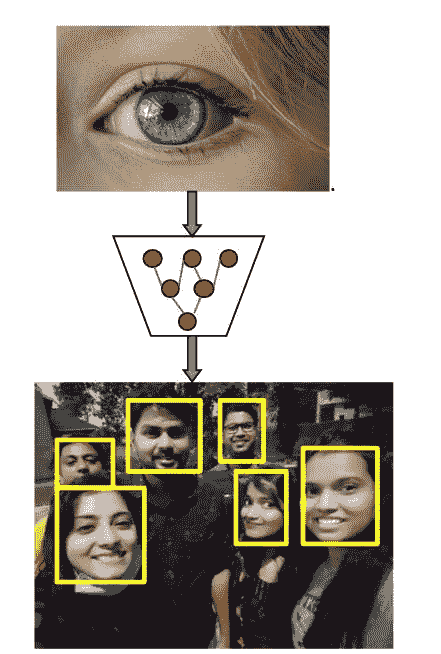
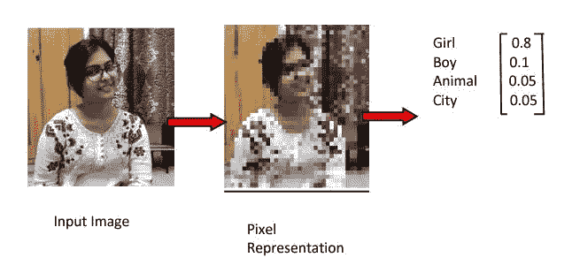
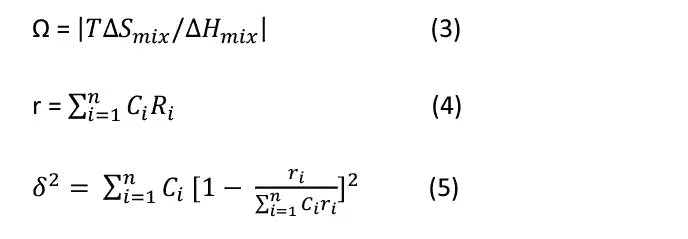
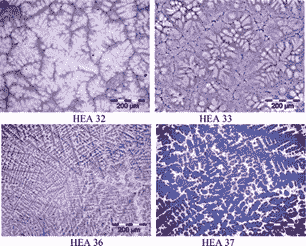
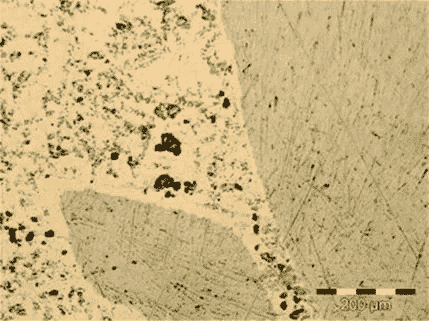
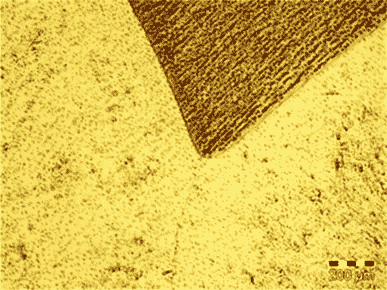
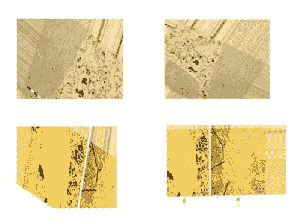
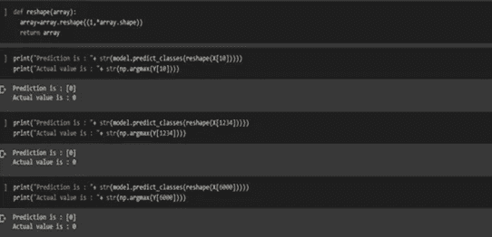
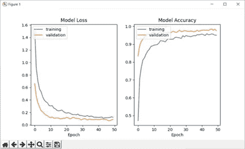

# 探测高熵合金中钽和铌碎片的深度计算机视觉

> 原文：<https://pub.towardsai.net/deep-computer-vision-for-the-detection-of-tantalum-and-niobium-fragments-in-high-entropy-alloys-5d0c2d8c988a?source=collection_archive---------2----------------------->

## [计算机视觉](https://towardsai.net/p/category/computer-vision)

*深度计算机视觉能够完成物体检测和图像分类任务。在图像分类任务中，特定系统接收一些输入图像，并且该系统知道一些预定的类别或标签集合。有一些固定的类别标签，计算机的工作是查看图片并给它分配一个固定的类别标签。卷积神经网络(CNN)在模式识别和机器学习领域获得了广泛的应用。在我们目前的工作中，我们构建了一个卷积神经网络(CNN)用于识别高熵合金(HEA)中钽和铌碎片的存在。在测试给定数据集时，结果显示 100 %的准确性。*

**简介**

视觉是人类拥有的最重要的感官。在日常生活中，人们依靠视觉来识别物体，挑选物体，导航，识别复杂的人类情感和行为。深度计算机视觉能够解决过去无法解决的异常复杂的任务。面部检测和识别以及检测是深度计算机视觉的一个例子。图 1 显示了视觉以图像或像素或视频的形式进入深度神经网络，底部的输出是人脸的描述[1–4]。

图 1 .深度计算机视觉的工作原理

下一件事应该是值得回答的问题，计算机如何处理图像或视频，以及它们如何处理来自这些的像素？图像只是数字，像素也有一些数值。所以我们的图像可以用数字组成的二维矩阵来表示。让我们以图像识别为例来理解这一点，即图像是男孩、女孩还是动物。图 2 显示了输出变量采用一个类标签，并可以产生属于特定类的概率。

图 2 .图像分类

为了正确地对图像进行分类，我们的管道必须正确地告诉我们特定图片的独特之处。卷积神经网络(CNN)在制造和材料科学领域得到应用。Lee 等人[5]提出了一个 CNN 模型，用于半导体制造过程中的故障诊断和分类。Weimer 等人[6]设计了深度卷积神经网络架构，用于工业应用中的自动特征提取。Scime 等人[7]使用 CNN 模型检测激光粉末床熔融添加制造中的原位加工缺陷。结果表明，CNN 架构提高了所设计系统的分类精度和整体灵活性。

在目前的工作中，我们设计了用于检测高熵合金(HEA)微结构中微量钽和铌的 CNN 结构。1995 年，Yeh 等人[8]首先发现了高熵合金，2004 年 Cantor 等人[9]将高熵合金作为一种多元体系。高能合金通常是由 5-35at 组成的先进合金和新型合金。%其中所有元素都表现为主要元素。与传统合金相比，它们具有高耐磨性、耐腐蚀性、高热稳定性和高强度等优越性能。张等人[10–11]列出了 hea 制造参数的各种参数，如下式所示:

hea 可应用于各种行业，如航空航天、潜艇、汽车和核电厂行业[12–14]。hea 也被用作微连接过程的填充材料[15]。Geanta 等人[16]对 AlCrFeCoNi 系统的军用 hea 进行了测试和表征。观察到在熔融状态下，HEAs 的微观结构具有冷冻外观，如图 3 所示。

图 3 .冷冻微结构的外观

**材料和方法**

Geanta 等人[17]制造了生物相容的 FeTaNbTiZrMo HEAs。在我们的研究中，我们使用了他们研究中的微结构数据。获得的微结构如图 4 和 5 所示。数据收集是从无数不同来源收集和测量信息的过程。为了使用我们收集的数据来开发实用的人工智能(AI)和机器学习解决方案，必须以对手头的业务问题有意义的方式收集和存储这些数据。因为我们缺少图像，所以我们首先做了图像增强。

图 4 . FeTaNbTiZrMo 合金中未溶解的 Ta 和 Nb 碎片[17]。

图 5 . FeTaNbTiZrMo 合金中未溶解的钽碎片。

图像数据扩充用于扩展训练数据集，以提高模型的性能和概括能力。Keras 深度学习库中通过图像数据生成器类支持图像数据增强。因此，输入数据由两幅图像组成。正如我们所知，我们不能只用两幅图像来训练我们的深度神经网络，因为这将导致模型的过度拟合。过度拟合模型基本上意味着我们的模型将在训练数据上给出最好的分数，但在测试或验证数据或它以前没有见过的数据上给出最好的分数。因此，这样一个过度拟合的模型将无助于有效地训练我们的模型，我们将在这些输入图像的帮助下制作更多的图像。我们将通过图像增强来实现这一点。

图 5 . FeTaNbTiZrMo 合金中未溶解的钽碎片。

我们可以使用图像数据生成器类来实现这一点。首先，我们将制作这个类的对象。之后，我们将提供一些参数，这些参数基本上是我们想要提供图像的波动或特征，如发光强度、宽度移动范围、高度移动范围等。通过在函数中提供路径，我们可以遍历保存图像的目录。这样，我们可以生成大量的数据。在这个项目中，我们为每个图像生成了大约 3000 个图像。

我们创建了两个数据集用于训练和测试。Python 编程用于开发构建卷积神经网络架构所需的代码。卷积神经网络(ConvNet/CNN)是一种深度学习算法，可以接受输入图像，为图像中的各个方面/对象分配重要性(可学习的权重和偏差)，并能够区分彼此。与其他分类算法相比，ConvNet 中所需的预处理要低得多。在原始方法中，滤波器是手工设计的，经过足够的训练，ConvNets 有能力学习这些滤波器/特性。

**结果和讨论**

微观结构的放大图像如图 6 所示。

图 6 .微观结构的放大图像

模型是用损失-二进制交叉熵和度量-准确性编译的，优化器是 adam。为了防止模型过度拟合，使用了早期停止和模型检查点，以防止模型过度训练。早停基本上就是模型没有任何改进就停止训练的过程。该参数是在制作其对象时提前停止提供的。这个参数被称为耐心。在此基础上，还提供了度量和模式作为测试模型的参数。假设度量是值准确性，模式是最大值，所以当模型没有显示任何改进(值准确性的增加)时，它将等待直到耐心参数，之后，它将停止。当我们针对未标记的图像训练我们的模型时，结果相当令人满意。正如我们在图 7 中看到的，在预测过程中，几乎每个实际值都与预测值匹配，因此我们的模型得到了有效的训练。

图 7 .预测值与实际值相符

图 8 中的图表显示了训练时指标的变化。如我们所见，模型损耗随着时间的增加而变得更低，精度随着时间的增加而增加。

图 8 .显示模型损失和模型准确性的图表

**结论**

可以得出结论，目前的研究基本上是关于图像处理和分类的，其中我们首先由于数据短缺而收集数据，我们进行数据扩充以训练我们的深度学习模型，之后，我们实现了我们的模型架构并完成了编译。训练结束后，显示结果。观察到预测值与实际值相匹配，导致对存在于 HEAs 中的碎片的图像分类的良好准确性。

***参考文献***

[1]福塞斯，大卫和让庞塞。现代方法。普伦蒂斯霍尔专业技术参考，2002 年。

[2]蒙迪、J.L .和齐塞曼编辑。, 1992.计算机视觉中的几何不变性(92 卷)。麻省剑桥:麻省理工学院出版社。

[3] Bradski，g .和 Kaehler，a .，2008 年。用 OpenCV 库学习 OpenCV:计算机视觉。奥莱利媒体公司。

4 r . j . Schalkoff，1989 年。数字图像处理和计算机视觉(第 286 卷)。纽约:威利。

[5] Lee，K.B .，Cheon，s .和 Kim，C.O .，2017。用于半导体制造过程中故障分类和诊断的卷积神经网络。IEEE 半导体制造汇刊，30(2)，第 135-142 页。

[6]魏默博士、舒尔茨-赖特尔博士和什皮塔尔尼博士，2016 年。工业检测中自动特征提取的深度卷积神经网络结构设计。CIRP 年鉴，第 65 卷第 417-420 页。

[7] Scime，l .和 Beuth，j .，2018 年。一种用于激光粉末床熔融添加制造过程中的自主异常检测和分类的多尺度卷积神经网络。添加剂制造，第 24 卷，第 273–286 页。

[8]叶，陈，林世军，等.多主元纳米结构高熵合金:新型合金设计概念和结果.高级工程材料。2004;6(5):299–303

[9] Cantor B .高熵合金。载于:Buschow KHJ，Cahn RW，Flemings MC，Ilschner B，Kramer EJ，Mahajan S 等编辑。材料百科全书:科学与技术。国际标准书号 978–0–08043152–9

[10]叶，陈，林世军，等.高熵合金——新的开发时代.材料科学论坛。2007;560:1–9

[11]张 Y，周，林 JP，等.多元合金的固溶相形成规律.高级工程材料。2008;10(6):534–538

[12]周，张 Y，王，等.具有优异室温力学性能的 AlCoCrFeNiTix 固溶体合金.应用物理学快报。2007;90(18):1904

[13]森科夫上，威尔克斯 GB，斯科特 JM，奇迹 DB。Nb25Mo25Ta25W25 和 V20Nb20Mo20Ta20W20 耐火高熵合金的力学性能金属间化合物。2011;19:698–706

[14]林 CM，蔡 HL。高熵 Al0.5CoCrFeNi 合金的显微组织、硬度和腐蚀性能的演变金属间化合物。2011;19(3):288–294

[15]Ashutosh Sharma(2020 年 4 月 6 日)。用于微纳米连接应用的高熵合金[在线优先]，IntechOpen，DOI: 10.5772/intechopen.91166。可从:[https://www . IntechOpen . com/Online-First/high-Entropy-Alloys-for-Micro-and-nano joining-Applications](https://www.intechopen.com/online-first/high-entropy-alloys-for-micro-and-nanojoining-applications)

[16]维克多·格安塔和尤内利娅·沃伊库列斯库(2019 年 10 月 23 日)。用于军事应用的 AlCrFeCoNi 系统的高熵合金的表征和测试[在线优先]，IntechOpen，DOI: 10.5772/intechopen.88622。

[17] .维克托·吉安塔、约内莉亚·沃伊库勒斯库、佩特里卡·维祖雷亚努和安德烈·维克托·桑杜(2019 年 9 月 21 日)。医用高熵合金[在线首发]，IntechOpen，DOI: 10.5772/intechopen.89318。