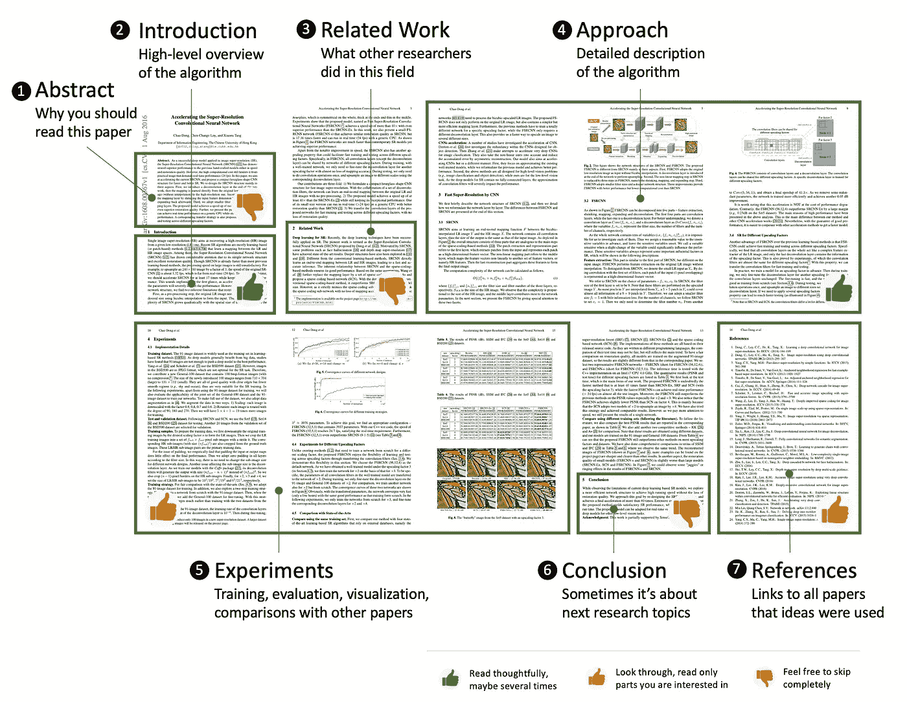

# 学习实现论文:初学者指南

> 原文：<https://pub.towardsai.net/deep-learning-d44474891d2c?source=collection_archive---------0----------------------->

## [深度学习](https://towardsai.net/p/category/machine-learning/deep-learning)

## 关于如何理解深度学习论文和实现所描述的方法的分步指导。

来源:https://arxiv.org/abs/1608.00367

对于数据科学家来说，能够实现最新的科学论文是一项极具竞争力的技能。因为没多少人能做到。

如果你想成为一名思想家，了解黑匣子里正在发生的事情，激发你的创造力，或者成为第一个将最新科学研究引入商业的开发者——这篇文章就是为你准备的。

今天我们将讨论如何选择一篇“好”的论文，这对初学者来说相对容易；我们将概述典型的论文结构和重要信息的位置；我会给你一步一步的指导，告诉你如何实现纸质实现，并分享一些链接，当你遇到困难时，这些链接会对你有所帮助。

# 从哪里开始？

如果你希望你的学习顺利，没有压力，你应该找到一个“好”的论文。作为起点，我真的推荐你选择一篇 ***古老且被高度引用的论文*** 来描述你所熟悉的概念。

*   老的高被引论文通常解释非常基本的概念，成为最近研究的基础。你知道基本原理——你也会更好地理解最近的论文。对于深度学习来说，2016 年之前的论文被认为已经很老了。
*   高被引论文可复制。这意味着许多其他科学家能够理解和实施这种方法。要想知道某篇论文被引用的次数，可以在谷歌学术谷歌一下。引用次数超过 1000 次的论文被认为是高被引论文。
*   通常，较老的论文描述的是较简单的概念，这对于初学的你来说是一大加分。

# 论文结构:跳过什么，阅读什么

典型的深度学习论文具有以下结构:

1.  摘要
2.  介绍
3.  相关著作
4.  细节方法
5.  实验
6.  结论
7.  参考

典型深度学习论文的结构。作者图片

**1。摘要**是“营销”的总结。它很短，重点是为什么这种方法比以前的方法更好，以及它的新颖之处。摘要发表在会议日程和在线档案中(如 [Arxiv](https://arxiv.org/) )，它们唯一的目标就是说服你阅读这篇特定的论文。你已经选择了一篇论文来阅读(并实施)——所以请随意跳过摘要。

**2。简介**是一个重要的章节，也是必读的。它给出了该方法的高级概述。通常情况下，它并不太专业，而且非常“人性化”，所以先阅读介绍部分，在深入研究算法细节之前，先预热一下大脑。

**3。相关工作**。所有科学论文(以及深度学习)都是相关的:每一项发现都是建立在数十名研究人员之前的工作基础上的。相关工作概述是每篇论文的必修部分。作者必须确保他们的工作是相关的，解决重要的问题，并且不重复其他研究人员以前做过的工作。这对于科学界来说是一个重要的部分——但对于我们(从业者)来说不是，所以跳过它！
(好的。有时你可能需要它——但只是在你寻找该领域其他基本论文/概念的情况下。)

**4。详细介绍**。有趣的事情开始了。这是论文中最复杂和最具挑战性的部分，也是最重要的部分(一定要读！).不要期望太高，也不要期望从一次阅读中理解所有的东西。这是你在编码时会一次又一次回来的部分。

不要害怕复杂的公式，大多数情况下，它们解释的是基本概念。我相信研究人员就是这样开玩笑的。过一会儿，你会习惯的。

在阅读论文时，捕捉你可能需要的所有信息——数据预处理技术、详细的神经网络架构、损失函数、训练技巧和后处理。尽你所能去得到它。如果你试了几次还是不明白，没关系，以后我会告诉你怎么做。

**5。实验**。这个部分充满了图表、表格和图像。通常，它包含有关数据集、训练和评估的详细信息，以及对该模型在各种超参数下的表现以及与其他论文中最先进方法的比较的综述。如果论文是关于计算机视觉的，也会有模型预测的可视化。我会说这一部分是你唯一感兴趣的部分。

**6。结论**是论文的总结，有时包含作者对未来研究的想法。你应该跳过它。

7 .**。参考文献**。科学界(不仅仅是科学界)有一条严格的规则:如果研究人员使用了属于他人的观点，他/她需要添加对原始作品的引用(引用)。当这些参考文献中的概念已经在论文中解释过，或者不重要时，你可能会跳过大部分这样的参考文献。然而，有时作者可能会说:“我们使用了论文[2]中描述的模型架构，只修改了最终层中的激活”。在这种情况下，你需要找到并阅读文章[2]来完全理解这种方法。

现在——该读报了。关掉音乐，把手机调到飞行模式，喝杯茶。在接下来的 30 分钟里，你应该高度集中注意力，因为你正在潜入一个新的世界——令人兴奋，但相当具有挑战性。

# 去哪里寻求帮助？

对许多人来说，“实现论文”意味着“快速阅读论文，然后在互联网上寻找现成的实现方法”。这是最简单的方法，但不是有益的方法。我真的建议你从头开始，不要马上寻找现成的解决方案。至少自己做些事情——那是你学习的时候。

即使你是一个完全的实施论文的初学者，你总是有一些事情可以做:

**下载数据集，探索它，编写一个数据加载器。**

简单易行的任务，但一旦完成，它会给你信心并帮助你继续前进:

*   开始写模型架构，简化或者跳过不理解的部分。有一个奇怪的权重初始值设定项——现在跳过它，使用默认的。您以前从未使用过 PReLU 激活，请改用 ReLU。你现在的目标是创建一个可训练的模型，不是纸上谈兵的模型或者性能好的模型，只是可训练的。它有输入，有输出，所以你可以运行培训。
*   论文中有一个自定义丢失——用深度学习库中实现的类似的替换掉。
*   对优化器、数据扩充、后处理做同样的事情——简化或跳过。

你最终会被征召入伍。你甚至可以训练一下草稿，看看效果如何——也许结果不会那么糟糕🙂

然后填补空白，修复工作不佳的部分。首先，自己进行实验——测试你在写草稿时想到的想法，再读一遍论文，希望能抓住你之前漏掉的概念。如果你很快就卡住了，不要沮丧。你写了一份草稿，这是一个很大的进步，你已经学到了很多。所以下一次，下一篇论文你会写得更好。这是一个学习的过程。

感觉完全卡住了？搜索的最佳时机。

记住，我建议你选择一篇高被引论文。现在你会感受到好处。流行的报纸在互联网和博客上有许多描述复杂部分的实现。尽情享受吧！

第一个要检查的地方是代码为的[论文，这是一个很大的库，可能包含了所有流行论文的代码实现。这些实现要么是官方的，要么来自像你我这样的研究人员。例如，在 PyTorch 和 Tensorflow 中，word2vec 在代码为](https://paperswithcode.com/)的论文上有 [67 个实现。](https://paperswithcode.com/paper/efficient-estimation-of-word-representations)

你可以复制粘贴，但是要花时间去理解这些代码。这是最后一条建议。

# 祝你好运！

再一次:

1.  选择一篇旧的高被引论文。
2.  通读一遍，尽量抓住——数据准备、模型架构、损失函数、训练细节。
3.  什么都不懂也不要难过。
4.  通过跳过和简化您不理解的概念来创建一个实现草案。如果你的草稿与论文中的方法相差甚远，也没关系。
5.  试着自己去完善草稿。
6.  当你遇到困难的时候——在互联网上寻找文章和用纸实现的代码。复制粘贴，但要阅读理解。
7.  把你的工作包装成 Github 项目(为什么不呢？).看，[我是怎么做到的](https://github.com/OlgaChernytska/Super-Resolution-with-FSRCNN)。
8.  用一篇新论文重复。感受一下第二次有多顺利🙂

真正的学习发生在步骤 2-5，所以你在这里花的时间越多，你学得越快。祝你好运！

# 下一步是什么？

如果你想了解更多关于纸张实现的内容，请查看我的其他帖子:

*   [学习复制论文:初学者指南](https://towardsdatascience.com/learn-to-reproduce-papers-beginners-guide-2b4bff8fcca0\)(这是当前帖子的一个较长版本，附有一个论文实现示例)
*   [Word2vec 带 PyTorch:实现原纸](https://towardsdatascience.com/word2vec-with-pytorch-implementing-original-paper-2cd7040120b0)