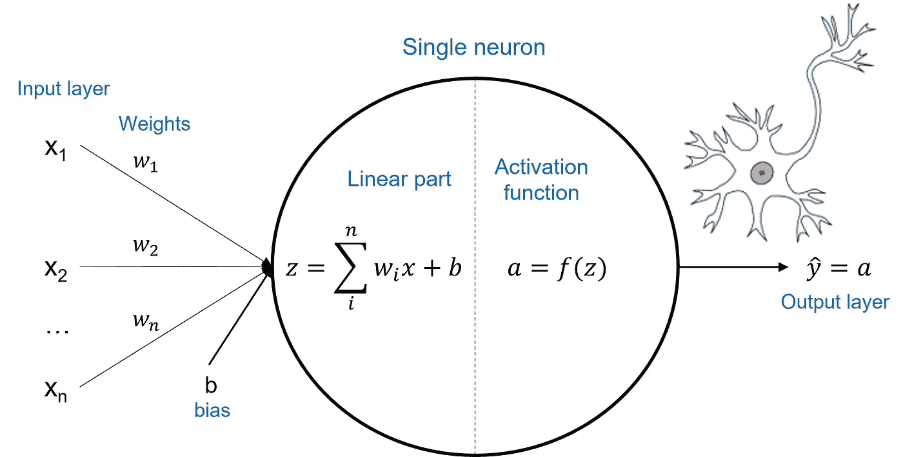
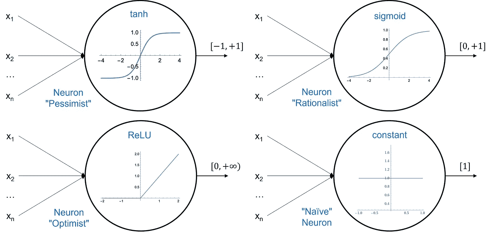
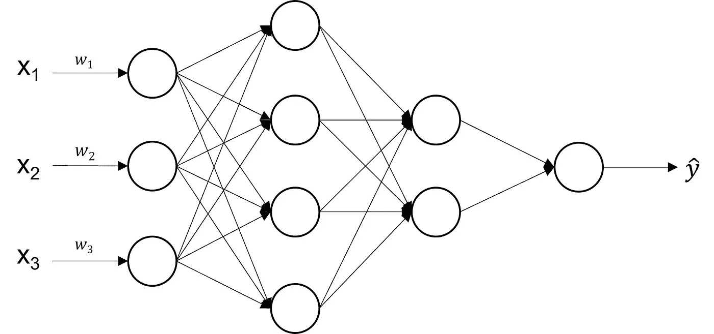
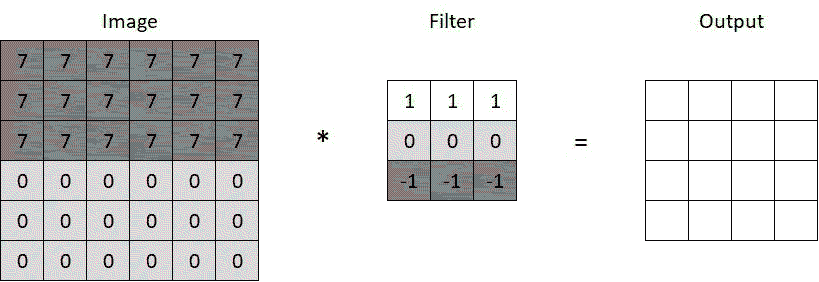
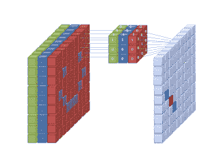

# 简化的深度学习:像神经网络专家一样感觉和说话

> 原文：<https://pub.towardsai.net/deep-learning-simplified-feel-and-talk-like-an-expert-in-neural-networks-911dce0765e9?source=collection_archive---------0----------------------->

## 关于多层感知器、卷积神经网络和序列网络感觉超级聪明的 15 分钟指南

尼古拉·特斯拉和他的磷光灯泡约 1890 年(图片来自[维基共享资源](https://commons.wikimedia.org/wiki/File:Tesla-bulb.jpg#/media/File:Tesla-bulb.jpg)

答人工智能(AI)、机器学习(ML)、深度学习、人工神经网络(ANN)是大家都在谈论的热门词汇，通常可以互换使用。但是我们当中有多少人真正理解它们的意义和区别呢？听到不熟悉的术语，如多层感知器、前向传播、反向传播和梯度下降，可能会使我们许多人感到困惑。所以，让我们把它确定下来，下次有人再谈论这个话题时，我们会觉得自己超级聪明。掌握新现象的最好方法是通过类比我们都可以联系到的东西——人类！

# 内容

*   作为灵感的人脑
*   多层感知器(MLP)
*   卷积神经网络
*   像人类一样，神经网络从错误中学习得最好
*   深度学习框架
*   像人类一样，深度神经网络可以共享知识
*   序列网络
*   深邃伟大的思想

# 作为灵感的人脑

**人工智能**的最终目的是取代自然智能，复制人类行为，包括学习、理解、推理、解决问题和感知。为了创造智能人工智能系统，我们需要“模仿”人脑。无处不在的人工系统已经成为新的标准，成为我们日常生活的一部分:自动驾驶汽车、机器人、语音识别、聊天机器人(我知道这是相当烦人的“生物”)、GPS 导航、医疗保健专家系统、图像识别、在线语言翻译、个人购物者等等。

**机器学习**是人工智能和计算机科学不可或缺的一部分，它利用数据和计算机算法来模拟人类的行为。

**深度学习**是机器学习最令人兴奋的领域，也是当前最先进的技术，在许多人工智能领域取得了一些惊人的成果，包括环境智能、物联网(IoT)、机器人、专家系统、计算机视觉和自然语言处理(NLP)。

受大脑神经元和大脑视觉和记忆功能部分的启发，人工智能科学家创建了三种主要类型的深度学习网络:**多层感知器**(MLP)——模仿大脑神经元，**卷积神经网络**(conv net)——受人类大脑视野中对刺激的反应的启发，以及**序列网络**s——模仿人类的记忆过程。

深度神经网络与人脑的类比(图片由作者提供)

所有三种类型网络的构建原理都是相似的。使用它们的基本组成部分(感知器、过滤器或存储单元)，我们通过创建不同大小的网络层并将它们堆叠在一起来构建网络——有点类似于乐高积木。我们堆叠的层越多，网络就越深，因此，产生了深度神经网络和深度学习这个术语。

为了处理速度，我们可以牺牲尽可能多的深度。如果你对一个网络能有多深感到好奇，那么《*用回旋更深入》* [1]是一本很好的读物！本文的标题灵感来自电影《盗梦空间》中一句经常被引用的话:

> *我们需要更深入*。

最棒的是，这三种网络类型的层可以合并，这是人工智能科学家的最新趋势，他们创造了这种异构网络，取得了令人兴奋的结果。稍后会详细介绍。

继续阅读，了解三种网络类型及其基本组成的更多细节，了解神经网络如何学习以及如何共享知识，最后，发现当前最新和最伟大的深度网络思维。

# 多层感知器(MLP)

同义词:密集层、全连接层

## 感知器是网络的组成部分，激活函数是刺激

同义词:感知器、单层感知器、人工神经元

感知器是 MLP 神经网络的最小组成部分。它有一个带有多个输入信号的输入层和一个由单个神经元组成的输出层。

感知器(左图作者)与大脑神经元(右上图来自[维基百科](https://en.wikipedia.org/wiki/Neuron))

分配给输入信号的权重代表每个信号的重要性。在应用激活函数*产生单个输出(预测)之前，神经元将输入及其权重汇总成线性函数 ***z*** 。*

*输出值的范围由激活函数的类型定义。最常见的激活函数是 *tanh* (双曲正切)、 *ReLU* (校正线性)和 *sigmoid* 函数。下图显示了这三个函数以及一个名为*常量*的函数，在这种情况下，该函数在功能上是无用的。它出现仅仅是为了好玩和帮助记忆。也就是说，根据 y 轴上函数值的范围，所有四个神经元都与四种不同的性格有关:悲观主义者、理性主义者、乐观主义者和天真。*

*例如， *ReLU* 函数只给出从零到无穷大的正值，因此被称为“乐观主义者”。导致负的 ***z*** 值的加权输入的任何线性组合，在应用 *ReLU* 函数之后，在输出端给出零值；而正的 ***z*** 值在应用 *ReLU* 后保持不变(如下图左下方)。*

*下图中标记为“理性主义者”的感知器是*逻辑回归*，这是最简单形式的神经网络。它的输出值范围从 0 到 1，因此非常适合预测概率和分类任务。*

**

*人类个性与激活功能的“类比”:tanh、sigmoid 和 ReLU(作者图片)，激活功能由[wolframalpha.com](https://www.wolframalpha.com/)创造*

## *MLP 建筑*

*纵向和横向堆叠在一起的神经元组合成一个称为多层感知器的神经网络。MLP 由输入图层、输出图层以及二者之间的一个或多个隐藏图层组成。输入层是向网络提供数据的插件，不执行任何计算—它是网络的眼睛和耳朵。输出层给出的模型响应是预测，是做出明智决策的触发器。隐藏层或特征图是堆叠在一起的神经元的集合。*

*一层中的每一个神经元都与下一层中的每一个神经元相连，形成了完全连接的层——这是 MLP 的另一个同义词。但是，决定每层有多少神经元以及需要多少层往往具有挑战性，需要数据科学家提供科学和创造性的解决方案。至于隐藏层数，黄金法则就是少花钱多办事。所以，从包括逻辑回归在内的最简单的网络结构开始！至于每层(节点、单元)的神经元数量，经验法则是层输入数量的一半。*

*在数学上，MLP 是一个非线性模型，因此，非常适合描述复杂的现实世界的问题。每个节点解决一个“小”问题，并有助于解决一个“大”问题——类似于人类的思维过程。*

**

*具有输入图层(X)、输出图层(y 形帽)和三个隐藏图层(图片由作者提供)的 MLP*

# *卷积神经网络*

*缩写:ConvNet，CNN*

## *滤波器是网络的组成部分，卷积函数是激励源*

*同义词:过滤器、内核*

*滤镜就像照相机上的镜头，旨在提取和增强图像中的特殊图案(特征)。应用于图像数据(像素)的过滤器产生较小维度的回旋特征图。类似地，像感知器一样，每个过滤器解决一个“小”问题，更多的过滤器配合在一起有助于看到“大画面”。*

*假设我们想要检测穿过下面 6x6 像素图像中间的水平边缘。我们可以使用一个类似于同一张图片中的滤镜，用一些水平排列的数字来表示颜色强度。我们运行卷积操作(*)，它扫描整个图像，如动画 gif 所示。在每次扫描时，图像和滤波器的相应像素相乘(7、0 或-7)，乘积相加(例如 3x7x1+3x0x0-3x7x1=0)，结果存储在卷积输出中。下面复杂输出中间突出的水平线证实了过滤器识别水平线的能力——一个简单而强大的概念。*

**

*使用过滤器检测图像水平边缘的卷积运算过程(gif 图像由作者提供)*

## *ConvNet 架构*

*ConvNets 通过多个滤镜、通道和图层处理视觉数据。**应用于图像数据(即像素)的过滤器**产生回旋层的特征图，每个图是输入图像的不同版本。卷积网络可以为单个图像并行编排数百个过滤器。图像**通道**代表颜色。通常，对于红色、绿色和蓝色中的每一种颜色，每个滤镜有 3 个通道。*

**

*具有红、绿、蓝三个通道的图像过滤器(图片来自[维基共享资源](https://commons.wikimedia.org/wiki/File:Convolutional_Neural_Network_with_Color_Image_Filter.gif))*

*卷积**层**有 3 个维度:高度、宽度和深度。层的高度和宽度由图像和滤镜大小定义。层的深度等于用于创建层的滤镜数量。*

*分层排序的层以前馈方式处理视觉信息。ConvNet 架构由不同类型的层组成。它通常是卷积层(a 必须拥有)、池层(a 应该拥有)和全连接层(a 可能拥有)的组合。*

*汇集层有多种用途。它们减小了图像表示的大小，加速了计算，可以增强图像特征，并使 ConvNet 更通用，并确保对象的存在与对象位置无关。*

*全连接层(MLP 层)通常被添加到网络的深层，用于图像分类。例如，下图中 VGG 16 网络的最后四层是全连接层。该网络接受了 130 万张图像的训练，可以识别 1000 种不同的物体。网络由输入层(图像)、卷积层(灰色)、汇集层(红色)和全连接层(蓝色)组成。最后，输出层(绿色)是具有 1000 个神经元的 softmax 层，这相当于网络被训练识别的对象的数量。*

**

*用于图像识别的 VGG-16 卷积神经网络结构(图片来自[维基共享资源](https://commons.wikimedia.org/wiki/File:VGG_structure.jpg#/media/File:VGG_structure.jpg)*

*构建这些层可以被认为是一门科学和一门艺术。有许多参数和无数的组合。此外，还有许多约束需要考虑，包括层数、每层的大小、网络形状、速度或训练、精度等等。高效的深度网络架构需要专家的知识、技能和想象力来掌握。*

*虽然 ConvNets 是为图像识别而创建的，但它们也可以成功地用于一维空间，如音频和时间序列数据。*

> *像人类一样，神经网络从错误中学习得最好*

*任何网络都是不切实际的，除非我们通过**训练**让它变得智能。训练过程可以类似于时间旅行——它旅行到未来以看到结果(预测)。如果不满意，它会回到过去，调整一些参数，并投射回未来以查看新的结果，就像下面的动画图像一样。就这样，它不断前进后退，直到找到最优结果。*

*在神经网络术语中，这种时间传播被称为**正向**和**反向传播**。正向传播从随机分配权重开始，即输入要素的重要性。然后它从左到右运行，其中一层的神经元接受来自前一层的输入，应用激活函数并将结果传递给输出，输出又成为下一层的输入。正向传播在输出层给出预测。真实输出( *y* )和预测输出( *y-hat* )之差就是误差或**损失函数**。整个训练样本的损失总和代表总成本函数。*

**

*神经网络训练过程(gif 图片由作者提供)*

*成本是我们总是试图最小化的东西。在神经网络中，这是使用**梯度下降**算法实现的。梯度下降的目标是找到最小化成本函数的网络参数。梯度下降通过以尽可能少的步骤找到向最小值下降的陡坡来做到这一点。下图说明了这一过程。在数学术语中，这些斜率被称为梯度或成本函数的偏导数，它们是在反向传播过程中计算的。*

**

*寻找最小值函数的梯度下降动画(gif 图片来自[维基共享](https://commons.wikimedia.org/wiki/File:Gradient_descent.gif#/media/File:Gradient_descent.gif)*

*在每次迭代中，前向传播从左到右提供预测，后向传播从右到左提供损失并调整权重，这些权重又被前向传播用于下一次迭代。在模型训练的开始，当我们随机分配权重时，损失是高的，但是当它从以前的错误中学习时，它在每次迭代中减少！一旦它知道哪个最佳权重产生最小成本，从而产生最佳预测，整个过程就完成了！权重(参数)是使网络智能化的因素——在给定新输入数据的情况下，可以放心地将相同的权重应用于预测类似的现实世界问题。*

# *深度学习框架*

*深度学习网络可以使用基本的数学运算来构建和训练，但这将是一项涉及大量微积分和代数的西西弗任务。幸运的是，有一些专门设计的框架，比如 TensorFlow、Keras、PyTorch 和 Theano，它们速度快，使用相对简单，更健壮，并且在实践中更容易实现。*

*为了使用其中一个框架构建一个网络，我们需要指定层的数量和类型、每层神经元/过滤器的数量、激活函数等等。这些框架配备了一组预定义的激活功能，但也允许自定义功能，这是研究人员特别感兴趣的。我们还可以指定一个优化器来最小化总成本函数；我们要如何衡量损失，即真实值和预测值之间的差异；以及使用什么度量来评估模型性能。此外，我们指定我们希望成本函数多快达到最小值(**学习速率**，设置向前-向后迭代的次数(**时期**，以及每次迭代的样本数量(**批量**)。至于批量大小，我们可以使用整个输入数据、单个观察值或介于两者之间的小批量数据。*

*使用深度学习框架，我们可以控制过度拟合——当一个模型在训练数据上表现很好，但在新(看不见的)数据上表现很差时，这是一种不良影响。所有这些网络参数统称为**超参数**，它们的值会因网络而异，必须根据经验进行设置。超参数优化是深度学习框架的另一个商品，它可以找到一组最佳的参数值，从而获得最佳的模型性能。*

> *像人类一样，深度神经网络可以共享知识*

*训练复杂的神经网络模型需要时间和巨大的计算机能力。好消息是，我们可以通过应用预先训练的模型来解决类似的问题，并节省时间、资源和大量的挫折，从而重用这些模型！这叫做**迁移学习**，是深度学习网络的妙处。*

*有许多方法可以应用迁移学习。例如，我们可以简单地删除预训练网络的输出层，并用新层替换它；或者，我们甚至可以用新的层替换网络中的多个层，并简单地用新数据训练网络的那个部分。*

*深度学习框架提供迁移学习能力。假设我们想训练一个网络，从图像上识别车辆和行人。我们可以使用预先训练好的网络进行图像分类，而不是从头开始，例如上图中的 VGG-16，它在 Keras 深度学习框架中可用。我们可以通过几个简单的步骤来实现这一点:导入模型，保留其所有层及其预训练的权重，并用另一个只有 2 个神经元的 softmax 层来替换只有 1000 个神经元的最终(绿色)softmax 层，因为我们只需要识别两个类别——行人和车辆。一旦我们修改了网络，我们只用新的输入图像来训练最后一层，就这样！我们已经创建了一个快速、简单、智能的网络，能够识别车辆和行人！*

*另一个迁移学习的伟大例子是神经风格迁移的 conv net[2]，它产生了 AI 艺术图像。预先训练的 VGG 网络的特定层已经被用于定义 AI 图像的风格和内容。在这个[博客](https://www.worldprogramming.com/blog/datascience/art-and-ai/)中找到更多关于这个迷人算法的信息，并看到一些惊人的例子:*

> *我希望我是梵高:人工智能一切皆有可能！*

# *序列网络*

*序列网络是一个深奥的概念，即使试图深入这个主题的细节，也会破坏这个博客的“*保持简单*”的本质。因此，我将只涉及这类网络的一些实际应用。*

*序列网络适用于任何顺序数据，其中数据排序的顺序极其重要。这包括视频和音频信号、时序数据和文本流，我们需要保存和记忆它们的顺序。一种这样的网络是递归神经网络(RNN ),其中 LSTM(长短期记忆)是最受欢迎的。作为深度学习领域最杰出的人工智能科学家和领导者之一，Andrej Karpathy 表示:*

> **递归神经网络(RNNs)有些神奇的地方**

*因为即使是微不足道的 RNN 结构也能产生真正惊人的结果！*

*与 MLPs 和 ConvNets 不同，它们受限于输入和输出的固定大小，序列模型没有这样的约束，并且输入和输出都可以具有可变的长度。例如，在情感分析中，我们有许多输入(文本序列)，只有一个输出(从 1 到 5 的数字，表示星星或笑脸的数量)；在机器语言翻译中，我们有一种语言的许多输入，被翻译成另一种语言的许多输出；或者在图像标注中，我们有一个输入(一个图像)翻译成许多输出(文本描述)。*

***注意力网络**是为自然语言处理设计的下一代序列网络。它的名字模仿了人类选择性集中思维的认知过程。这种网络是由 Vaswani 等人提出的。艾尔。在他们的开创性论文“*中，注意力是你所需要的一切*”[3]。*阿列克谢！*，*好的谷歌！*"和"*嘿 Siri！*”是基于这样的网络的触发字检测系统。*

# *深邃伟大的思想*

***变形金刚**是目前最先进的用于自然语言处理的深度学习网络，通常被称为语言模型。他们的优势来自于两种类型的深度学习网络的协同作用——attention 和 ConvNets。BERT [4]和 T5 [5]是基于变形金刚网络的流行语言模型，由 Google 研究人员创建。这两个模型都是在维基百科上训练的，可以执行各种任务，包括从一种语言到另一种语言的翻译，预测句子中的下一个单词(谷歌搜索引擎有效地使用了它！)，回答一个随机给定的问题，甚至创建一个非常长的文本的摘要段落。*

*深度学习研究的最新突破来自 OpenAI，它有两个惊人的变形金刚——GPT-3 和达尔-E [6]，前者是人工智能小说家和诗人，后者是人工智能设计师和艺术家。使用 GPT-3，你可以用几个句子或段落开始一部小说或一首诗，并要求模型完成它。DALL-E 模型将文本转换成许多图像。例如，句子:*

> **阁楼卧室，床头柜旁放着一张白色床。床边有一株芦荟。— OpenAI**

*被 DALL-E 转换成下面描述的一系列图像。*

**

*行动中的 DALL-E 变压器模型(图片由 [OpenAI](https://openai.com/blog/dall-e/) 提供)*

*相当令人印象深刻！*

## *参考*

*[1] C. Szegedy，W. Liu，Y. Jia，P. Sermanet，S. Reed，D. Anguelov，D. Erhan，V. Vanhoucke 和 A. Rabinovich，[用卷积深入研究](https://arxiv.org/abs/1409.4842) (2014)*

*[2] A. Gatys，A. Ecker 和 M. Bethge，[一种艺术风格的神经算法](https://arxiv.org/abs/1508.06576) (2015)*

*[3] A .瓦斯瓦尼，n .沙泽尔，n .帕尔马，j .乌兹科雷特，l .琼斯，a .戈麦斯，l .凯泽和 I .波洛苏欣，[关注是你所需要的一切](https://arxiv.org/abs/1706.03762) *(2017)**

*[4] J. Devlin，M. Chang，K. Lee 和 K. Toutanova， [BERT:用于语言理解的深度双向变压器的预训练](https://arxiv.org/abs/1810.04805) *(2019)**

*[5] C. Raffel，N. Shazeer，A. Roberts，K. Lee，S. Narang，M. Matena，Y. Zhou，W. Li 和 P. Liu，[用统一的文本到文本转换器探索迁移学习的极限](https://arxiv.org/abs/1910.10683) (2020)*

*[6] A. Ramesh，M. Pavlov，G. Goh，S. Gray，C. Voss，a .，M. Chen 和 I. Sutskever，[零拍摄文本到图像生成](https://arxiv.org/abs/2102.12092) (2021)*