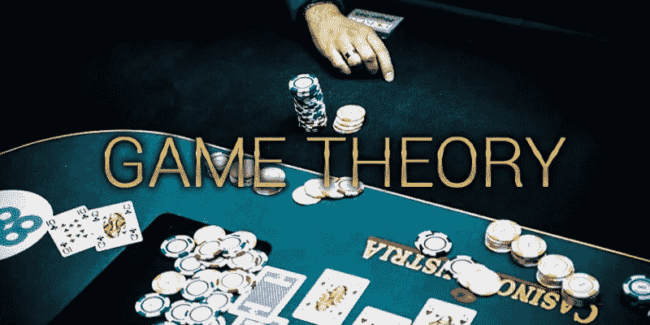
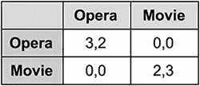

# DeepMind 掌握不对称游戏的聪明想法

> 原文：<https://pub.towardsai.net/deepminds-clever-idea-to-master-asymmetric-games-79c3461ef6e?source=collection_archive---------0----------------------->

## 该方法通过将非对称博弈分解成多个对称博弈来扩展纳什均衡的概念。

来源:[https://www . royalvegascasino . com/blog/5-things-you-need-know-on-game-theory/](https://www.royalvegascasino.com/blog/5-things-you-need-to-know-about-game-theory/)

> 我最近创办了一份专注于人工智能的教育时事通讯，已经有超过 125，000 名订户。《序列》是一份无废话(意思是没有炒作，没有新闻等)的 ML 导向时事通讯，需要 5 分钟阅读。目标是让你与机器学习项目、研究论文和概念保持同步。请通过订阅以下内容来尝试一下:

 [## 序列

### 与机器学习、人工智能和数据发展保持同步的最佳资源…

thesequence.substack.com](https://thesequence.substack.com/) 

不对称博弈代表了博弈论中最重要的领域之一，它类似于现实世界中的许多场景。从概念上讲，非对称游戏是一种环境，在这种环境中，玩家可以获得相同的选项，但根据他们的偏好，奖励是不同的。不对称游戏很难，它们挑战了博弈论的一些基本概念，比如纳什均衡。此外，非对称博弈在机器学习的不同领域是必不可少的，例如多智能体强化学习。因此，ML 社区投入了大量的研究来提出不对称游戏环境中的新技术就不足为奇了。

每个月都有几十篇来自 ML 研究人员的关于不对称游戏技术的论文。过去几年中最简单和最具创新性的方法之一来自 DeepMind 发表的一篇论文[，在这篇论文中，他们提出了一种解决不对称游戏问题的独特方法](https://www.nature.com/articles/s41598-018-19194-4.pdf)。DeepMind 的突破可能对现代多智能体、人工智能系统产生深远的影响，这些系统通常被建模为不对称游戏。在到达那里之前，让我们试着去理解非对称游戏环境有什么困难。

# 对称与非对称游戏

对称游戏是用来说明博弈论动态的最受欢迎的例子，因为它们在数学上是优雅的和近乎完美的。正如我们之前解释的，非对称博弈描述了一种动态，其中不同的参与者共享相同的策略和目标。一般来说，对称游戏的简单性使得从计算的角度建模更容易。不幸的是，大多数现实游戏环境缺乏对称游戏的数学优雅。

不对称游戏描述了多主体环境，在这种环境中，玩家有不同的并且经常是冲突的目标和策略。我们以昨天的市场暴跌为例。在这种环境下，一些交易者拼命抛售他们的头寸，而其他人则试图积累新的头寸，为市场的潜在反弹做准备(从期货来看，这似乎不会在今天发生；)).将这种策略推广到全球数百万的交易者和投资者身上，你会得到一个极其混乱的不对称游戏。

在游戏理论中，许多不对称游戏环境的解决方案是使用纳什均衡来建模的。这个模型是以约翰·福布斯·纳什的名字命名的，这位美国数学家因电影《美丽心灵》中的罗素·克劳而名垂千古。本质上，纳什均衡描述了这样一种情况:每个参与者都选择了一个策略，没有一个参与者可以通过改变策略而受益，而其他参与者保持他们的策略不变。

# 纳什均衡失败的地方

纳什均衡是一个美丽的和难以置信的强大的数学模型来解决许多博弈论问题，但它在许多不对称的游戏环境中也有不足。两个主要原因:

*首先，Nash 方法假设玩家拥有无限的计算能力，这在现实世界环境中很少出现。*

*此外，许多纳什均衡模型未能解释在经济市场的大多数不对称游戏中普遍存在的风险概念。*

因此，有许多不对称的博弈场景很难用纳什均衡来实现。这在多智能体人工智能系统中尤其重要，这些系统需要在解决方案的数学优雅性和实现的实用性之间找到正确的平衡。

# 深度思维对非对称博弈的对称分解

在 DeepMind 两年前发表的一篇论文中，作者提出了一个非常聪明的模型，通过将高度复杂的不对称游戏分解为不同的对称游戏来寻找解决方案。用数学术语来说，新技术表明

*如果(x，y)是非对称博弈(A，B)的纳什均衡，这暗示着 y 是由收益表 A 确定的对称对应博弈的纳什均衡，x 是由收益表 B 确定的对称对应博弈的纳什均衡*。

为了说明这项新技术，我将从 DeepMind 网站上的原始帖子中借用一个例子。这个例子基于著名的“性别之战”游戏。

在这里，两个玩家必须协调一个晚上去看歌剧或电影。其中一个玩家稍微偏爱歌剧，另一个稍微偏爱电影。这个游戏是不对称的，因为虽然两个玩家都有相同的选择，但根据玩家的偏好，相应的奖励是不同的。为了维持他们的友谊或者平衡，玩家应该选择相同的活动(因此不同活动的零收益)。

来源:[https://www . deep mind . com/blog/game-theory-insights-into-asymmetric-multi-agent-games](https://www.deepmind.com/blog/game-theory-insights-into-asymmetric-multi-agent-games)

这个博弈有三个均衡:

*(我)两位玩家都决定去看歌剧*

*(二)两人决定去看电影*

(iii)一个最终的混合选项，每个玩家将在五分之三的时间里选择他们喜欢的选项。

最后一个选项，据说是“不稳定的”，可以通过使用 DeepMind 的新方法，通过将不对称游戏简化或分解为对称游戏来快速发现。这些对应物游戏本质上将每个玩家的奖励表视为一个单独的对称 2 人游戏，其平衡点与原始的非对称游戏一致。