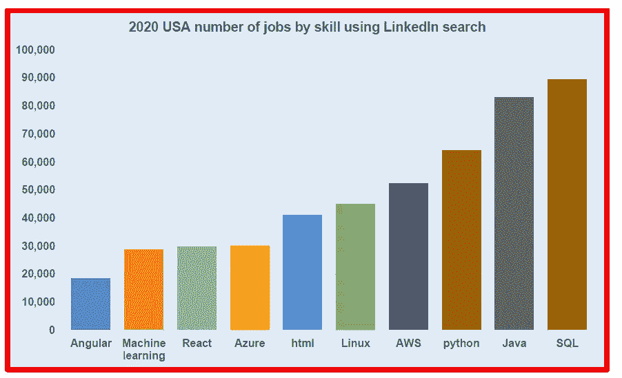
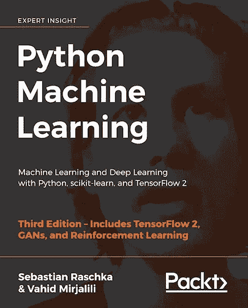

# 对数据技能的需求激增

> 原文：<https://pub.towardsai.net/demand-for-data-skills-has-skyrocketed-27dbff5058f2?source=collection_archive---------2----------------------->

## [数据科学](https://towardsai.net/p/category/data-science)，[新闻](https://towardsai.net/p/category/news)，[科技](https://towardsai.net/p/category/technology)

## 在当今数据驱动的世界中，您需要的顶级数据技能以及如何获得这些技能

图片由 [NESA 制作](https://unsplash.com/@nesabymakers?utm_source=medium&utm_medium=referral)在 [Unsplash](https://unsplash.com?utm_source=medium&utm_medium=referral) 上拍摄

# 一.导言

在过去的十年中，对拥有数据技能的个人的需求激增。最近一项使用从 LinkedIn 收集的数据进行的研究表明，美国和世界各地的大多数顶级技术工作都与数据有关，如下图所示:

Benjamin O. Tayo 的图片

Benjamin O. Tayo 的图片

上面的数字表明，当今世界的大多数顶级技术工作都与数据有关。随着越来越多的公司成为数据驱动型公司，对拥有数据相关技能(数据挖掘、数据存储、数据检索、数据转换和清理以及数据分析)的工人的需求很高也就不足为奇了。我们还注意到，用于大规模数据科学项目的基础设施，如 **Linux** 、 **Azure** 和 **AWS** 也在顶级技术技能中占有重要地位。这是因为越来越多的公司将云计算用于数据科学和机器学习项目。

对具有高级数据技能的熟练工人的需求增长可归因于 3 个因素:

1.  世界正以前所未有的速度产生数据；于是，数据成为了一种价值极高的新商品。因此，需要高技能的个人来挖掘、转换和分析数据。
2.  越来越多的公司变得数据驱动。这些公司现在正在创建由熟练工人组成的团队，他们可以一起工作，利用数据的力量来改善日常业务运营或增加销售额和利润。
3.  在利用技术技能优化业务运营和决策方面，全球竞争日益激烈。因此，许多公司正在投入更多的资源来招募、雇佣和培养合适的人才，以保持在全球竞争中的优势。

如果您正在考虑加入数据工作队伍，您可能想知道您需要什么样的数据技能以及如何获得这些技能。

# 二。数据作业标题

一些需求量很大的**顶级数据职位**包括:

a)数据科学家

b)数据分析师

c)商业情报分析师

d)数据库开发者

e)数据库管理员

f)数据工程师

g)数据分析经理

h)大数据软件开发商

I)云开发者

j)云软件工程师

# 三。如何获取数据技能？

## 1.大规模开放在线课程(MOOCs)

对数据科学从业者不断增长的需求导致了大规模开放在线课程(MOOC)的激增。最受欢迎的 MOOC 提供商包括:

a)**EDX**:【https://www.edx.org/】T2

b)**Coursera**:[https://www.coursera.org/](https://www.coursera.org/)

c) **数据营**:[https://www.datacamp.com/](https://www.datacamp.com/)

d) **乌迪米**:[https://www.udemy.com/](https://www.udemy.com/)

e) **乌达城**:[https://www.udacity.com/](https://www.udacity.com/)

https://www.lynda.com/琳达

如果你打算参加这些课程中的一门，请记住，有些 MOOCs 是 100%免费的，而有些则需要你支付订阅费(每门课程可能从 50 美元到 200 美元不等，甚至更多，因平台而异)。请记住，获得任何学科的专业知识都需要大量的时间和精力。所以不要着急。确保如果你决定注册一门课程，你应该准备好完成整个课程，包括所有的作业和家庭作业。一些测验和家庭作业将会很有挑战性。然而，请记住，如果你不挑战自己，你将无法增长你的知识和技能。

我自己已经完成了这么多数据科学 MOOCs，下面是我最喜欢的 3 个数据科学专业。

(一) [**数据科学专业证书**](https://www.edx.org/professional-certificate/harvardx-data-science) **(HarvardX，直通 edX)**

包括以下课程，全部使用 R 教授(您可以免费旁听课程或购买认证证书):

1.  数据科学:R 基础；
2.  数据科学:可视化；
3.  数据科学:概率；
4.  数据科学:推理和建模；
5.  数据科学:生产力工具；
6.  数据科学:扯皮；
7.  数据科学:线性回归；
8.  数据科学:机器学习；
9.  数据科学:顶点

(二) [**分析:必备工具和方法**](https://www.edx.org/micromasters/gtx-analytics-essential-tools-and-methods) **(佐治亚 TechX，through edX)**

包括以下课程，全部使用 R、Python 和 SQL 讲授(您可以免费审计或购买经过验证的证书):

1.  分析建模导论；
2.  数据分析计算导论:
3.  商业数据分析。

(三) [**应用数据科学与 Python 专业化**](https://www.coursera.org/specializations/data-science-python) **(密歇根大学，通过 Coursera)**

包括以下课程，全部使用 python 教授(您可以免费旁听大多数课程，有些课程需要购买认证证书):

1.  Python 中的数据科学导论；
2.  应用 Python 绘图、制图和数据表示；
3.  Python 中的应用机器学习；
4.  Python 中文本挖掘的应用:
5.  Python 中的应用社会网络分析。

## 2.从教科书中学习

从教科书中学习提供了比你从在线课程中获得的更精炼和更深入的知识。这本书对数据科学和机器学习提供了很好的介绍，代码包括:**“Python 机器学习”，作者 Sebastian Raschka** 。[https://github . com/rasbt/python-machine-learning-book-第三版](https://github.com/rasbt/python-machine-learning-book-3rd-edition)

作者以一种非常容易理解的方式解释了机器学习的基本概念。此外，代码也包括在内，因此您实际上可以使用提供的代码来练习和构建您自己的模型。我个人认为这本书在我作为数据科学家的旅程中非常有用。我会向任何数据科学爱好者推荐这本书。你所需要的是基本的线性代数和编程技能，以便能够理解这本书。

还有许多其他优秀的数据科学教科书，如韦斯·麦金尼的《 [Python for Data Analysis](https://sushilapalwe.files.wordpress.com/2018/04/python-for-data-analytics-book.pdf) 》，库恩·约翰逊的《[应用预测建模](https://vuquangnguyen2016.files.wordpress.com/2018/03/applied-predictive-modeling-max-kuhn-kjell-johnson_1518.pdf)》，伊恩·h·威滕的《[数据挖掘:实用的机器学习工具和技术](https://www.wi.hs-wismar.de/~cleve/vorl/projects/dm/ss13/HierarClustern/Literatur/WittenFrank-DM-3rd.pdf)》，Eibe Frank & Mark A. Hall，等等。

## 3.中等

[Medium](https://medium.com/) 现在被认为是增长最快的数据科学学习平台之一。如果您有兴趣使用该平台进行数据科学自学，第一步将是创建一个中型帐户。您可以创建一个免费帐户或会员帐户。对于免费帐户，每月可以访问的会员文章数量是有限制的。会员账户需要 5 美元或 50 美元/年的月订阅费。从这里了解更多关于成为中等会员的信息:【https://medium.com/membership】**。有了会员帐号，你将可以无限制地访问媒体文章和出版物。**

**媒体上排名前两位的数据科学出版物是面向数据科学的**和面向人工智能的**。每天都有新的文章发表在 medium 上，涵盖数据科学、机器学习、数据可视化、编程、人工智能等主题。使用 medium 网站上的搜索工具，您可以访问如此多的文章和教程，涵盖了从基本概念到高级概念的各种数据科学主题。******

## ******4.KDnuggets 网站******

******[KDnuggets](https://www.kdnuggets.com/) 是人工智能、分析、大数据、数据挖掘、数据科学和机器学习方面的领先网站**。**在该网站上，您可以找到数据科学方面的重要教育工具和资源以及职业发展工具:******

*   ****[博客/新闻](https://www.kdnuggets.com/news/index.html)****
*   ****[意见](https://www.kdnuggets.com/opinions/index.html)****
*   ****[教程](https://www.kdnuggets.com/tutorials/index.html)****
*   ****[头条新闻](https://www.kdnuggets.com/news/top-stories.html)****
*   ****[公司](https://www.kdnuggets.com/companies/index.html)****
*   ****[课程](https://www.kdnuggets.com/courses/index.html)****
*   ****[数据集](https://www.kdnuggets.com/datasets/index.html)****
*   ****[教育](https://www.kdnuggets.com/education/index.html)****
*   ****[事件(在线)](https://www.kdnuggets.com/meetings/index.html)****
*   ****[乔布斯](https://www.kdnuggets.com/jobs/index.html)****
*   ****[软件](https://www.kdnuggets.com/software/index.html)****
*   ****[网络研讨会](https://www.kdnuggets.com/webcasts/index.html)****

## ****5.开源代码库****

****GitHub 包含几个关于数据科学和机器学习的教程和项目。除了作为数据科学教育的优秀资源，GitHub 还是一个优秀的项目组合构建平台。有关在 GitHub 上创建数据科学作品集的更多信息，请参见以下文章:[数据科学作品集比简历更有价值。](https://towardsdatascience.com/a-data-science-portfolio-is-more-valuable-than-a-resume-2d031d6ce518)****

## ****6.商务化人际关系网****

****由于技术创新和新算法的发展，数据科学是一个不断发展的领域，因此保持现状的一种方法是加入数据科学专业人士网络。LinkedIn 是一个极好的社交平台。LinkedIn 上有几个数据科学小组和组织，你可以加入，例如，oriented AI、DataScienceHub、oriented data science、KDnuggets 等。你也可以在这个平台上关注该领域的顶级领导者。****

## ****7.油管（国外视频网站）****

****YouTube 包含几个教育视频和教程，可以教你数据科学所需的基本数学和编程技能，以及几个面向初学者的数据科学教程。一个简单的搜索就会产生几个视频教程和讲座。****

## ****8.可汗学院****

****Khan academy 也是一个学习数据科学所需的基本数学、统计学、微积分和线性代数技能的好网站。****

# ****四。摘要****

****总之，我们已经讨论了一些目前需求量很大的顶级数据技能。随着越来越多的公司变得由数据驱动，对拥有高级数据相关技能的员工的需求将继续增加。在今天的需求中，需要关注的技能将取决于一个人对什么样的技术领域感兴趣。对于数据分析师/数据科学家的工作角色来说，掌握 SQL、Python、机器学习、AWS 等技能是必不可少的。****