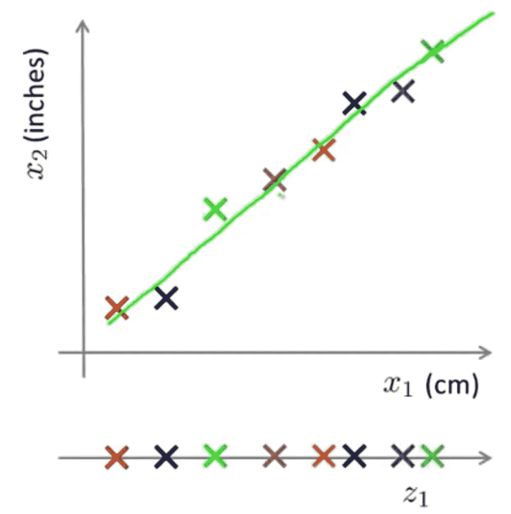
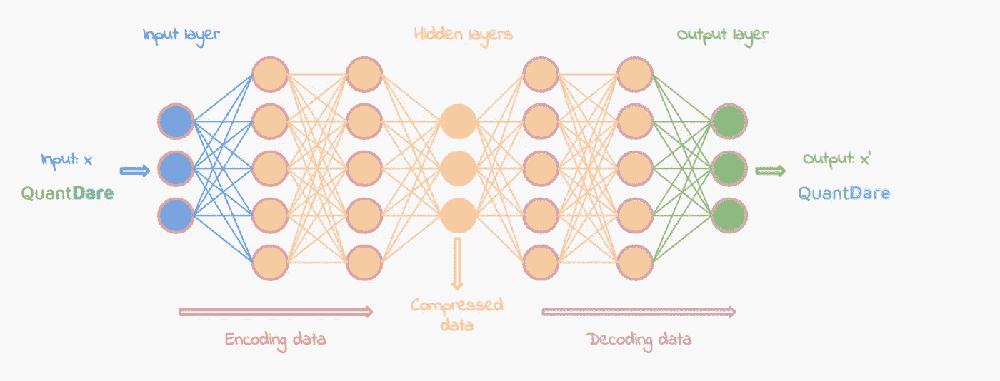

# 降维

> 原文：<https://pub.towardsai.net/dimensionality-reduction-a0f7899363b7?source=collection_archive---------5----------------------->

## [机器学习](https://towardsai.net/p/category/machine-learning)

## 什么是降维，为什么它在当今世界如此有用？

由[艾萨克·史密斯](https://unsplash.com/@isaacmsmith?utm_source=medium&utm_medium=referral)在 [Unsplash](https://unsplash.com?utm_source=medium&utm_medium=referral) 上拍摄的照片

考虑一下，你是 Airbnb 的一名数据分析师，你被指派负责了解和预测波士顿房屋的未来销售情况。众所周知，更好的模型来自对数据的更好理解，因此您开始寻求它，但是您从工程团队收到的数据有大约 1000 个特征，您没有时间坐下来检查冗余或不需要的特征，除此之外，查看 1000 维的数据是不可能的，更不用说 1000 维了，当特征集增加到 10，000 甚至 50，000 时，我们该怎么办。是的，你听说过，随着全球信息的快速增长，我们收到的数据有时会非常多，那么我们如何检查如此大量的数据呢？-这就是降维的时候了！！

# 什么是降维？

降维是一种无监督的机器学习算法，它可以帮助我们将数据从高维空间转换到低维空间，这样转换后的数据可以简洁地传递相似的信息。让我们以数据集的两组特征 X1 和 X2 为例，数据集以厘米和英寸为单位给出了对象的测量值，但我们知道这些特征高度相关，会给模型带来大量噪声，因此我们可以将 2-D (X1 和 X2)数据转换为 1-D (Z1)数据，后者传达了几乎相似的信息。

图片来源:吴恩达的《机器学习》

在更一般的意义上，我们可以将数据从 k 维空间转换到 n 维空间(k>n)以从模型中获得更好的性能。

# 降维在哪里有用:

**数据压缩**:将数据压缩到更低的维度会带来多种优势，例如:

减少存储数据的空间

减少所需的计算时间和功率，从而提高计算效率。

**多重共线性:**

通过移除冗余要素或高度相关的要素来提高模型性能。

有助于减少因数据冗余而产生的噪音

**数据可视化:**

将数据降低到更低的维度，如 2D 或 3D，可以帮助我们更精确地绘制和可视化数据，以便我们获得更好的数据要点。

# 技术:

我们有两种类型的数据简化策略特征选择或特征投影。我们现在将深入讨论这些策略:

> **特征选择是通过减少特征数量来提高模型性能，进而降低计算开销的过程。**

**缺失值**:如果数据有大量缺失值，理想情况下建议通过删除它们来减少要素的数量。

**相关性**:高相关性过滤器可用于监控两个独立数值变量之间的线性关系。如果相关系数超过某个阈值，就可以去掉其中一个。高相关性肯定是一个主要问题，因为这会降低某些模型(如线性或逻辑模型)的性能。

**方差**:低方差过滤器可用于去除对模型性能贡献很小或可以忽略的变量。例如:考虑一个所有观察值都为 1 的特性，这不会给模型提供任何新的信息，因此可以正确地删除它。

**后向特征消除**:在这种方法中，我们从所有的特征开始，在每次迭代中一个一个地迭代删除它们，直到即使删除了一个特征，模型也没有改进的空间。

**前向特征选择**:这种方法与后向消除过程完全相反，这里我们从没有任何特征开始，然后一个接一个地迭代添加特征，这提高了模型的性能，直到即使添加了新的特征，性能也没有改善。

**随机森林/决策树**:随机森林是使用最广泛的功能选择算法之一，它告诉我们某一组功能的重要性，更好的是，我们不必专门编写任何程序，因为它有一个内置的包来实现这一特定功能。

> **基于投影的方法通过变换将数据压缩到更低的维度。**

**PCA** :主成分分析是一种广泛应用于线性数据的约简算法。主成分分析帮助我们从现有的特征集中提取新的变量，这些变量被称为主成分。提取这些主成分的方式是，第一个成分保留数据集中的最大方差，第二个成分保留与第一个成分相比稍小的方差，以此类推，然后是递减趋势。

**SVD** :奇异值分解广泛应用于数据稀疏的信号和图像降噪处理中。SVD 也基于与 PCA 相似的算法工作，通过使用本征分量投影数据，但是在矩阵计算的内在水平上有很小的不同。

**独立分量分析** : ICA 基于信息论，是一种线性约简方法，将原始的特征集合转化为独立分量。PCA 和 ICA 的主要区别在于 PCA 寻找不相关的因素，而 ICA 对独立的因素更感兴趣。

不相关:缺乏线性关系的特征。

独立:互不依赖的特性。

**自动编码器**:自动编码器遵循神经网络的策略，将具有多个输入特征节点的原始数据编码为一组较少的节点。在隐藏层之前，系统的第一部分称为编码器，隐藏层之后的第二部分称为解码器。编码器转换输入，而解码器尝试重新创建转换后的数据。

图片来源:QuantDare

**线性判别分析:** LDA 是一种多类分类技术，其中我们为 n 个输入特征生成一组称为判别函数的 m 个线性组合，使得 m < n 最大化类分离。现在，所有输入特征都被投影到这些线性判别函数上，以降低数据的维数。这里 m 是数据被归约到的类的数量。

**因子分析**:这里我们根据变量的相关性对变量进行分组，这样在一个组内，它们与另一组中的变量具有高相关性，而低相关性。每一组都被表示为一个因子，这确保了数据被减少到非常少的因子，但是这些因子很难被观察到。

**t-SNE** : t-分布式随机邻居嵌入是 PCA 的更高级版本，它以非线性方式解决问题。这种方法在流形上既局部又全局地处理问题。它计算高维和低维空间中的点的概率相似性，然后试图最小化概率之间的差异。

**UMAP** :为了解决 t-SNE 的局限性，引入了均匀流形逼近和投影技术，以更少的计算开销更有效、更快速地保留局部和全局结构。UMAP 使用 k-最近邻来计算流形中的点之间的距离，然后使用随机梯度下降来最小化距离之间的差异。

SNE 霸王龙和 UMAP 霸王龙都能很好地处理高维数据，并且对尝试可视化数据非常有帮助，但是 UMAP 霸王龙比 SNE 霸王龙运行时间更短。

在我们每天都会生成大量数据的世界里，降维是一项非常有用的技术，处理大量特征是数据分析师必备的技能之一。从上面的文章中，您已经积累了处理大量特性的知识，并有效地将它们可视化以获得更好的洞察力。

感谢您抽出时间阅读这篇文章。请分享你对此的想法！！下次见，再见。

和平✌️

参考资料:

沙尔马普尔基特。"降维技术:Python . " *Analytics Vidhya* ，2020 年 5 月 25 日，[www . analyticsvidhya . com/blog/2018/08/dimensionality-reduction-techniques-python/。](http://www.analyticsvidhya.com/blog/2018/08/dimensionality-reduction-techniques-python/.)

布朗利，杰森。"如何选择机器学习的特征选择方法."*机器学习掌握*，2020 年 8 月 20 日，machineellingmastery . com/Feature-selection-with real-and-category-data/#:~:text = Feature % 20 selection % 20 is % 20 the % 20 process，the % 20 performance % 20 of % 20 the % 20 model。

雷，苏尼尔。"降维:降维技术."*分析 Vidhya* ，2020 年 6 月 26 日，[www . analyticsvidhya . com/blog/2015/07/dimension-reduction-methods/。](http://www.analyticsvidhya.com/blog/2015/07/dimension-reduction-methods/.)