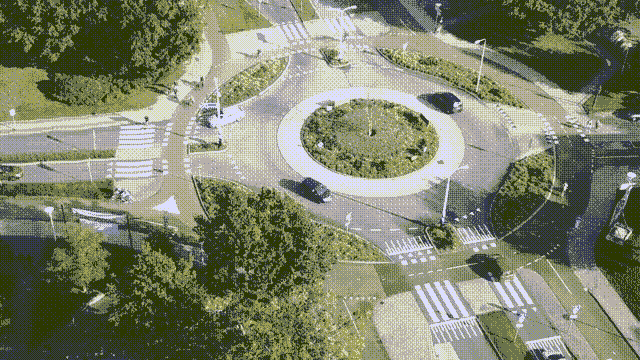
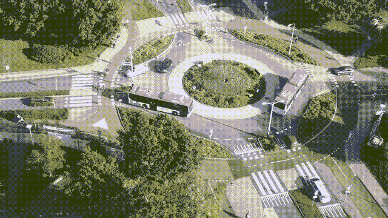
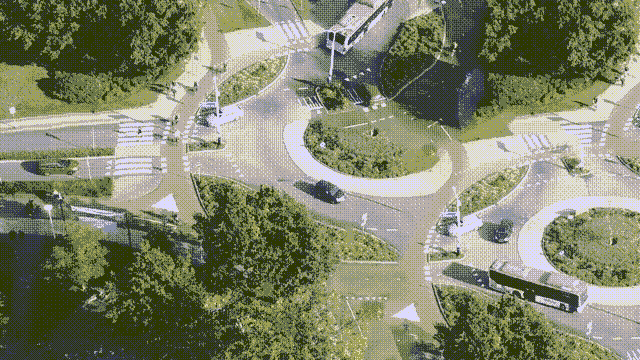
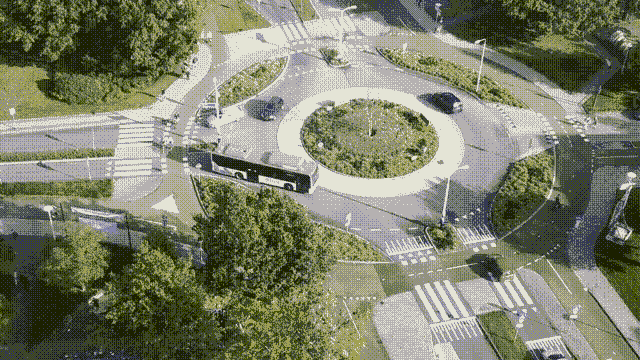
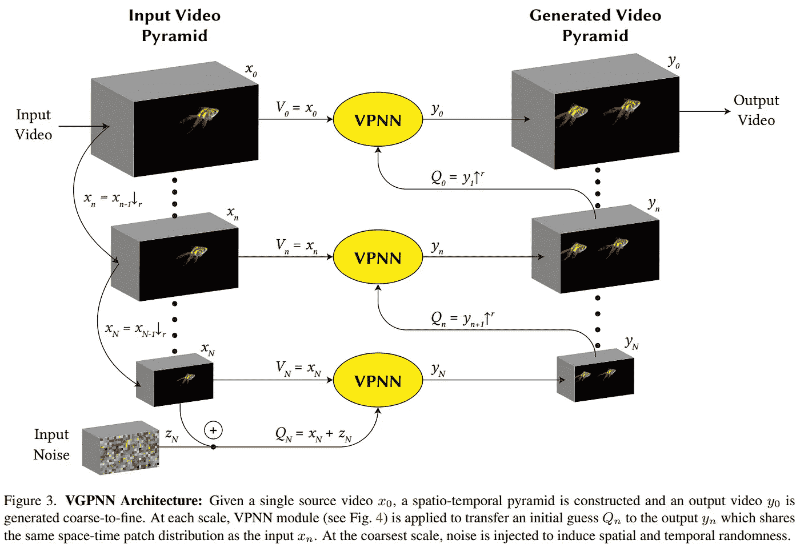
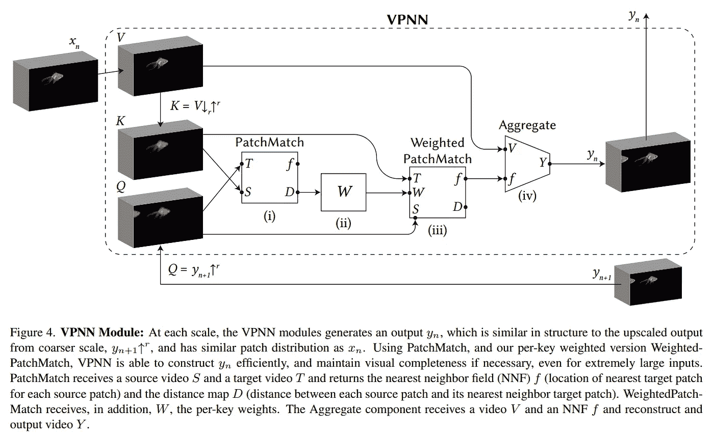
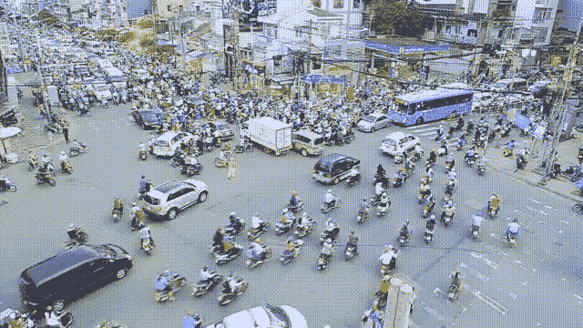
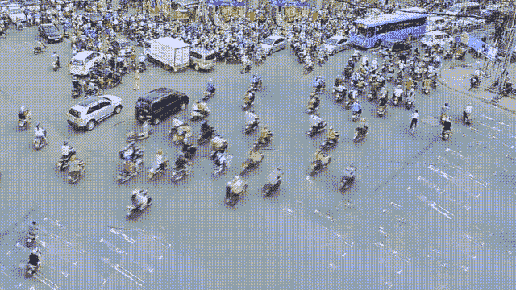
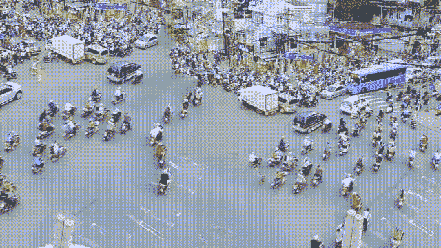
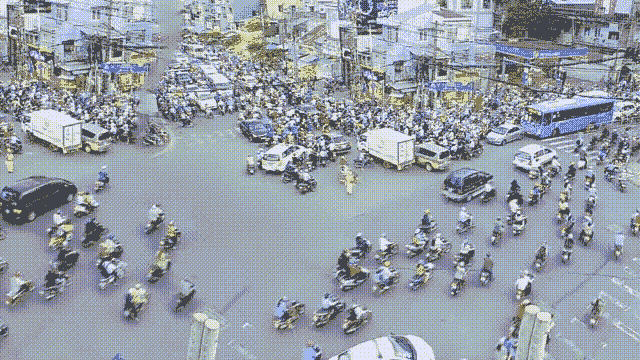

# 从单个视频生成不同的内容成为可能—不需要数据集或深度学习！

> 原文：<https://pub.towardsai.net/diverse-generation-from-a-single-video-made-possible-no-dataset-or-deep-learning-required-f4377c0c56bf?source=collection_archive---------3----------------------->

## [人工智能](https://towardsai.net/p/category/artificial-intelligence)

## 这种模式可以做任何视频操作或视频生成应用程序，你记住了！

> 原载于 [louisbouchard.ai](https://www.louisbouchard.ai/vgpnn-generate-video-variations/) ，前两天在[我的博客](https://www.louisbouchard.ai/vgpnn-generate-video-variations/)上看到的！

## 观看视频并查看更多示例！

原始视频的视频变体(左上角)。图片示例来自 [VGPNN](https://nivha.github.io/vgpnn/) [1]。

你有没有想过剪辑一个视频？

删除或添加某人，更改背景，使其持续更长时间，或者更改分辨率以适应特定的纵横比，而不压缩或拉伸它。对于那些已经开展过广告活动的人来说，你肯定希望有不同的视频来进行 AB 测试，看看什么效果最好。Niv Haim 等人的这项新研究可以帮助你在一个高清视频中完成所有这些事情！的确，使用一个简单的视频，你可以在几秒钟或几分钟内完成我刚才提到的任何高质量视频的任务。你基本上可以把它用于任何你想到的视频操作或视频生成应用。它甚至在所有方面都优于 GANs，并且不使用任何深度学习的花哨研究，也不需要庞大而不切实际的数据集！最棒的是，这项技术可以扩展到高分辨率视频。它不仅仅是为了 256x256 像素视频的研究目的！哦，当然，你也可以用它来处理图像！让我们看看它是如何工作的。

## 它是如何工作的？

图来自[VGPNN](https://nivha.github.io/vgpnn/)【1】。

该模型被称为基于视频的生成式面片最近邻，简称 VGPNN。开发 VGPNN 的研究人员没有使用复杂的算法和模型，如 GANs 或 transformers，而是选择了一种更简单的方法，但重新进行了研究。最近邻算法。

首先，他们以金字塔的方式缩小图像，每一层的分辨率都比上一层低。然后，他们将随机噪声添加到最粗糙的级别，以生成不同的图像，类似于 GANs 在编码图像后在压缩空间中所做的事情。

请注意，为了简单起见，这里我将说图像，但在这种情况下，由于它适用于视频，该过程是在 3 帧上同时进行的，增加了一个时间维度，但解释保持不变，只是在最后增加了一个额外的步骤。

添加了噪声的最粗比例的图像被分成多个小的正方形小块。添加了噪声的图像中的所有补片被替换为来自没有噪声的初始缩小图像的最相似的补片。正如我们将看到的，这个最相似的小块是用最近邻算法测量的。大多数这些补丁将保持不变，但根据添加的噪声，一些补丁将发生足够的变化，使它们看起来更类似于初始图像中的另一个补丁。

这是你在上面看到的 VPNN 输出。这些变化足以生成新版本的图像。然后，该第一输出被放大并用于与下一尺度的输入图像进行比较，以充当其噪声版本，并且在该下一次迭代中重复相同的步骤。我们将这些图像分割成小块，并用当前步骤中最相似的图像替换先前生成的图像。

让我们进入刚刚讨论过的 VPNN 模块:

图来自[VGPNN](https://nivha.github.io/vgpnn/)【1】。

正如您在这里看到的，与添加噪声的初始步骤的唯一区别是，我们将放大生成的图像(这里表示为 Q)与之前图像的放大版本进行比较，以便它具有相同的细节和锐度级别(表示为 K)。基本上，使用下面的级别作为比较，我们比较 Q 和 K，然后从当前级别 V 中选择图像中的相应补片，以生成该步骤的新图像，该图像将用于下一次迭代。正如你在这里看到的小箭头，K 只是我们在这个算法的初始步骤中缩小 V 所创建的图像的放大版本，在这个步骤中，我们创建了图像的金字塔缩放版本。这样做是为了比较两幅图像中的相同清晰度水平，因为来自前一层(Q)的放大生成的图像将比当前步骤(V)的图像更加模糊，并且很难找到相似的补片。如此反复，直到我们回到金字塔的顶端，得到高分辨率的结果。然后，将所有这些生成的补丁折叠成一个视频。

## 摘要

让我们做一个快速的总结:
图像在多个尺度下缩小。噪声被添加到最粗糙尺度的图像中，该图像被分成小的正方形小块。然后，每个有噪声的补片被来自相同的无噪声压缩图像的最相似的补片所替换，从而在保持真实性的同时在图像中引起很少的随机变化。新生成的图像和没有该步骤的噪声的图像都被放大并进行比较，以再次找到与最近邻最相似的片。然后，从当前分辨率的图像中选择这些最相似的小块，以生成该步骤的新图像。我们重复这些升级和比较步骤，直到我们回到金字塔的顶端，得到高分辨率的结果。

瞧！你可以用不同的噪声或修改重复这个过程，在你的视频上产生任何你想要的变化！

## 限制

最初视频(左上)中各代的限制。图片来自 [VGPNN](https://nivha.github.io/vgpnn/) [1]。

当然，结果并不完美。你仍然可以看到一些人工制品，比如人在奇怪的地方出现和消失，或者在某些情况下简单地复制粘贴某人，如果你专注于它，它会变得非常明显。尽管如此，这只是第一篇用最近邻算法攻击视频操作并使其可扩展到高分辨率视频的论文。看到不同的方法总是很棒。我非常兴奋地看到下一篇论文在这篇基础上有所改进！

此外，结果仍然令人印象深刻，由于运行时间非常低，它们可以用作处理视频的模型的数据增强工具。允许其他模型在更大和更多样化的数据集上进行训练，而无需太多成本。

如果你有兴趣学习更多关于这项技术的知识，我强烈推荐你阅读他们的论文[1]。

感谢您的阅读！

如果你喜欢我的工作，并想与人工智能保持同步，你绝对应该关注我的其他社交媒体账户( [LinkedIn](https://www.linkedin.com/in/whats-ai/) ， [Twitter](https://twitter.com/Whats_AI) )，并订阅我的每周人工智能 [**简讯**](http://eepurl.com/huGLT5) ！

## 支持我:

*   支持我的最好方式是成为这个网站的会员，或者如果你喜欢视频格式，在[**YouTube**](https://www.youtube.com/channel/UCUzGQrN-lyyc0BWTYoJM_Sg)**上订阅我的频道。**
*   **在经济上支持我在 T21 的工作**
*   **跟我来这里上 [**中**](https://whats-ai.medium.com/)**
*   **想进入 AI 或者提升技能，[看这个](https://www.louisbouchard.ai/learnai/)！**

## **参考**

**[1]论文包括:哈伊姆，n .，费恩斯坦，b .，格拉诺特，n .，肖彻，a .，巴贡，s .，戴克尔，t .，伊拉尼，M. (2021)。从一个视频中产生不同的一代成为可能。ArXiv，abs/2109.08591。**

**[2]从图像改编成视频的技术:尼夫·格拉诺特、本·范斯坦、阿萨夫·肖彻、沙伊·巴贡和迈克尔·伊拉尼。丢弃 gan:作为单一图像生成模型的补丁最近邻的防御。arXiv 预印本 arXiv:2103.15545，2021。**

**[3]代码(即将推出):[https://nivha.github.io/vgpnn/](https://nivha.github.io/vgpnn/)**