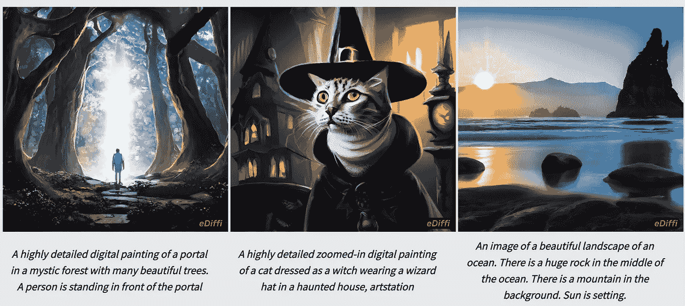
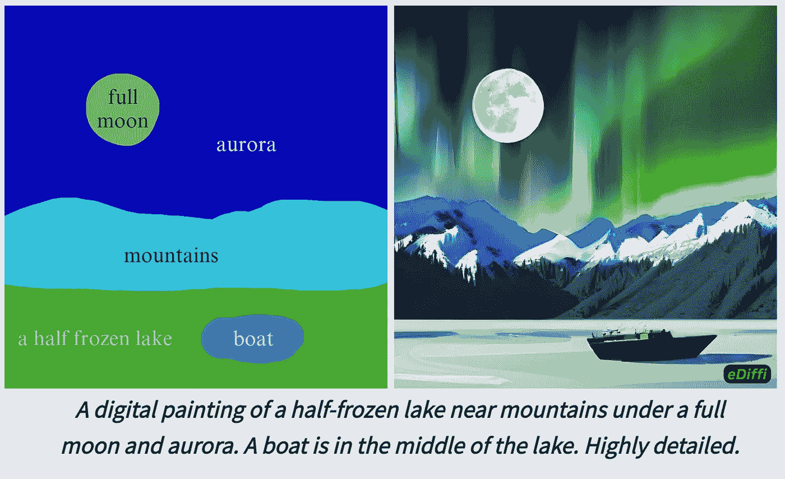
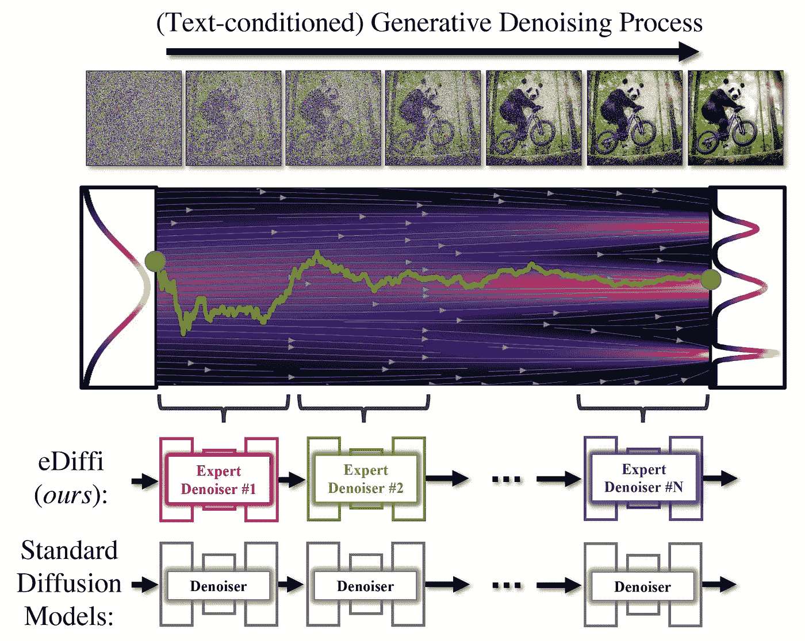

# 埃迪菲解释说:新的 SOTA 图像合成模型！

> 原文：<https://pub.towardsai.net/ediffi-explained-new-sota-image-synthesis-model-efba13267e15?source=collection_archive---------2----------------------->

## NVIDIA 的新模型比 DALLE 和 Stable Diffusion 有更好的效果，更多的控制，更逼真！

> 最初发表于 [louisbouchard.ai](https://www.louisbouchard.ai/ediffi/) ，前两天在[我的博客上读到的！](https://www.louisbouchard.ai/ediffi/)

## 看视频！

这是 eDiffi，图像合成的最新技术。

它比所有以前的方法，如 [DALLE 2](https://youtu.be/rdGVbPI42sA) 或[稳定扩散](https://youtu.be/RGBNdD3Wn-g)，生成更好看、更精确的图像。eDiffi 更好地理解你发送的文本，并且更加可定制，增加了一个我们在 NVIDIA 以前的论文中看到的功能:画师工具。

eDiffi 论文的结果。

就像他们说的，你可以用文字画画。简而言之，这意味着您可以输入一些主题，并在图像中画出应该出现在这里和那里的内容，与根据提示随机生成的图像相比，这允许您创建更多的自定义图像。这是下一个水平，让你通过简单地画一个可怕的速写就能得到你脑海中的精确图像——连我都能做到！

eDiffi 论文的结果。

正如我提到的，结果不仅是 SOTA，比稳定扩散更好看，而且更可控。当然，这是一个不同的用例，因为它需要更多的工作和头脑中更清晰的想法来创建这样一个草稿，但它绝对是超级令人兴奋和有趣的。这也是我想在我的频道上报道它的原因，因为它不仅是一个更好的模型，而且是一种对输出有更多控制的不同方法。

这个工具现在还不可用，但是我希望它能很快出现。顺便说一句——如果你喜欢这类文章，并希望获得这个高度复杂领域的易于理解的新闻，你绝对应该关注我的媒体和我的时事通讯！

他们允许你在这个新模型中有更多控制的另一种方式是通过使用我们看到的相同但不同的特征。事实上，该模型通过一句话来生成图像，但它也可以通过快速草图来影响——所以它基本上以图像和文本作为输入。

这意味着你也可以做其他事情，因为它理解图像。在这里，他们通过开发一种样式转换方法来利用这种能力，在这种方法中，您可以影响图像生成过程的样式，使图像具有特定的样式以及您的文本输入。这太酷了，看看结果吧。有点不可思议。用一种方法击败 SOTA 式转移模型和图像合成模型。

现在的问题是:英伟达如何开发出一种能创造更好看的图像的模型，

支持对样式和图像结构的更多控制，以及更好地理解和表现您真正想要的东西。

它们从两个方面改变了典型的扩散结构。

埃迪菲管道。图片来自 eDiffi 报纸。

首先，他们使用两种不同的方法对文本进行编码，这两种方法我已经在频道中介绍过了，我们称之为 CLIP 和 T5 编码器。这意味着他们将使用预训练的模型来获取文本并创建各种嵌入，这些嵌入侧重于不同的功能，因为他们被训练并表现不同。嵌入只是最大化句子对算法或机器理解它的实际意义的表示。关于输入图像，他们也只是使用剪辑嵌入，基本上对图像进行编码，以便模型也可以理解它，这一点你可以在我的其他视频中了解更多，这些视频涵盖了生成模型，因为它们几乎都是基于剪辑构建的。

这使得他们能够更好地控制输出，处理文本和图像，而不仅仅是文本。

为过程的不同步骤可视化的注意力地图。图片来自 eDiffi 报纸。

第二个修改是使用扩散模型的级联，而不是像我们通常使用基于扩散的模型那样重复使用相同的模型。在这里，他们使用了为生殖过程的特定部分而训练的模型。这意味着每个模型不必像常规扩散降噪器那样通用。由于 it 必须专注于流程的特定部分，因此可以做得更好。他们使用这种方法是因为他们观察到去噪模型似乎大量使用文本嵌入来将它的生成导向过程的开始，然后越来越少地使用它来关注输出质量和保真度。这自然会带来一种假设，即在整个过程中重复使用相同的去噪模型可能不是一个好主意，因为它会自动关注不同的任务，并且我们知道多面手在所有任务上都远非专家水平。为什么不用几个专家而不是一个多面手来获得更好的结果呢？

这就是为什么他们称他们为“去噪专家”，也是质量和忠实度提高的主要原因。该架构的其余部分与其他方法非常相似，用其他模型放大最终结果，以获得高清最终图像。

如今，图像和视频合成领域正变得越来越疯狂，我们每周都能看到令人印象深刻的成果问世。我对下一个版本非常兴奋，我喜欢看到不同的方法，既有解决问题的创新方法，也有不同的用例。

正如一位伟人曾经说过的，“活着是多么美好的时光啊！”

我希望你喜欢这个方法的快速概述，它比我通常做的更高级，因为它采用了我在许多视频中已经介绍过的大多数部分，并对它们进行了更改以表现不同的行为。我邀请您观看我的[稳定扩散视频](https://youtu.be/RGBNdD3Wn-g)以了解更多关于扩散方法的信息，并阅读 NVIDIA 的论文以了解更多关于这种具体方法及其实施的信息。

下周我会带着另一篇精彩的论文来看你！

## 参考

阅读全文:【https://www.louisbouchard.ai/ediffi/
[巴拉吉，y .等人，2022，eDiffi:文本到图像扩散模型与一群专家降噪，](https://www.louisbouchard.ai/ediffi/)[https://arxiv.org/abs/2211.01324](https://arxiv.org/abs/2211.01324)
项目页面:[https://deepimagination.cc/eDiffi/](https://deepimagination.cc/eDiffi/)
我的时事通讯(每周向你的电子邮件解释一个新的人工智能应用！):[https://www.louisbouchard.ai/newsletter/](https://www.louisbouchard.ai/newsletter/)