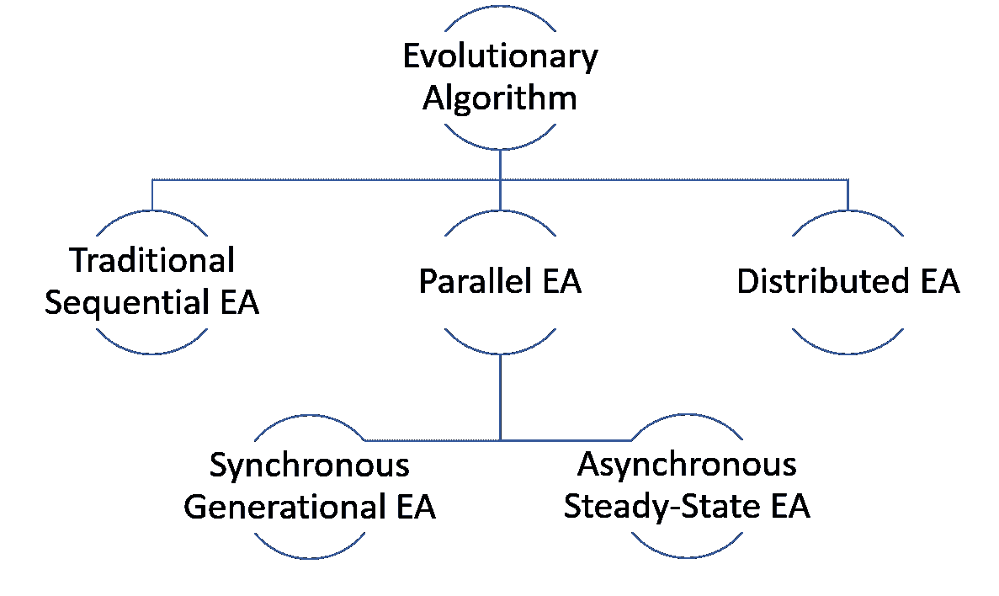

# 进化算法中的评估时间偏差

> 原文：<https://pub.towardsai.net/evaluation-time-bias-in-evolutionary-algorithms-bf1dadf7b447?source=collection_archive---------3----------------------->

## [人工智能](https://towardsai.net/p/category/artificial-intelligence)，[优化](https://towardsai.net/p/category/optimization)

## 从文献中对早期研究作品进行简要概述

照片由[乔恩·泰森](https://unsplash.com/@jontyson?utm_source=medium&utm_medium=referral)在 [Unsplash](https://unsplash.com?utm_source=medium&utm_medium=referral) 拍摄

An [进化算法](https://en.wikipedia.org/wiki/Evolutionary_algorithm) (EA)是人工智能中进化计算的子集。[进化计算](https://en.wikipedia.org/wiki/Evolutionary_computation)是一组受生物进化启发的全局优化算法。大数据信息时代的快速发展导致优化问题的规模和复杂性增加。在 EA 的上下文中，这最终导致搜索空间的扩展，个体的[适应度评估](https://en.wikipedia.org/wiki/Fitness_function)(用于最优解搜索)计算成本变得非常高【1】。

深入研究 EA 变体，我们观察到以下不同的类型，

来源:图片由作者提供

在本文中，我们将主要关注**并行 EA** 变体及其两种类型，然后深入理解评估时间偏差的问题。

**传统的世代进化算法**源自顺序进化算法，但是被公式化以诱导并行性[2]。然而，这些算法需要同步，并且当个体之间存在时间差异来评估它们的适应值时，经常面临空闲时间的问题。这通常会导致 CPU 资源的浪费和并行化的障碍。为了解决这个问题，我们有异步进化算法[2],它基于一个稳态模型，在这个模型中，一次产生一个个体后代，然后进行适应性评估。一旦对个体的适应度评估完成，它可以立即在现有群体中竞争一个位置，而不需要同步。这个过程最终有助于计算资源的有效利用，并导致高效的并行处理。然而，异步 ea 面临着所谓的**评估问题——时间偏差**。

评价时间偏差[3]是一种遗传现象，在这种现象中，与群体中的其他个体相比，快速评价自己的个体在进化过程中具有繁殖优势。这最终将长期评估的个体置于不利地位，因为快速评估的个体有更多的机会产生后代。这也导致解搜索偏向于快速评估区域而远离搜索空间的长评估区域，从而导致过早收敛。然而，有时，如果所有快速评估的个体都更好，评估时间偏差在算法中可以证明是有帮助的，但同时如果所有个体都更差，则可能阻碍收敛[4]。值得注意的是，在一个平坦的[健身景观](https://en.wikipedia.org/wiki/Fitness_landscape)中进行的实验中，评估没有显示出偏向更快或更慢区域的证据，这表明在某些条件下这种偏向可能很小或可以忽略不计【2】。作为一个解决方案，根据不同的场景，有时通过分配长的评估时间来惩罚高质量的解决方案，可以帮助防止 EA 过早收敛，并提高其性能[5]。

下面举例说明了为解决评估时间偏差问题而开展的两项早期研究工作，为进一步的研究方向奠定了基础。

**准世代异步进化算法**

QGEA [6]结合了同步和异步 EA 的某些方面，作为一种新颖的算法，可以两全其美。这种提出的算法作为中间解决方案，既不会导致空闲时间，也不会明显偏向快速解决方案。QGEA 利用异步评估方案来评估群体中的个体，从而最小化空闲时间。但是，被评估的个人不会直接添加到父群体中。相反，会创建一个单独的子群体，并一次添加一个。一旦达到子群体的最大容量，它将替换父群体，然后创建新的子群体。该算法与传统 EA 的区别在于，它从每组父代中产生更多的子代，这进一步有助于保持所有处理器都被占用。群体的变化以世代的方式发生，在每个确定数量的步骤之后群体完全替换。

**世代交错进化算法(IGEA)**

IGEA [4]相当于标准的分代进化算法，但通过交错不同代的适应度评估，允许更好地利用计算资源，从而避免评估时间偏差，并表现出更好的并行化潜力。该算法的主要思想在于，在当前代被完全评估之前，来自下一代的一些个体可以被产生。与标准 EA 中导致 CPU 空闲时间不同，IGEA 试图通过空闲 CPU 对生成个体的评估来消除这种情况，因此不需要处理器节点等待较慢的评估个体完成评估。IGEA 有两种变体，**逗号版本(λ，λ)** 和**加号版本(λ + λ)** 。逗号版本的群体为λ，每一代产生λ个后代用于下一代。plus 版本从λ个父母产生λ个后代，然后从组合的后代和父母群体中选择λ个个体用于下一代。

然而，基于他们的实验评估，两种早期方法都表现出一定的局限性，QGEA 方法没有解决评估时间偏差的问题，并且表现出非常低的收敛速度。IGEA 方法不是基于异步 EA 方案，因此不会出现评估时间偏差。只有当个体的选择不需要在执行之前评估所有的个体时，世代的交错才能起作用。因此，IGEA 方法旨在通过交错标准世代 EA 的世代来消除评估时间偏差的问题，但同时不允许使用像异步 EA 那样的无限并行性。

最近一年，我们在这个领域又发表了两篇研究论文。[7]中提出了一种新的父选择策略，通过考虑每个解决方案的搜索进度来减少评估时间偏差的影响。当使用异步 NSGA-III [8]进行实验评估时，这种提出的方法有助于减少其计算时间和评估时间偏差的影响。另一项研究工作[9]建立在 IGEA [4]的基础上，并提出了一个解决方案，该方案通过优先评估 IGEA 试验后代的概念来提高 CPU 利用率。

总之，从文献中观察到，没有具体的解决方案可以完全消除评估时间偏差。因此，研究有效消除异步进化算法中评估时间偏差问题的有效方法，以及研究在特定问题类型和条件下预测评估时间偏差如何影响进化算法性能的公开研究问题，仍然是**研究的热点课题**。

## 参考

[1]龚玉军，陈，王文宁，詹志宏，张，李，张，秦，李军军，2015 .分布式进化算法及其模型:对最先进的*应用软计算*， *34* ，第 286–300 页。

[2]e . o .斯科特和 K.A .德容，2015 年 1 月。理解简单的异步进化算法。在*2015 年 ACM 遗传算法基础会议论文集 XIII* (第 85–98 页)。

[3]e . o .斯科特和 K.A .德容，2015 年 7 月。异步进化算法中的评估时间偏差。在*2015 年遗传和进化计算年会的配套出版物*中(第 1209-1212 页)。

[4]皮拉特和聂鲁达，2017 年 7 月。交叉世代并行进化算法。在*遗传和进化计算会议的会议录*(第 865-872 页)。

[5] Yagoubi，m .，Thobois，l .和 Schoenauer，m .，2011 年 6 月。异构评价成本下的异步进化多目标算法。2011 年 IEEE 进化计算大会(CEC) (第 21-28 页)。IEEE。

[6]斯科特，E.O .和德容，K.A .，2016 年 7 月。准世代和稳态异步进化算法中的评估时间偏差。在*2016*遗传与进化计算会议论文集(第 845–852 页)。

[7]t .原田，2020 年，12 月。异步并行多目标进化算法中基于搜索进度的父代选择。在 *2020 年 IEEE 计算智能研讨会系列(SSCI)* (第 1013–1020 页)。IEEE。

[8]Deb k .和 Jain h .，2013 年。使用基于参考点的非支配排序方法的进化多目标优化算法，第一部分:解决有盒约束的问题。 *IEEE 进化计算汇刊*， *18* (4)，第 577–601 页。

[9] Noguchi，h .，Sonoda，a .，Harada，t .和 Thawonmas，r .，2020 年 9 月。试探子代优先评估的交叉世代进化算法。在 *2020 年第 59 届日本仪表与控制工程师学会(SICE)年会上*(第 832–837 页)。IEEE。