# 每个人都能理解机器学习——朴素贝叶斯分类

> 原文：<https://pub.towardsai.net/everyone-can-understand-machine-learning-naive-bayes-classification-9a66effd2f19?source=collection_archive---------1----------------------->

由[免费拍摄的照片](https://pixabay.com/users/free-photos-242387/)在 [Pixabay](https://pixabay.com/photos/feet-man-woman-shoes-footwear-984260/) 上

## [机器学习](https://towardsai.net/p/category/machine-learning)

## 让算法猜测一个人的性别

朴素贝叶斯是经典机器学习领域中最常用的分类算法之一。它完全基于概率论中著名的贝叶斯定理。

不要被“机器学习”或者“算法”这些词吓到。在本文中，我将介绍朴素贝叶斯分类作为一种机器学习算法是如何工作的。

在这个“人人都能理解机器学习”系列中，我总是尽力用浅显易懂的语言解释机器学习算法，没有任何科学的表述。然而，我希望你至少有基本的概率知识来理解这个问题。别担心，你不必是一个统计学家，只需要知道一些类似抛硬币得到一张脸的概率是 50%:)

在本文中，我将首先介绍什么是贝叶斯定理。然后，我举一个简单的例子，用贝叶斯规则来修正我们的“第一直觉”。之后，机器学习算法为什么叫“朴素贝叶斯”，为什么叫“朴素”？最后我会举一个实际的例子来说明机器是如何猜测一个人的性别的。

记住，你不需要成为一个专业人士来理解这篇文章。所以，放松，享受阅读吧！

# 什么是贝叶斯定理？

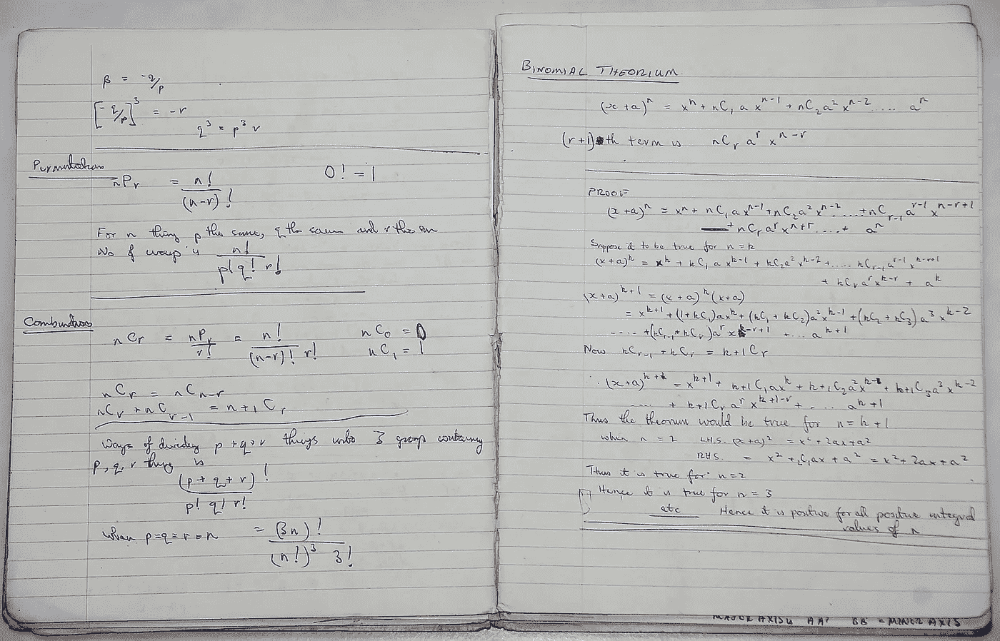

照片由 [sandid](https://pixabay.com/users/sandid-356019/) 在 [Pixabay](https://pixabay.com/photos/school-book-maths-algebra-683566/) 上拍摄

为了理解什么是贝叶斯，我们需要首先看看什么是“正常”概率。假设我们有 5 个红色的球和 5 个蓝色的球放在一个袋子里。如果我问你从袋子里随机拿起一个球，你有多少机会得到一个红球，很明显是 50%。具体来说就是 5/(5+5)=0.5。

这种概率就是我们所熟悉的。然而，实践中对某些事实不可知论的情况并不少见。比如我们不知道包里有多少红球和蓝球怎么办？

让我们考虑如下实际情况。假设有一种病叫“X 病”。从一般的医学报告中，我们知道在我们的人口中有 1/10000 的人患有这种疾病。现在有一种叫做“X-Test”的医学测试，可以测试一个人是否患有这种 X 疾病，准确率达到 99.9%。然后，假设有这样一个人已经用 X-Test 进行了测试，得到了一个肯定的结果。这个人真的得了 X 病的几率有多大？难道仅仅因为测试的准确率是 99.9%就要 99.9%吗？

不要！不要用你的直觉来决定这个概率。这不是正态概率。这是一种“反向”概率。这个问题在某种程度上相当于问:

> 我有一个装有 10 个球的包。然后，我已经试着从包里拿起一个球放回去 10 次了，每次都是红球。袋子里只有红球的几率有多大？

这种情况下正态概率帮不上忙。然而，我们可以尝试以这种方式导出反演概率:

1.  X 检验的准确率是 99.9%，所以有 0.1%的几率出错。一个错误意味着一个没有 X 疾病的人被检测为阳性。

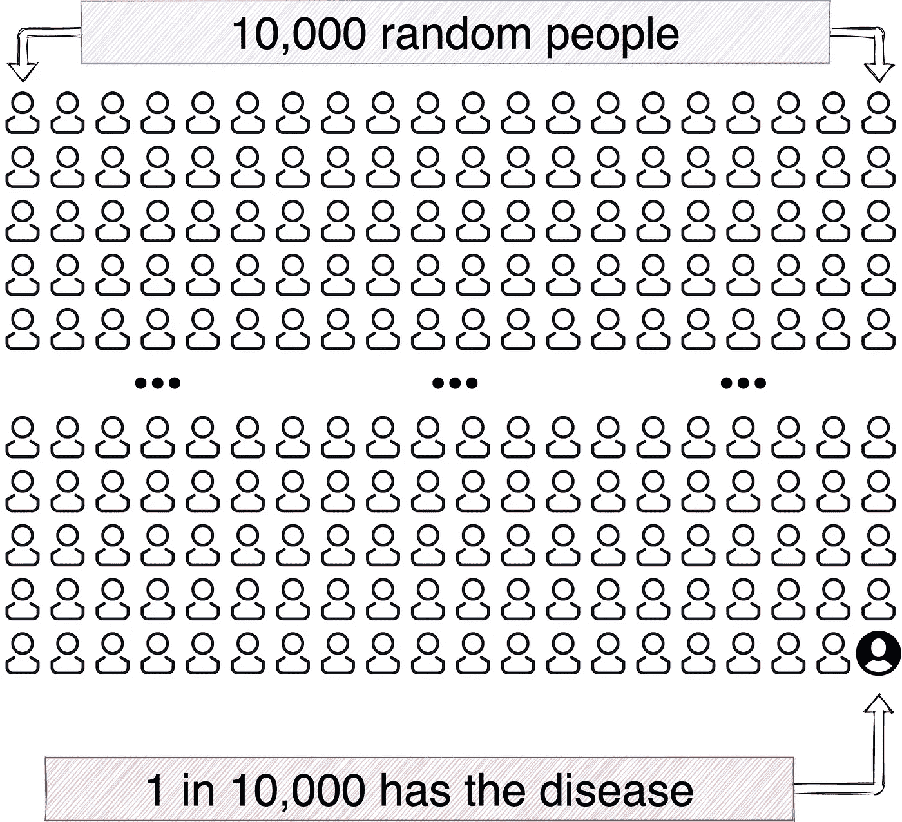

2.假设那里有一万人。如果我们对所有人进行 X 检验，将有 10，000 * 0.1% = 10 人没有患 X 疾病，但结果却是错误的阳性。

3.我们可以预计会有 1 个人真的得了 X 病，因为我们知道万分之一的人会得这种病。

4.因此，将有 11 人在 X 测试中呈阳性，但其中只有一人真的患有 X 疾病。

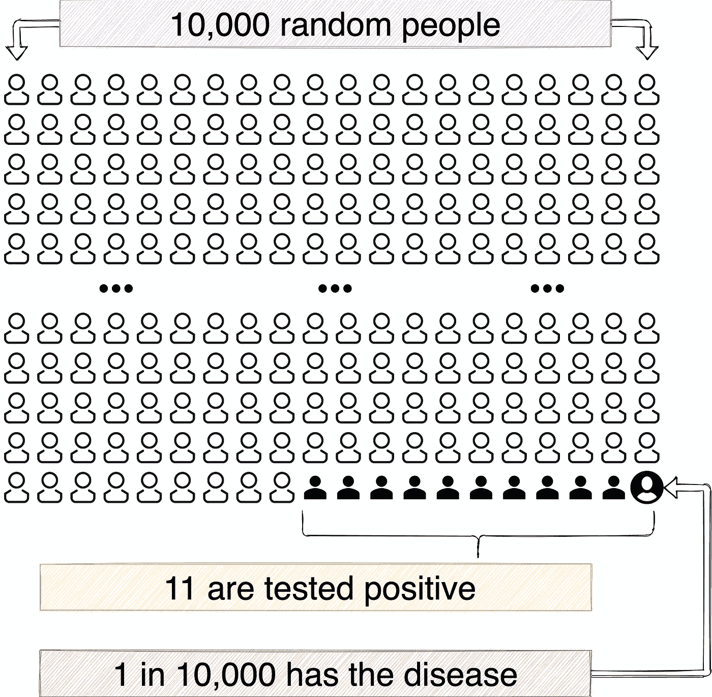

5.因此，如果一个人被检测为阳性，只有 1/11 的机会(约 9%)真的患有 X 疾病。

结果，9%，有点违背我们的直觉，对吧？但是如果我的解释对你有意义的话，那是基于我们已知的事情的正确概率。这是贝叶斯定理的典型应用。

# 阐明贝叶斯定理

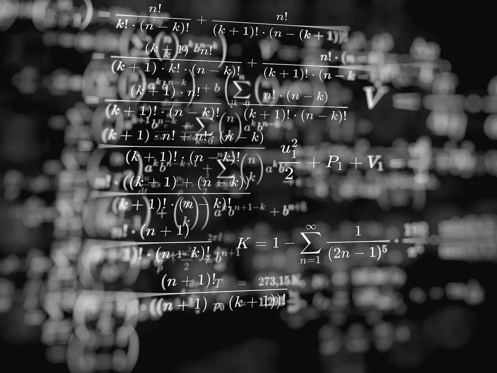

[Elchinator](https://pixabay.com/users/elchinator-10722855/) 在 [Pixabay](https://pixabay.com/photos/math-work-mathematics-formulas-4711302/) 上拍摄的照片

然而，上面的例子只是一个解释。在我们可以使用贝叶斯定理来训练我们的机器学习模型之前，我们需要将规则推广到可以应用于其他问题的东西。

让我们假设“Pos”代表一个人被检测为阳性的事件。这实际上是我们在这种情况下唯一的“属性”。然后，让我们用“T”代表真正的阳性，指的是这个人真的患有 X 疾病，用“F”代表实际上没有的假阳性。

我们需要知道的另一件事是“条件概率”的符号。比方说，`P(Pos|T)`表示一个人被检测为阳性的概率，假设这个人确实患有 X 疾病。同样，`P(Pos|F)`代表一个人被检测为阳性的概率，假设这个人没有患 X 疾病。

让我们总结一下我们已经知道的。

*   `P(Pos|T) = 99.9% = 0.999`
*   `P(Pos|F) = 0.1% = 0.001`
*   `P(T) = 1/10000 = 0.0001`
*   `P(F) = 9999/10000 = 0.9999`

然后，贝叶斯定理的公式如下。

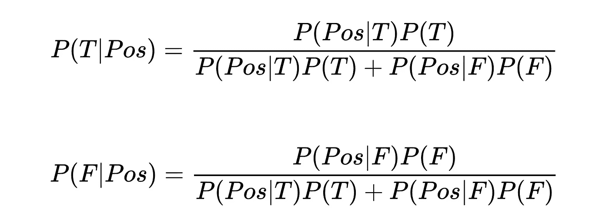

不要被公式吓到。我们不需要了解公式是如何推导出来的。我们只需要知道这是大多数朴素贝叶斯分类算法使用的贝叶斯定理。我们要做的就是把已知的事实代入这个公式，然后计算结果。

第一个等式是计算`P(T|Pos)`，也就是“如果这个人被检测为阳性，那么这个人真的患有 X 疾病的概率”。第二个是计算“如果这个人被检测为阳性，这个人没有患 X 疾病的概率”。让我们把已知的数字代入第一个方程。

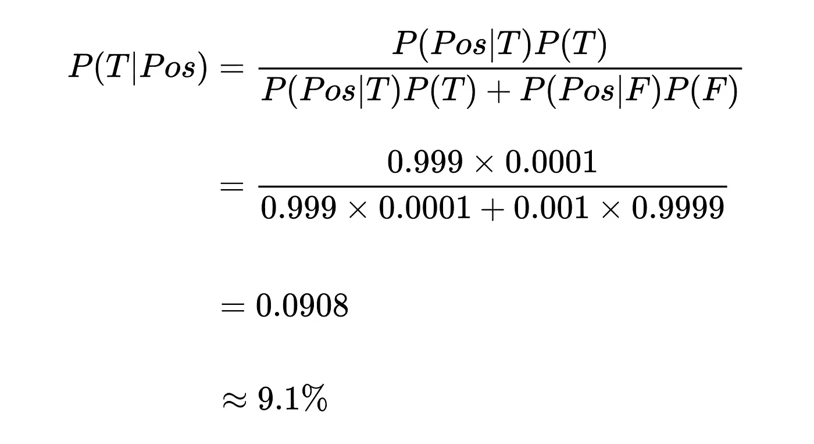

我们可以将这个例子视为一个机器学习问题，即对一个人是否患有 X 疾病进行分类。在这种情况下，我们只有一个属性，就是测试结果。然而，在实践中，我们可能有多种属性。在后面的案例研究中，我将使用一个具有多个属性的例子。

# 为什么说“幼稚”？

照片由 [pasja1000](https://pixabay.com/users/pasja1000-6355831/) 在 [Pixabay](https://pixabay.com/photos/memory-desire-dream-summer-shells-3121138/) 上拍摄

在机器学习算法的案例研究之前，我先解释一下为什么朴素贝叶斯分类叫“朴素”。

如果你有一些基本的概率统计知识，你可能已经发现，我们在前面的例子中用到的一万个人都是“独立”的。基本上，我们可以说每个人的 X-Test 结果是与他人独立的。

然而，在实践中，独立性通常无法得到保证。例如，朴素贝叶斯分类的一个典型应用是对一篇餐馆评论是正面还是负面进行分类。在这种情况下，朴素贝叶斯分类器

*   平等独立地对待点评评论中的每一个字
*   不考虑单词的顺序

虽然单词的顺序在大多数人类语言中确实很重要，但算法会忽略它们。这就是所谓“幼稚”的原因。事实上，尽管它很幼稚，但它已经被证明在某些情况下非常有效，并成为最受欢迎的分类算法之一。

此外，通常有两种类型的朴素贝叶斯分类。

*   多项式朴素贝叶斯，处理离散值属性
*   高斯朴素贝叶斯，处理连续值属性

在本文的案例研究中，为了方便起见，我们将重点关注离散场景。

# 案例分析—猜测人们的性别

由 [Pixabay](https://pixabay.com/photos/yahtzee-dice-luck-game-throwing-1132533/) 上的 [Skitterphoto](https://pixabay.com/users/skitterphoto-324082/) 拍摄

正如这篇文章的标题，我们不能训练我们的模型能够“猜测”一个人的性别，给定这个人的身高、体重和鞋码。这是我们的训练数据。

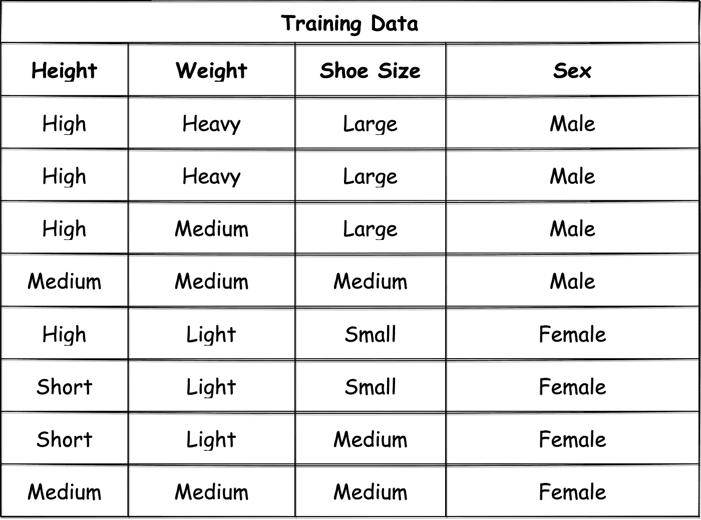

那就有问题了，就是要分类的数据。

所以，我们需要解决的问题是“给定一个人的**身高**、**体重**、**鞋码中等**，这个人是**男/女** **的概率”。基于我们在上一节中展示的贝叶斯公式，我们需要求解这个问题的方程如下。**

还是那句话，不要被方程吓到，让我解释一下。

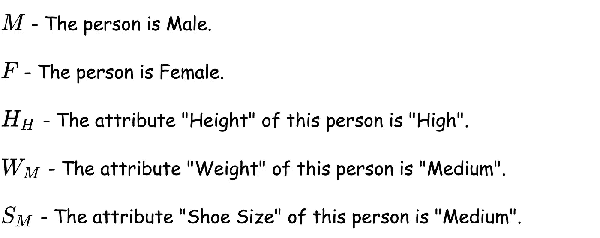

在这种情况下，我们只需要计算男性或女性的条件概率，因为我们只需要分类。例如，女性的条件概率必须是 100%减去男性的条件概率。

但是等等，有个东西看起来很陌生。别担心，别被条件概率骗了。请看下文:

这一点不难理解。例如，第一个等式，左边的条件概率是“假定一个人是男性，则该人具有高身高、中等体重和中等鞋码的概率”。从句子中不难看出，这三个属性是“与”的关系。也就是说，这个人必须满足这三个条件。所以概率可以分解成右边 3 个条件概率的相乘。

现在，让我们从我们的训练数据中算出“已知概率”。

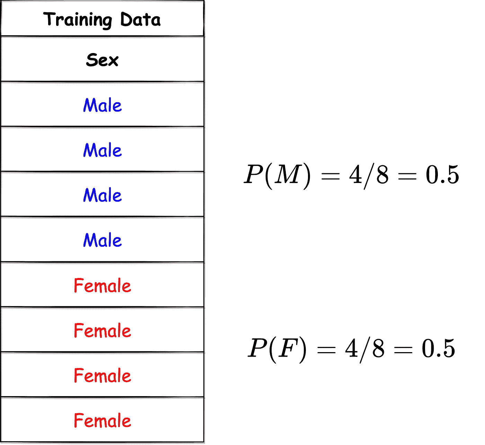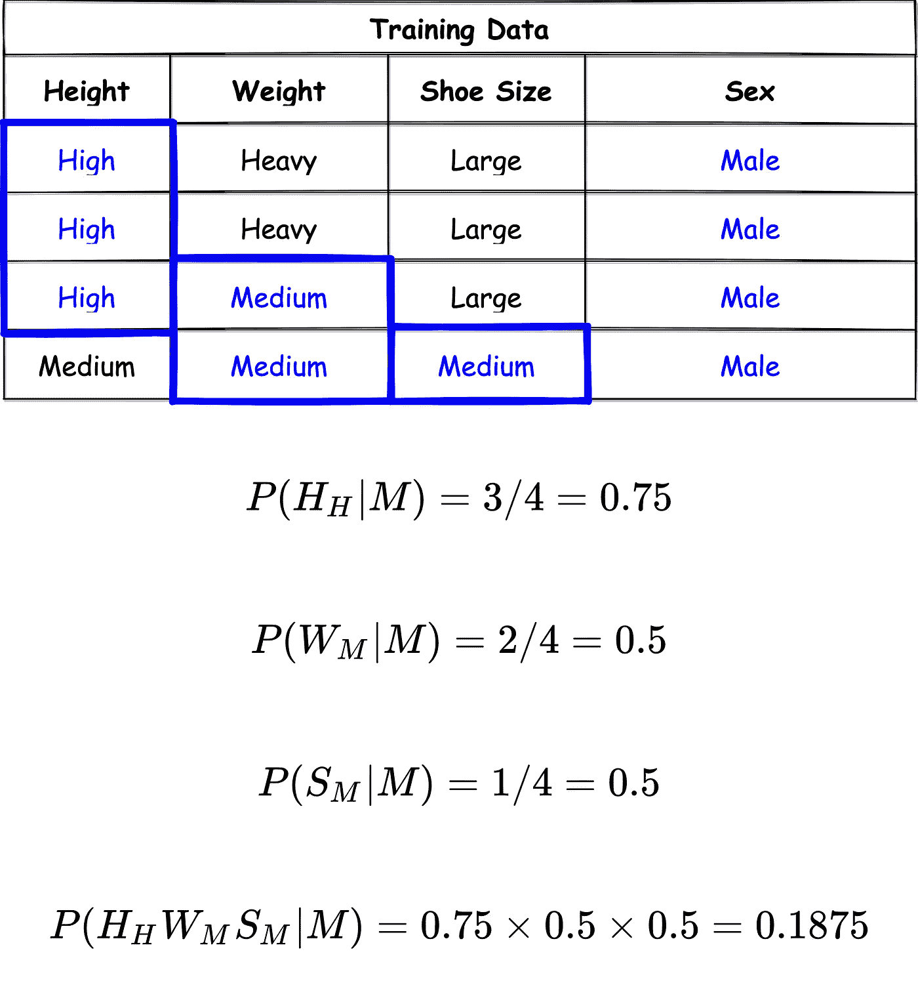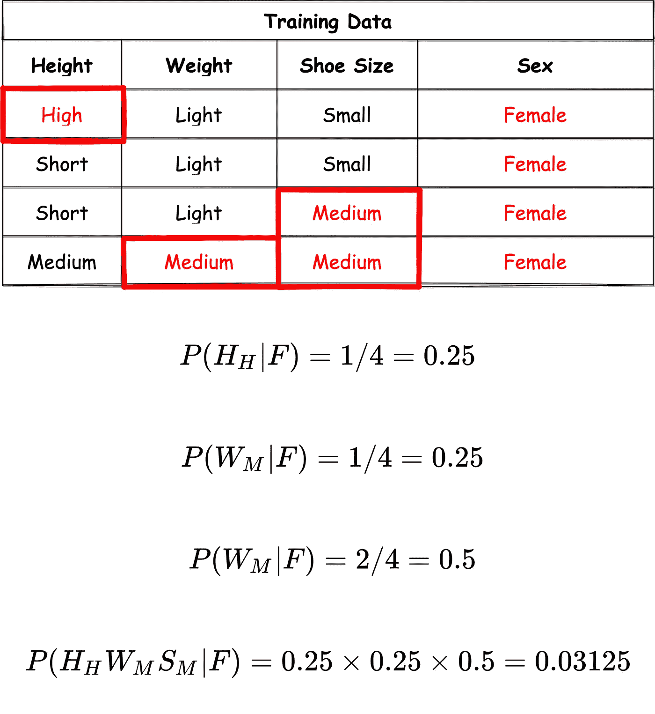

好的。我们已经有足够的已知概率来解决这个问题。现在，让我们把这些数字代入方程。

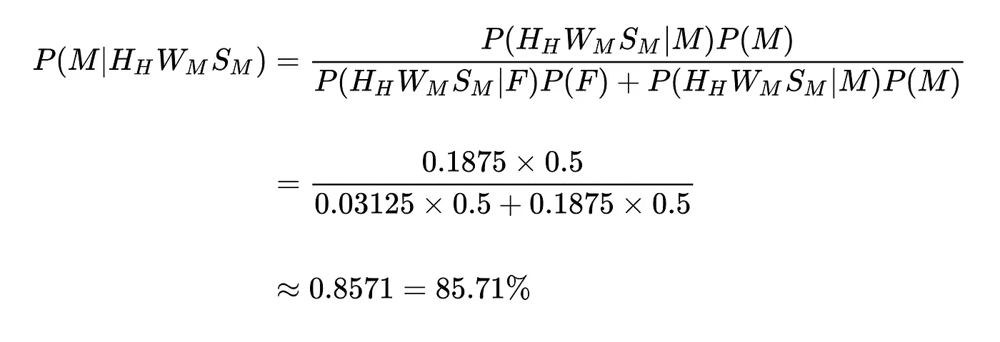

所以，这个人有 85.71%的概率是男性。如上所述，我们不需要计算这个人是女性的概率，因为它必须是 14.29%，也就是 100%减去 85.71%。

# 摘要

[Engin_Akyurt](https://pixabay.com/users/engin_akyurt-3656355/) 在 [Pixabay](https://pixabay.com/photos/coffee-pen-notebook-caffeine-cup-2306471/) 上拍摄的照片

在本文中，我介绍了贝叶斯定理，它是最流行的机器学习算法之一——朴素贝叶斯分类。

希望你现在明白什么是贝叶斯定理，为什么朴素贝叶斯是“朴素的”，以及机器学习算法是如何从身高、体重和鞋码猜测一个人的性别的。

本文中使用的案例研究称为多项式朴素贝叶斯，它只能在属性离散或分类时使用，如“高”、“中”和“低”。请关注我的故事列表，我将在下一篇文章中介绍高斯朴素贝叶斯。

 [## 通过我的推荐链接加入 Medium 克里斯托弗·陶

### 作为一个媒体会员，你的会员费的一部分会给你阅读的作家，你可以完全接触到每一个故事…

medium.com](https://medium.com/@qiuyujx/membership) 

**如果你觉得我的文章有帮助，请考虑加入灵媒会员来支持我和成千上万的其他作家！(点击上面的链接)**