# 可解释的助推机器

> 原文：<https://pub.towardsai.net/explainable-boosting-machines-c71b207231b5?source=collection_archive---------0----------------------->

## [机器学习](https://towardsai.net/p/category/machine-learning)

## 保持高准确性，同时获得有启发性的解释，从而创造知识并帮助理解和调试数据。

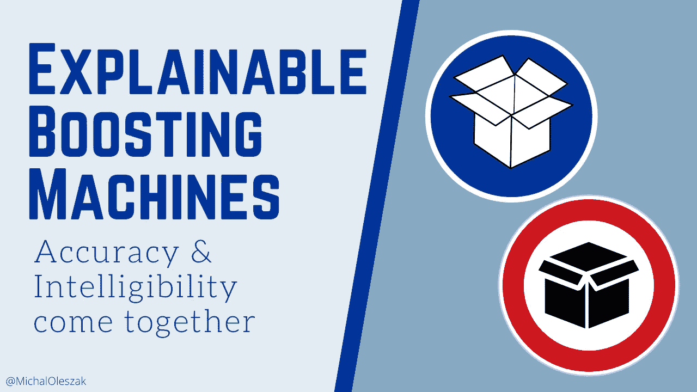

微软研究院最近开发了一种新的基于 boosting 的模型，他们声称该模型可以产生与最先进方法一样准确的预测，同时提供了一种理解其工作方式的创新方法。可解释的助推机器，因为这就是它的名字，是独一无二的，它如何传递新知识，并允许调试和理解它被训练的数据。是时候告别这个世界的 XGBoosts 了吗？让我们来了解一下！


## 关于可解释性的几句话

在模型的预测准确性和可理解性之间似乎存在一种权衡，可理解性被理解为理解模型工作的容易程度。在大多数情况下，与简单的玻璃盒模型(如线性或逻辑回归)相比，黑盒模型(如提升树或神经网络)会产生更好的预测性能。另一方面，后者更加透明，允许程序员或最终用户理解和解释模型的预测。

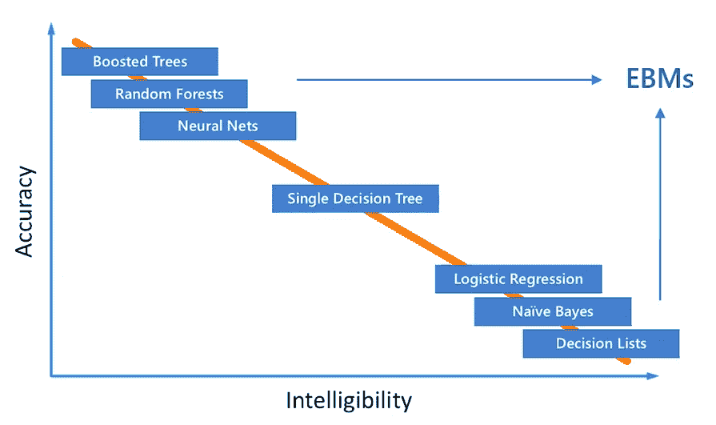

来源:YouTube 上的[“解释背后的科学:可解释的助推机器”](https://www.youtube.com/watch?v=MREiHgHgl0k)微软研究院

在很多情况下，人们会乐于停留在高精度、低清晰度的一端。出于预测的目的，我们可能只想得到可能的最佳预测，而不管模型是如何得到的。在处理图像或文本等非表格数据时，复杂的深度神经网络往往是首选方法，没有人会希望基于简单的线性回归来构建合理的对象检测系统。然而，在其他情况下，我们可能希望或需要沿着权衡曲线下滑。

> 通常更准确意味着更少的透明度。有时，我们可能想要滑下权衡曲线来得到一些解释。

有时，为了更深入地了解模型的工作原理，牺牲一些模型的预测性能是有益的，或者是必需的。通过理解模型为什么会犯特定的错误，可解释的模型更容易调试。这种理解也可以指导特征工程，并帮助检测公平性问题。更不用说更实际的原因:当人类要使用模型的输出来做决策时，他们可能会在信任模型之前要求一些解释。在某些行业，这样的解释可能是法律要求的——想想医疗保健或金融。

理解模型输出的一个方法是使用众多黑盒解释器中的一个。石灰值或沙普利值等技术被广泛使用。前者归结为在黑盒模型的基础上训练一个解释器或代理模型，以围绕特定的预测对其进行近似，而后者试图将预测解释为模型使用的功能所玩的游戏。这两种方法都有缺点。LIME 依赖于一个可能准确也可能不准确的近似值，一次只能解释一个预测，而 Shapley 值的计算成本非常高，尤其是对于具有许多要素的模型。此外，这些和类似的技术在无法解释的黑盒上运行，试图通过将它们的输入与输出相关联来理解它们。对我来说，这似乎是一种肤浅而浅薄的理解。

> 黑盒解释者提供非常肤浅的理解，在他们的黑盒之上工作。玻璃盒子模型可以通过设计来解释。

相比之下，玻璃盒子模型给出的解释来自模型本身的数学公式。但是，我们能制造出一个玻璃盒子，在精确度上能与错综复杂的黑匣子相媲美吗？进入可解释的增压机。

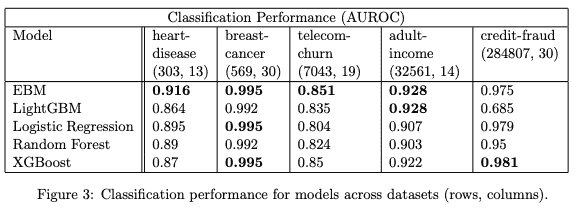

EBM 和 SOTA 模型一样好。来源:[https://arxiv.org/pdf/1909.09223.pdf](https://arxiv.org/pdf/1909.09223.pdf)。

根据作者的说法，在许多不同的数据集上，EBM 的表现至少与最先进的表格数据方法一样好。同时，它们提供的解释不仅信息丰富，而且领域专家也可以编辑。让我们看看所有这些是如何工作的！


## 从 GAMs 到 EMBs

为了理解循证医学，我们需要回到 20 世纪 90 年代，回到经典的统计学学习。当时，人们试图推广简单的回归模型，以适应不同的假设和数据类型。这就是广义加性模型(gam)的诞生。GAM 模型采用以下形式:


当我们希望使用一些特性 *x.* 来预测(或解释)我们的目标 *y* 的期望值时，函数 *f()* 是我们的输入特性所经历的一些变换(每个特性可以有不同的变换)，而链接函数 *g()* 表示应用于目标的变换。然后，变换后的目标被建模为变换后的特征的线性组合，因此是 gam 中的“加法”。

如果我们选择 *g* 作为恒等函数，选择*f*s*作为一些线性函数，我们将得到经典的[线性回归](https://towardsdatascience.com/a-comparison-of-shrinkage-and-selection-methods-for-linear-regression-ee4dd3a71f16)作为结果。将 *g* 改为 logit 函数，我们最终得到[逻辑回归](https://towardsdatascience.com/linear-classifiers-an-overview-e121135bd3bb)。对 g*和 f*的其他选择将允许我们制作概率单位模型、泊松回归或一些回归样条。*

正如我刚刚描述的，gam 的一个缺点是它们忽略了不同特性之间可能的交互。因此，[研究将它们纳入了](https://www.cs.cornell.edu/~yinlou/papers/lou-kdd13.pdf)所谓的具有成对相互作用的广义可加模型(GA Ms):


所以我们已经有了可以解释的助推机器。简而言之，它们是遗传算法的一种实现，只是稍微做了一点改动:变换不再是预先假定的，而是通过传统的梯度推进来学习的。

> EBM 是广义回归，其中一部分是通过梯度推进学习的。


## 可解释的助推机器算法

EBM 训练程序与普通[梯度推进](https://towardsdatascience.com/boost-your-grasp-on-boosting-acf239694b1)非常相似。我们在训练很多树，每一棵树都在试图解释前一棵树所犯的错误。然而，还是有一些不同之处。

首先，每个正在构建的树只允许使用一个特征。我们从只能使用 x₁的树开始，以传统的梯度增强方式更新残差，然后进行到只能使用 x₂的第二棵树，等等。遍历完所有的特性，也就是所谓的完成一次迭代，我们再次从 x₁开始。

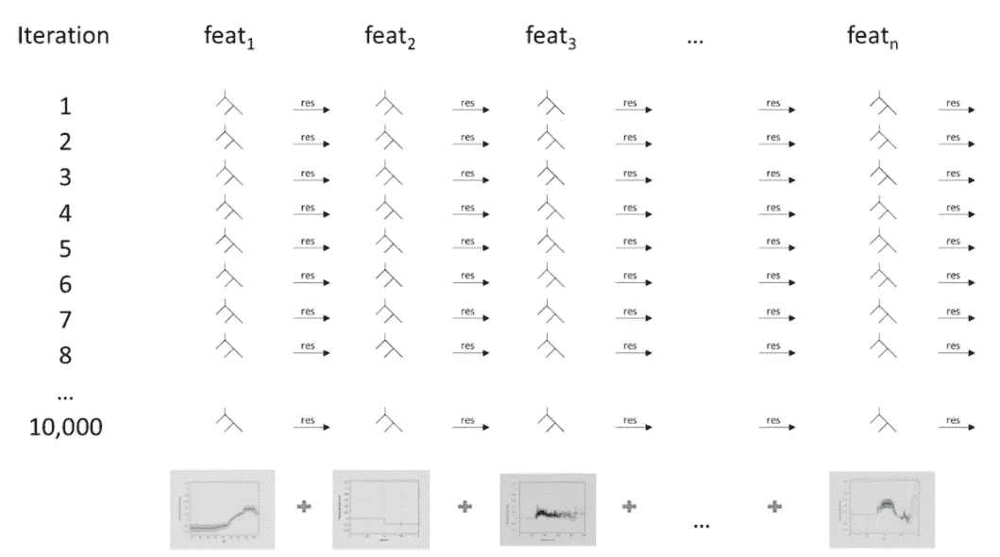

来源:[“解释背后的科学:可解释的助推机器”，YouTube](https://www.youtube.com/watch?v=MREiHgHgl0k) 微软研究院

为了防止算法偏向于特定的特征，正在使用非常小的学习率(即，每棵树对运行残差的贡献按小数字缩放)，因此特征的顺序无关紧要。因此，与传统的梯度提升相比，需要更多的迭代。在许多情况下，种植 100 或 1000 棵树后，您可以得到一个合理的 XGBoost 模型，而 EBM 可能需要您进行 10k 次迭代。将此乘以特征的数量，得到正在构建的小型单特征树的数量。由于这个原因，EBM 的训练可能会很慢(然而，它们的推理速度快得惊人，这一点我们接下来会讨论)。

一旦我们有了所有的树，我们就按特性聚合它们，得到每个特性的贡献图。您可以将这些图表视为字典或查找表。对于每个特征值，它们保存该值对最终预测的贡献。本质上，它们是来自上面公式的 *f* 函数，通过 boosting 学习。

然后——等等——我们删除了所有的树！不再需要它们了。经过训练的模型只包含几个贡献图，每个特征一个。为了在推理时进行预测，我们从查找表中读取每个特征的贡献，将它们相加，并通过链接函数 *g* 来计算最终的预测。又快又简单！

现在让我们来看看作者在[的 YouTube 视频](https://www.youtube.com/watch?v=MREiHgHgl0k)中展示的几个案例研究(如果可以的话，一定要看一看！)展示了 EBM 如何帮助创建新知识、调试数据和发现隐藏的偏差。


## 循证医学创造新知识

第一个例子来自一个模型，该模型预测肺炎风险是患者两项医学测量的函数，其中一项称为 BUN。BUN 代表血液尿素氮。一般来说，我们不希望血液中有尿素氮，所以值越低越好。较高水平的 BUN 可能与肺炎风险相关。下图显示了 EBM 学习的 BUN 特性的 *f* 功能。

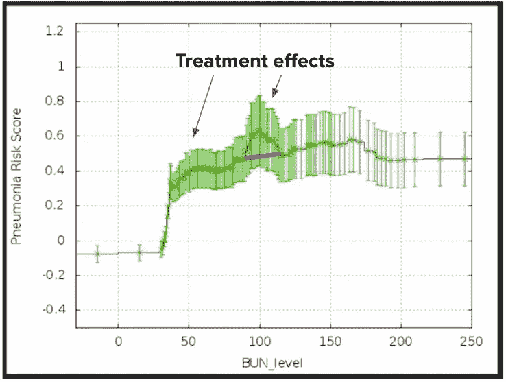

来源:YouTube[“解释背后的科学:可解释的助推机器”](https://www.youtube.com/watch?v=MREiHgHgl0k)微软研究院

尿素氮低于 40，似乎没有严重的风险。然后，我们看到风险突然增加，在 50 时趋于平缓。然后，在 100 处有一个严重的尖峰。怎么会这样事实证明，医生倾向于根据一个习惯性的阈值(通常是整数)来做出治疗决定。BUN 患者< 50 are considered low-risk and are not treated. A BUN between 50 and 100 results in some light treatment, while BUN > 100 要求透析。

看过这个图表后，医生们发现了两条新知识:

*   通常使用的治疗阈值 50 可能太高。BUN > 40 的患者已经是高危人群，可能也应该接受治疗。
*   BUN 110 的患者其实比 95 的风险低！怎么会这样前者是处方透析，降低风险，而后者不是，因为他们还没有越过 100 魔术阈值。对图表的快速假设分析让我们假设，如果从 BUN=90 开始开透析处方，模型将学习红线所示的关系。这将允许挽救许多目前在这条线以上的病人！


## EBM 帮助调试数据

另一个例子，这次是来自一个预测在重症监护室死亡风险的模型。该模型的一个特征是所谓的 PF 比率，这是一个衡量空气中的氧气转化为血液中的氧气的指标。在健康患者中，它应该在 1000 左右或更高。EBM 为此特征学习的函数 *f* 在大约 400 的某个值处显示出奇怪的下降。

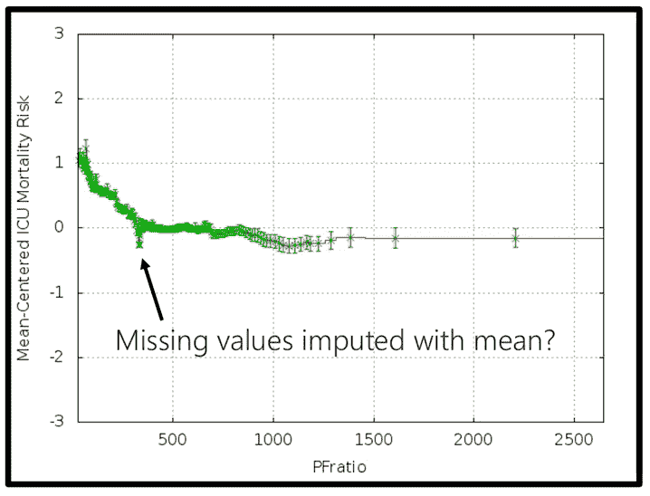

来源:YouTube 上的[“解释背后的科学:可解释的助推机器”](https://www.youtube.com/watch?v=MREiHgHgl0k)微软研究院

原来，下降时的特定值是训练数据中 PF-ratio 的平均值，它用于估算缺失值(单独说明:[请不要估算平均值，永远不要！](https://towardsdatascience.com/handling-missing-data-5be11eddbdd))。正如医生解释的那样，缺失值通常意味着病人看起来很好，没有进行测量。因此，大约 400 的相当不健康的平均值被分配给健康的患者，使模型知道这个值实际上是健康的——因此观察到死亡风险下降。

但是如果一个非常严重的病人得到了 PF-ratio 的平均值呢？他们应该被视为高危人群！幸运的是，EBM 允许修改贡献图。毕竟，这只是一个查找表，我们可以通过在相邻值之间进行插值来轻松地消除下降。这样，我们得到的模型更符合(有偏差的)训练数据，但是拯救了更多的生命！


## 循证医学有助于理解数据

最后一个例子来自一项研究，该研究旨在诊断一些共病在多大程度上增加了死于新冠肺炎的风险。下图总结了每种疾病的循证医学学习 f 函数，以显示每种疾病对 COVID 风险的影响程度。例如，从最后一栏中，我们可以看到慢性肾脏疾病患者比任何其他共病患者更有可能死于 COVID。

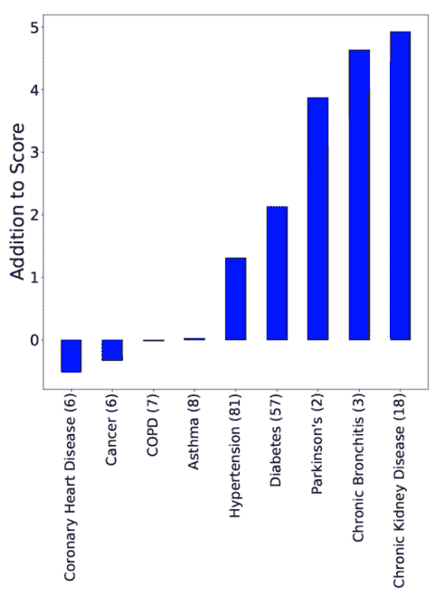

来源:[“解释背后的科学:可解释的助推机器”，YouTube](https://www.youtube.com/watch?v=MREiHgHgl0k) 微软研究院

前两列呢？癌症和冠心病对冠状病毒有保护作用吗？他们当然不是！但这些见解有助于揭示数据中的抽样偏差。

事实证明，患有这些疾病的患者更有可能被送入医院，即使他们的 COVID 症状没有那么糟糕，因为他们被医生视为非常高的风险。因此，在医院的所有 COVID 患者中，与患有其他疾病的患者相比，患有癌症的患者更有可能患有良性 COVID。多亏了循证医学，在根据这些数据做出任何结论时，这种抽样偏倚是值得警惕的。


## Python 中的 EBMs:interpret ml

EMBs 已经由作者自己在 Python 中实现为一个名为 *interpretml* 的包(尽管要 pip-install 它，只需使用 *interpret* ) *。*这个包包含了几个玻璃盒子模型，包括 EMBs，以及一些黑盒解释器。该界面非常像 scikit-learn，使其易于适应模型。截至撰写本文之日，[软件包的文档](https://interpret.ml/docs/intro.html)还有很多需要改进的地方，但据我所知，它仍在开发中。让我们为臭名昭著的葡萄酒质量数据集拟合一个 EBM。

让我们从导入开始，准备数据。

为了考虑交互项，我们将多类分类问题转化为一个二元问题。EBM 以与 GA M 相同的方式找到最佳可能的交互集合(详细信息见[GA M 论文](https://www.cs.cornell.edu/~yinlou/papers/lou-kdd13.pdf))，但此功能不适用于多类分类。接下来，我们以 scikit-learn 的方式拟合模型。我们可以像平常一样得到预测、分类概率和准确度分数。

```
Preds: [1 1 1 0 1] Preds proba: [[2.67903375e-11 1.00000000e+00]  
             [1.41780219e-05 9.99985822e-01]  
             [1.09045127e-12 1.00000000e+00]  
             [9.99999971e-01 2.86001626e-08]  
             [1.06279072e-10 1.00000000e+00]] Accuracy: 0.9444444444444444
```

最后，我们可以从模型中提取解释。这些分为局部和全局解释。全局解释包括一个交互式工具，用于查看每个特征的 f 函数以及每个特征的综合影响。

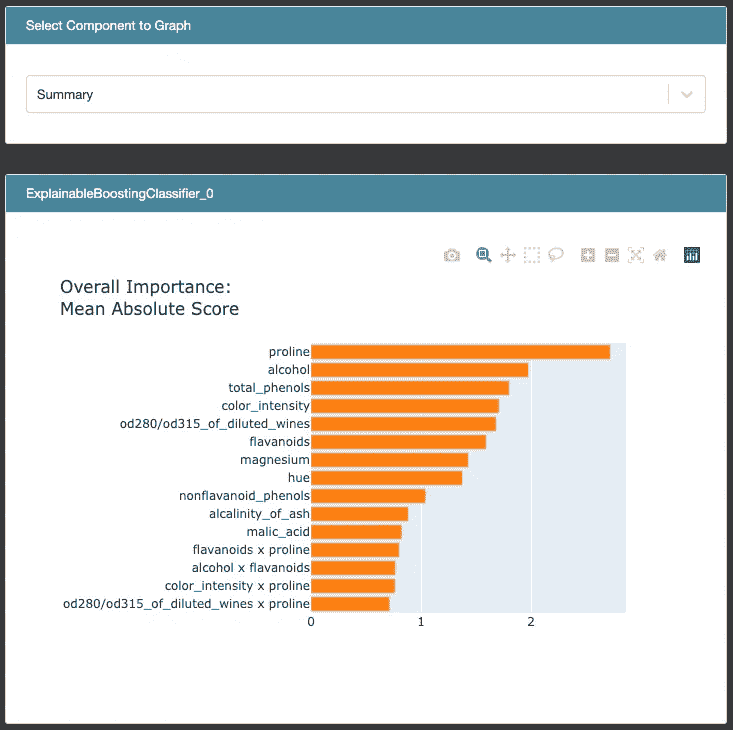

全局解释-所有功能。图片作者。

看来脯氨酸和酒精的含量是决定葡萄酒质量的两个最重要的特征。酒精有什么影响？

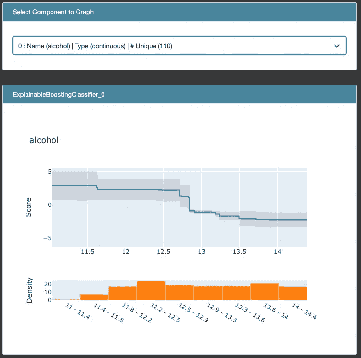

全局解释—特性 1(酒精)。图片作者。

酒精含量超过 12.75%的葡萄酒比度数较低的葡萄酒更不可能是高质量的。我们还可以看看交互作用，就像对待常规特征一样(从 GA M 公式中可以清楚地看出)。酒精含量和葡萄酒的颜色有什么相互作用？

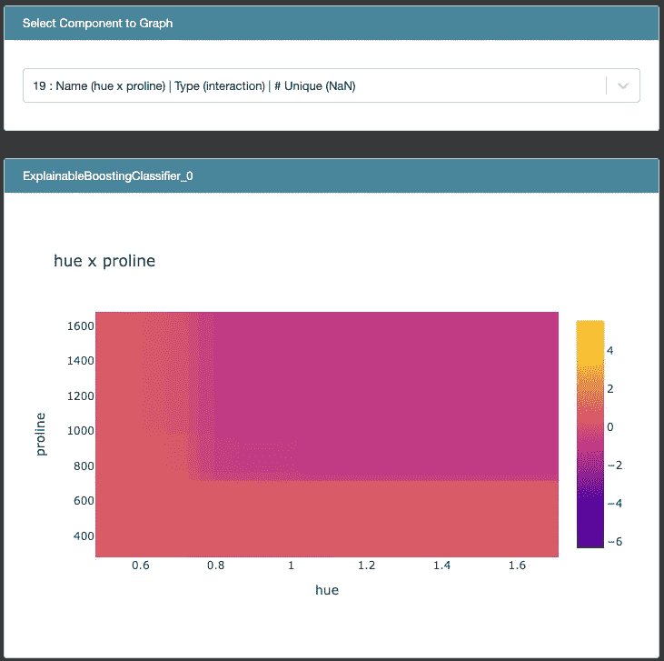

全局解释—两个特征(酒精和脯氨酸)的相互作用。图片作者。

如果两者都很高，这对葡萄酒的质量来说是一个不好的信号，如果只有其中一个特征取大值，就不是这样了。

现在让我们来看看局部解释，也就是关于特定预测的解释。

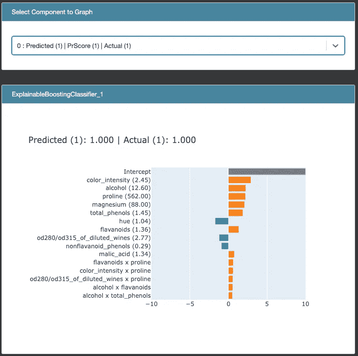

对测试用例观察的本地解释。图片作者。

从测试集的第一个观察结果来看，葡萄酒质量很高，大多数特征都是这样说的。例外情况是色调、非类黄酮酚的含量，以及一种称为“稀释葡萄酒的 OD280/OD315”的特性。他们把预测拉向一款低品质的葡萄酒，但其他特征更重要，最终的预测确实是正确的。


## 关于因果关系的思考

让我以一些关于循证医学和因果关系的考虑来结束我的发言。EBM 模型的公式鼓励我们用因果关系来思考，我所描述的例子也是如此。只要看看医生决定只治疗通过一些门槛的病人*如何导致*他们中的一些人比其他人做得更好，以及这种影响如何被 EBM 很好地捕捉到。然而，我认为将因果关系归因于循证医学的发现将是一个严重的错误。

> 循证医学是建立在相关性的基础上的，不应该随意解释！

为了说明为什么会出现这种情况，请考虑一下，如果通过添加或删除一些其他功能来重新训练模型，功能的贡献图会发生什么情况。由于我们的特性与添加或删除的特性的相关性，它显然会发生变化(请随意用实验来验证它！).

EMBs 对数据提供了独特的、有启发性的见解，允许我们提出问题，甚至是因果问题。但是要回答这些问题，我们需要一个[完全不同的因果工具集](https://towardsdatascience.com/establishing-causality-part-1-49cb9230884c)。


## 来源

*   [微软研究院在 YouTube 上发布的视频《解释的助推机器背后的科学》](https://www.youtube.com/watch?v=MREiHgHgl0k)
*   Rich Caruana 等人，2015，医疗保健的可理解模型:预测肺炎风险和医院 30 天再入院。《第 21 届 ACM SIGKDD 知识发现和数据挖掘国际会议论文集》(KDD '15)。计算机械协会，纽约，纽约州，美国。https://doi.org/10.1145/2783258.2788613
*   [GitHub 上的 interpretML Python 包](https://github.com/interpretml/interpret)
*   [interpretML Python 包文档](https://interpret.ml/docs/intro.html)


感谢阅读！

如果你喜欢这篇文章，为什么不在我的新文章上 [**订阅电子邮件更新**](https://michaloleszak.medium.com/subscribe) ？通过 [**成为媒介会员**](https://michaloleszak.medium.com/membership) ，你可以支持我的写作，并无限制地访问其他作者和我自己的所有故事。

需要咨询？你可以问我任何事情，也可以在这里 预定我 1:1 [**。**](http://hiretheauthor.com/michal)

你也可以试试我的其他文章。不能选择？从这些中选择一个:

[](https://towardsdatascience.com/on-the-importance-of-bayesian-thinking-in-everyday-life-a74475fcceeb) [## 贝叶斯思维在日常生活中的重要性

### 这个简单的思维转变将帮助你更好地理解你周围不确定的世界

towardsdatascience.com](https://towardsdatascience.com/on-the-importance-of-bayesian-thinking-in-everyday-life-a74475fcceeb) [](https://towardsdatascience.com/establishing-causality-part-1-49cb9230884c) [## 建立因果关系:第 1 部分

### 随机实验的黄金标准

towardsdatascience.com](https://towardsdatascience.com/establishing-causality-part-1-49cb9230884c) [](https://towardsdatascience.com/6-useful-probability-distributions-with-applications-to-data-science-problems-2c0bee7cef28) [## 6 有用的概率分布及其在数据科学问题中的应用

### 带有示例和 Python 代码的实用概述。

towardsdatascience.com](https://towardsdatascience.com/6-useful-probability-distributions-with-applications-to-data-science-problems-2c0bee7cef28)