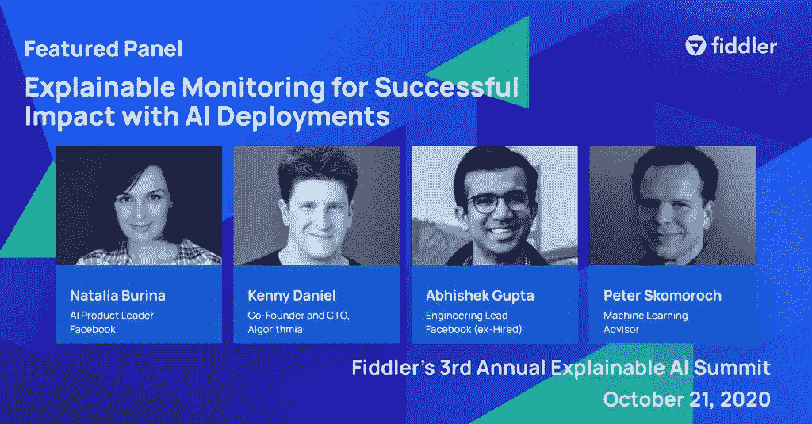

# 对人工智能部署的成功影响进行可解释的监控

> 原文：<https://pub.towardsai.net/explainable-monitoring-for-successful-impact-with-ai-deployments-ffbc78d8deaa?source=collection_archive---------4----------------------->

## [人工智能](https://towardsai.net/p/category/artificial-intelligence)

训练和部署 ML 模型相对快速和便宜，但是可操作性——随着时间的推移维护、监控和治理模型——是困难和昂贵的。一个可解释的 ML 监控系统扩展了传统监控，提供了具有可操作步骤的深度模型洞察。作为 2020 年 10 月 Fiddler 第三届年度可解释人工智能峰会的一部分，我们召集了一个技术和产品领导者小组，讨论机器学习系统的可操作性，以及监控和可解释性在一个组织的人工智能堆栈中必须发挥的关键作用。

# 向可操作化的转变

正如 Natalia Burina(脸书人工智能产品负责人)所指出的，“随着 MLOps 的兴起，已经出现了向运营的转变。最近的一份报告给出的数据显示，Q2 2020 增长最快的 20 个 Github 项目中，有 25%与 ML 基础设施、工具和运营有关 Abhishek Gupta(工程主管，脸书；Hired，Inc .的前工程主管)预测，在未来 2-5 年内，我们将看到越来越多的工具“简化”ML 操作化的各个方面。

这些创新是对越来越多的组织尝试——并且经常挣扎——让他们的 ML 项目“走出实验室”的回应正如 Peter Skomoroch(机器学习顾问)解释的那样，由于多年前围绕大数据的推动，公司已经投资于数据基础设施，以帮助在其网站上进行分析。现在，他们试图将这些数据用于机器学习，但遇到了挑战。传统的工程过程是基于团队编写、测试、然后部署到站点的软件，虽然它可能是 A/B 有效性测试，但是软件本身并没有改变。但是，机器学习就不一样了。因此，监控和可解释性是成功的人工智能系统的关键组成部分。

# 典型的例子是新冠肺炎

Kenny Daniel(algorithm ia 的联合创始人兼首席技术官)分享道，“在我参与的数据科学社区中，有一个时间序列的图片，任何时间序列，它看起来都很正常，然后— COVID 命中。”这个故事的寓意是:如果你没有办法识别宏观环境何时发生了变化，你就会遇到问题。航空公司经历了这一点:在疫情开始时，它们的价格急剧下降，因为算法错误地认为这是让人们再次飞行的方法。

当 COVID 受到冲击时，许多公司不得不迅速重新培训他们的模型。古普塔将 Hired 的情况描述为“超现实”，因为他们看到招聘人数突然下降，候选人激增，导致他们的模型表现得不太理想。(自那以后，古普塔在脸书公司担任工程主管。)

# 监测和解释

所有小组成员都同意，监控对于机器学习系统尤其重要，大多数公司目前的工具都不够用。“你必须假设事情会出错，而你的机器学习团队将面临迅速修复它的压力，”Skomoroch 说。“如果你有一个模型，你不能询问，你不能确定为什么准确性下降，这是一个非常紧张的情况。”

Burina 说，这对于处理公平和弱势群体的高风险用例更加重要，并补充说“调试模型是正在发展的事情。我们在行业中没有像在传统软件中那样的非常好的方法。”Skomoroch 表示同意:“这就是为什么我认为像 Fiddler 这样的东西非常令人兴奋，因为目前很多都是手动和临时完成的——有一些笔记本在电子邮件中四处乱飞。我们真的需要有我们持续关注的基准。”

古普塔说，在他看来，“ML 监控和向下钻取并解释的能力是密不可分的。”当你拥有这两个东西时，你可以更快地发现和解决问题，同时，ML 工程师能够更好地直觉哪些模型和特性需要更多的工作。Gupta 解释说，“Fiddler 的工具和可解释的监控已经改变了游戏规则，并对我们如何监控和应对我们在市场中看到的挑战进行了逐步的功能改进。”

# 整体解决方案与最佳方法

小组成员一致认为，人工智能工具栈的趋势是走向一种更加异构的、“同类最佳”的方法，这种方法结合了开源、定制软件和各种供应商解决方案，而不是一个工具完成所有工作。

根据丹尼尔的说法，“项目越有价值、越重要，你就越想为每一个部分找到最好的组成部分。”在传统的软件中，这意味着为 CI/CD、测试、监控和可观察性组合不同的解决方案，同样的逻辑也适用于 ML。毕竟，“你不可能构建端到端的解决方案，并期望在一个发展如此迅速的行业中取得成功。你需要能够在驾驶时切换汽车的某些部件，因为两年前流行的东西现在已经过时了。”

ML 工具栈的组件越来越多地外包，而不是内部构建。公司现在的任务是挑选专门针对他们的领域和用例的高质量工具。“对于从一开始就认真的公司来说，”Burina 说，“他们真的应该考虑同类最佳的解决方案，因为这将成为他们的竞争优势。”

# 人工智能的利益相关者

可能关心模型及其输出的不同人物角色是什么？当然，数据科学家和工程师是一个群体。此外，产品经理关心模型与商业策略和目的的匹配。法律团队、监管机构和最终用户都可能需要访问这些信息。最高管理层的领导经常想知道模型在高层次上的表现。

正如 Skomoroch 所说，“全世界的人都不理解你们(数据科学家)每天都在做什么，整个团队对他们来说就像一个黑匣子。因此，拥有像 Fiddler 这样的东西，拥有这种可观察性，并监控发生的事情，有一个附带的好处，就是他们可以在他们可以看到的地方看到一些东西:进展如何？我们的机器学习模型发生了什么？”Gupta 观察到，拥有 ML 监控和可解释性提供了“对杠杆和权衡的共同理解——并且在那个抽象层次上进行对话大有帮助。”

# 算法偏差和公平性

可解释的人工智能和监控的最重要的用例之一，也是利益相关者共同感兴趣的一个用例，是防止有偏见和公平的问题。“不必要的后果可能在管道的任何部分蔓延，”布里纳说。“公司必须从整体上考虑这个问题，从设计到开发，他们真的应该对偏见和公平进行持续监控。”

Gupta 说，持续的监控可以帮助团队“信任但核实”。随着许多人异步工作以提高人工智能系统的集体性能，个人偏见可能会随着时间的推移而蔓延，即使没有一个人在宏观层面上控制系统必须如何运行。这就是可解释的监控真正有用的地方。

谁最终负责确保人工智能没有偏见？毕竟，正如丹尼尔指出的，“只是因为它在人工智能的黑匣子里，并不意味着没有人负责。总有人需要负责任。”在 Skomoroch 看来，拥有一个专注于人工智能道德的首席数据科学官或总监这样的专门角色可能是一个不错的选择。这个人可以确保当工作从一个团队转移到下一个团队时，不会有任何遗漏。布里纳还提出了一个新的全行业角色“模型质量科学家:挑战模型，检查模型的稳健性，包括任何潜在的不利因素……会批准部署的人，真的使它成为一个更严格的过程。”

在 Fiddler，我们从许多与之打交道的客户那里听说了偏见问题。作为回应，我们一直在努力构建一个高级框架，展示可能存在偏见的地方，并允许客户根据这些见解采取行动:他们是否希望重新训练模型，平衡他们的数据集，或者随着时间的推移不断进行监控，并使用这些见解来调整他们的应用。

*有兴趣听完整的小组讨论吗？你可以在这里* *观看现场录音* [*。* **小组成员:**](https://www.youtube.com/watch?v=m_5btgojj1s)

彼得·斯科莫洛赫，机器学习顾问

Abhishek Gupta，脸书工程主管；受雇的前工程主管

脸书人工智能产品负责人 Natalia Burina

Kenny Daniel，Algorithmia 联合创始人兼首席技术官

由 Fiddler 高级产品经理 Rob Harrell 主持

*原载于 2021 年 1 月 20 日*[*https://blog . fiddler . ai*](https://blog.fiddler.ai/2021/01/explainable-monitoring-for-successful-impact-with-ai-deployments/)*。*