# 探索性数据分析(EDA) —不要问如何，要问什么

> 原文：<https://pub.towardsai.net/exploratory-data-analysis-eda-dont-ask-how-ask-what-2e29703fb24a?source=collection_archive---------0----------------------->

## [数据科学](https://towardsai.net/p/category/data-science)，[机器学习](https://towardsai.net/p/category/machine-learning)

## 任何数据科学项目的第一步都是 EDA。本文将解释为什么 EDA 中的每一步都很重要，以及为什么我们应该关心我们从数据中学到了什么。

# 概观


迷失在虚无的海洋中(有时感觉像 EDA)——来自 Unsplash

**EDA 到底是什么？**

EDA 或探索性数据分析是在我们开始寻找问题的解决方案之前，了解我们的数据集中有哪些数据的过程。换句话说，这是一种不带偏见假设地分析数据的行为，以便有效地对数据集进行预处理以进行建模。

**我们为什么要做 EDA？**

我们做 EDA 的主要原因是验证数据集中的数据，检查数据在问题的上下文中是否有意义，甚至有时只是为了了解我们正在探索的问题。请记住:


[xkcd](https://xkcd.com/) 的《垃圾进垃圾出》

## **EDA 中有哪些步骤，每一步应该怎么做？**

*   描述性统计-从较高的层面了解数据集
*   缺失值-接受数据集的糟糕程度
*   分布和异常值——以及为什么坚持使用不同单位的国家让我们的工作变得如此困难
*   相关性——以及为什么有时即使是最明显的模式仍然需要一些调查

## 关于大熊猫特征分析的一点注记

[Pandas Profiling](https://github.com/pandas-profiling/pandas-profiling) 可能是快速完成 EDA 的最简单的方法(尽管有许多其他替代方法，如 [SweetViz](https://github.com/fbdesignpro/sweetviz) )，使用 Pandas Profiling 的缺点是，即使在不需要的时候，它也很难提供非常深入的分析。

下面我将描述我如何使用 Pandas Profiling 来分析 Kaggle 上的糖尿病患者再入院数据集([https://www . ka ggle . com/Friedrich schneider/diabetic-Dataset-for-re-admission/data](https://www.kaggle.com/friedrichschneider/diabetic-dataset-for-readmission/data))

要查看 Pandas Profiling 报告，只需运行以下命令:


# **描述性统计**

在这个阶段，我想看看几个要点:

*   我查看计数，看是否有每个特定特性的大量缺失值。如果某个特性有很多缺失值，我可能会想丢弃它。

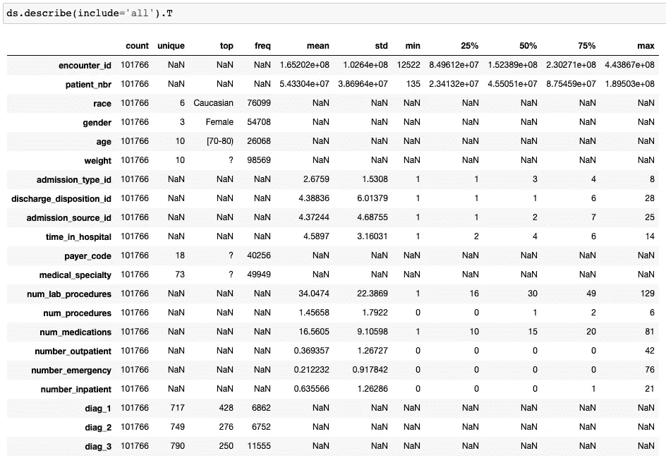

使用 df.describe()查看描述性统计数据

*   我查看唯一值(对于分类，这将显示为熊猫描述的 NaN，但是在熊猫概况中，我们可以看到不同的计数)。如果一个特征只有一个唯一值，那么它对我的模型没有帮助，所以我放弃了它。

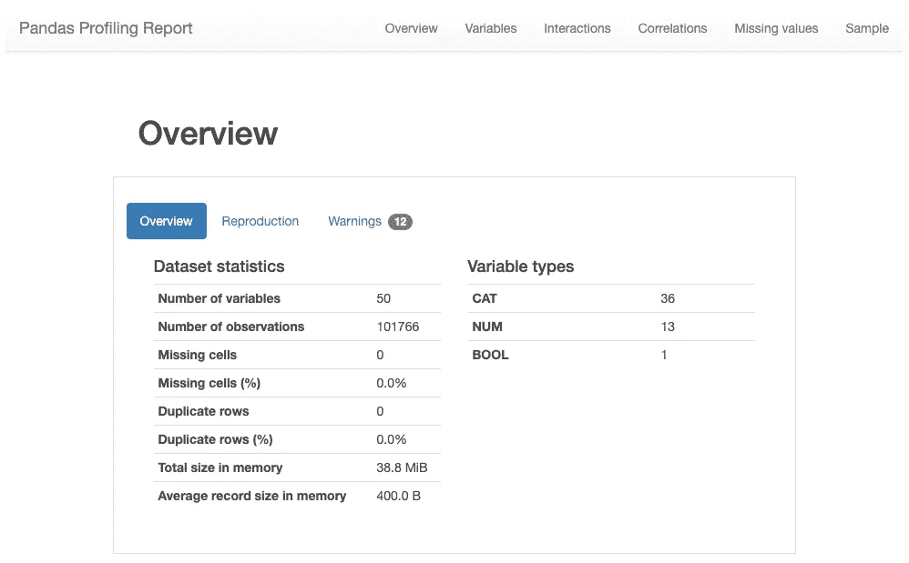

来自熊猫概况的数据集概述。这里有一件令人厌烦的事情——没有丢失值——这在现实世界中几乎从未发生过，这意味着我们可能会有一个编码的丢失值，稍后将详细介绍。

*   我观察这些值的范围。如果某个特性的最大值或最小值与平均值和 75% / 25%有显著差异，我可能想进一步了解这些值在其上下文中是否有意义。

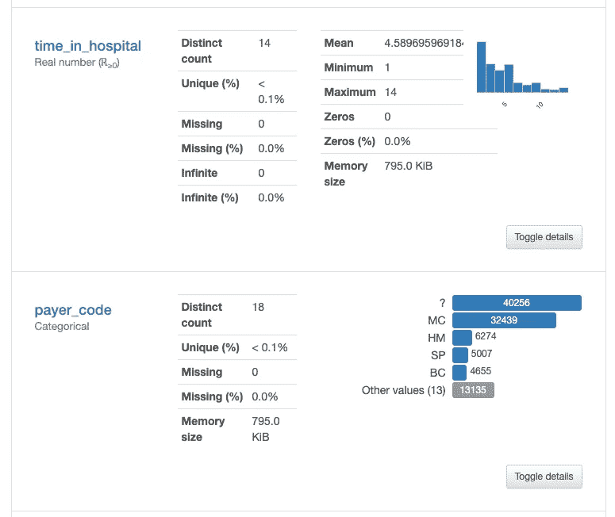

这是我们可以从熊猫档案中获得的每一个特征的描述性统计。上面是数字特征，下面是分类特征。在本系列的第 2 部分中会有更多关于处理这些差异的内容。

# 缺少值

几乎每个真实世界的数据集都有缺失值。有许多方法可以处理缺失值—通常我们使用的技术取决于数据集和上下文。有时我们可以做出有根据的猜测和/或估算值。我将不再讨论每一种方法(有许多优秀的媒体文章深入描述了不同的方法——参见吴俊的这篇[优秀文章](https://towardsdatascience.com/handling-missing-data-for-a-beginner-6d6f5ea53436)),我将讨论有时即使我们在数据中被给定了一个值，这个值实际上是缺失的，以及一种允许我们暂时忽略隐藏值的特定方法。

糖尿病数据集是隐藏在数据中的缺失值的一个很好的例子。如果我们查看“描述性统计”,我们可以看到零个缺失值，但简单观察其中一个特征，在本例中，如上图中的“payer_code ”,我们可以看到几乎一半的样本都有一个类别“？”。这些是隐藏的缺失值。

当一半样本有缺失值时，我们该怎么办？没有一个正确的答案([见吴俊的文章](https://towardsdatascience.com/handling-missing-data-for-a-beginner-6d6f5ea53436))。许多人会说，只要从模型中排除具有许多缺失值的特征，因为没有办法准确地估算它们。

但是有一种方法被许多数据科学家忽略了。如果您使用的是基于决策树的模型(比如 GBM)，那么该树可以将缺失值作为输入。由于所有的特征都将被转换成数值，我们可以只编码“？”作为远离数据集中使用的范围的极值(如 999，999)，这样在节点处，所有具有缺失值的样本将分裂到树的一侧。如果我们在建模后发现这个值非常重要，我们可以回到 EDA 阶段，尝试并理解(可能通过使用领域专家)在这个特定特性的所有缺失值中是否有有价值的信息。有些包甚至不要求你对丢失的值进行编码，比如 [LightGBM](https://lightgbm.readthedocs.io/en/latest/Advanced-Topics.html) 会自动进行这种分割。

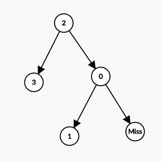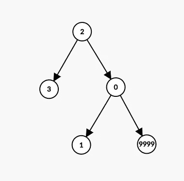

树中缺少值的拆分示例

## 重复行

数据集中有时会出现重复行。这很容易解决(这是一个使用熊猫内置方法的解决方案):

```
df.drop_duplicates(inplace=True)
```

还有另一种类型的重复行需要警惕。假设你有一个病人的数据集。对于每个患者，您可能有许多行来表示正在服药。这些不是复制品。我们将在本系列后面的“特性工程”中探讨如何处理这种重复行。

# 分布和异常值

分析数据集中的分布和异常值的主要原因是验证数据是正确的和有意义的。这样做的另一个好理由是简化数据集。

## 验证数据集

假设我们绘制了患者身高的直方图，并观察到以下情况

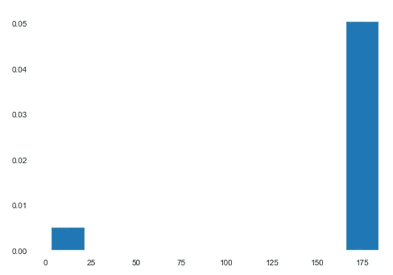

患者身高直方图

很明显，数据存在某种问题。在这里，我们可以猜测(根据上下文), 10%的数据以英尺为单位，其余的以厘米为单位。然后，我们可以将高度小于 10 的行从英尺转换为厘米。很简单。在一个更复杂的例子中，比如下面的例子，我们该怎么做？

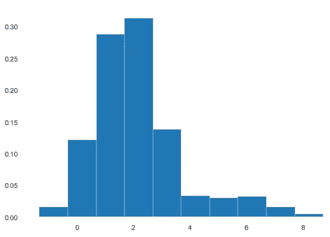

患者身高直方图

在这里，如果我们简单地看一下数据集，而不是检查每一个特征，我们会错过患者的身高被记录为甚至 6 米，这是没有意义的(见[世界上最高的人](https://www.guinnessworldrecords.com/news/2019/2/a-history-of-record-breaking-giants-100-years-after-the-tallest-man-in-the-world-511577))。为了解决这个单位误差，我们必须对截止值做出一些决定:哪些高度以英尺为单位，哪些以米为单位。另一个选项是检查身高和国家之间是否有关联，例如，我们可能会发现所有的英尺测量值都来自美国。

## 极端值

另一件重要的事情是检查异常值。我们可以将不同的特征绘制成箱线图或另一个特征的函数图(通常是目标变量，但不是必须的)。有许多统计数据来检查数据中的异常值，但通常在 EDA 中，我们可以非常容易地识别它们。在下面的例子中，我们可以立即识别异常值(随机数据)。

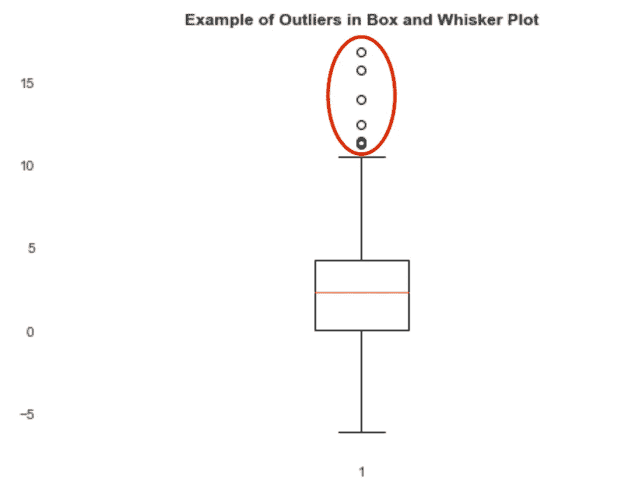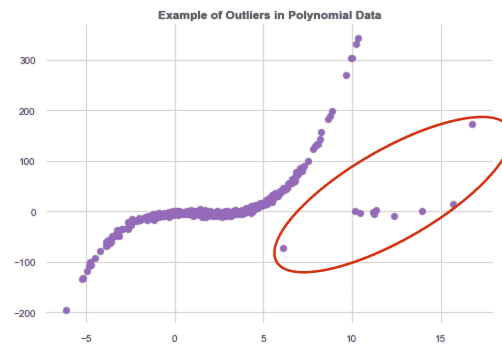

识别可视化中的异常值

检查异常值以了解这些是否是数据集中的错误非常重要。这是一个完全独立的主题(参见 [Natasha Sharma 关于该主题的精彩文章](https://towardsdatascience.com/ways-to-detect-and-remove-the-outliers-404d16608dba))，但对于理解是否保留数据集中的错误非常重要。

## 简化数据集

进行 EDA 的另一个真正重要的原因是，我们可能希望简化数据集，甚至只是确定在哪里简化数据集。

或许我们可以对数据集中的某些要素进行分组？以糖尿病患者数据集中的目标变量“再入院”为例。如果我们绘制不同的变量，我们会发现 30 天以内和 30 天以上的再入院通常遵循不同特征的相同分布。如果我们合并它们，我们可以平衡我们的数据集，得到更好的预测。

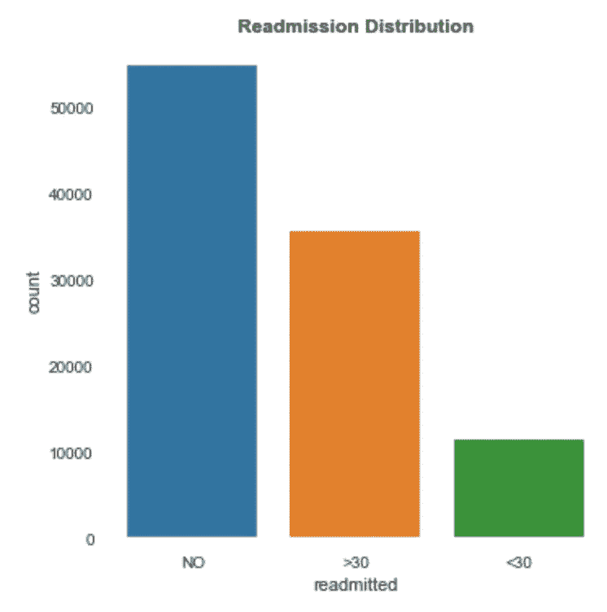

数据集平均分布在再次入院和未入院之间

如果我们检查不同特征的分布，我们发现这仍然成立，例如在不同性别之间

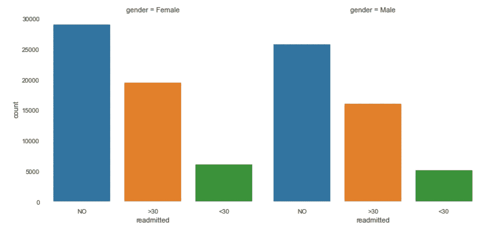

我们可以看到，重新接纳或不接纳之间的性别分布大致相同

我们可以跨不同的功能检查这一点，但这里的结论似乎是数据集非常平衡，我们可能会在 30 多天或不到 30 天内合并“再次入院”。

## 了解数据集

可视化数据集分布的另一个非常重要的原因是了解您拥有什么。以下列按年龄和性别划分的“患者人数”人口金字塔为例

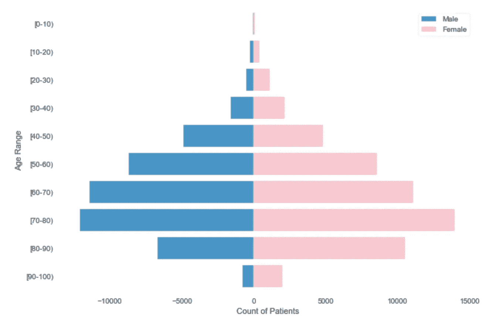

按年龄和性别划分的患者人数分布——归功于 Lilach Goldshtein

了解数据集中年龄和性别的分布是至关重要的，以确保我们尽可能减少他们之间的偏差。研究发现，许多模型都有极大的偏见，因为它们只针对一种性别或种族进行过训练(例如，通常是男性或白人)，所以这是 EDA 中极其重要的一步。

# 相关

EDA 中经常强调相关性，相关性通常非常有趣，但并不完全有用(参见这篇关于解释基本相关性的文章)。学术界的一个重要研究领域是如何识别因果关系和相关性(简单介绍见本[可汗学院课程](https://www.khanacademy.org/test-prep/praxis-math/praxis-math-lessons/gtp--praxis-math--lessons--statistics-and-probability/a/gtp--praxis-math--article--correlation-and-causation--lesson))，尽管领域专家通常可以验证相关性确实是因果关系。

有许多方法来绘制相关性，并使用不同的相关方法。我将重点介绍三种方法——Phi K、Cramer 的 V 和“单向分析”。

## Phi K 相关性

Phi_K 是一个新的相关系数，基于对两个变量的皮尔逊独立性检验的改进(更多信息参见[文档](https://phik.readthedocs.io/))。见下文熊猫概况的 Phi K 相关性(几个可用的相关性矩阵之一)

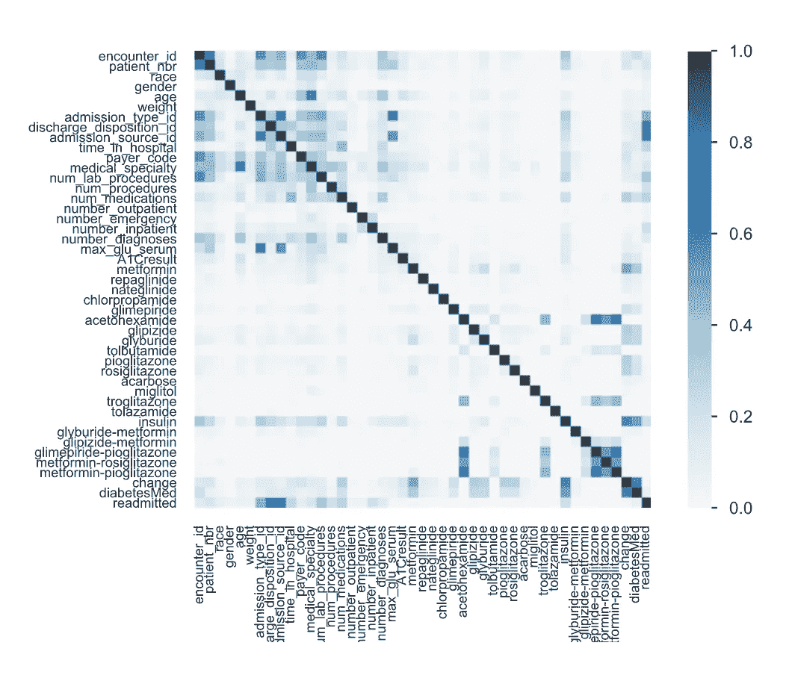

熊猫图谱中相关系数的φK 相关系数

我们可以很容易地确定“再次入院”(我们的目标变量)(最后一行/列)和其他几个特征之间的相关性，例如:“入院类型”、“出院处置”、“入院来源”、“付款人代码”和“实验室程序数量”。这对我们来说应该是一个亮点，我们必须更深入地挖掘每一个问题，以了解这在问题的上下文中是否有意义(可能——如果您有更多的过程，那么您可能有更重要的问题，因此您更有可能被重新接纳)，并帮助确认我们的模型在项目的后期可能发现的结论。

## 克莱姆 V 相关

克莱姆 V 是一个很好的统计量，用来衡量两个变量之间的相关性。一般来说，我们通常对特征和目标变量之间的相关性感兴趣。

有时，我们可以从相关图中发现其他有趣且令人惊讶的信息，例如 Lilach Goldshtein 在糖尿病数据集中发现的一个有趣事实。让我们来看看“出院 _ 处置 _id”(一个表明患者出院原因的分类特征)和“再次入院”(我们的目标变量——患者是否再次入院)的 Cramer V。

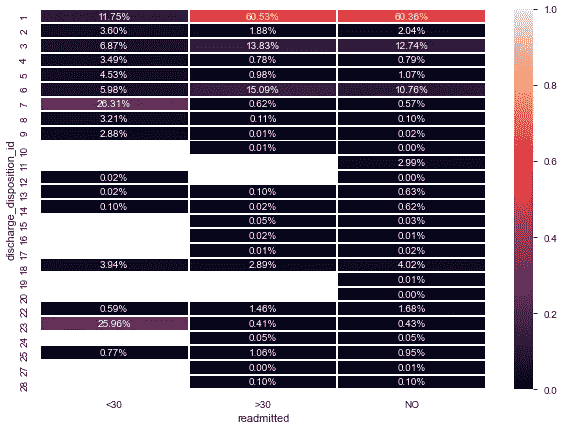

目标变量的克莱姆 V 和放电原因——归功于李拉赫·戈德斯坦

我们在这里注意到，出院编号 11、19、20 和 21 没有再入院的患者——奇怪！

让我们看看这些 id 是什么:

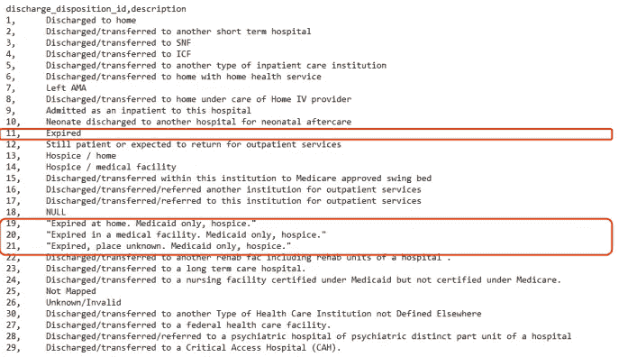

归功于莱拉·戈德斯坦

这些人从未被重新接纳，因为不幸的是，他们去世了。

这是一个非常明显的注意事项——我们可能不需要挖掘数据相关性来确定这一事实——但这样的观察常常被完全忽略。现在需要决定如何处理这些样本——我们是否将它们包含在模型中？可能不会，但这同样取决于数据科学家。在 EDA 阶段，重要的是我们找到这些事件。

## **单向分析**

老实说，如果你做了我在整篇文章中概述的一件事，就做这件事。单向分析可以在一个图表中提取我在本文中提到的许多不同的观察结果。

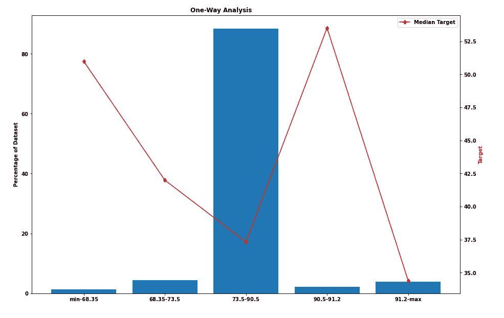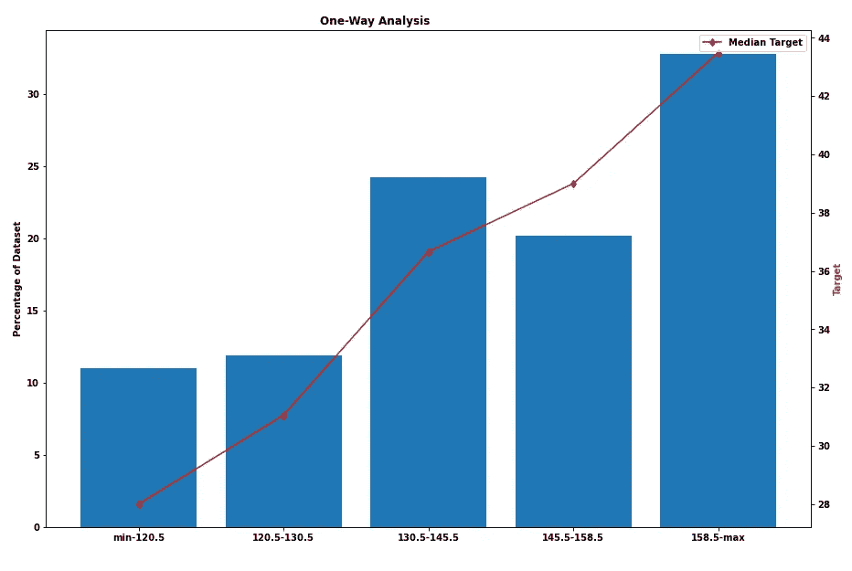

两个不同特征的单向分析

上图向我们展示了某个范围所代表的数据集的百分比以及该范围内目标变量的中值(这不是糖尿病数据集，而是用于回归的数据集)。在左侧，我们可以看到大多数样本都在 73.5–90.5 的范围内，并且特征和目标之间没有线性相关性。另一方面，在右侧，我们可以看到该特征与目标直接相关，并且在每个组中都有很好的样本分布。

使用单个决策树来选择组，以进行最佳分割。

这是一种分析数据集的好方法。我们可以看到样本在特定特征中的分布，如果有异常值，我们可以看到异常值(在这些示例中没有异常值),并且我们可以识别缺失值(或者我们首先将它们编码为之前描述的极端数值，或者如果它是分类特征，我们将看到标签为“NaN”或者在糖尿病情况下为“？”).

# 结论

您现在可能已经注意到了——对于 EDA 来说，没有一种尺寸适合所有人。在这篇文章中，我决定不深入研究如何做分析的每一部分(大多数可以用简单的 Pandas 或 Pandas Profiling 方法完成)，而是解释我们可以从每一步中学到什么，并帮助那些想了解为什么每一步都很重要的人。

在现实世界的数据集中，几乎总是存在缺失值、数据中的错误、不平衡数据和有偏见的数据。EDA 是处理数据科学项目的第一步，以了解我们有哪些数据并评估其有效性。

我要感谢 Lilach Goldshtein，她关于 EDA 的精彩演讲启发了这篇中型文章。