# 探索随机森林的最新趋势

> 原文：<https://pub.towardsai.net/exploring-the-last-trends-of-random-forest-396bd0347aa1?source=collection_archive---------1----------------------->

## [机器学习](https://towardsai.net/p/category/machine-learning)

## 随机森林模型被认为是最近变得非常流行的有前途的 ML 集合模型之一。在本帖中，我们回顾了随机森林的最新趋势。

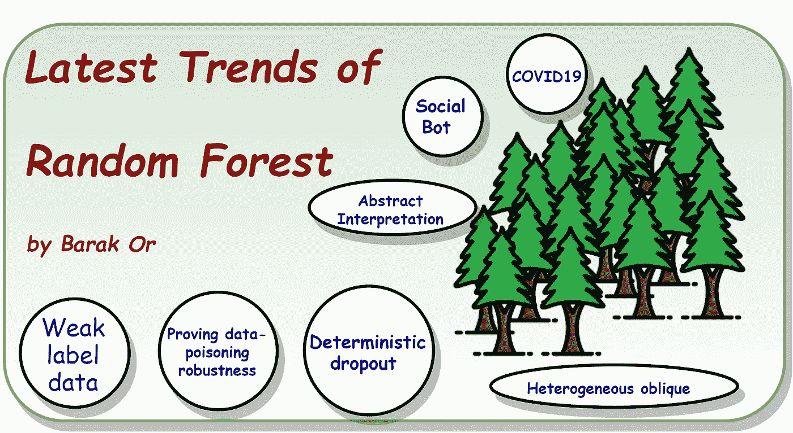

作者图片

# **集合模特-简介**

集成考虑多个学习模型，并将它们组合以获得更强大的模型。将不同的模型组合成一个集合可以更好地概括数据，最大限度地减少过度拟合的机会。随机森林是集合模型的一个例子，其中考虑了多个决策树。由于这篇文章与随机森林的最新趋势有关，所以假设读者有决策树的背景(如果没有，请参考[机器学习中的决策树](https://towardsdatascience.com/decision-trees-in-machine-learning-641b9c4e8052)，这是 [Prashant Gupta](https://medium.com/u/a84d0e60277a?source=post_page-----396bd0347aa1--------------------------------) 的一篇很棒的文章)。

# **随机森林-背景**

随机森林是由 Leo Breiman [1]在 2001 年提出的。动机在于决策树模型的主要缺点，即当创建许多叶子时，它容易过度拟合。因此，许多决策树导致更稳定的模型，具有更好的泛化能力。随机森林的想法是创建许多决策树，其中每一棵都应该合理地预测目标值，但看起来与其他树不同。“不同的”创建是通过在树构建过程中添加随机变化来完成的。这些变化包括训练模型的所选数据的变化，并且每个分割测试的特征是随机选择的。通常，随机森林过程可以描述如下:

作者图片

设计应该设置的主要调整参数可以总结如下:

1.  集合模型中使用的树(估计量)的数量。
2.  最大特征参数。主要影响集合模型中树木的多样性。强烈影响性能。
3.  最大树深度。该参数对于避免过度拟合非常重要。

## 随机森林的优点和缺点总结如下:

作者图片

这里给出了一个使用随机森林的很好的例子:[Arya Murali](https://towardsdatascience.com/an-implementation-and-explanation-of-the-random-forest-in-python-77bf308a9b76)在 python-77bf308a9b76 中实现并解释随机森林。

# **从弱标签数据中学习:深入森林探险**

弱标签是指每个训练样本同时与多个(真实)标签相关联，但只提供其中的一部分。最近，王等人的一篇论文[2]建议通过应用深森林探险模型来处理弱标签数据。他们引入了具有标记互补结构的“LCForset 方法”:

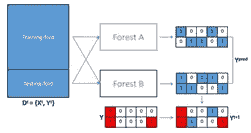

王等，2020

主要贡献是基于树集成的深度学习方法(针对弱标签)训练。大多数情况下，这类问题都被公式化为一个正则化的框架。在他们的工作中，他们逐层处理信息，并能够实现有效的标签互补结构。下图给出了它们的一般方案，其中数据用于训练两个完全随机森林和每层两个随机森林。然后，对于每个训练示例，连接特征向量。该过程继续，直到达到最大层 t

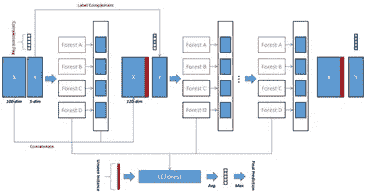

王等，2020

该方法在图像和序列数据(医学 NLP 任务)上被演示/测试，具有很好的结果。

# 决策树集成分类器的抽象解释

随机森林鲁棒性验证问题非常重要。显然需要解释训练好的模型并提供一些验证工具。最近，Ranzato 等人[3]研究了这个问题，提出了一个基于一般和主要抽象解释的框架，用于随机森林的形式稳定性和鲁棒性。他们的方法包括对标准对抗性扰动的鲁棒性检查。他们使用 MNIST 数据集评估了他们的工具，并为随机森林验证提供了一个有效的工具。下图描述了不同(最大)深度的稳定性和准确性之间的关系。

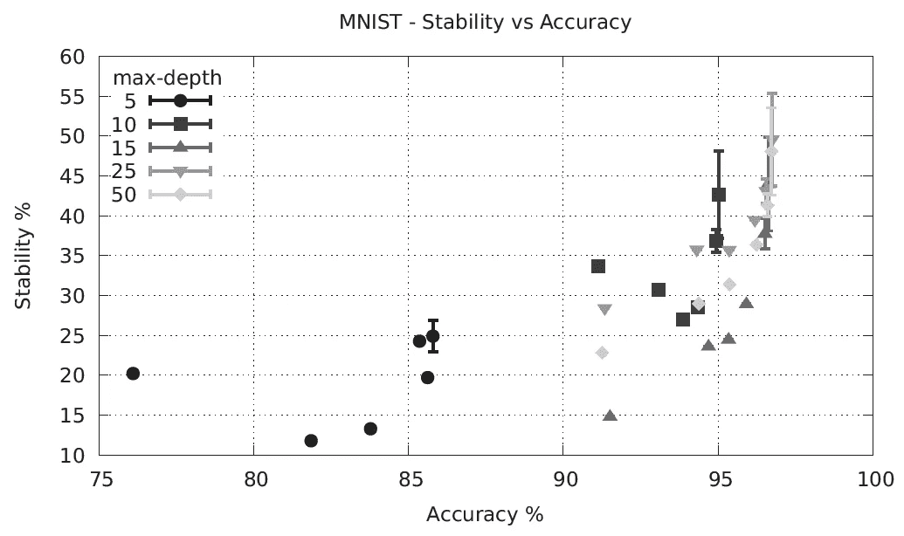

兰扎托等人，AAAI 2020

# **证明决策树中数据中毒的鲁棒性**

在许多机器学习模型中，训练数据的微小变化可能会严重影响结果预测。最近，Drews 等人[4]在攻击的背景下研究了这个问题，攻击者可以通过注入一些恶意的。他们通过在随机森林算法中大量使用的决策树模型展示了他们的结果。提出了一种新的工具“解毒剂”，用于验证决策树学习器的数据平衡鲁棒性。下图总结了他们的方法。

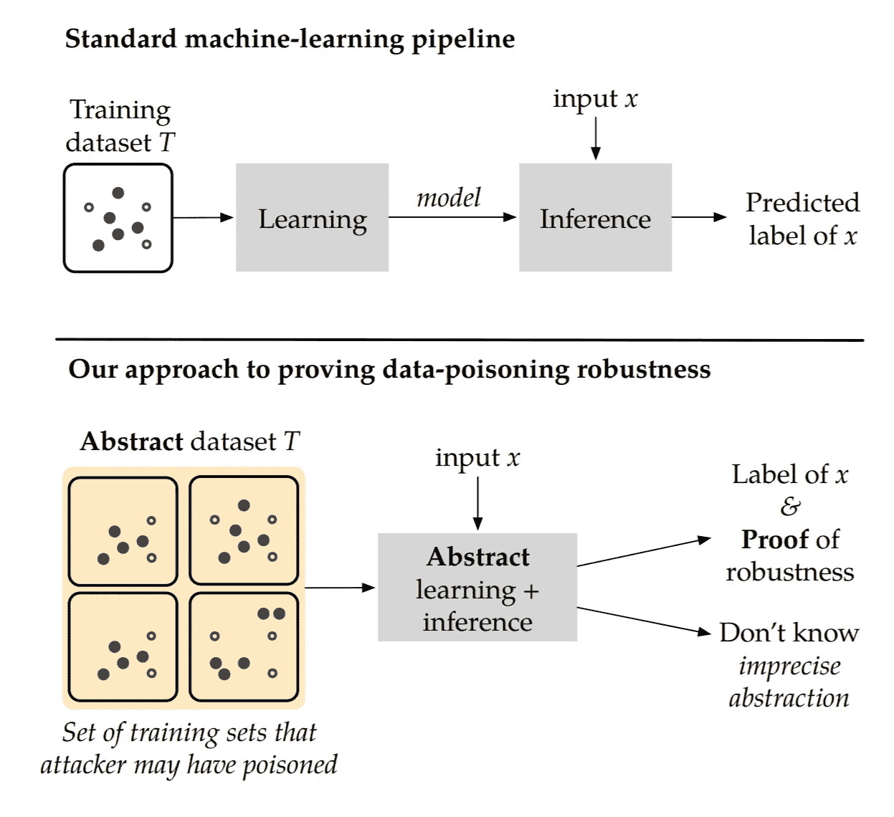

Drews 等人 *ACM SIGPLAN，2020*

他们使用下面提供的结果在许多数据集上评估了他们的模型，其中一小部分测试实例被证明对中毒参数 n 是稳健的。

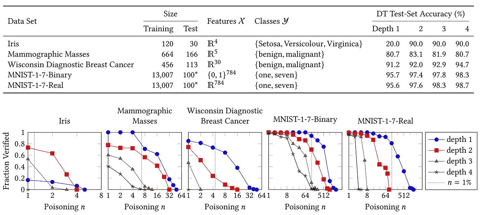

Drews 等人 *ACM SIGPLAN，2020*

# 通过数据选择进行可扩展和可推广的社交机器人检测

社交机器人被广泛使用。高效可靠的社交机器人分类对于检测社交媒体上的信息操纵非常重要。最近，Yang 等人[5]提出了一个框架，该框架使用最少的帐户元数据，能够进行高效的分析，从而实时处理 Twitter 的全部公共推文流。他们发现，有策略地选择训练数据的子集比穷尽所有可用数据进行训练会产生更好的模型准确性和泛化能力。社交机器人的可生成性是通过使用具有 5 重交叉验证的随机森林实现的:

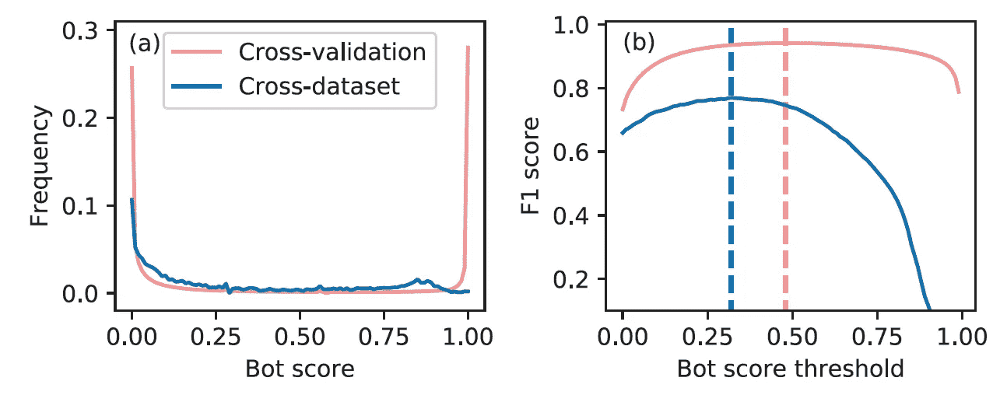

杨等人*2020 年*

当随机森林生成 0 到 1 之间的分数时，获得最大化精确度和召回率(通过 F1 度量)的阈值用于交叉验证或跨域测试。因此，阈值的选择取决于用于验证的维持数据集。

# **异类斜乱森林**

使用随机森林涉及在节点中具有单一特征的决策树来分割数据。这种分割可能无法利用数据的内部结构(例如，几何结构)，因为涉及到轴平行的决策边界。Katuwal 等人[6]最近提出了异源倾斜随机森林，其中使用了倾斜超平面而不是轴平行超平面。具有这种超平面的树可以更好地利用几何结构来增加树的精度并减少深度。

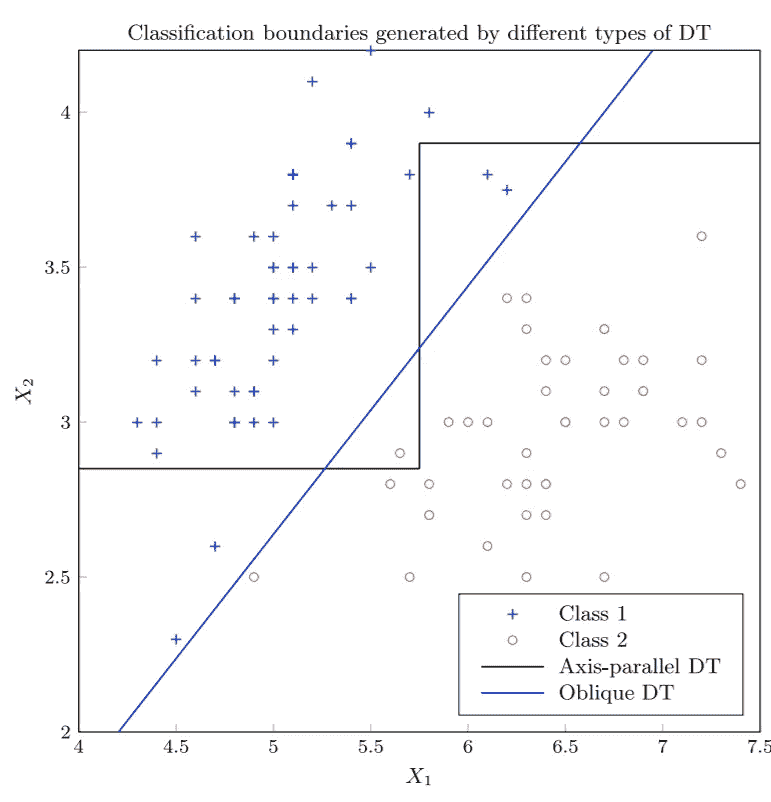

卡图瓦尔等人，模式识别，爱思唯尔

他们的方法包括在树的内部节点的几个线性分类器，得到 K 个基于超类的分区，所有的分区创建 K 个 on-vs-all 分区。

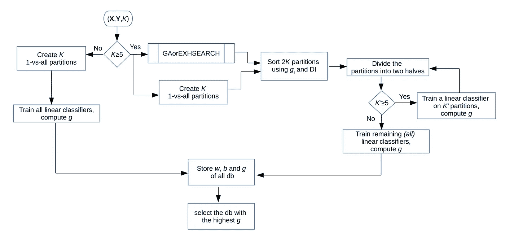

卡图瓦尔等人，模式识别，爱思唯尔

他们将他们的方法与许多已知数据库上的几个模型进行了对比，获得了更高的平均准确度。

# 使用复合随机森林的深度神经网络的确定性丢失

下面的工作来自深度学习领域，其中随机森林模型被用来改进退出技术。Santra 等人[7]提出了一种确定性地识别和终止神经网络中不重要的连接(丢失)的方法。随机森林算法用于查找不重要的连接，从而提高了 MNIST 数据集的准确性:

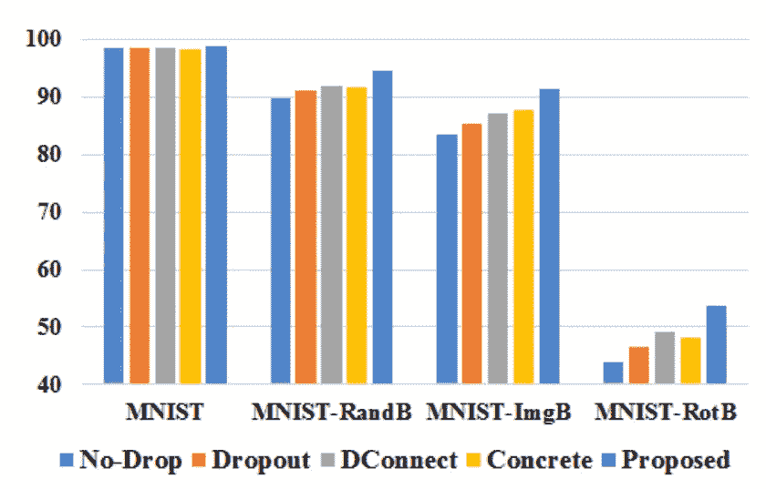

Santra 等人，模式识别，爱思唯尔

他们的方法流程图由下式给出:

Santra 等人，模式识别，爱思唯尔

其中一般来说，各种步骤包括找到两个完全连接的层来执行丢弃，在两个层的输出处构建特征向量(通过创建复合特征向量)，以及找到不重要的复合特征来丢弃它们。

# 基于增强随机森林算法的新冠肺炎患者健康预测

最后，随机森林的高受欢迎程度导致它也被用于新冠肺炎预测。Iwendi 等人[8]提出了一个由 AdaBoost 算法增强的微调随机森林模型。他们建议的模型使用了许多新冠肺炎特征，并且在他们使用的数据集上具有 94%的准确性和 0.86 的 F1 分数。

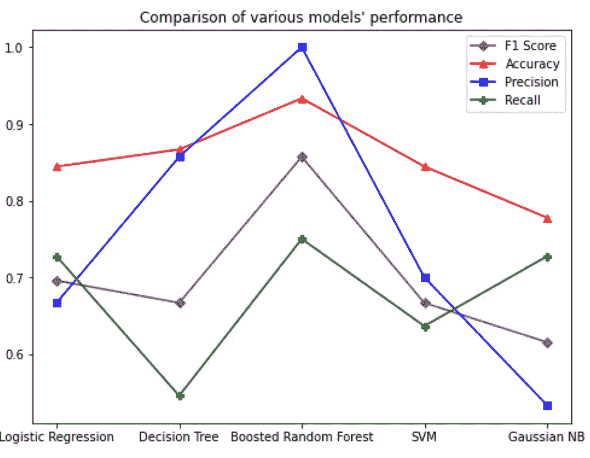

Iwendi 等人，*公共卫生前沿* 8

# 结论

在这篇文章中，我们探索了随机森林领域的最新作品。随机森林最近变得非常受欢迎，许多出版物也出现了实际的工业用途。模型的稳定性和复杂性似乎是非常重要的，其中主要的研究方法包括 dropout 技术和稳定性约束。此外，对于高级模型，与深度学习的集成似乎很常见。

— — — — — — — — — — — — — — — — — —

# 关于作者

Barak 获得了以色列理工学院的航空工程学士学位(2016 年)、硕士学位(2018 年)以及经济和管理学士学位(2016 年，成绩优异)。他曾在高通工作(2019-2020)，在那里他主要研究机器学习和信号处理算法。巴拉克目前正在海法大学攻读博士学位。他的研究兴趣包括传感器融合、导航、机器学习和估计理论。

www.Barakor.com|[https://www.linkedin.com/in/barakor/](https://www.linkedin.com/in/barakor/)

— — — — — — — — — — — — — — — — -

# 参考

[1]布雷曼，利奥。“随机森林。”*机器学习*45.1(2001):5–32。

[2]王，钱伟长，，于."从弱标签数据中学习:一次深入森林的探险." *AAAI* 。2020.‏

[3]兰扎托、弗朗切斯科和马尔科·扎内拉。"决策树集成分类器的抽象解释."*AAAI 人工智能会议记录*。第 34 卷。№04.2020.‏

[4]德鲁斯、塞缪尔、奥斯·阿尔巴古提和洛里斯·德安东尼。"证明决策树中数据中毒的鲁棒性."*第 41 届 ACM SIGPLAN 编程语言设计与实现会议论文集*。2020.

[5]杨，程凯等，“基于数据选择的可扩展和可推广的社会机器人检测”AAAI 人工智能会议论文集。第 34 卷。№01.2020.

[6]卡图瓦尔、拉凯什、彭努图赖、纳加拉塔姆·苏甘坦和张乐。“异质斜向随机森林。”*模式识别* 99 (2020): 107078。

[7] Santra、Bikash、Angshuman Paul 和 Dipti Prasad Mukherjee。"使用复合随机森林的深度神经网络的确定性丢失."*模式识别字母*131(2020):205–212。

[8] Iwendi，Celestine 等，“使用增强随机森林算法进行新冠肺炎患者健康预测”公共卫生前沿 8 (2020): 357。