# 两种不同方法的人脸识别算法

> 原文：<https://pub.towardsai.net/face-recognition-algorithms-with-2-different-methods-361276a2ebc0?source=collection_archive---------0----------------------->

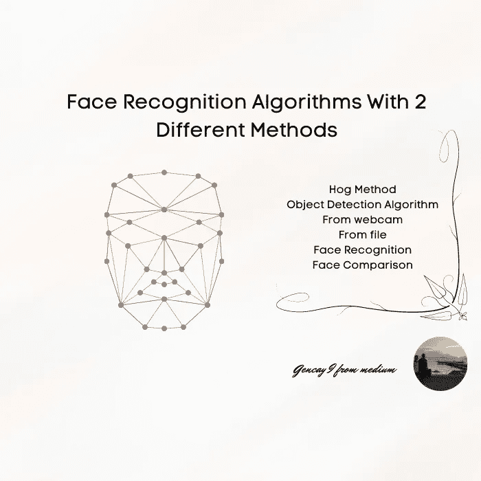

作者图片

# 介绍

在计算机技术&算法和数据能力的支持下，计算机视觉是人类视觉能力的复制形式。根据各自的最新发展，计算机视觉的应用正变得越来越普及并进入我们的生活。

```
Content· [Introduction](#547e)
· [Example of Computer Vision Applications](#88bc)
· [Why Python?](#efb2)
· [Histogram of Gradients Algorithm](#1bc8)
 ∘ [Finding Faces](#01e7)
 ∘ [Find the Facial Landmarks](#58db)
 ∘ [Codes of finding Facial Landmarks of Face](#777c)
 ∘ [Drawing lines of facial landmarks](#d2a8)
 ∘ [Numbering the Faces](#a88e)
 ∘ [Name a person from those numbers](#d1f8)
 ∘ [Face Comparison with Hog Method](#444b)
 ∘ [Face Recognition in Webcam](#35e7)
· [Object Detection Algorithm](#e2ac)
 ∘ [What is Haarcascade?](#cb0b)
 ∘ [Important Reminder: Version Check](#e9e6)
 ∘ [Train- Test Split](#05c9)
 ∘ [Loading Haarcascade](#e6de)
 ∘ [Face Recognition in Pictures with Object Detection Algorithm](#6186)
· [Conclusion](#1e9e)
```

# 计算机视觉应用的例子

**医疗保健**:根据不断增长的数据量，医疗保健行业发明了许多 CV 应用程序。例如:肿瘤检测、医学成像、癌症检测等等。

**安全**:通过在各个部门的监控摄像头中使用人脸检测，安全公司和地方当局正在利用 CV 应用程序的优势。

**自动驾驶汽车**:现在自动驾驶汽车这么受欢迎。从特斯拉开始，许多其他公司试图开发他们的自动驾驶汽车，以跟上未来的技术。这些系统背后的逻辑也是 CV 应用程序之一，它在汽车自动驾驶时持续围绕汽车工作。

**人脸识别**:人脸识别是 CV 最酷的应用之一。

如果你在某种程度上使用脸书或新名字 Meta，你也会对人脸识别很熟悉。人脸检测的一个流行应用是脸书使用的。

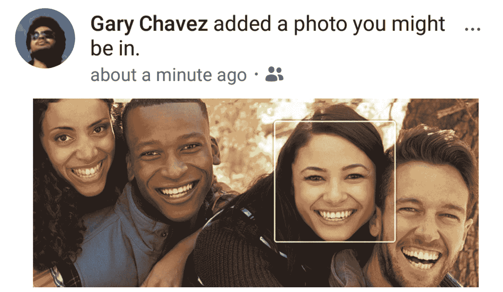

***来源:TechCrunch***

此外，这项技术也通过我们的手机进入我们的生活。在 iPhone 上使用照片图库时，您也可能会看到以下功能。

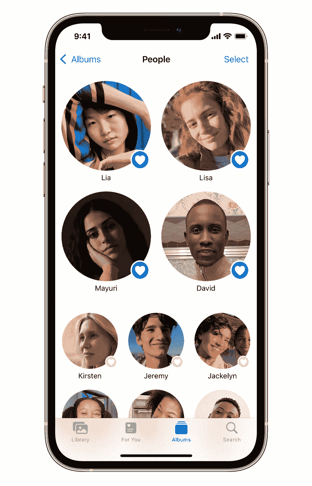

[信用](https://support.apple.com/en-us/HT207103#:~:text=photo%20collection%20screen.-,Here's%20how%3A,that%20you%20want%20to%20use.)

人脸识别是计算机视觉的一个流行应用。

这些应用程序背后的逻辑令人疑惑。

在这篇文章中，我将向您介绍人脸识别的两种著名方法及其应用、代码，以及在 Python 中应用这些模型之前需要注意的重要事项。

# 为什么是 Python？

随着时间的推移，Python 越来越受欢迎，并且具有易于使用的特点，成为越来越受欢迎的编程语言。

这是 O'Reilly 正在做的一项研究，旨在展示 Python 越来越受欢迎的程度及其与其他语言的比较。

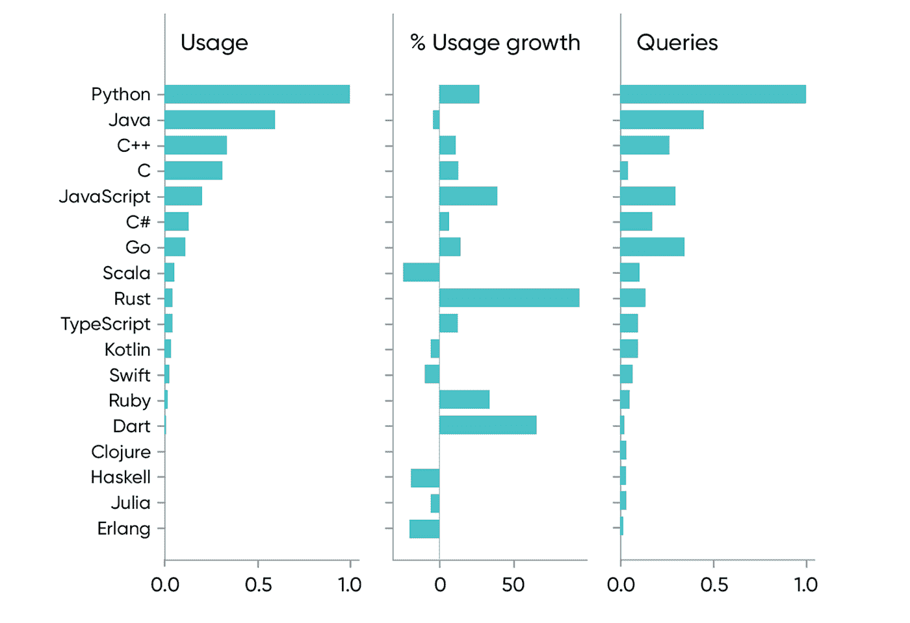

[参考](https://www.oreilly.com/radar/where-programming-ops-ai-and-the-cloud-are-headed-in-2021/)

# HOG 算法

梯度算法的直方图由 Navneet Dalal 和 Bill Triggs 在 2005 年创建。该方法是一种特征描述子，用于计算机视觉中的目标检测。

现在我把它分为 4 个部分的 HOG 应用在人脸识别。

*   寻找面孔
*   找到面部标志
*   给面编号
*   从这些数字中说出一个人的名字

## 寻找面孔

为了找到图像中的人脸，我们将一次一个地查看图像中的每个像素。

对于每一个像素，我们都会。看看直接包围它的像素。

主要目标是找出图像在哪个方向变暗，然后画一个箭头指向那个像素。

当您对图像中的每个像素反复执行该操作时，您会看到每个像素都被一个箭头所取代。

这些箭头是“渐变”。它们显示了从亮到暗的流动。

然后我们每个取 16x16 像素，定义图片中的主箭头。

结果，我们得到了一张猪的照片。

现在让我们看看宇航员艾伦·柯林斯的猪照片。

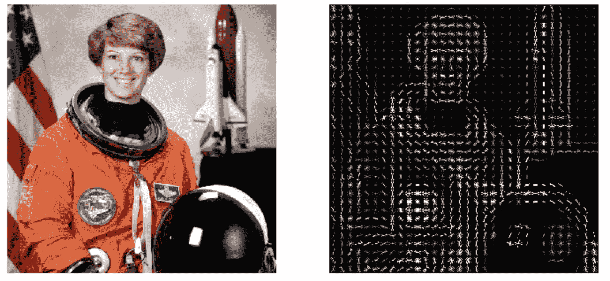

*描述:宇航员艾琳·科林斯* [的图像的猪特征的可视化参考](https://iq.opengenus.org/object-detection-with-histogram-of-oriented-gradients-hog/)

如何把自己的照片变成猪的图像？

通过遵循 Python 中的代码，很容易应用这一点。

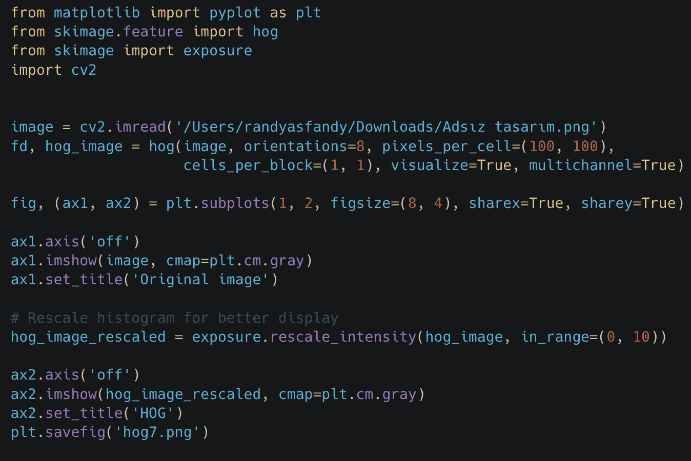

之后，通过遵循 HOG 模式，我们从图片中找到人脸。

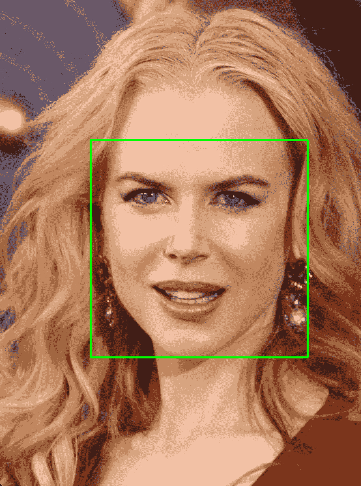

来源:[定位人脸](https://theskincareedit.com/.image/c_limit%2Ccs_srgb%2Cq_auto:good%2Cw_600/MTU2ODk4MzQxOTIxODI2MjUz/nicole-kidman-cmt-music-awards-2008.webp)

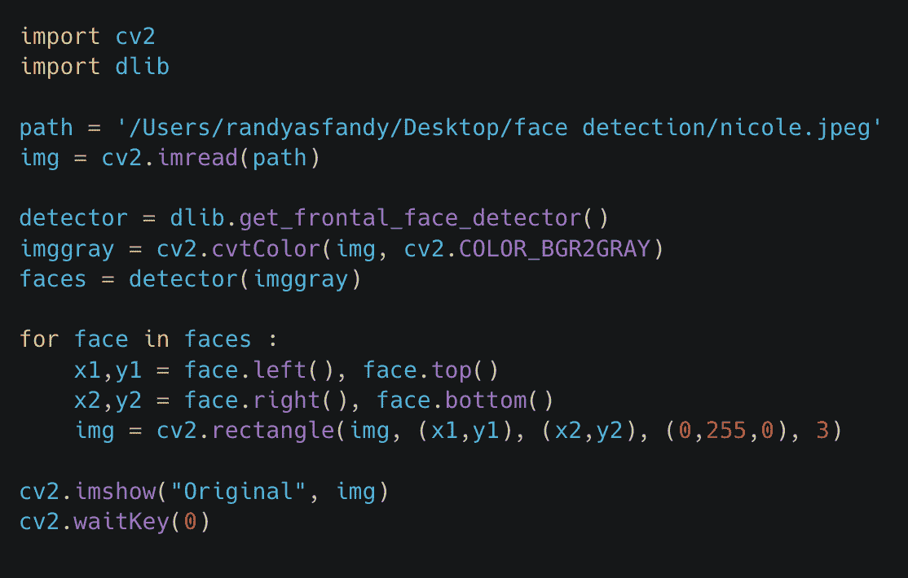

定位面部

## 找到面部标志

为了用数字概括面部，面部识别库在后端使用 dlib 库来寻找面部标志以完成这个概括过程。

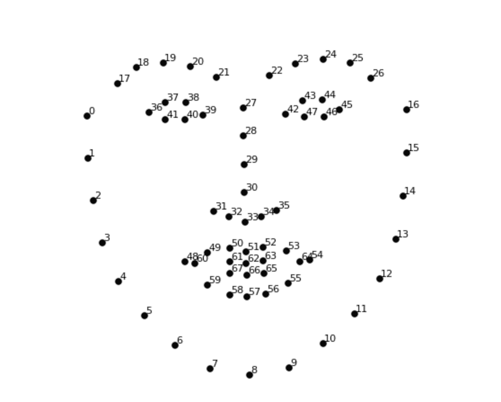

你可以从这些点上看到，例如从 36 岁到 41 岁你可以看到右眼，或者从 0 岁到 16 岁你可以看到下巴，或者从 27 岁到 36 岁你可以看到鼻子，全部列表；

*   颌= 0–16
*   右眉= 17–21
*   左眉= 22–26
*   鼻子= 27–35°
*   右眼= 36–41
*   左眼= 42–47
*   嘴巴= 48–60 岁
*   嘴唇= 61–67


来源:[面部标志](https://theskincareedit.com/.image/c_limit%2Ccs_srgb%2Cq_auto:good%2Cw_600/MTU2ODk4MzQxOTIxODI2MjUz/nicole-kidman-cmt-music-awards-2008.webp)

## 寻找[面部](https://carbon.now.sh/?bg=rgba%28171%2C+184%2C+195%2C+1%29&t=seti&wt=none&l=python&width=680&ds=true&dsyoff=20px&dsblur=68px&wc=true&wa=true&pv=56px&ph=56px&ln=false&fl=1&fm=Hack&fs=14px&lh=133%25&si=false&es=2x&wm=false&code=import%2520cv2%250A%250Aimport%2520numpy%2520as%2520np%250A%250Aimport%2520dlib%250A%250Aimg%2520%253D%2520cv2.imread%28%27%252FUsers%252Frandyasfandy%252FDesktop%252Fnicole.jpeg%27%29%250A%250Adetector%2520%253D%2520dlib.get_frontal_face_detector%28%29%250Apredictor%2520%253D%2520dlib.shape_predictor%28%2522%252FUsers%252Frandyasfandy%252FDownloads%252Fshape_predictor_68_face_landmarks.dat%2522%29%250A%250Aimggray%2520%253D%2520cv2.cvtColor%28img%252C%2520cv2.COLOR_BGR2GRAY%29%250Afaces%2520%253D%2520detector%28imggray%29%250A%250Afor%2520face%2520in%2520faces%2520%253A%250A%2520%2520%2520%2520x1%252Cy1%2520%253D%2520face.left%28%29%252C%2520face.top%28%29%250A%2520%2520%2520%2520x2%252Cy2%2520%253D%2520face.right%28%29%252C%2520face.bottom%28%29%250A%2520%2520%2520%2520landmarks%2520%253D%2520predictor%28imggray%252C%2520face%29%250A%2520%2520%2520%2520for%2520n%2520in%2520range%2868%29%253A%250A%2520%2520%2520%2520%2520%2520%2520%2520x%2520%253D%2520landmarks.part%28n%29.x%250A%2520%2520%2520%2520%2520%2520%2520%2520y%2520%253D%2520landmarks.part%28n%29.y%250A%2520%2520%2520%2520%2520%2520%2520%2520cv2.circle%28img%252C%28x%252Cy%29%252C%25205%252C%2520%2850%252C50%252C255%29%252C%2520cv2.FILLED%29%250A%250A%250Acv2.imshow%28%2522Original%2522%252C%2520img%29%250Acv2.waitKey%280%29)面部标志的代码

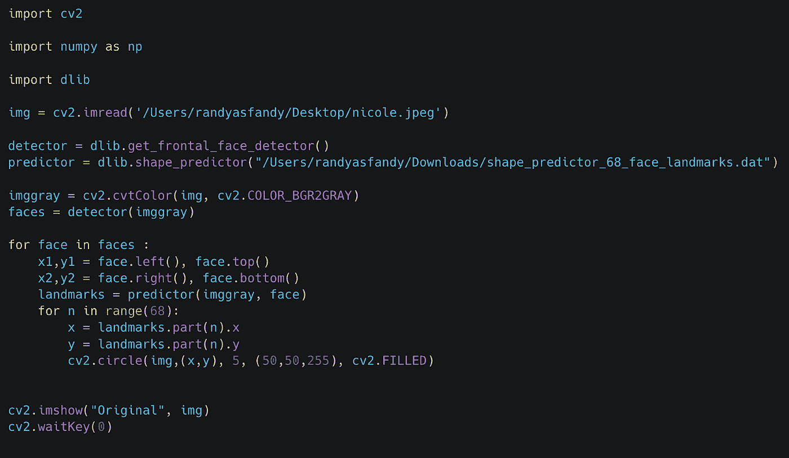

## 绘制面部标志线

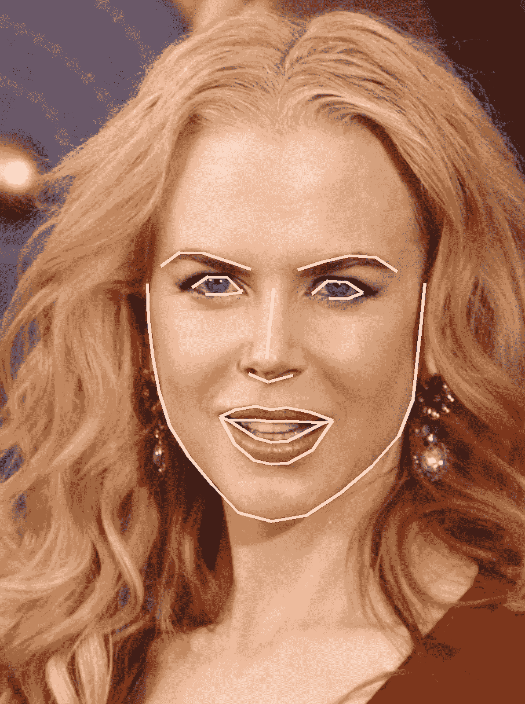

来源:[妮可·基德曼](https://theskincareedit.com/.image/c_limit%2Ccs_srgb%2Cq_auto:good%2Cw_600/MTU2ODk4MzQxOTIxODI2MjUz/nicole-kidman-cmt-music-awards-2008.webp)

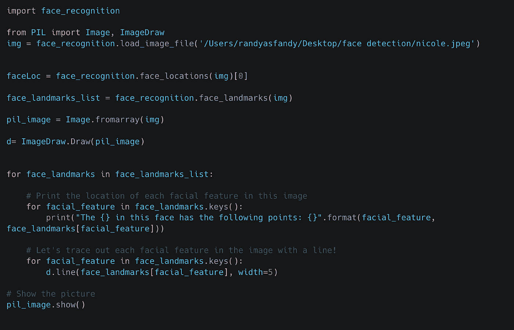

## 给面编号

要对人脸进行编码，首先，用一串数字来象征人脸是很重要的。为此，我使用了*人脸识别*库。

从图像中产生的 128 个测量值。

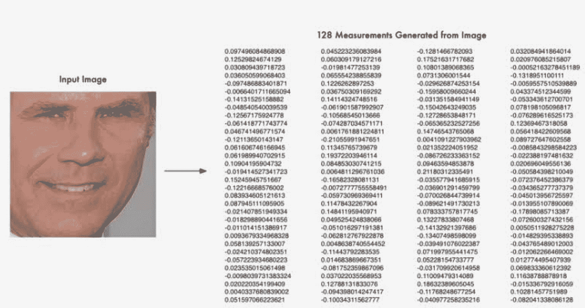

来源:[参考](https://medium.com/@ageitgey/machine-learning-is-fun-part-4-modern-face-recognition-with-deep-learning-c3cffc121d78)

获得这些测量值后，我们比较这些结果来定义或比较人脸。

## 从这些数字中说出一个人的名字

在这个过程中，我们将根据我们的第一个定义从编码中定义一个人。

现在使用 Adam Geitgeys 库会更好，他也会在他的[文章中广泛地定义这个方法。](https://medium.com/@ageitgey/machine-learning-is-fun-part-4-modern-face-recognition-with-deep-learning-c3cffc121d78)

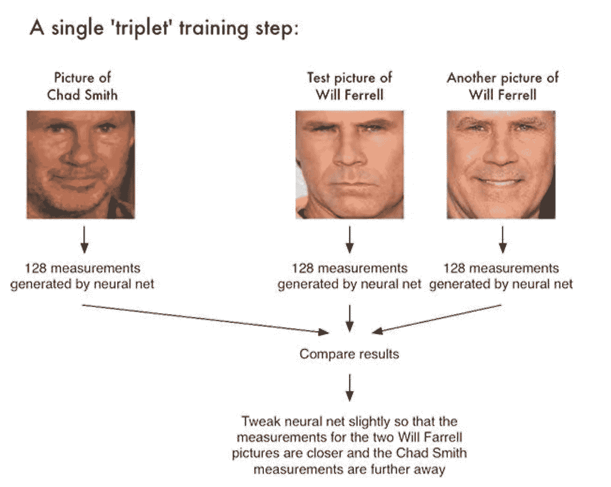

来源:[参考](https://medium.com/@ageitgey/machine-learning-is-fun-part-4-modern-face-recognition-with-deep-learning-c3cffc121d78)

为了定义，我们将应用机器学习分类算法，该算法是支持向量机算法。

如果你熟悉计算机视觉或机器学习，你肯定知道用于分类的 SVM 算法。

通过这一点，可以在测量值之间进行区分，并且可以知道这些测量值是否是给定个人的。

## 用 Hog 方法进行人脸比对

这个算法会给你两张不同照片的比较结果。

我们要做的第一件事是加载图像并将其转换为 RGB，因为我们得到的图像是 PGR 的，而库理解它为 RGB，所以我们应该转换它。

***重要提示:不要忘记安装 dlib 库 19.18，以减少应用代码时的错误。***

步骤:

我们将训练并获得正常图像的编码，然后我们将使用我们的测试图像。

我们将选择我们的图像，选择过程取决于你加载了多少图像，如果你有一个以上的图像，选择那一个，你必须使用切片器。

如果你想选择第一个，你应该使用“[0]”符号来确定。

然后我们会对检测到的人脸进行编码。

接下来，我们将绘制一个矩形周围的脸，你可以区分厚度，颜色，或矩形的大小，通过改变代码的值。

找到人脸并在人脸周围画一个矩形后，现在是时候比较人脸了。

要做到这一点，现在是时候应用 SVM 了。当两次测量之间的距离很小时，这意味着可能是匹配的，因为这标识了相似性。

最后，如果你想在人脸周围放置文字，表示匹配是真还是假，你可以使用 ***puttext*** 方法，确定你可以根据你的意愿改变文字的大小或颜色。

全代码；

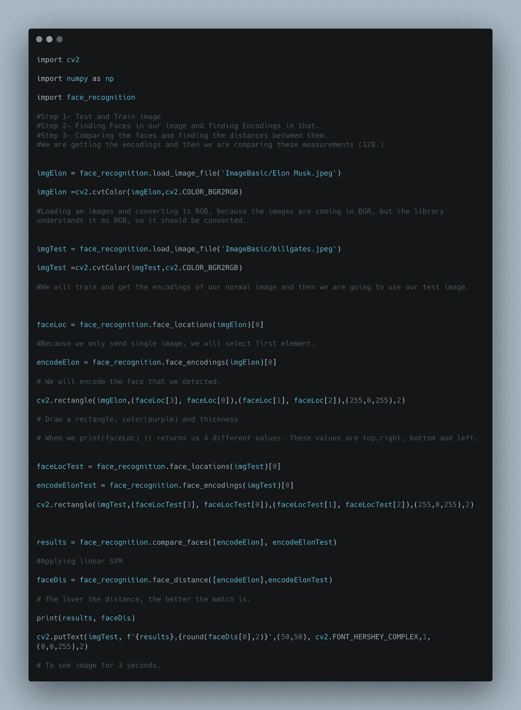

现在是在两个名人之间应用代码的时候了。

正如我们看到的，当两张图片之间的数量增加时，这意味着这里不存在相似性。

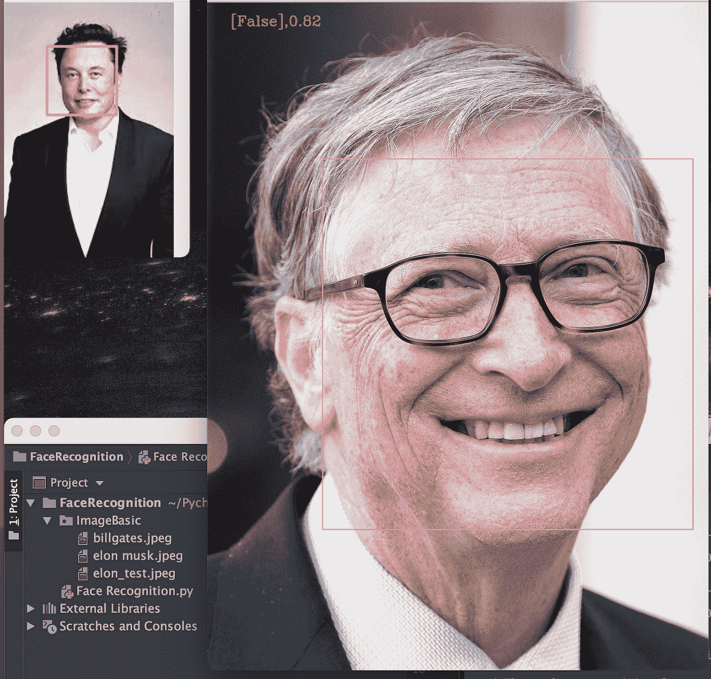

图片来源:作者

与此相反，随着数量的减少，这意味着两张照片之间存在不可否认的相似之处，就像我们在例子中看到的一样，这可能是同一个人。

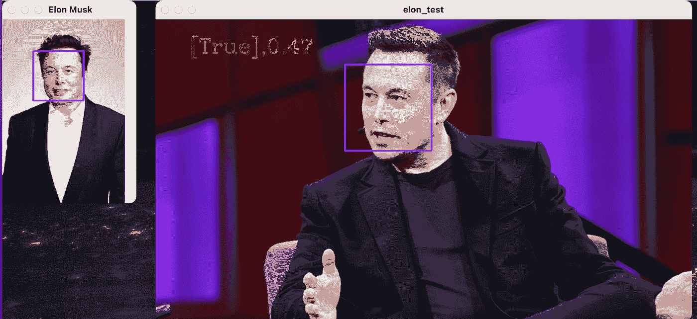

图片来源:作者

## 网络摄像头中的人脸识别

这是带有人脸识别[库的网络摄像头中人脸识别的完整代码。](https://github.com/ageitgey/face_recognition)

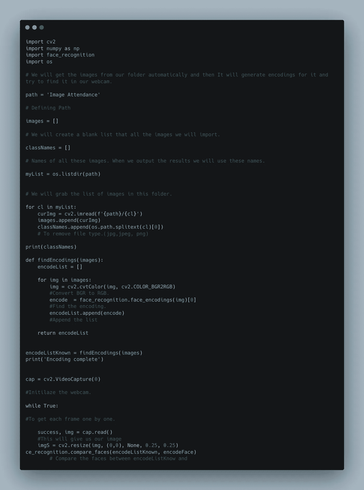

图片来源:作者

# 目标检测算法

[算法](https://ieeexplore.ieee.org/document/990517)使用保罗·维奥拉&迈克尔·琼斯创造的边缘或线条检测功能。

## 什么是 Haarcascade？

Haarcascade 是一种对象检测算法，用于识别图像或视频中的人脸。

该算法使用 Paul Viola 和 Michael Jones 在研究论文中创建的边缘或直线检测功能

## 重要提醒:版本检查

当 haarcascade 与 opencv 一起使用到 face 时，加载 [opencv_contrib_python](https://pypi.org/project/opencv-contrib-python/) 库以便能够使用 [face 是至关重要的。LBPHFaceRecognizer_create](https://docs.opencv.org/3.4/df/d25/classcv_1_1face_1_1LBPHFaceRecognizer.html) 。

因为 [opencv_python](https://pypi.org/project/opencv-python/) 库不包含[面。LBPHFaceRecognizer_create](https://docs.opencv.org/3.4/df/d25/classcv_1_1face_1_1LBPHFaceRecognizer.html) 。

## 列车测试分离

请在您的工作目录中创建两个包含图片的文件夹，首先算法将进行训练，然后根据训练的结果进行测试。

[列车](https://github.com/gncll/face_recognition/blob/main/Object%20Detection%20Algorithm/train.py)

[测试](https://github.com/gncll/face_recognition/blob/main/Object%20Detection%20Algorithm/test.py)

## 正在加载 Haarcascade

如果可能的话，在你的工作目录下下载 xml 格式的 haarcascade

1.  以 [raw 格式](https://raw.githubusercontent.com/opencv/opencv/master/data/haarcascades/haarcascade_frontalface_default.xml)打开
2.  按 Ctrl+A，然后按 Ctrl+V，或者按 mac 命令+A 和命令+V
3.  通过 python 解释器在目录中创建新文件。我推荐 Anaconda- Spyder，因为我在加载 face 时遇到了一个问题。LBPHFaceRecongizer.create 使用 PyCharm CE。
4.  粘贴到一个文件中，然后保存它。
5.  您将在代码中使用它。
6.  在 OpenCV haarcascades 的新版本中，您可以使用

[代码](https://carbon.now.sh/?bg=rgba%28171%2C+184%2C+195%2C+1%29&t=seti&wt=none&l=python&width=680&ds=true&dsyoff=20px&dsblur=68px&wc=true&wa=true&pv=56px&ph=56px&ln=false&fl=1&fm=Hack&fs=14px&lh=133%25&si=false&es=2x&wm=false&code=cv2.CascadeClassifier%28cv2.data.haarcascades%2520%252B%2520%27haarcascade_frontalface_default.xml%27%29%250A)

## 基于目标检测算法的图片人脸识别

这将是一个有点长，但我想这将是更有用的，这里是完整的代码和一个对象检测算法的图片中的人脸识别的解释。

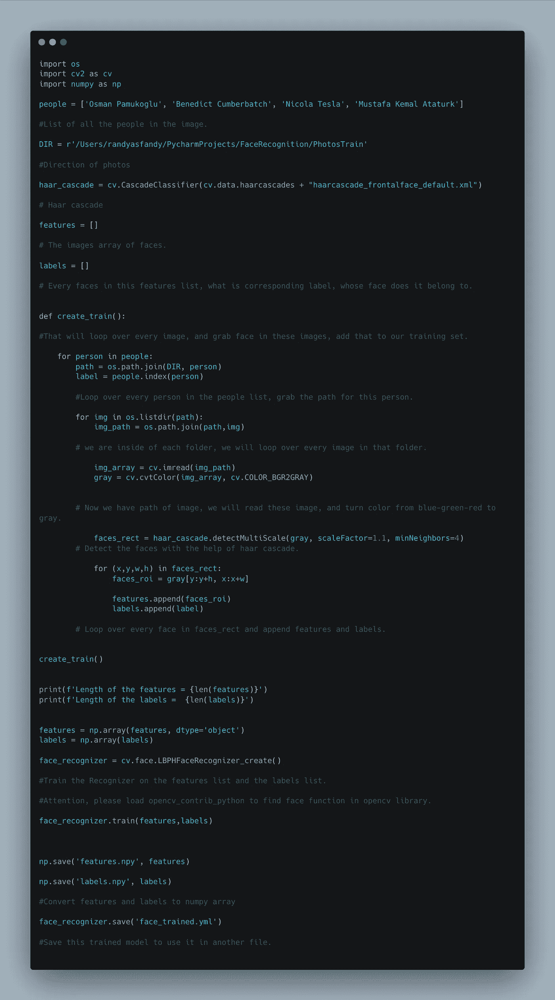

图片来源:作者

# 结论

我做这项研究是因为我的一份工作申请交给我的一项任务。在做了调查和我的申请后，那家公司的 CEO 亲自给我发了电子邮件，感谢我的调查，他说他真的很喜欢那份工作。

然后我想，我可能接受了这份工作，但看起来这是一份没有报酬的实习，这就是我拒绝它的原因。

之后，我把这篇文章发给了一个著名的关于数据科学的网站，而不是媒体，他们喜欢这个想法，我们在他们的网站上发表了这篇文章，并为这篇文章给了我 200 美元，这实际上是一笔很大的交易。

来源:[此处](https://giphy.com/gifs/fallontonight-jimmy-fallon-tonight-show-F4Ieoc5i0r6w7CMYPn?utm_source=iframe&utm_medium=embed&utm_campaign=Embeds&utm_term=https%3A%2F%2Fcdn.embedly.com%2F)

但后来我收到了科罗纳的邮件，他们甚至对我说“早日康复”，但我猜他们后来改变了主意，因为这个过程比预期的要长，他们决定不回我的邮件。

这篇文章作为草稿在我的 google drive 中停留了太长时间，我希望这对你的研究和文章有所帮助，或者只是为了好玩。

为我订阅更多；

[](https://medium.com/subscribe/@geencay) [## 每当 Gencay I .出版时，就收到一封电子邮件。

### 每当 Gencay I .出版时，就收到一封电子邮件。注册后，如果您还没有，您将创建一个中型帐户…

medium.com](https://medium.com/subscribe/@geencay)