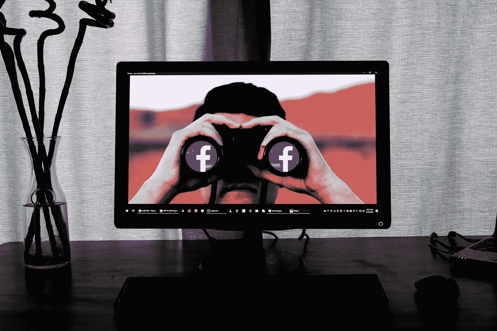

# 脸书人工智能从 10 亿张 Instagram 照片中学习了物体识别

> 原文：<https://pub.towardsai.net/facebook-ai-learned-object-recognition-from-1-billion-instagram-pics-f31ea6c598d6?source=collection_archive---------1----------------------->

## [计算机视觉](https://towardsai.net/p/category/computer-vision)

## SEER:计算机视觉更强大、更灵活、更容易进入的时代的开始

照片由[丽莎·福蒂斯](https://www.pexels.com/@fotios-photos?utm_content=attributionCopyText&utm_medium=referral&utm_source=pexels)从[派克斯](https://www.pexels.com/photo/person-holding-midnight-black-samsung-galaxy-s8-turn-on-near-macbook-pro-1092671/?utm_content=attributionCopyText&utm_medium=referral&utm_source=pexels)拍摄

近年来，**脸书**一直在努力创新和实施各种新兴技术，如用于其服务的 [AI](https://becominghuman.ai/cheat-sheets-for-ai-neural-networks-machine-learning-deep-learning-big-data-678c51b4b463) 、ML 和 DL，他们已经在一系列项目上取得了重大进展，如[深度假货检测](https://ai.facebook.com/datasets/dfdc/)、[使用 AI 预测新冠肺炎预测](https://ai.facebook.com/tools/covid-19-forecasting/)、[自然语言处理](https://ai.facebook.com/research/NLP/)、[计算机视觉](https://www.facebook.com/careers/life/computer-vision)以及许多类似的项目。

他们最近创新的一个领域是人工智能。脸书的人工智能研究部门最近宣布，他们在自我监督学习模型方面取得了突破，能够从一组随机的无标签图像中学习。

**好奇想知道更多？**

请阅读以下内容，全面了解脸书计划如何通过其 SEER 学习模型彻底变革计算机视觉领域。

# 这是传统计算机视觉系统的工作原理

在我们深入研究 SEER 之前，让我给你一个传统计算机视觉系统如何工作的例子。

现代计算机视觉系统的主要目标是从图像集合中识别物体，例如猫、狗等等，该系统使用带标签的图像数据集。

数据集由数十万张手工标记的图像组成，这需要相当多的时间。尽管这很有效，但对于你想要让 [AI](https://becominghuman.ai/cheat-sheets-for-ai-neural-networks-machine-learning-deep-learning-big-data-678c51b4b463) 模型识别的每一个新事物，这个过程都必须从头开始，如果做得不正确，这将导致巨大的性能下降。

**查看谷歌指南《计算机视觉如何工作》——**

来源— [谷歌云技术](https://www.youtube.com/watch?v=OcycT1Jwsns)

# 以下是脸书的先知是如何工作的

作为同类产品中的第一个，脸书的[自我监督学习模型 SEER](https://ai.facebook.com/blog/seer-the-start-of-a-more-powerful-flexible-and-accessible-era-for-computer-vision) 在没有任何人类参与的情况下，随机获取一个未标记的图像数据集，并试图尽可能多地从图像中进行分类。

训练模型也是一项不小的任务。

> *脸书表示，SEER 使用了 500 多颗 NVIDIA 的数据中心级 V100 GPUs 和 32GB 的 VRAM，花了 8 天多的时间，用 Instagram 上的 10 亿张公开图像来完全训练这个模型。*

事实证明，使用 10 亿张图像的图像数据集非常有益，可以提高准确性和可靠性。脸书声称，SEER 的高准确性使其在物体识别测试中成功击败了其他几个人工智能模型。

脸书还在一个庞大的图像库数据集[**ImageNet**](http://image-net.org/)提供的近 **13000 张图像上测试了他们的模型的准确性，在那里它成功取得了令人震惊的 84.2%的分类准确率分数。**

# *先知在*脸书的未来

自我监督学习最近受到了很多关注，因为它不需要对数据集进行任何标记，这可能是一个非常耗时的过程。这使得研究人员可以毫不费力地将该模型用于需要更大甚至多样化数据集的项目。

脸书说，他们试图以某种方式建立 SEER，以便在未来，该模型将足够智能，可以直接从给定的信息中识别，无论是文本还是图像，而不依赖于人标注的数据集。脸书还认为，SEER 可以成为人工智能系统实现常识性理解所急需的一步，使其能够从给定的图像中理解任何东西。

根据脸书的说法，SEER 背后的驱动力是看看是否有可能使自我监督的工作优于更常用的方法，如现实世界场景中的监督学习。初步测试报告称，像 SEER 这样的自我监督系统可以吃掉数据集，就像它们什么都不是一样，与监督模型相比，需要几乎 100 倍的图像才能达到相同的精度。

虽然这只是一个研究项目，但脸书认为 SEER 这样的模型的潜在用例可能非常广泛，允许它用于一系列旨在提高可访问性的项目，对脸书市场上的商品进行自动分类，甚至将有害图像从平台上删除。

**欲了解更多信息，请访问脸书人工智能博客—**

 [## SEER:计算机视觉更强大、更灵活、更容易进入的时代的开始

### 人工智能的未来在于创造能够直接从给定的任何信息中学习的系统——无论是…

ai.facebook.com](https://ai.facebook.com/blog/seer-the-start-of-a-more-powerful-flexible-and-accessible-era-for-computer-vision) 

# 但是，潜在的隐私问题呢？

由[格伦·凯莉](https://unsplash.com/@glencarrie?utm_source=unsplash&utm_medium=referral&utm_content=creditCopyText)在 [Unsplash](https://becominghuman.ai/?utm_source=unsplash&utm_medium=referral&utm_content=creditCopyText) 拍摄的照片

让我们快速了解一下人们对这种模式最关心的问题，即**隐私。人们已经开始非常认真地对待数字隐私，对他们来说，这可能会令人震惊，他们的照片正被用来训练一个人工智能模型。**

结合起来，脸书、WhatsApp、Instagram 和 Messenger 拥有巨大的数据宝库，可以用来提供其平台上用户的详细信息。脸书的数据政策明确指出，只要用户信息在他们的平台上公开发布，他们就可以使用这些信息来改善他们当前的服务，并开发更新、更好的服务，比如 SEER。

但是说实话，没有一个用户知道他们的照片，以及他们的其他数据，正被用来提供有针对性的广告和建立人工智能系统。看看脸书目前提供的一些产品，比如其强大的使用面部识别的照片图像标记功能，可以看出该公司认为更好地了解用户以及为什么要开发 SEER 是有价值的。

但像任何其他前沿技术一样，SEER 并不完美，脸书担心，从 Instagram 上拍摄的图像可能不成比例地代表了可以使用互联网和手机的年轻人口，可能无法准确地代表图像数据集没有很好定义的群体。

当被问及 SEER 对世界其他地方的可用性时，脸书表示他们会以开源库的形式提供该软件的一部分。这将允许其他研究人员试验自我监督学习，并在未切割的图像数据集上训练他们的模型。

# 最后的想法

总之，可以肯定地说，自我监督学习解决方案有无限的可能性，并且通过消除对手动注释的需要，很明显，它们将在未来更好地塑造下一波智能解决方案。但人们只能希望脸书将妥善处理这一庞大的用户数据池，并尽力避免像 2018 年震惊世界的剑桥分析公司数据隐私丑闻那样的灾难性事件。

# 了解你的作者

**克莱尔 D** 。是 **Digitalogy** 的内容设计师和战略家，他可以将你的内容想法转化为清晰、引人注目、简洁的文字，与读者建立强有力的联系。

在 [**上跟我连线**](https://medium.com/@harish_6956)**[**Linkedin**](https://www.linkedin.com/in/claire-d-costa-a0379419b/)**&**[**Twitter**](https://twitter.com/ClaireDCosta2)**。****