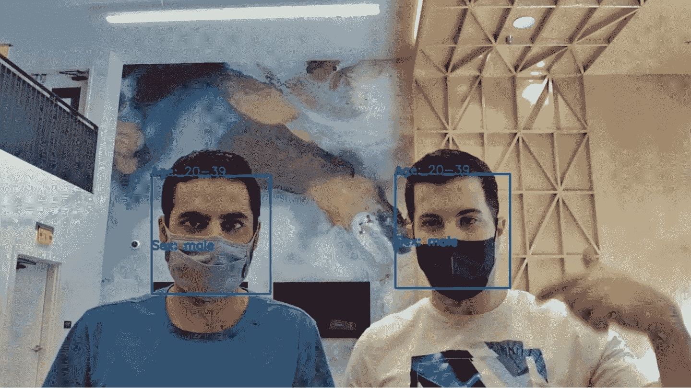
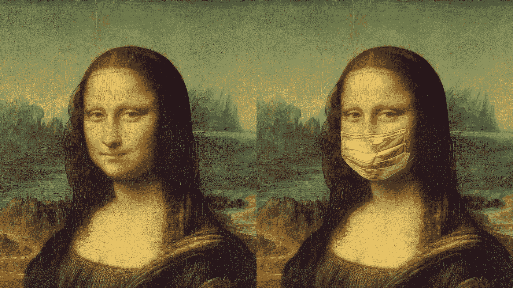
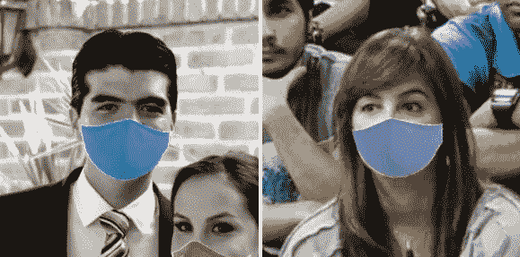
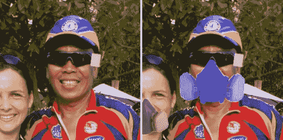
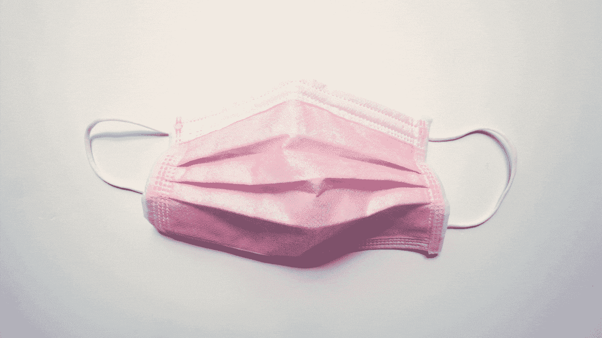
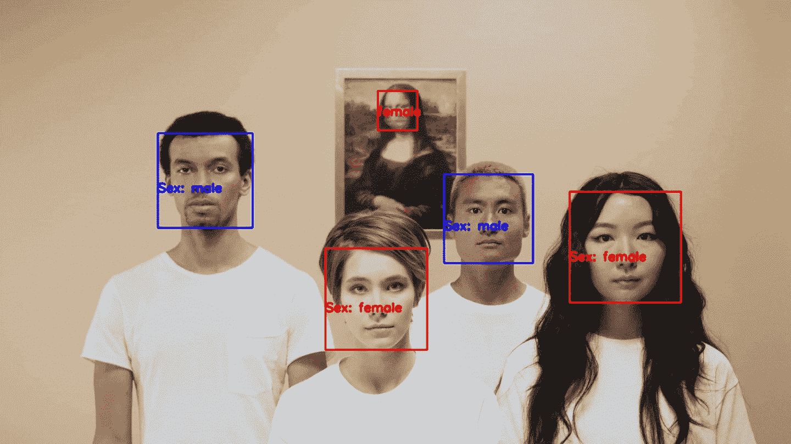
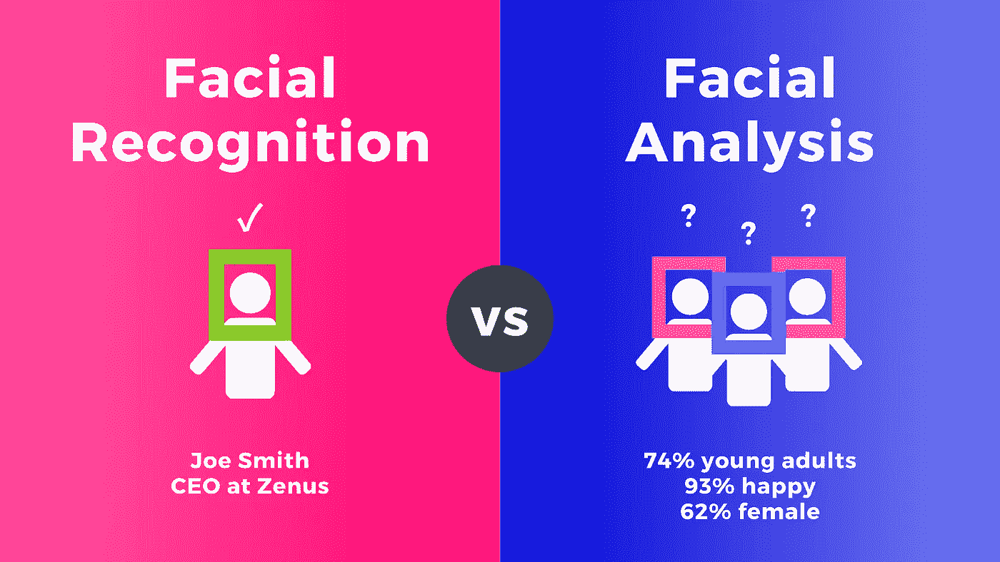
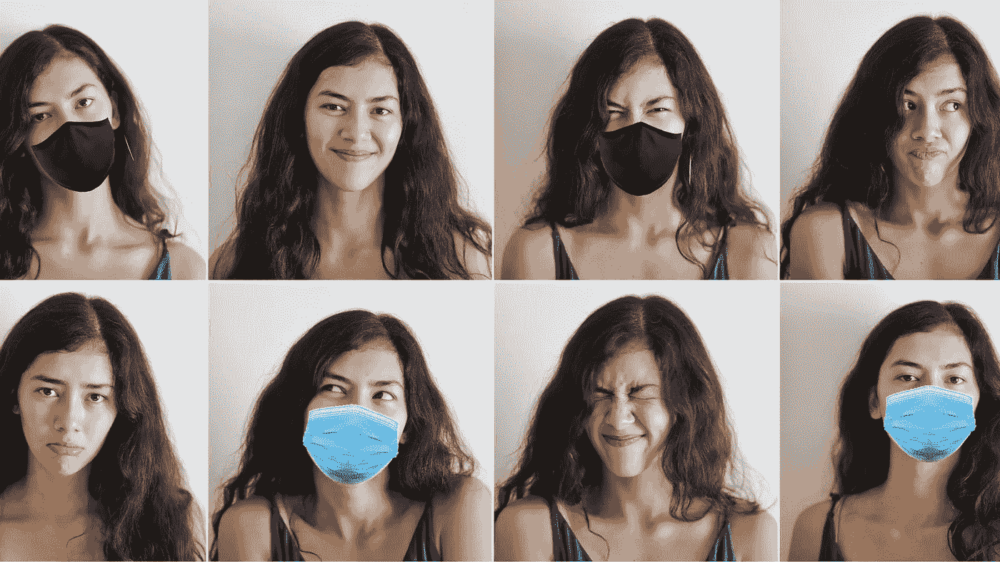

# 带口罩的面部分析？了解如何达到 96%的准确率

> 原文：<https://pub.towardsai.net/facial-analysis-with-masks-learn-how-to-achieve-96-accuracy-8a4d0b3686ea?source=collection_archive---------0----------------------->

## [计算机视觉](https://towardsai.net/p/category/computer-vision)

## 面具和面部覆盖物会一直留在这里。这是一个在不越过隐私线的情况下训练健壮的 AI 模型的指南。



[Zenus](https://rb.gy/yzo0v4) 联合创始人用面具演示现场面部分析。[此链接提供完整视频](https://youtu.be/7cFEJC4Kblc)。

**作者** : [帕诺斯·穆塔菲什博士](https://www.linkedin.com/in/pmoutafis/) & [拉克沙克·塔尔瓦尔](https://www.linkedin.com/in/rakshak-talwar-71759053/) & [玛丽·林](https://www.linkedin.com/in/mary-lim-12387a73/)

几十年来，面具和面部覆盖物已经在许多文化和工作环境中流行。但是如果你在 2021 年读到这篇文章，我们可以读出你的想法——你在想疫情！由于新冠肺炎，口罩成了我们日常生活中的必备配件。

> 缺乏戴口罩人群的数据

从零售店到公司校园以及体验式营销，分析人脸有着广泛的应用。问题是，我们如何在无法获得大量戴口罩的人的数据集的情况下训练健壮的人工智能模型？如果这让你晚上睡不着，我们有好消息！



现在，她到底笑不笑？

# 数据扩充

我们的团队通过使用数据增强技术解决了戴口罩人群数据集缺乏的问题。人们可以通过在人脸上叠加面具来增强他们现有的数据集(或[公开可用的数据集](https://github.com/dchen236/FairFace))。一旦你做到这一点，训练面部分析模型如面部检测和性别预测就变得更容易了。

> 佐治亚理工学院的一名研究人员正在管理一个名为“[面具脸](https://sites.google.com/view/masktheface)”的开源项目 GitHub 上提供了源代码，可用于将人脸数据集转换为蒙版人脸数据集。

在您的映像上运行软件包轻而易举！

```
cd MaskTheFace
# Generic
python mask_the_face.py --path <path-to-file-or-dir> --mask_type <type-of-mask> --verbose --write_original_image

# Example
python mask_the_face.py --path 'data/office.jpg' --mask_type 'N95' --verbose --write_original_image
```

源代码和更多细节可以在 [GitHub 项目页面](https://github.com/aqeelanwar/MaskTheFace)上找到。

# 偏差

广泛使用该软件预计会产生一些不一致的结果。在某些情况下，它工作得非常好，并解决了头部姿势和照明条件的变化。在其他情况下，在存在强烈的头部姿态变化和照明像差的情况下，该算法将错过面部或放错掩模。这是由于项目中使用的人脸检测器的性能。



**左图:**检测右下方的人脸，并应用掩膜增强。**右图像:**左上角的面部没有被检测到，因此，没有执行掩模增大。

即使训练集中的一些人脸不会被掩盖，这通常也是可以的，因为整个数据集将包括被掩盖和未被掩盖的人脸(参见下面的训练部分)。此外，还可以使用不同的检测器选项，这些选项对于获得更好的结果来说更加可靠。总之，该方法具有较强的适应性和实用性。



正确应用于各种面具的面具增强图。

正如您在相应的示例图片中看到的，引用的方法产生了逼真的结果。还可以从各种不同的掩模中进行选择，以增加数据集中面部覆盖的多样性。这些选项包括不同的图案、颜色和亮度值。



使用不同颜色和类型的遮罩模拟真实世界的场景

# 培养

有许多不同的方法来训练面部分析模型，无论这涉及检测、识别、性别、年龄组和/或情绪。出于本指南的目的，我们将专注于性别预测，假设图像已经使用检测模块进行了裁剪和对齐，该检测模块已经对遮挡人脸具有[鲁棒性。](https://youtu.be/7cFEJC4Kblc)


我们训练了自己的分类任务负责人，他从一个经过战斗考验的骨干那里接收特征地图。这是一段代码，用于说明一个更大的系统中一个很小但很重要的组件。尽管如此，原理仍然是相同的，并允许我们在广泛的任务范围内实现高精度。

*这是仅用于说明目的的示例代码。这不是 Zenus 所拥有的，所做的，或将要使用的。*

# 讨论

数据扩充的简单过程导致**对于被掩盖的面部**超过 96%的测试准确度。现实世界的表现也极其可靠。我们在一个短视频上运行了我们的算法，以说明性别预测模型的表现有多好。



Zenus 的训练有素的模型在戴面罩和不戴面罩的情况下工作的图示。

我们训练我们的算法向我们展示他们的预测，以及他们对预测的信心。因为我们的系统在推断过程中从同一张脸捕获多个印象，所以我们已经将其配置为仅使用高置信度预测来进一步增加其鲁棒性。

# 考虑

在我们发表结束语之前，有必要强调几个关键的考虑因素。

首先，比如说，年龄预测和面部识别之间有很大的区别。当增加数据库大小时，识别一个人变得更加困难。这不是其他类型的面部分析的情况。因此，当检测人口统计数据时，与准确度降低相比，任何信息损失将对识别性能产生更大的影响。



个人身份与匿名统计

对真实世界用例的影响也很不同。面部识别通常侧重于安全应用，如控制出入，在这种情况下，小错误可能代价高昂。另一方面，人数和人口统计数据分析可用于在较高层面上了解目标受众。与实际情况的微小偏差通常对这些见解的影响可以忽略不计。



你能说出戴面具和不戴面具时，哪种表情对应更快乐的脸吗？

与回归问题相比，面具和面部覆盖物对分类任务的影响也不太明显。例如，需要训练一个回归模型，以便根据一个人的面部表情来量化他们的幸福水平。这种模型在推断时产生分数，这些分数对于戴面具和不戴面具的人来说表现不同。

> 一个人工智能系统只能和提供给它的数据一样好

最后但同样重要的是，我们想强调人们认同不同性别的权利的重要性。一个经过训练的人工智能模型只能与提供给它的数据以及底层的生物学和生物统计学差异一样好。排除可信度分数低的预测(参见讨论部分)并专注于正确的用例是极其重要的。

# 未来会怎样

开发人工智能模型需要仔细的规划和详尽的测试。当涉及到与个人面部等隐私数据交织在一起的应用程序时，这一点尤其正确。

> 我们是人，还有很多东西要学。尽管如此，我们的团队仍然非常看好面部分析的未来，即使有面具和面部覆盖物。

我们将继续努力工作，并纳入保护人们隐私的安全措施。邀请您[支持我们的使命](https://rb.gy/yzo0v4)并加入我们的旅程！

注意安全。保持乐观。测试阴性。

1.  *部分图片来源于* [*FairFace*](https://github.com/joojs/fairface) *并在 CC-BY-4.0 许可下使用。一些图像通过增加面具进行了修改。*
2.  *其他图片和视频来源于* [*Zenus*](https://rb.gy/yzo0v4) *、维基共享、Pexels 和 Unsplash。它们可能已经从其原始形式进行了修改。*