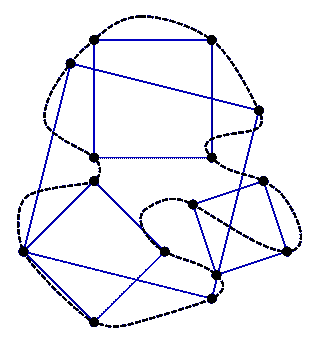
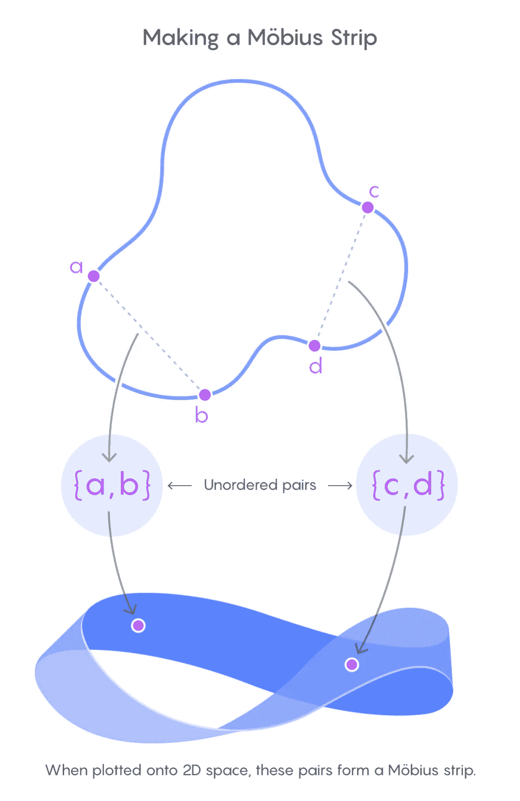

# 著名的现代数学问题:方桩问题

> 原文：<https://pub.towardsai.net/famous-modern-math-problems-the-square-peg-problem-b6e20e5d5604?source=collection_archive---------0----------------------->

## [数学](https://towardsai.net/p/category/mathematics)

## 一个世纪之久的几何问题，去年几乎得到解决。

来源:[https://www . quanta magazine . org/new-geometric-perspective-cracks-old-problem-about-rectangles-2020 06 25/](https://www.quantamagazine.org/new-geometric-perspective-cracks-old-problem-about-rectangles-20200625/)

在另一个例子中，我们的系列包括著名的数学问题，今天我想讨论一个世纪之久的问题，仍然部分未解决。这个问题的通俗名称是“方形桩问题”，也称为托普利兹猜想。

这个问题是由德国数学家[奥托·托普利兹](https://en.wikipedia.org/wiki/Otto_Toeplitz)在 1911 年提出的。这个问题的陈述如此简单，似乎令人震惊，以至于它还没有被完全解决。Toeplitz 预测任何闭合曲线都包含四个点组成一个正方形。

图片来源:流行力学

这个问题对任何有几何基础知识的人来说都很容易理解，但解决起来却特别困难。让这个问题如此具有挑战性的是闭环的性质。一些环是连续和平滑的，这基本上意味着它们没有间断和拐角。这些是我们可能用笔和纸画出的循环类型。其他曲线可以是连续的，但包含断裂，这是分形的情况。这么说吧，在第一类循环中，方桩问题更容易分析。

赫伯特·沃恩在 20 世纪 70 年代首次突破了平方挂钩问题。这位数学家发现，绘制构成示例闭合曲线的所有成对的点，当不加区别地以任意顺序绘制 x 或 y 坐标时，会形成一个称为莫比乌斯带的形状。这个形状有新的数学性质，沃恩证明了它至少包含四个形成矩形的点。

图片来源:广达杂志

平方证明问题中最重要的证明出现在几个月前，当时数学家 Joshua Greene 和 Andrew Lobb 将 Vaughan 的工作与一些新的数学思想相结合，证明了平方桩问题的一种变体，即所谓的“矩形桩问题”。具体地说，格林和洛布证明了任何光滑连续的曲线都包含四个点的集合，这些点构成了任意比例的矩形的顶点。

虽然最初的托普利兹猜想仍未解决，但格林和洛布所做的工作已经接近证明这个谜一样的数学问题。