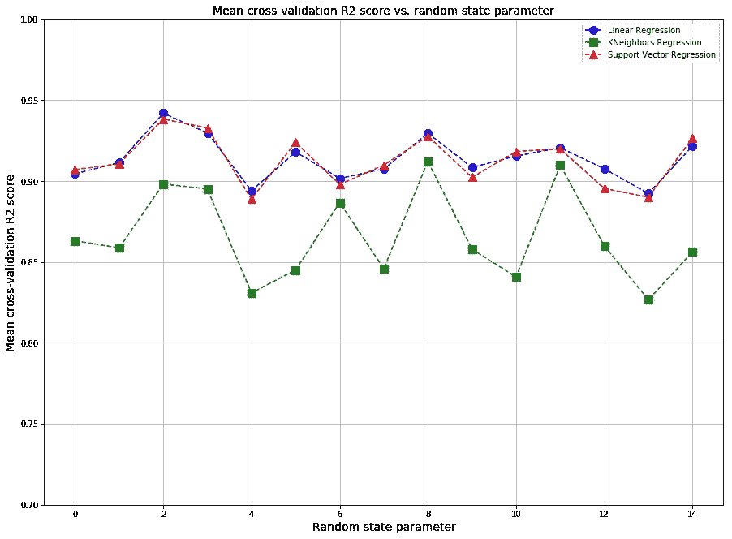

# 数据科学中的第一原理方法

> 原文：<https://pub.towardsai.net/first-principles-approach-in-data-science-5c8c403e9514?source=collection_archive---------1----------------------->

图片来源:Pexels

## [数据科学](https://towardsai.net/p/category/data-science)

## **首要原则**解决问题的方法是将问题分解成基本部分，然后从基本部分开始

# **一、简介**

解决问题的第一原则方法是将问题分解成基本部分，然后从基本部分开始。这种方法早在亚里士多德时代就为物理学家所熟知。第一原理方法是一种非常有效的解决问题的方法。Elon Musk(特斯拉和 SpaceX 的首席执行官)因应用第一原理方法解决技术和工程问题而闻名。

在本文中，我们将讨论如何使用第一原理方法来简化数据科学任务。我们将考虑两个案例研究。

# 二。案例研究 1:天气数据可视化

在案例研究 1 中，我们通过将第一原理方法应用于数据可视化问题来说明它。使用 [**weather_data.csv**](https://github.com/bot13956/weather_pattern/blob/master/weather_data.csv) 数据集，目标是编写代码来执行以下数据可视化任务:

1.  返回 2005-2014 年期间一年中各天的最高记录温度和最低记录温度的折线图。一年中每一天的最高温度和最低温度之间的区域用阴影表示。
2.  覆盖任何点(高点和低点)的 2015 年数据散点图，这些点在 2015 年打破了十年记录(2005-2014)的最高记录或最低记录。

一个好的数据可视化由几个组件组成，这些组件必须拼凑在一起才能产生最终产品。使用第一原理方法，我们可以将问题分解为以下几个基本部分:

a) **数据组件**:决定如何可视化数据的第一个重要步骤是了解数据的类型，例如分类数据、离散数据、连续数据、时间序列数据等。在本例中，我们的天气数据集包含不同月份的连续温度值。

b) **几何组件:**您可以在这里决定哪种可视化适合您的数据，例如散点图、线形图、条形图、直方图、QQ 图、平滑密度、箱线图、对线图、热图等。对于天气数据集，我们关注线图和散点图。

c) **映射组件:**这里你需要决定用什么变量作为你的*x*-变量，用什么作为你的*y*-变量。这一点非常重要，尤其是当数据集是包含多个要素的多维数据集时。在本例中，月份是*x*-变量(自变量)，温度是*y*-变量(因变量)。

d) **秤组件:**在这里您可以决定使用哪种秤，例如线性秤、对数秤等。在本例中，我们使用简单的线性标度表示温度轴。

e) **标签组件:**这包括轴标签、标题、图例、使用的字体大小等。在本例中，我们的 *x* 和 *y* 轴分别标记为月和温度。我们的可视化也被赋予了一个标题:记录 2005 年到 2015 年间不同月份的温度。还添加了一个图例，以使可视化更具可读性。

f) **道德成分**:在这里，你要确保你的可视化讲述真实的故事。在清理、汇总、操作和生成数据可视化时，您需要意识到您的行为，并确保您没有使用您的可视化来误导或操纵您的受众。

当上述所有组件组装在一起时，最终产品如下图**图 1** 所示。

**图一**。气象数据的数据可视化。Benjamin O. Tayo 的图片

天气数据项目的完整代码可以从这个资源库下载:**。**

# **三。案例研究 2:建立线性回归模型**

**在案例研究 2 中，我们考察了如何将第一原理方法应用于预测分析。使用邮轮数据集[**cruise _ ship _ info . CSV**](https://github.com/bot13956/ML_Model_for_Predicting_Ships_Crew_Size)**，**目标是建立一个机器学习模型，根据数据集中提供的几个预测变量来预测邮轮的船员人数。使用第一原理方法，我们可以将问题分解为以下几个基本部分:**

## **a.问题框架**

*****明确你的项目目标。你想知道什么？有数据可以分析吗？*****

****目标 *:*** 该项目的目标是建立一个回归模型，使用邮轮数据集[**cruise _ ship _ info . CSV**](https://github.com/bot13956/ML_Model_for_Predicting_Ships_Crew_Size)**为潜在的邮轮买家推荐“船员”规模。****

## **b.数据分析**

*****导入数据集，分析特征以选择与目标变量相关的相关特征。*****

*   **导入必要的库**
*   **读取数据集并显示列**
*   **计算协方差矩阵**
*   **生成用于显示协方差矩阵的热图**
*   **使用协方差矩阵图的特征选择**
*   **定义您的特征矩阵和目标变量**

**然后，上面获得的特征矩阵和目标变量可以用于模型建立。**

## **c.模型构建、测试和评估**

*****挑选与你的数据和想要的结果匹配的机器学习工具。用可用数据训练模型。*****

**由于我们的目标是使用回归，我们将实现 3 种不同的回归算法:**线性回归(LR)** 、**近邻回归(KNR)** 和**支持向量回归(SVR)** 。**

**数据集必须分为训练集、验证集和测试集。超参数调整用于微调模型，以防止过度拟合。执行交叉验证是为了确保模型在验证集上表现良好。在微调模型参数之后，将模型应用于测试数据集。该模型在测试数据集上的性能大约等于该模型用于对未知数据进行预测时的预期性能。**

## **d.应用**

*****给你的最终模型打分，生成预测。使您的模型可用于生产。根据需要重新培训您的模型*** *。***

**在这个阶段，选择最终的机器学习模型并投入生产。该模型在生产环境中进行评估，以评估其性能。从实验模型转换到生产线上的实际性能时遇到的任何错误都必须进行分析。然后，这可以用于微调原始模型。**

**当所有组件组装在一起时，代码的最终输出如下图**图 2** 所示。**

****

****图二**。不同回归模型的平均交叉验证显示。Benjamin O. Tayo 的图片**

**根据**图 2** 的结果，我们观察到线性回归和支持向量回归几乎处于同一水平，并且优于 KNeighbors 回归。所以最终选择的模型可以是线性回归，也可以是支持向量回归。**

**本教程的数据集和 Jupyter 笔记本可以从这里下载:[**https://github . com/bot 13956/Machine _ Learning _ Process _ Tutorial**](https://github.com/bot13956/Machine_Learning_Process_Tutorial)。**

# **四。总结和结论**

**总之，我们已经讨论了解决问题的第一原理方法，以及如何在数据科学中使用这种强大的技术。我们使用两个案例研究，即一个数据可视化项目和一个机器学习项目，展示了解决问题的第一原理方法。第一原则方法，即将数据科学任务分解成更小的任务，并以此为基础进行构建，是每个数据科学有志者都应该熟悉的方法。**

# **其他数据科学/机器学习资源**

**[数据科学最低要求:开始从事数据科学时你需要知道的 10 项基本技能](https://towardsdatascience.com/data-science-minimum-10-essential-skills-you-need-to-know-to-start-doing-data-science-e5a5a9be5991)**

**[数据科学课程](https://medium.com/towards-artificial-intelligence/data-science-curriculum-bf3bb6805576)**

**[机器学习的基本数学技能](https://medium.com/towards-artificial-intelligence/4-math-skills-for-machine-learning-12bfbc959c92)**

**[进入数据科学的 5 个最佳学位](https://towardsdatascience.com/5-best-degrees-for-getting-into-data-science-c3eb067883b1)**

**[数据科学的理论基础——我应该关心还是仅仅关注实践技能？](https://towardsdatascience.com/theoretical-foundations-of-data-science-should-i-care-or-simply-focus-on-hands-on-skills-c53fb0caba66)**

**[机器学习项目规划](https://towardsdatascience.com/machine-learning-project-planning-71bdb3a44349)**

**[如何组织你的数据科学项目](https://towardsdatascience.com/how-to-organize-your-data-science-project-dd6599cf000a)**

**[大型数据科学项目的生产力工具](https://medium.com/towards-artificial-intelligence/productivity-tools-for-large-scale-data-science-projects-64810dfbb971)**

**[数据科学作品集比简历更有价值](https://towardsdatascience.com/a-data-science-portfolio-is-more-valuable-than-a-resume-2d031d6ce518)**

*****如有疑问和询问，请发邮件给我***:benjaminobi@gmail.com**