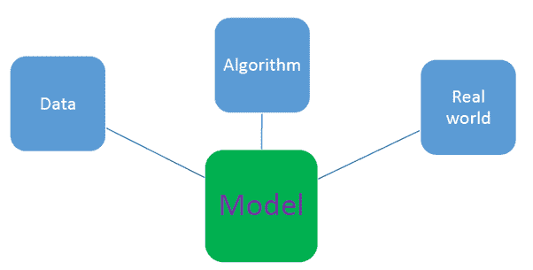

# 成为数据科学家的 5 个步骤

> 原文：<https://pub.towardsai.net/five-steps-to-becoming-a-data-scientist-239bbc60a6e3?source=collection_archive---------1----------------------->

## [职业](https://towardsai.net/p/category/careers)，[数据科学](https://towardsai.net/p/category/data-science)

**数据科学家形象。来源:**[**www.quora.com**](http://www.quora.com)

数据科学是一个如此广阔的领域，包括几个细分领域，如数据准备和探索；数据表示和转换；数据可视化和显示；预测分析；机器学习等。对于初学者来说，学习数据科学的基础知识可能是一项非常艰巨的任务，特别是如果您没有适当的指导，无法了解所需的必要培训，或者要学习哪些课程，以及学习的顺序。在讨论成为一名数据科学家的必要步骤之前，我们先讨论一下每个数据科学家在他的技能集工具箱中应该具备的技能。

## 每个数据科学家都应该具备的基本技能

大多数数据科学职位列表中提到的**前五大技术技能**([数据科学家最需要的技能——走向数据科学](https://towardsdatascience.com/the-most-in-demand-skills-for-data-scientists-4a4a8db896db))是:

1.  计算机编程语言
2.  稀有
3.  结构化查询语言
4.  Hadoop
5.  火花

成为一名数据科学家还需要以下**一般技能**:

1.  数学分析和线性代数
2.  机器学习
3.  统计和概率
4.  计算机科学
5.  沟通
6.  数据争论/准备、数据呈现/可视化

大约一年前开始学习数据科学。从一开始就很有挑战性，但是让我和你们分享一下适合我的方法。我将讨论**五个重要步骤**，它们在我作为数据科学家的整个旅程中帮助了我。

## **成为数据科学家的步骤**

第一步:不要匆忙

如果你还没有读过这篇文章:**《十年自学编程》作者 Peter Norvig(谷歌机器学习总监)**，我鼓励你去读一读。这里是文章的链接:[http://norvig.com/21-days.html](http://norvig.com/21-days.html)

这里的重点是，你不需要十年的时间来学习数据科学的基础知识，但是匆忙地学习数据科学肯定是没有帮助的。成为一名数据科学家需要时间、努力、精力、耐心和承诺。

**第二步:参加 DataCamp、Coursera、EdX 或其他平台的课程**

data camp([https://www.datacamp.com/courses](https://www.datacamp.com/courses))当然是一个很好的网站，在这里你可以学到很多不同的技能，从基本的编程概念到高级技能，比如数据科学和机器学习。然而，我认为 DataCamp 使用了一种仓促的方法，因此过于肤浅。数据营课程是速成课程，很少或没有深度。大多数评估问题都很简单，没有挑战性。如果您对学习数据科学的学术方法感兴趣，我会推荐以下课程，这些课程将为您奠定非常坚实的数据科学基础(学术方法需要大量的时间投入和奉献，但这是值得的):

(一)**数据科学专业证书(HarvardX，通过 edX):**【https://www.edx.org/professional...】T4

包括以下课程，全部使用 R 教授(您可以免费旁听课程或购买认证证书):

1.  数据科学:R 基础；
2.  数据科学:可视化；
3.  数据科学:概率；
4.  数据科学:推理和建模；
5.  数据科学:生产力工具；
6.  数据科学:扯皮；
7.  数据科学:线性回归；
8.  数据科学:机器学习；
9.  数据科学:顶点

(二)**分析:基本工具和方法(Georgia TechX，通过 edX):**[https://www.edx.org/micromasters...](https://www.edx.org/micromasters/analytics-essential-tools-methods)

包括以下课程，全部使用 R、Python 和 SQL 讲授(您可以免费审计或购买经过验证的证书):

1.  分析建模导论；
2.  数据分析计算导论:
3.  商业数据分析。

(iii) **应用数据科学与 Python 专门化(密歇根大学，通过 Coursera)**:[https://www.coursera.org/special...](https://www.coursera.org/specializations/data-science-python)

包括以下课程，全部使用 python 教授(您可以免费旁听大多数课程，有些课程需要购买认证证书):

1.  Python 中的数据科学导论；
2.  应用 Python 绘图、制图和数据表示；
3.  Python 中的应用机器学习；
4.  Python 中文本挖掘的应用:
5.  Python 中的应用社会网络分析。

**第三步:从课本中学习**

从教科书中学习提供了比你从在线课程中获得的更精炼和更深入的知识。这本书对数据科学和机器学习提供了很好的介绍，代码包括:**“Python 机器学习”，作者 Sebastian Raschka** 。作者以一种非常容易理解的方式解释了机器学习的基本概念。此外，代码也包括在内，因此您实际上可以使用提供的代码来练习和构建您自己的模型。我个人认为这本书在我作为数据科学家的旅程中非常有用。我会向任何数据科学爱好者推荐这本书。你所需要的是基本的线性代数和编程技能，以便能够理解这本书。也有很多其他优秀的数据科学教科书，如韦斯·麦金尼的《 [Python for Data Analysis](https://sushilapalwe.files.wordpress.com/2018/04/python-for-data-analytics-book.pdf) 》、库恩·约翰逊的《[应用预测建模](https://vuquangnguyen2016.files.wordpress.com/2018/03/applied-predictive-modeling-max-kuhn-kjell-johnson_1518.pdf)》、伊恩·h·威滕的《[数据挖掘:实用机器学习工具和技术](https://www.wi.hs-wismar.de/~cleve/vorl/projects/dm/ss13/HierarClustern/Literatur/WittenFrank-DM-3rd.pdf)》、艾贝·弗兰克&马克·a·霍尔的《数据挖掘:实用机器学习工具和技术》等等。

**第 4 步:与其他数据科学有志者建立联系**

从我的个人经历来看，通过与其他数据科学有志者合作，我从每周关于数据科学和机器学习各种主题的小组对话中学到了很多。与其他数据科学有志者建立联系，在 GitHub 上分享您的代码，在 LinkedIn 上展示您的技能，这将真正帮助您在短时间内学习许多新概念和工具。你还会接触到新的做事方式，以及新的算法和技术。

**第五步:将知识应用于真实的数据科学问题**

请记住，单靠在线课程不会让你成为数据科学家。在建立了强大的数据科学基础后，你可以寻求实习或参加 Kaggle 竞赛，在那里你可以从事真正的数据科学项目。

**分析模型的 3 个基本组成部分。**

请记住，你可能非常擅长处理数据以及构建良好的机器学习算法，但作为一名数据科学家，现实世界的应用才是最重要的。每一个预测模型都必须产生现实生活中有意义的和可解释的结果。预测模型必须根据实际情况进行验证，才能被认为是有意义和有用的。因此，人类的输入和经验对于理解算法产生的结果总是必要和有益的。

总之，我们已经讨论了成为数据科学家的五个重要步骤。根据个人背景的不同，成为数据科学家的旅程可能会有所不同，但上面提到的步骤是适合我的方法。

感谢阅读！