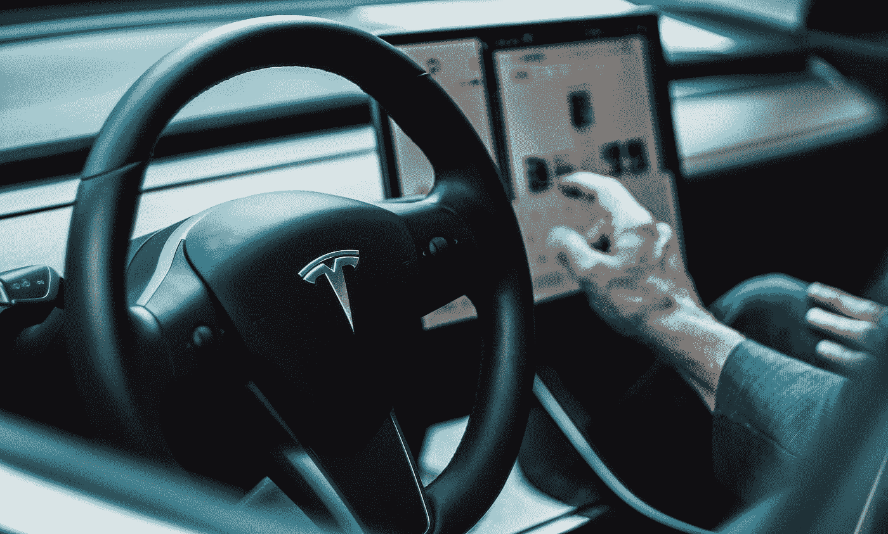
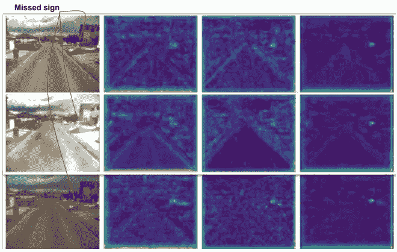
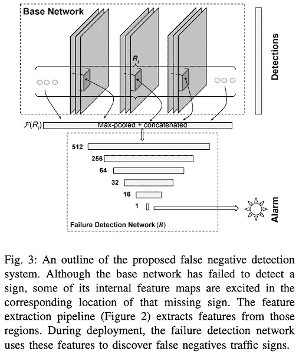
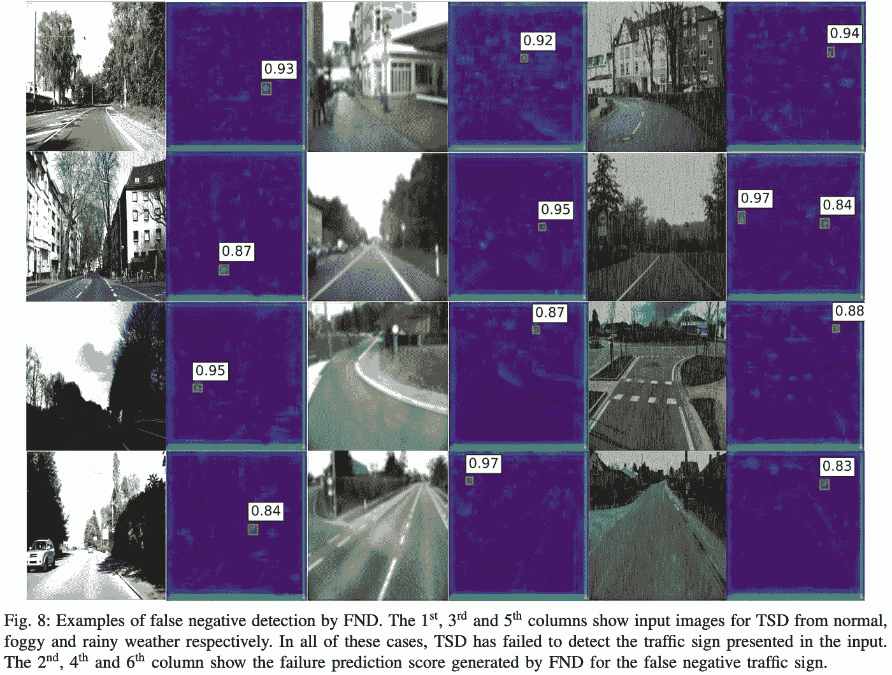

# 出于安全原因，无人驾驶汽车一定不能错过检测信号

> 原文：<https://pub.towardsai.net/for-safety-reasons-self-driving-cars-must-not-miss-detecting-the-signs-bb26e65e721?source=collection_archive---------4----------------------->

## [自动驾驶汽车](https://towardsai.net/p/category/self-driving-cars)

## 假阴性检测研究的前沿

IEEE/RSJ IROS 2019

由[大卫·冯迪马尔](https://unsplash.com/@davidvondiemar?utm_source=medium&utm_medium=referral)在 [Unsplash](https://unsplash.com?utm_source=medium&utm_medium=referral) 上拍摄的照片

你想驾驶自动驾驶汽车的哪个阶段？你有多害怕自动驾驶汽车会发生意外事故？目前，安全问题是第二级自动驾驶汽车广泛部署的瓶颈。

不能保证物体检测系统不会出错。无论性能提升多少，识别准确率必然会因为各种环境因素而变差。作者认为，必须有一种机制来检测检测器在自动化环境中驾驶时犯了错误。

在这个故事中，你错过了标志吗？介绍了昆士兰科技大学澳大利亚机器人视觉中心的交通标志检测器的假阴性报警系统。这是作为 IEEE/RSJ IROS 2019 的技术论文发表的。本文提出了一种识别被目标检测器遗漏的交通标志的方法。当物体探测器错过交通标志时，系统会发出警报。通过训练假阴性检测器(FND)以及单次多盒对象检测器来检测交通标志，我们可以确定交通标志检测器是否错过了标志。本文的主要贡献在于首次提出了一种针对目标识别任务中误报的符号检测器。

让我们看看他们是如何做到的。我将只解释 FND 的精髓，所以如果你有兴趣阅读我的博客，请点击 [**FND 论文。**](https://arxiv.org/pdf/1903.06391.pdf)

# 这篇论文说了什么？

出于安全考虑，物体探测器需要在各种条件下可靠工作。然而，未知的环境、恶劣天气导致的较差图像质量、不均匀的光照和较差的纹理会影响 AVs 中对象检测系统的性能下降。

鉴于作者不能保证对象检测系统永远不会出错，他们认为需要一种在部署期间检测错误的机制，即，当确定部署的标志检测器的性能可能正在下降时向用户发出警报的故障检测系统。换句话说，作者的研究并不旨在提高符号检测器的性能。相反，重点是识别系统何时无法识别特定位置的交通标志。

何时应该通知用户警报？什么时候应该把控制权交给人类？现在可以考虑这些问题了，因为我们有了一个物体探测器，同时也有了一个检查探测器探测性能的系统。该系统可以警告检测器它很可能错过了特定输入图像区域中的物体。如果警报的频率继续增加，自治系统可以要求人类用户进行干预以进行控制。

图 1 你和机器会错过坏天气的征兆。

# 这篇论文的新颖之处在哪里？

视觉系统中的故障检测任务有多种方法，其中一种方法是通过检查视觉系统的输出来识别故障。为了识别故障，最近有人提出用不确定的测量值来评估预测方差，以减少系统感知的模糊性，这种模糊性是在真实环境中使用这些系统的障碍[Grimmett 等人，2013 年和 Triebel 等人，2016 年]。然而，[Daftry 等人，2016 年]认为，从原始传感器数据预测故障比利用基于模型的分类器的不确定性更有效。本文的独特之处在于两个方面:第一，它没有使用不确定性度量；其次，它首次提出将假阴性检测作为自治系统的故障安全机制。

# 假阴性检测(FND)

作者提出的方法，假阴性检测(FND)，包括两个任务。

1.从 TSD 没有检测到任何迹象的输入图像的特定区域收集特征。

2.评估这些特征以识别这些区域的假阴性交通标志。

图 2 示出了识别交通标志检测器(TSD)中故障的假阴性检测器(FND)。

[https://arxiv.org/abs/1903.06391](https://arxiv.org/abs/1903.06391)

假阴性检测器(FND)依赖于以下观察:当交通标志检测器(TSD)错过标志时，其内部特征图仍包含一些令人兴奋的区域，其中一些区域对应于标志的位置(图 2(a)和(b))。使用该属性，可以构建分类器来从这些区域获得特征，并确定 TSD 是否未能检测到这些区域中的标志。给大家提个醒:TSD 忽略了两种模式。由于 TSD 没能探测到来自这里的信号，这个区域将被称为**故障**。另一个区域被称为**冒名顶替者**，因为它很兴奋，但与交通标志无关。在将图 2(b)中的特征图二值化之后，图 2(c)识别每个激励区域( *Ri* )的边界框(*【x 最小，y 最小，x 最大，y 最大】*)。图 2(d)是 FND 的输出，示出了检测到的假阴性交通标志。

[https://arxiv.org/abs/1903.06391](https://arxiv.org/abs/1903.06391)

在训练阶段，将激励区域的坐标从特征空间转换到图像空间，并测量和上与地面真值边界框的交点。在提取故障和冒名顶替者的特征向量之后，故障检测网络 *(B)* 被训练来对这两个特征向量进行分类，如图 3 所示。

在测试阶段，FND 按照特征提取管道(图 2)从 TSD 的内层提取特征。最初，FND 接收由 TSD 产生的检测输出，并且在没有检测的情况下识别输入图像区域。

# 结果

图 8 显示了假阴性检测系统的定性结果。这里显示了几个案例，其中 FND 成功识别了检测器错过的假阴性交通标志。这些样本结果是从 BTSD 测试数据的三种不同环境(正常、模拟雾和模拟雨)中获得的。

[https://arxiv.org/abs/1903.06391](https://arxiv.org/abs/1903.06391)

## 参考

【Daftry 等人，2016】s . daf try，S. Zeng，J. A. Bagnell，M. Hebert，“内省知觉:学习预测视觉系统中的故障”，2016 年 IEEE/RSJ IROS。

[Grimmett 等人，2013 年] H. Grimmett、R. Paul、R. Triebel 和 I. Posner，“当我们不知道时知道:关键任务决策的内省分类”，2013 年 IEEE 机器人和自动化国际会议。

【Triebel et al .，2016】r . trie bel，H. Grimmett，R. Paul，I. Posner，《驾驶的驱动学习:内省如何改善语义映射》，机器人研究。斯普林格。

【[拉赫曼等人，2019](https://arxiv.org/pdf/1903.06391.pdf) 】拉赫曼，q .，南德豪夫，n .&达乌布，F，『你错过标志了吗？“交通标志检测器的假阴性报警系统”，2019 年 IEEE/RSJ IROS。

# 过去论文摘要列表

## 深度学习方法

**2020:【**[**DCTNet**](https://medium.com/towards-artificial-intelligence/lets-compress-the-cnn-training-like-a-jpeg-compression-ca8237c56f3c)

## **不确定性学习**

****2020:****[**DUL**](https://mako95.medium.com/cvpr2020-paper-summary-data-uncertainty-in-face-recognition-1f17547473a2)****

## ******异常检测******

********2020 年:【**[**FND**](https://medium.com/towards-artificial-intelligence/for-safety-reasons-self-driving-cars-must-not-miss-detecting-the-signs-bb26e65e721)**】********

## ****一级分类****

******2019:【**[**DOC**](https://medium.com/swlh/paper-summary-deep-one-class-classification-doc-adc4368af75c)****

********2020:【**[**DROC**](https://medium.com/the-shadow/exploring-important-feature-repressions-in-deep-one-class-classification-droc-d04a59558f9e)******

## ******图象分割法******

********2018:**[**【UOLO】**](https://medium.com/swlh/paper-summary-biomedical-image-segmentation-and-object-detection-uolo-c1175ba5c8c4)******

******2020:【**[**ssCPCseg**](https://medium.com/towards-artificial-intelligence/efficient-biomedical-segmentation-when-only-a-few-label-images-are-available-2e0b2513703d)**】******

## ****图像聚类****

******2020:**[**【DTC】**](https://medium.com/swlh/paper-deep-transfer-clustering-dtc-learning-to-discover-novel-visual-categories-ec5a26aea075)****